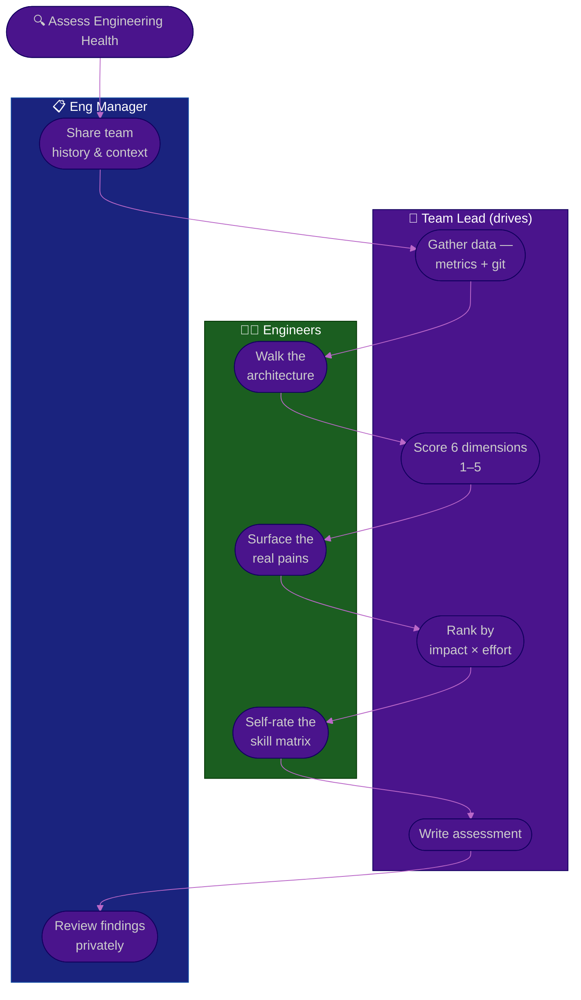

# Procedure: Technical Assessment

**Tags:** #procedure #team-lead #tech-lead #engineering #assessment #techdebt #codequality
**Roles:** Team Lead / Tech Lead · Engineering Manager · Developers · QA · Architect
**Read Time:** ~13 min

> You cannot improve what you haven't honestly diagnosed. In Phase 2 of your first 90 days, you turn first impressions into an **evidence-based picture of engineering health** across six dimensions: **Architecture, Code Quality, Tests, CI/CD & Tooling, Tech Debt, and Team Skills.** Each gets a **1–5 maturity score**, each finding is a fact (with a number where possible), and every recommendation is ranked by **impact × effort** — not by what offends your taste. The golden rule: **diagnose before you prescribe.** A confident rewrite plan written in week two is a guess wearing a suit.

---

## 📌 Table of Contents
- [Why Score Maturity](#why-score-maturity)
- [The Six Dimensions](#the-six-dimensions)
- [Mermaid Swimlane Diagram](#mermaid-swimlane-diagram)
- [ASCII Flow](#ascii-flow)
- [Step-by-Step Responsibility Table](#step-by-step-responsibility-table)
- [The 1–5 Maturity Scale](#the-15-maturity-scale)
- [Dimension 1 — Architecture](#dimension-1--architecture)
- [Dimension 2 — Code Quality](#dimension-2--code-quality)
- [Dimension 3 — Tests](#dimension-3--tests)
- [Dimension 4 — CI/CD & Tooling](#dimension-4--cicd--tooling)
- [Dimension 5 — Tech Debt](#dimension-5--tech-debt)
- [Dimension 6 — Team Skills](#dimension-6--team-skills)
- [Prioritizing by Impact × Effort](#prioritizing-by-impact--effort)
- [Anti-Patterns to Avoid](#anti-patterns-to-avoid)
- [Related Documents](#related-documents)

---

## Why Score Maturity

A score turns a vibe ("the tests are bad") into a baseline ("test maturity is 2/5: 31% coverage, 9% flaky, no E2E"). Scores let you:
- **Show progress** — a 2 → 3 next quarter is a visible, defensible win.
- **Prioritize** — the lowest scores in the highest-impact dimensions are where you start.
- **Align** — your manager and team argue about *one number per dimension* instead of everything at once.

Score honestly. Inflating today's number steals next quarter's win and your team will know it's fake.

---

## The Six Dimensions

| # | Dimension | Asks | Key Signals |
|:--|:----------|:-----|:------------|
| 1 | **Architecture** | Is the structure clear and right-sized? | Module boundaries, coupling, dependency direction |
| 2 | **Code Quality** | Is the code readable & consistent? | Lint/format, complexity, duplication, naming |
| 3 | **Tests** | Can we change safely? | Coverage, flakiness, test pyramid shape, speed |
| 4 | **CI/CD & Tooling** | Is the path to prod fast & safe? | Build time, green rate, deploy frequency, local setup |
| 5 | **Tech Debt** | What's slowing us, and is it tracked? | Debt register, hot spots, workarounds, TODO rot |
| 6 | **Team Skills** | Who knows what — and what's the bus factor? | Skill matrix, ownership concentration, growth gaps |

---

## Mermaid Swimlane Diagram



---

## ASCII Flow

```
TECHNICAL ASSESSMENT — 6 DIMENSIONS
══════════════════════════════════════════════════════════════════════════════════

🔍 ASSESS ENGINEERING HEALTH
   │
   ▼
┌──────────────────────────────────────────────────────────────────────────────┐
│  STEP 1 — GATHER DATA   (Team Lead)                                          │
│    Coverage, build time, flaky %, deploy freq, PR latency, git churn/hotspots │
└───────────────┬────────────────────────────────────────────────────────────────┘
                ▼
┌──────────────────────────────────────────────────────────────────────────────┐
│  STEP 2 — SCORE 6 DIMENSIONS  (Team Lead + Engineers)        each 1–5         │
│    ① Architecture  ② Code Quality  ③ Tests                                     │
│    ④ CI/CD & Tooling  ⑤ Tech Debt  ⑥ Team Skills                              │
└───────────────┬────────────────────────────────────────────────────────────────┘
                ▼
┌──────────────────────────────────────────────────────────────────────────────┐
│  STEP 3 — RANK BY IMPACT × EFFORT   (Team Lead)                               │
│    Lowest scores in highest-impact dimensions first · quick wins up top        │
└───────────────┬────────────────────────────────────────────────────────────────┘
                ▼
┌──────────────────────────────────────────────────────────────────────────────┐
│  STEP 4 — WRITE & REVIEW   (Team Lead → Eng Manager privately)                │
│    Facts + scores, then recommendations · align before wide publication        │
└────────────────────────────────────────────────────────────────────────────────┘
```

---

## Step-by-Step Responsibility Table

| # | Step | Who Owns | Who Helps | Output |
|:--|:-----|:---------|:----------|:-------|
| 1 | Gather metrics & git history | Team Lead | DevOps | Raw data sheet |
| 2 | Walk the architecture | Team Lead | Senior devs | Annotated diagram |
| 3 | Score the six dimensions | Team Lead | The team | Scorecard (1–5 each) |
| 4 | Build the skill matrix | Team Lead | Each engineer | Skill matrix + bus-factor map |
| 5 | Rank pains by impact × effort | Team Lead | Eng Manager | Prioritized backlog |
| 6 | Write the assessment | Team Lead | — | [Technical Assessment](./templates/tech-assessment-template.md) |
| 7 | Review privately | Team Lead | Eng Manager | Aligned narrative |

---

## The 1–5 Maturity Scale

| Score | Label | What it looks like |
|:-----:|:------|:-------------------|
| **1** | Ad hoc | No standard; outcomes depend on who's working that day |
| **2** | Repeatable | Some practice exists but is inconsistent and undocumented |
| **3** | Defined | Documented and mostly followed; gaps are known |
| **4** | Measured | Practiced consistently and tracked with metrics |
| **5** | Optimizing | Metrics drive continuous, deliberate improvement |

Most healthy-but-imperfect teams land at **2–3** across the board. A fresh assessment that's all 4s and 5s is either an exceptional team or a dishonest scorecard.

---

## Dimension 1 — Architecture

**Asks:** Is the structure clear, right-sized, and matched to how the team actually changes the code?

- Map the **major components** and their dependencies. Draw the direction of dependencies — cycles and "everything depends on the god module" are red flags.
- Check **boundaries**: can a feature be changed without touching ten unrelated files? High coupling shows up as wide-reaching PRs.
- Look for **right-sizing**: a four-person team running twelve microservices is over-architected; a single 200k-line monolith with no module seams is under-architected. Neither is "wrong" — judge it against team size and change patterns.
- Document decisions as **ADRs** going forward (see [03 — Technical Direction](./03-technical-direction.md)); the absence of any ADR or design history is itself a maturity-1 signal.

---

## Dimension 2 — Code Quality

**Asks:** Can a new engineer read a file and understand it without a tour guide?

- Is there an enforced **formatter and linter** in CI, or is style argued in every review?
- Sample **complexity and duplication** — hot files with huge functions and copy-pasted blocks are change-risk magnets.
- Check **naming and consistency**: do similar things look similar across the codebase, or did every author invent their own pattern?
- Quality is contextual. A maturity-3 here means standards exist, are mostly automated, and the team agrees on them — not that the code is perfect.

---

## Dimension 3 — Tests

**Asks:** Can the team change the system and trust that a green build means it works?

- Measure **coverage** — but treat it as a floor signal, not a goal. 80% coverage of trivial getters is worse than 50% covering the money paths.
- Measure **flakiness**: a flaky suite trains the team to ignore red, which is worse than no suite. Track the flaky-test rate explicitly.
- Check the **shape of the pyramid**: lots of fast unit tests, fewer integration tests, a thin layer of E2E. An inverted pyramid (mostly slow E2E) is slow and brittle.
- Measure **speed** — if the suite takes 40 minutes, people skip it. Coordinate the test strategy with QA: see [QA — Test Strategy](../qa-leadership/03-test-strategy.md).

---

## Dimension 4 — CI/CD & Tooling

**Asks:** Is the path from a developer's laptop to production fast, safe, and boring?

- **Local setup:** time how long it takes a new engineer to get the app running. One command and ten minutes is great; a two-day odyssey is a maturity-1 tax on everyone.
- **Build & CI:** measure build time and the **green rate** of the main branch. A frequently-red main branch blocks everyone.
- **Flaky CI** is its own disease — distinct from flaky tests, it includes infra timeouts and runner contention. It erodes trust in the gate.
- **Deploy:** how often do you ship, and how long does a deploy take? Map this against the [Deployment Flow](../software-delivery/08-deployment-flow.md) and the [Code Review & PR](../software-delivery/04-code-review-and-pr.md) flow.

---

## Dimension 5 — Tech Debt

**Asks:** What is actually slowing the team down, and is any of it tracked?

- Distinguish **debt that hurts** (slows every change in a hot area) from **debt that's just ugly** (in a file no one touches). Only the former earns priority.
- Find the **hot spots** with git: files with high churn *and* high complexity are where debt costs the most. Those are your highest-ROI targets.
- Look for an existing **debt register**. If debt lives only as TODO comments and tribal knowledge, that's maturity 1–2; a tracked, prioritized register is maturity 3+.
- Tech debt is a **strategy decision**, not just cleanup — how you pay it down belongs in [03 — Technical Direction](./03-technical-direction.md).

---

## Dimension 6 — Team Skills

**Asks:** Who knows what — and where is the bus factor dangerously low?

- Build a **skill matrix**: rows are people, columns are systems/skills, cells are a 0–3 familiarity. Have each engineer self-rate, then sanity-check.
- Find the **single points of knowledge** — systems exactly one person understands. Those are your top mentoring and pairing targets (see [05 — Mentoring & Growth](./05-mentoring-and-growth.md)).
- Note **growth gaps and ambitions** from your 1-on-1s — who wants to go deeper, who wants to broaden, who's quietly stalled.
- This dimension feeds your people plan directly; a low team-skills score with a high bus-factor risk often outranks a code-quality fix.

---

## Prioritizing by Impact × Effort

Don't fix the dimension that annoys you most. Fix the one with the best ratio of pain relieved to effort spent.

```
            HIGH IMPACT
                │
    SCHEDULE    │   DO NOW
   (big bets)   │  (quick wins)
   e.g. split   │  e.g. fix flaky
   the monolith │  CI, one-cmd setup
                │
  ──────────────┼──────────────  EFFORT →
                │
    AVOID /     │   FILL-IN
   DEPRIORITIZE │  (easy, low value)
   gold-plating │  rename a tidy file
                │
            LOW IMPACT
```

- **Do Now** (high impact, low effort) — your Phase 4 quick wins. Lead with these to earn trust.
- **Schedule** (high impact, high effort) — the big bets (a monolith split, a test-pyramid rebuild). Plan them with capacity and ADRs.
- **Fill-in / Avoid** — resist. Low-value cleanup feels productive and isn't.

---

## Anti-Patterns to Avoid

| Anti-Pattern | Why It Hurts | Do Instead |
|:-------------|:-------------|:-----------|
| **Scoring on taste, not facts** | "This isn't how I'd build it" isn't a finding | Anchor every score to a number or example |
| **Prescribing in the report** | A diagnosis full of "rewrite X" reads as a hidden agenda | Facts and scores first; recommendations clearly separated |
| **Coverage as the goal** | Teams game coverage with worthless tests | Treat coverage as a signal; judge what's covered |
| **Ignoring the human dimension** | A perfect codebase with a bus factor of 1 is fragile | Score team skills as seriously as the code |
| **Boiling the ocean of debt** | Listing 200 issues paralyzes everyone | Surface the 3 hot spots that cost the most |
| **Publishing before manager review** | Findings your manager hasn't seen are a career risk | Always align privately first |

---

## Related Documents
- **Previous:** [01 — First 90 Days](./01-first-90-days.md)
- **Next:** [03 — Technical Direction](./03-technical-direction.md)
- **Template:** [Technical Assessment](./templates/tech-assessment-template.md)
- **Cross-feed:** [DoR vs DoD](../../management/02-dor-and-dod-guide.md) · [Deployment Flow](../software-delivery/08-deployment-flow.md) · [QA — Test Strategy](../qa-leadership/03-test-strategy.md) · [Management & Leadership](../../management/README.md)

---

*Part of the [Team Lead Playbook](./README.md) · Last updated: 2026-05-31*
