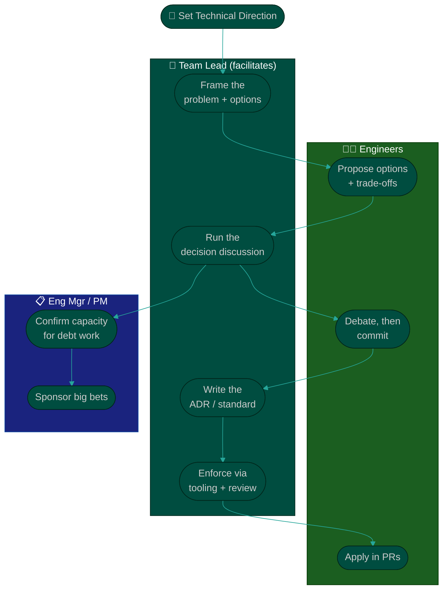

# Procedure: Technical Direction

**Tags:** #procedure #team-lead #tech-lead #architecture #standards #adr #techdebt
**Roles:** Team Lead / Tech Lead · Engineering Manager · Developers · Architect · PM/PO
**Read Time:** ~13 min

> Setting technical direction is the part of the job only a Tech Lead can do — but it is not done *to* the team, it is done *with* them. Direction lives in three artifacts: **standards** (how we write code), **decisions** (how we choose architecture, captured as ADRs), and a **tech-debt strategy** (how we balance shipping against keeping the codebase healthy). The golden rule: **standards the team helped shape are standards the team follows.** A document you wrote alone and announced in a meeting is a wish, not a standard.

---

## 📌 Table of Contents
- [Direction Is Influence, Not Decree](#direction-is-influence-not-decree)
- [The Three Pillars](#the-three-pillars)
- [Mermaid Swimlane Diagram](#mermaid-swimlane-diagram)
- [ASCII Flow](#ascii-flow)
- [Step-by-Step Responsibility Table](#step-by-step-responsibility-table)
- [Pillar 1 — Standards](#pillar-1--standards)
- [Pillar 2 — Architecture Decisions (ADRs)](#pillar-2--architecture-decisions-adrs)
- [Pillar 3 — Tech-Debt Strategy](#pillar-3--tech-debt-strategy)
- [Balancing Delivery vs Quality](#balancing-delivery-vs-quality)
- [Anti-Patterns to Avoid](#anti-patterns-to-avoid)
- [Related Documents](#related-documents)

---

## Direction Is Influence, Not Decree

> **You set direction by building consensus, then documenting the decision — not by announcing it.** Your title lets you break a tie; it does not let you skip the conversation. Engineers commit to standards and architectures they helped reason about, and they quietly route around the ones imposed on them.

Three things make technical direction *stick*:
1. **It solves a real, agreed pain** — traced back to the [Technical Assessment](./02-technical-assessment.md), not your preferences.
2. **The team co-authored it** — they argued the trade-offs and their names are on it.
3. **It's written down and discoverable** — a decision no one can find is a decision no one made.

---

## The Three Pillars

| Pillar | Defines | Artifact | Cadence |
|:-------|:--------|:---------|:--------|
| **Standards** | How we write & review code | Coding standards doc + linters | Evolves quarterly |
| **Decisions** | Why we chose this architecture | ADRs ([template](./templates/adr-template.md)) | Per significant decision |
| **Tech-Debt Strategy** | What we pay down, when, and how much | Debt register + capacity policy | Reviewed each sprint/planning |

---

## Mermaid Swimlane Diagram



---

## ASCII Flow

```
SETTING TECHNICAL DIRECTION
══════════════════════════════════════════════════════════════════════════════════

🧭 SET TECHNICAL DIRECTION
   │
   ▼
┌──────────────────────────────────────────────────────────────────────────────┐
│  PILLAR 1 — STANDARDS   (Team co-authors, Lead facilitates)                   │
│    Document how we write code · automate it in linters/CI · keep it short      │
└───────────────┬────────────────────────────────────────────────────────────────┘
                ▼
┌──────────────────────────────────────────────────────────────────────────────┐
│  PILLAR 2 — DECISIONS (ADRs)   (Lead writes, team debates)                    │
│    Frame problem → options + trade-offs → decision → consequences → record     │
└───────────────┬────────────────────────────────────────────────────────────────┘
                ▼
┌──────────────────────────────────────────────────────────────────────────────┐
│  PILLAR 3 — TECH-DEBT STRATEGY   (Lead proposes, Eng Mgr funds capacity)      │
│    Register the debt · reserve a % of capacity · pay hot spots first           │
└───────────────┬────────────────────────────────────────────────────────────────┘
                ▼
┌──────────────────────────────────────────────────────────────────────────────┐
│  BALANCE — DELIVERY vs QUALITY   (continuous)                                 │
│    Make the trade-off VISIBLE to PM/PO · let the business choose with eyes open│
└────────────────────────────────────────────────────────────────────────────────┘
```

---

## Step-by-Step Responsibility Table

| # | Step | Who Owns | Who Helps | Output |
|:--|:-----|:---------|:----------|:-------|
| 1 | Frame the problem & options | Team Lead | Senior devs | Options doc |
| 2 | Run the decision discussion | Team Lead | The team | Agreed direction |
| 3 | Write the ADR | Team Lead | Decision participants | [ADR](./templates/adr-template.md) |
| 4 | Co-author coding standards | Team Lead | The team | Standards doc |
| 5 | Automate enforcement | Team Lead | DevOps | Linter/CI rules |
| 6 | Maintain the debt register | Team Lead | The team | Prioritized debt list |
| 7 | Reserve debt capacity | Eng Manager | Team Lead, PM | Capacity policy |
| 8 | Surface delivery/quality trade-offs | Team Lead | PM/PO | Visible decision |

---

## Pillar 1 — Standards

**Standards exist to end pointless arguments, not start new ones.** Their job is to make style a solved, automated, invisible problem so reviews can focus on substance.

- **Automate everything you can.** A formatter and linter in CI settle 90% of style debates without a human. If it can be a lint rule, it should never be a review comment.
- **Keep the human-judgment standards short.** A 40-page style bible goes unread. A one-page "how we write code here" — naming, error handling, logging, file layout, testing expectations — gets followed.
- **Co-author it.** Draft from what the best existing code already does, then have the team react and amend. Ownership comes from shaping it.
- **Version it and let it evolve.** Standards are living documents. When a rule causes more friction than value, change it — out loud, with reasoning.

> Standards feed directly into review culture: the bar you document is the bar you enforce in PRs. See [04 — Code Review & Quality](./04-code-review-and-quality.md).

---

## Pillar 2 — Architecture Decisions (ADRs)

An **Architecture Decision Record** captures *why* a significant choice was made, so future engineers (including future you) don't relitigate it or break it by accident.

Use the **[ADR template](./templates/adr-template.md)** — Title, Status, Context, Decision, Consequences. Write one when a decision is:
- **Costly to reverse** (datastore choice, public API shape, framework, language).
- **Cross-cutting** (auth strategy, error model, how services communicate).
- **Contested** — when smart people disagreed, the reasoning is exactly what's worth recording.

Good ADR practice:
- **Record the rejected options.** Half the value is showing the alternatives you considered and *why* they lost.
- **Be honest about consequences** — including the bad ones. An ADR that only lists upsides isn't trusted.
- **Keep them immutable.** You don't edit a decision; you supersede it with a new ADR that links back. The history is the point.
- **Make them discoverable** — a numbered `/docs/adr/` folder in the repo, reviewed in PRs like code.

This is the same discipline as the wider [System Design & Architecture](../system-design/01-system-architecture.md) ADR practice, scaled to a single team.

---

## Pillar 3 — Tech-Debt Strategy

Debt is not a moral failing to be eliminated — it's leverage to be *managed*. Your strategy answers: **what do we pay down, when, and with how much of our capacity?**

- **Maintain a register.** Pull debt out of TODO comments and into a tracked, prioritized list (from your [Technical Assessment](./02-technical-assessment.md) hot spots). Untracked debt compounds invisibly.
- **Pay down hot spots first.** Debt in a file that changes weekly costs every sprint; debt in a dormant file costs nothing. Prioritize by *interest rate*, not ugliness.
- **Reserve a steady capacity** — e.g., ~15–20% of each sprint, or a recurring "engineering health" slice — rather than waiting for a mythical "cleanup sprint" that never comes. Agree this with your Eng Manager and PM up front.
- **Tie debt to delivery pain.** "This refactor cuts our checkout-bug rate" wins funding; "this is cleaner" does not. Speak the language of [Delivery & Collaboration](./06-delivery-and-collaboration.md).

---

## Balancing Delivery vs Quality

This is the daily tension of the role. The mistake is treating it as a binary you decide alone in secret.

| Lever | When you lean this way | The risk |
|:------|:-----------------------|:---------|
| **Ship faster, defer quality** | Real deadline, reversible decision, throwaway code | Debt compounds; "temporary" becomes permanent |
| **Slow down, invest in quality** | Hot path, hard-to-reverse, high blast radius | Over-engineering; missing the market window |

- **Make the trade-off visible, then let the business choose.** Your job is not to secretly tank quality to hit a date, nor to secretly gold-plate past one. It's to say: *"We can ship Friday with a known shortcut we'll repay in Sprint 14, or ship Wednesday-next with it done right. Here's the risk of each."* Then the PM/PO/sponsor decides with open eyes. This mirrors the PM's trade-off-triangle discipline in [PM — Planning & Estimation](../pm-leadership/03-planning-and-estimation.md).
- **Protect the non-negotiables.** Some quality is not a dial — security, data integrity, and the build staying green are floors, not trade-offs. Defend them.
- **Right-size the rigor.** A throwaway internal script does not need the ceremony of a payment path. Spending equal quality everywhere is its own waste.

---

## Anti-Patterns to Avoid

| Anti-Pattern | Why It Hurts | Do Instead |
|:-------------|:-------------|:-----------|
| **Standards by decree** | Imposed rules get quietly ignored | Co-author with the team; automate the rest |
| **The 40-page style bible** | Nobody reads it; it rots | One page of judgment calls; CI handles the rest |
| **ADRs only listing upsides** | Reads as advocacy, not a decision | Record rejected options and honest consequences |
| **Editing decided ADRs** | Erases the reasoning history | Supersede with a new ADR that links back |
| **Cleanup-sprint thinking** | The cleanup sprint never arrives | Reserve steady capacity every sprint |
| **Paying down ugly, not costly, debt** | Effort spent where it doesn't pay back | Prioritize by churn × complexity (hot spots) |
| **Hiding the delivery/quality call** | Secret shortcuts detonate; secret gold-plating slips dates | Surface the trade-off; let the business choose |
| **Architecture astronaut** | Designing for scale you'll never hit | Right-size to team size & real change patterns |

---

## Related Documents
- **Previous:** [02 — Technical Assessment](./02-technical-assessment.md)
- **Next:** [04 — Code Review & Quality](./04-code-review-and-quality.md)
- **Templates:** [ADR](./templates/adr-template.md) · [30/60/90 Plan](./templates/30-60-90-plan-template.md)
- **Cross-feed:** [System Design & Architecture](../system-design/01-system-architecture.md) · [DoR vs DoD](../../management/02-dor-and-dod-guide.md) · [PM — Planning & Estimation](../pm-leadership/03-planning-and-estimation.md) · [Management & Leadership](../../management/README.md)

---

*Part of the [Team Lead Playbook](./README.md) · Last updated: 2026-05-31*
