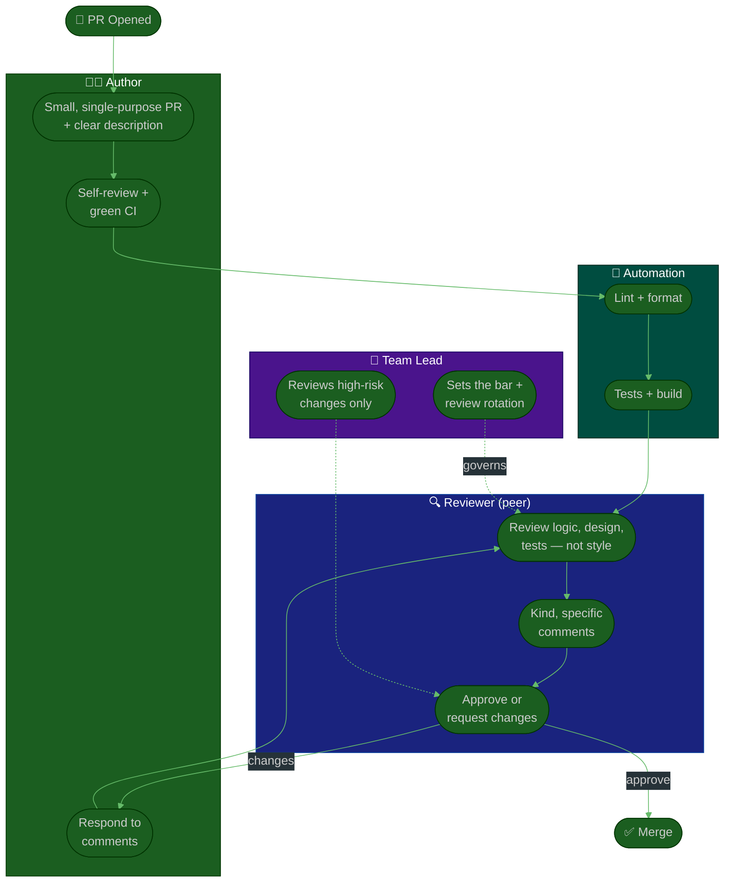

# Procedure: Code Review & Quality

**Tags:** #procedure #team-lead #tech-lead #codereview #quality #pr #engineering
**Roles:** Team Lead / Tech Lead · Developers · QA · Engineering Manager
**Read Time:** ~12 min

> Code review is the single most powerful culture-shaping tool a Team Lead owns. It is where the quality bar is set, where engineers teach each other, and — done badly — where teams grind to a halt waiting on one person. Your job is to **own the review culture, not the review queue.** You raise the bar by modeling great reviews and spreading the skill across the team; you do *not* become the gate every PR squeezes through. The golden rule: **review the code, not the coder — and optimize for the team's learning, not your own correctness.**

---

## 📌 Table of Contents
- [Review Is a Multiplier, Not a Gate](#review-is-a-multiplier-not-a-gate)
- [What a Healthy Review Culture Looks Like](#what-a-healthy-review-culture-looks-like)
- [Mermaid Swimlane Diagram](#mermaid-swimlane-diagram)
- [ASCII Flow](#ascii-flow)
- [Step-by-Step Responsibility Table](#step-by-step-responsibility-table)
- [What Good Review Looks Like](#what-good-review-looks-like)
- [The Quality Bar](#the-quality-bar)
- [Avoiding the Review Bottleneck](#avoiding-the-review-bottleneck)
- [Anti-Patterns to Avoid](#anti-patterns-to-avoid)
- [Related Documents](#related-documents)

---

## Review Is a Multiplier, Not a Gate

> **The point of review is a better team, not just a better PR.** A merged improvement is good; an engineer who writes the better version *next time without being told* is the real win. Every review is a teaching moment and a trust deposit — or, done carelessly, a withdrawal.

When you arrive, review culture usually sits in one of three failure modes — diagnose yours:
- **Rubber stamp** — "LGTM" in 30 seconds; review adds nothing, bugs leak through.
- **Gauntlet** — nitpicky, ego-driven, slow; authors dread it and route around it.
- **Bottleneck** — only one or two people review, so PRs age for days and they burn out.

Your goal is the fourth mode: **fast, kind, substantive, and distributed.**

---

## What a Healthy Review Culture Looks Like

| Dimension | Unhealthy | Healthy |
|:----------|:----------|:--------|
| **Speed** | PRs age 2–3 days | First response < 1 business day; small PRs same-day |
| **PR size** | 1,500-line mega-PRs | Small, single-purpose, reviewable in < 30 min |
| **Tone** | "Why would you do this?" | "What do you think about X here?" |
| **Coverage** | One bottleneck reviewer | Several capable reviewers; load spread |
| **Focus** | Style nits a linter should catch | Logic, design, edge cases, tests |
| **Outcome** | Author defends; nothing learned | Author levels up; knowledge spreads |

This builds directly on the team-wide [Code Review & PR Flow](../software-delivery/04-code-review-and-pr.md) — that doc defines the mechanics (branch → PR → review → merge); this one defines the *culture and standards* you own as lead.

---

## Mermaid Swimlane Diagram



---

## ASCII Flow

```
CODE REVIEW & QUALITY
══════════════════════════════════════════════════════════════════════════════════

🔀 PR OPENED
   │
   ▼
┌──────────────────────────────────────────────────────────────────────────────┐
│  ① AUTHOR PREPARES                                                            │
│    Small + single-purpose · clear description (what/why) · self-review first   │
└───────────────┬────────────────────────────────────────────────────────────────┘
                ▼
┌──────────────────────────────────────────────────────────────────────────────┐
│  ② AUTOMATION GATES   (no human needed)                                       │
│    Lint + format + tests + build must be GREEN before a human looks            │
└───────────────┬────────────────────────────────────────────────────────────────┘
                ▼
┌──────────────────────────────────────────────────────────────────────────────┐
│  ③ PEER REVIEW   (distributed — NOT just the lead)                            │
│    Logic · design · edge cases · tests · readability — kind + specific         │
└───────────────┬────────────────────────────────────────────────────────────────┘
                ▼
┌──────────────────────────────────────────────────────────────────────────────┐
│  ④ LEAD GOVERNS THE BAR  (not the queue)                                      │
│    Sets standards · runs reviewer rotation · reviews only high-risk changes    │
└───────────────┬────────────────────────────────────────────────────────────────┘
                ▼
            ✅ MERGE  →  deploy per Deployment Flow
```

---

## Step-by-Step Responsibility Table

| # | Step | Who Owns | Who Helps | Output |
|:--|:-----|:---------|:----------|:-------|
| 1 | Define the quality bar & review standard | Team Lead | The team | Review checklist / standard |
| 2 | Automate style & correctness gates | Team Lead | DevOps | Green-required CI |
| 3 | Open a small, well-described PR | Author | — | Reviewable PR |
| 4 | Self-review before requesting review | Author | — | Cleaner diff |
| 5 | Peer review (logic, design, tests) | Reviewer (rotated) | — | Comments / approval |
| 6 | Respond & iterate | Author | Reviewer | Updated PR |
| 7 | Review high-risk changes | Team Lead | Senior dev | Risk sign-off |
| 8 | Track review health metrics | Team Lead | — | Review latency, PR size trend |

---

## What Good Review Looks Like

**As the author** (model this; coach the team to it):
- Keep PRs **small and single-purpose**. The strongest predictor of a good review is a reviewable diff. A 1,500-line PR gets a rubber stamp because no human can hold it in their head.
- Write a **description that answers *why***, not just *what*. Link the ticket and any ADR. Call out the risky parts and where you want eyes.
- **Self-review first.** Read your own diff before requesting review; you'll catch half the comments yourself.

**As the reviewer:**
- **Review the right layer.** Let CI handle formatting; you focus on logic, design, edge cases, security, and whether the tests actually prove the change.
- **Be kind and specific.** "This will NPE if `items` is empty" beats "this is wrong." Ask questions when you're unsure rather than asserting. Phrase preferences as preferences.
- **Distinguish blocking from non-blocking.** Prefix nits: `nit:` (optional), `question:` (clarify), `blocking:` (must fix). Don't hold a PR hostage over taste.
- **Approve to unblock.** "Approve with comments" for trivial fixes trusts the author and keeps flow moving.

**As the lead:**
- **Model the gold-standard review** publicly so the team sees the bar. Your reviews teach more than any standards doc.
- **Praise great reviews, not just great code.** Reward the engineer who left the thoughtful review; that's how the culture spreads.

---

## The Quality Bar

The bar is what review *defends*. Make it explicit so it isn't re-argued every PR. A practical bar — adapt with the team:

- **Correct** — does what the ticket says; edge cases and error paths handled.
- **Tested** — meaningful tests prove the behavior; they'd fail if the code broke. (Coordinate with QA — see [QA — Test Strategy](../qa-leadership/03-test-strategy.md).)
- **Readable** — the next engineer understands it without a walkthrough.
- **Consistent** — follows the team's [coding standards](./03-technical-direction.md).
- **Safe** — no obvious security, data-integrity, or performance regressions.
- **Meets DoD** — satisfies the team's [Definition of Done](../../management/02-dor-and-dod-guide.md).

The bar is a **floor that everyone defends**, not a ceiling only you enforce. Some elements (security, data integrity, green build) are non-negotiable; others flex with context — a spike or throwaway script doesn't carry a payment path's rigor.

---

## Avoiding the Review Bottleneck

This is the doer→multiplier trap in its most common disguise. If you review every PR, three bad things happen: PRs age waiting on you, you burn out, and the team never builds review muscle.

- **Rotate reviewers deliberately.** Assign so juniors review (great learning) and so knowledge spreads off the single-points-of-knowledge you found in your [Technical Assessment](./02-technical-assessment.md).
- **Set a team SLA** — e.g., first response within one business day; reviewing is a first-class task, not "when I get to it." Protect review time in everyone's day.
- **Grow other reviewers on purpose.** Pair-review with a junior, then hand them the next solo review. Soon you're reviewing the *reviews*, not the code.
- **Reserve yourself for the high-risk changes** — migrations, security-sensitive paths, cross-cutting architecture — and let peers handle the routine flow.
- **Right-size the process.** Two-reviewer mandates on every one-line fix are theater. Match required rigor to blast radius.

> **A team that needs you on every PR isn't a team you've led well — it's a team you've made dependent.** The goal is a review culture that runs without you in the room.

---

## Anti-Patterns to Avoid

| Anti-Pattern | Why It Hurts | Do Instead |
|:-------------|:-------------|:-----------|
| **Lead reviews every PR** | You become the bottleneck; the team stays dependent | Rotate reviewers; reserve yourself for high-risk |
| **Reviewing style by hand** | Wastes humans on what CI should catch | Automate format/lint; review substance |
| **The gauntlet review** | Nitpicky, ego-driven reviews kill morale and speed | Be kind, specific; separate nits from blockers |
| **Rubber-stamp "LGTM"** | Bugs leak; review adds no value | Defend the explicit quality bar |
| **Mega-PRs** | Unreviewable; get stamped or stall | Coach small, single-purpose PRs |
| **Review the coder, not the code** | Defensiveness; nothing learned | Critique the change; ask questions |
| **Hostage-taking over taste** | Blocks flow on non-blocking opinions | Phrase preferences as `nit:`; approve to unblock |
| **Quality bar in your head** | Re-argued every PR; inconsistent | Write it down; tie to DoD |

---

## Related Documents
- **Previous:** [03 — Technical Direction](./03-technical-direction.md)
- **Next:** [05 — Mentoring & Growth](./05-mentoring-and-growth.md)
- **Mechanics of the flow:** [Code Review & PR Flow](../software-delivery/04-code-review-and-pr.md)
- **Cross-feed:** [DoR vs DoD](../../management/02-dor-and-dod-guide.md) · [Sprint Ceremonies](../software-delivery/03-sprint-ceremonies.md) · [QA — Test Strategy](../qa-leadership/03-test-strategy.md) · [QA Leadership Playbook](../qa-leadership/README.md)

---

*Part of the [Team Lead Playbook](./README.md) · Last updated: 2026-05-31*
