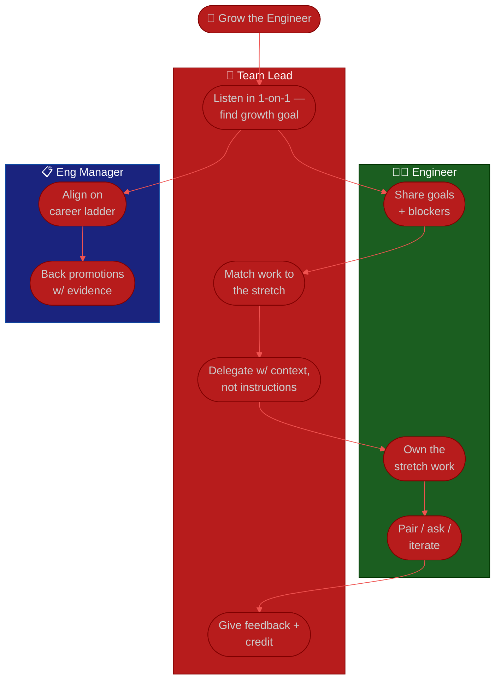

# Procedure: Mentoring & Growth

**Tags:** #procedure #team-lead #tech-lead #mentoring #growth #1on1 #delegation #feedback
**Roles:** Team Lead / Tech Lead · Developers · Engineering Manager
**Read Time:** ~13 min

> Growing engineers is where the doer→multiplier shift becomes real. Your value as a lead is no longer the code you write — it's the **slope of everyone else's growth curve.** This procedure covers the tools that move that slope: **1-on-1s, delegation, pairing, stretch assignments, feedback, and career growth.** The golden rule: **delegate the work *and* the credit; keep the accountability.** If you hoard the interesting problems "because it's faster," you cap the team at your own throughput and starve everyone of the chance to grow.

---

## 📌 Table of Contents
- [The Multiplier Mindset, Deepened](#the-multiplier-mindset-deepened)
- [The Growth Toolkit](#the-growth-toolkit)
- [Mermaid Swimlane Diagram](#mermaid-swimlane-diagram)
- [ASCII Flow](#ascii-flow)
- [Step-by-Step Responsibility Table](#step-by-step-responsibility-table)
- [Tool 1 — 1-on-1s](#tool-1--1-on-1s)
- [Tool 2 — Delegation](#tool-2--delegation)
- [Tool 3 — Pairing & Stretch Assignments](#tool-3--pairing--stretch-assignments)
- [Tool 4 — Feedback](#tool-4--feedback)
- [Tool 5 — Career Growth](#tool-5--career-growth)
- [Anti-Patterns to Avoid](#anti-patterns-to-avoid)
- [Related Documents](#related-documents)

---

## The Multiplier Mindset, Deepened

> **The work that grows people almost always feels slower in the moment.** Coaching a junior through a problem takes longer than solving it yourself today — and it's the only thing that means you don't have to solve it yourself tomorrow. Optimize for the team's future capability, not for today's keystroke efficiency.

A multiplier's relationship to the hard problem changes:
- The **doer** asks: *How do I solve this?*
- The **multiplier** asks: *Who on the team could solve this with the right support — and how do I give it?*

Your three growth levers, in priority order:
1. **Reduce the bus factor** — turn single points of knowledge into shared knowledge.
2. **Raise the floor** — bring the least experienced engineers up fastest; that lifts the whole team's throughput most.
3. **Stretch the ceiling** — give your strongest engineers problems bigger than their current title.

---

## The Growth Toolkit

| Tool | Best for | Cadence |
|:-----|:---------|:--------|
| **1-on-1s** | Trust, blockers, growth conversations | Weekly or biweekly, never skipped |
| **Delegation** | Building ownership & reducing bus factor | Continuous |
| **Pairing** | Spreading knowledge, unblocking, onboarding | As needed / weekly |
| **Stretch assignments** | Growing toward the next level | Per quarter |
| **Feedback** | Reinforcing or correcting in the moment | Immediate + ongoing |
| **Career growth** | Direction, motivation, retention | Quarterly + ongoing |

---

## Mermaid Swimlane Diagram



---

## ASCII Flow

```
MENTORING & GROWTH — DOER → MULTIPLIER
══════════════════════════════════════════════════════════════════════════════════

🌱 GROW THE ENGINEER
   │
   ▼
┌──────────────────────────────────────────────────────────────────────────────┐
│  ① UNDERSTAND   (1-on-1s)                                                     │
│    Where do they want to grow? What's blocking them? Listen 80%, talk 20%      │
└───────────────┬────────────────────────────────────────────────────────────────┘
                ▼
┌──────────────────────────────────────────────────────────────────────────────┐
│  ② MATCH   (stretch assignment)                                               │
│    Pick work just beyond their current reach · attach support, not hand-holding│
└───────────────┬────────────────────────────────────────────────────────────────┘
                ▼
┌──────────────────────────────────────────────────────────────────────────────┐
│  ③ DELEGATE   (context, not instructions)                                     │
│    Hand over outcome + the why · let them choose the how · resist taking back  │
└───────────────┬────────────────────────────────────────────────────────────────┘
                ▼
┌──────────────────────────────────────────────────────────────────────────────┐
│  ④ SUPPORT   (pairing + feedback)                                             │
│    Pair to unblock & teach · feedback in the moment · let them keep the credit │
└───────────────┬────────────────────────────────────────────────────────────────┘
                ▼
┌──────────────────────────────────────────────────────────────────────────────┐
│  ⑤ GROW   (career)                                                            │
│    Tie wins to the ladder · advocate with evidence · repeat one level up       │
└────────────────────────────────────────────────────────────────────────────────┘
```

---

## Step-by-Step Responsibility Table

| # | Step | Who Owns | Who Helps | Output |
|:--|:-----|:---------|:----------|:-------|
| 1 | Run regular 1-on-1s | Team Lead | Engineer | Notes + growth goals ([template](./templates/one-on-one-template.md)) |
| 2 | Identify growth goal per person | Team Lead | Engineer | Per-person growth plan |
| 3 | Match a stretch assignment | Team Lead | PM (scope) | Owned stretch work |
| 4 | Delegate with context | Team Lead | — | Engineer owns outcome |
| 5 | Pair to teach / unblock | Team Lead or senior | Engineer | Knowledge spread |
| 6 | Give timely feedback | Team Lead | — | Reinforced/corrected behavior |
| 7 | Advocate for advancement | Team Lead | Eng Manager | Promotion case w/ evidence |

---

## Tool 1 — 1-on-1s

The 1-on-1 is the foundation everything else rests on. It is **their meeting, not your status update.**

- **Make it sacred.** Weekly or biweekly, same slot, rarely cancelled. Cancelling signals "you don't matter" louder than any words say otherwise.
- **Let them drive the agenda.** Open with "What's on your mind?" not "Status?" You get status everywhere else.
- **Rotate the lens over time:** blockers this week, growth this month, career this quarter. Don't let every 1-on-1 collapse into task-tracking.
- **Keep a running doc per person** so you remember commitments and spot patterns (see the [1-on-1 template](./templates/one-on-one-template.md)).
- **Listen 80%, talk 20%** — the same discipline as your first-90-days discovery, sustained forever.

---

## Tool 2 — Delegation

Delegation is the core multiplier move — and the one new leads fumble most, usually by either dumping or hovering.

**Delegate the outcome and the why, not the keystrokes.** "Make checkout resilient to a payment-provider timeout — here's the context and the constraint; you choose the approach" grows an engineer. "Add a try/catch on line 88" grows nothing.

| Level | You hand over | Use when |
|:------|:--------------|:---------|
| **Tell** | Exact steps | Emergency, or true novice on a risky task |
| **Guide** | Outcome + checkpoints | Learning a new area |
| **Delegate** | Outcome + the why | Growing toward independence |
| **Empower** | The whole problem | Trusted owner; you stay informed |

- **Delegate the credit, keep the accountability.** When it goes well, it's their win — say their name in the room. When it goes wrong, it's your responsibility to your manager. That asymmetry is the job.
- **Resist taking it back.** The moment it gets hard and you grab the keyboard "just this once," you teach helplessness. Coach instead; let them struggle productively.
- **Delegate to reduce the bus factor**, deliberately handing single-points-of-knowledge to a second owner (from your [Technical Assessment](./02-technical-assessment.md) skill matrix).

---

## Tool 3 — Pairing & Stretch Assignments

- **Pairing** is the fastest way to spread knowledge and unblock without taking over. Use it for onboarding, for hard bugs, and to seed a second owner on a risky system. When you pair, **narrate your reasoning** — the thinking is the lesson, not the answer.
- **Stretch assignments** grow people toward their next level by handing them work *just beyond* their current reach — a junior owning their first feature end-to-end, a senior driving an ADR or mentoring a junior. The stretch should be uncomfortable but supported, with a real safety net so failure is recoverable, not catastrophic.
- Match the stretch to the **growth goal you found in 1-on-1s**, not to whatever ticket is convenient. Growth is intentional or it doesn't happen.

---

## Tool 4 — Feedback

Feedback is a gift most leads under-give. The team can't improve on signals they never receive.

- **Make it timely and specific.** "In the auth PR, splitting the token logic into its own module made it far easier to follow" lands; "good job lately" evaporates.
- **Use a simple structure** — Situation → Behavior → Impact: *"In standup (S), you jumped in with the root cause (B), which unblocked Rith immediately (I)."* Works for praise and correction alike.
- **Praise in public, correct in private.** Never criticize an engineer in front of peers; never let great work go unnamed in front of them.
- **Give corrective feedback early and kindly** — a small course-correction now beats a surprise at review time. No feedback at a 1-on-1 should ever be a surprise at performance review.
- **Ask for feedback on yourself** and act on it visibly. A lead who takes feedback well makes it safe for the team to do the same.

---

## Tool 5 — Career Growth

You may not own promotions, but you own the **evidence and advocacy** that make them happen.

- **Know each person's direction.** Deeper technical mastery? Breadth? Toward lead themselves? Out of their comfort zone entirely? Ask; don't assume everyone wants your job.
- **Map growth to the career ladder** with your Eng Manager so "what gets you to the next level" is concrete, not vibes.
- **Collect evidence continuously** — the stretch they nailed, the incident they led, the junior they mentored. A promotion case built on specifics wins; one built on "they're great" stalls.
- **Advocate up.** Be the person who makes their case in the room they're not in. Retention is mostly growth: people stay where they're getting better and feel seen.

---

## Anti-Patterns to Avoid

| Anti-Pattern | Why It Hurts | Do Instead |
|:-------------|:-------------|:-----------|
| **Hoarding the hard problems** | Caps the team at your throughput; starves growth | Delegate the stretch; coach the solver |
| **Cancelling 1-on-1s when busy** | Signals the person doesn't matter | Protect them; reschedule, never skip |
| **1-on-1 as status meeting** | You already get status elsewhere | Make it their agenda — growth & blockers |
| **Taking the keyboard back** | Teaches helplessness; kills ownership | Pair and coach; let them struggle productively |
| **Delegating tasks, not outcomes** | Grows obedience, not judgment | Hand over the outcome + the why |
| **Taking the credit** | Demoralizes; you don't need it anymore | Their win in public; your accountability in private |
| **Feedback only at review time** | Surprises are unfair and too late | Specific feedback in the moment, both directions |
| **Assuming everyone wants to lead** | Mis-targets growth; frustrates ICs | Ask their direction; grow them toward it |

---

## Related Documents
- **Previous:** [04 — Code Review & Quality](./04-code-review-and-quality.md)
- **Next:** [06 — Delivery & Collaboration](./06-delivery-and-collaboration.md)
- **Template:** [1-on-1 Notes](./templates/one-on-one-template.md)
- **Cross-feed:** [QA — Team & Cadence](../qa-leadership/06-team-and-cadence.md) · [PM Leadership Playbook](../pm-leadership/README.md) · [Management & Leadership](../../management/README.md)

---

*Part of the [Team Lead Playbook](./README.md) · Last updated: 2026-05-31*
