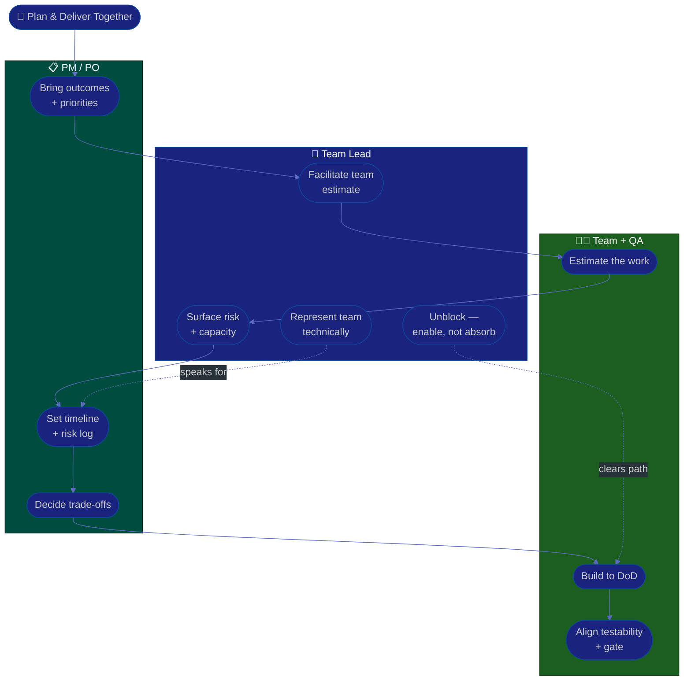

# Procedure: Delivery & Collaboration

**Tags:** #procedure #team-lead #tech-lead #delivery #collaboration #estimation #unblocking
**Roles:** Team Lead / Tech Lead · PM · QA · PO · Developers · Engineering Manager
**Read Time:** ~12 min

> A Team Lead sits at the seam between the engineering team and everyone who depends on it — PM, QA, PO, and partner teams. Your job at that seam is to **make the team's technical reality legible to the business, and the business's priorities legible to the team** — then clear the path so the work flows. The golden rule: **you represent the team, not yourself.** When you give an estimate, you carry the team's estimate; when you unblock, you remove the obstacle so the team keeps moving, rather than absorbing the work onto your own plate.

---

## 📌 Table of Contents
- [The Lead as Connective Tissue](#the-lead-as-connective-tissue)
- [Who You Work With and How](#who-you-work-with-and-how)
- [Mermaid Swimlane Diagram](#mermaid-swimlane-diagram)
- [ASCII Flow](#ascii-flow)
- [Step-by-Step Responsibility Table](#step-by-step-responsibility-table)
- [Working with PM — Estimation Input](#working-with-pm--estimation-input)
- [Working with QA & PO — Quality and Acceptance](#working-with-qa--po--quality-and-acceptance)
- [Unblocking the Team](#unblocking-the-team)
- [Representing the Team Technically](#representing-the-team-technically)
- [Anti-Patterns to Avoid](#anti-patterns-to-avoid)
- [Related Documents](#related-documents)

---

## The Lead as Connective Tissue

> **Translation is half the job.** PMs speak in dates and outcomes; engineers speak in complexity and risk; QA speaks in coverage and confidence. You are the person fluent in all three, and most delivery friction is really a translation failure you're positioned to fix.

You add value at the seam in three ways:
1. **Translate** — turn technical risk into business language ("this dependency could slip us a week") and business priority into technical clarity for the team.
2. **Protect focus** — shield the team from churn, drive-by requests, and thrash so they can build.
3. **Unblock** — make obstacles disappear, ideally by enabling someone else rather than doing it yourself.

---

## Who You Work With and How

| Partner | They own | You provide | Watch for |
|:--------|:---------|:------------|:----------|
| **PM (Delivery)** | Plan, timeline, risk log | Estimation input, technical risk, capacity reality | Committing to dates the team didn't agree to |
| **PO** | Backlog priority, acceptance | Feasibility, technical options, trade-offs | Accepting vague stories without acceptance criteria |
| **QA Lead** | Test strategy, release gate | Testability, quality bar alignment, fix turnaround | Adversarial dev-vs-QA framing |
| **Eng Manager** | People, budget, your growth | Team health signal, risk escalation | Hiding bad news until it explodes |
| **Partner teams** | Shared services / dependencies | Clear interface contracts, early heads-up | Hidden dependencies surfacing late |

---

## Mermaid Swimlane Diagram



---

## ASCII Flow

```
DELIVERY & COLLABORATION
══════════════════════════════════════════════════════════════════════════════════

🤝 PLAN & DELIVER TOGETHER
   │
   ▼
┌──────────────────────────────────────────────────────────────────────────────┐
│  ① ESTIMATION INPUT   (Lead facilitates, TEAM estimates)                      │
│    Translate scope → break down risk → the team sizes it → you forecast/flag   │
└───────────────┬────────────────────────────────────────────────────────────────┘
                ▼
┌──────────────────────────────────────────────────────────────────────────────┐
│  ② QUALITY & ACCEPTANCE   (with QA + PO)                                      │
│    Align on DoR/DoD · testability · the quality bar · no vague stories in      │
└───────────────┬────────────────────────────────────────────────────────────────┘
                ▼
┌──────────────────────────────────────────────────────────────────────────────┐
│  ③ UNBLOCK   (continuous)                                                     │
│    Spot blockers early · clear the path · ENABLE someone, don't absorb it all  │
└───────────────┬────────────────────────────────────────────────────────────────┘
                ▼
┌──────────────────────────────────────────────────────────────────────────────┐
│  ④ REPRESENT THE TEAM   (technically, to the business)                        │
│    Carry the TEAM's estimate & risk · surface trade-offs · shield from churn   │
└────────────────────────────────────────────────────────────────────────────────┘
```

---

## Step-by-Step Responsibility Table

| # | Step | Who Owns | Who Helps | Output |
|:--|:-----|:---------|:----------|:-------|
| 1 | Clarify scope & priority | PM / PO | Team Lead | Shared understanding |
| 2 | Facilitate the team's estimate | Team Lead | The team | Team estimate (not the lead's) |
| 3 | Surface technical risk & capacity | Team Lead | PM | Risk entries + capacity reality |
| 4 | Align testability & quality bar | Team Lead | QA Lead | DoR/DoD agreement |
| 5 | Spot & clear blockers | Team Lead | Eng Manager | Path cleared |
| 6 | Represent the team's decisions | Team Lead | — | Trade-offs made visible |
| 7 | Shield the team from churn | Team Lead | PM | Protected focus time |

---

## Working with PM — Estimation Input

The PM owns the plan; **the team owns the estimate; you facilitate and add technical truth.** This mirrors the PM's own discipline in [PM — Planning & Estimation](../pm-leadership/03-planning-and-estimation.md): *the team estimates, the PM forecasts.* Your role is the bridge.

- **Never estimate *for* the team.** A number you invent is one they don't believe and can't hit. Bring the work to them, facilitate the sizing, carry the result.
- **Add the technical layer the PM can't see:** hidden dependencies, the risky migration buried in a "simple" feature, the tech debt that will tax this estimate.
- **Be honest about uncertainty.** Surface it as a risk or a range, not a padded number. "This is a 3 if the legacy auth cooperates, an 8 if it doesn't — we should spike it first" is gold.
- **Protect the team from the over-commit.** When the desired date and the team's estimate diverge, make the trade-off visible (scope / time / people) and let the PM and business choose — don't quietly promise heroics. See the trade-off discipline in [03 — Technical Direction](./03-technical-direction.md).

---

## Working with QA & PO — Quality and Acceptance

- **QA is a partner, not the enemy.** The dev-vs-QA adversarial frame kills velocity and morale. Align early on **testability** (can this story even be tested cleanly?) and on a shared quality bar. Coordinate your [code-review bar](./04-code-review-and-quality.md) with the QA Lead's [Test Strategy](../qa-leadership/03-test-strategy.md) so quality is owned end-to-end, not bolted on.
- **Insist on a real [Definition of Ready](../../management/02-dor-and-dod-guide.md).** A story without acceptance criteria produces a vague estimate and guaranteed rework. Help the PO sharpen stories *before* they enter a sprint — that's cheaper than fixing them after.
- **Co-own the [Definition of Done](../../management/02-dor-and-dod-guide.md).** "Done" should mean tested, reviewed, and shippable — agreed with QA and PO so no one's surprised at the release gate.

---

## Unblocking the Team

Unblocking is the highest-leverage thing you do day to day — and the easiest to do wrong by absorbing the work yourself.

- **Make blockers visible fast.** A daily "anyone blocked?" beat (standup or async) surfaces obstacles while they're cheap. A blocker found on day 4 already cost three.
- **Clear the path, don't carry the load.** The multiplier move is to *enable* the unblock — get the API spec, the access, the decision, the introduction — so the engineer keeps moving. Grabbing the keyboard to do it yourself is the doer trap wearing a cape.
- **Escalate without ego.** If a blocker is above your line — a stalled partner team, a missing decision, a resourcing gap — escalate to your Eng Manager or the PM early and clearly. Sitting on it to "handle it myself" is how dates quietly slip.
- **Kill recurring blockers at the root.** A blocker that recurs is a process or architecture problem in disguise — feed it back into your [Technical Direction](./03-technical-direction.md).

---

## Representing the Team Technically

You are the team's technical voice in rooms they're not in. That's a responsibility, not a megaphone for your opinions.

- **Carry the team's position, not just yours.** When you speak for the team's estimate, risk, or technical stance, represent what the team actually concluded — even where you'd personally have chosen differently. Then bring decisions back transparently.
- **Shield the team from churn, not from truth.** Absorb the thrash — the shifting priorities, the drive-by requests, the politics — so the team can focus. But never hide real bad news from them or from your manager; shielding-by-hiding detonates later.
- **Translate up and down.** Turn "the database is at 80% capacity" into "we have ~6 weeks before this becomes customer-facing latency — here are the options" for the business; turn business priority into clear technical direction for the team.
- **Build the team's external reputation.** Reliable estimates, honest risk-flagging, and steady delivery earn the team autonomy and trust. Part of your job is making the team look as good as it actually is.

---

## Anti-Patterns to Avoid

| Anti-Pattern | Why It Hurts | Do Instead |
|:-------------|:-------------|:-----------|
| **Estimating for the team** | They don't believe or own the number | Facilitate; the team estimates, you forecast |
| **Committing to dates solo** | You promise heroics the team can't deliver | Surface the trade-off; let the business choose |
| **Absorbing every blocker** | Doer trap; team stays dependent, you drown | Enable the unblock; clear the path, don't carry it |
| **Dev-vs-QA adversarial frame** | Kills velocity and morale | Treat QA as a quality partner; align early |
| **Letting vague stories in** | Vague estimates + guaranteed rework | Enforce DoR; sharpen stories before the sprint |
| **Hiding bad news** | Surprises detonate; trust evaporates | Shield from churn, never from truth |
| **Pushing your opinion as "the team's"** | Misrepresents the team; erodes their trust | Carry the team's actual decision |
| **Sitting on escalations** | Dates slip while you "handle it" | Escalate early, clearly, without ego |

---

## Related Documents
- **Previous:** [05 — Mentoring & Growth](./05-mentoring-and-growth.md)
- **Start of series:** [01 — First 90 Days](./01-first-90-days.md)
- **Cross-feed:** [PM — Planning & Estimation](../pm-leadership/03-planning-and-estimation.md) · [Sprint Ceremonies](../software-delivery/03-sprint-ceremonies.md) · [DoR vs DoD](../../management/02-dor-and-dod-guide.md) · [QA Leadership Playbook](../qa-leadership/README.md) · [PM Leadership Playbook](../pm-leadership/README.md)

---

*Part of the [Team Lead Playbook](./README.md) · Last updated: 2026-05-31*
