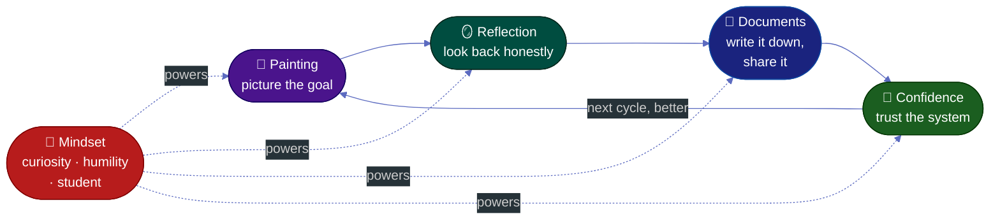

# Guide: The Painting → Reflection → Documents → Confidence Loop

**Tags:** #ways-of-working #collaboration #mindset #continuous-improvement #teams
**Audience:** Team leads · anyone running a system or procedure · teams that want to improve how they work
**Read Time:** ~13 min

> A framework shared by a founder at a talk: to work as a team you need a **procedure / flow**, and it only works if it keeps improving in a **loop** — **Painting → Reflection → Documents → Confidence → (repeat).** You picture where you're going, run the flow for a **set duration**, look honestly at what happened, write it down so it's shared, and each turn builds confidence in the system. What keeps the loop healthy is a **mindset** — stay curious, stay humble, stay a student — and a rule: when something fails, **ask why and fix the flow; don't "kill the goat"** (blame a person). That's what makes a procedure actually run — and what makes a team collaborate well. 🤝

---

## 📌 Table of Contents
- [The Big Idea](#01)
- [Mermaid Loop](#02)
- [ASCII Loop](#03)
- [The Loop at a Glance](#04)
- [Step 1 — Painting 🎨](#05)
- [Step 2 — Reflection 🪞](#06)
- [Step 3 — Documents 📄](#07)
- [Step 4 — Confidence 🔄](#08)
- [The Time-Box: Run for a Duration, Then Review ⏱️](#08b)
- [The Mindset That Powers the Loop 🧠](#09)
- [Blameless: Ask Why, Don't Kill the Goat 🐐](#09b)
- [Why This Makes Teams Collaborate 🤝](#10)
- [Self-Check](#11)
- [Related Documents](#12)

---

<a id="01"></a>
## The Big Idea

> A procedure written once and never revisited rots. The point isn't to *have* a process — it's to run a **loop** that makes the process a little better every cycle, and to build **shared confidence** in it as you go.

The four steps form a cycle, not a checklist:

- **Painting 🎨** — you picture the goal / the way forward (vision before detail).
- **Reflection 🪞** — you look back honestly at what actually happened.
- **Documents 📄** — you write the learning down so it's shared and repeatable.
- **Confidence 🔄** — each loop earns trust in the system; then you paint the next picture.

And underneath all four runs a **mindset** — curiosity, humility, the student's posture — without which the loop quietly stalls (people stop reflecting honestly, stop writing things down, stop trusting the system).

---

<a id="02"></a>
## Mermaid Loop



---

<a id="03"></a>
## ASCII Loop

```
THE PAINTING → REFLECTION → DOCUMENTS → CONFIDENCE LOOP
══════════════════════════════════════════════════════════════════════════════════

                     ┌──────────────────────────────────────┐
                     │                                       │
                     ▼                                       │
         ┌────────────────────┐                              │
         │  🎨 1 · PAINTING   │   picture the goal / vision  │
         └─────────┬──────────┘                              │
                   ▼                                          │
         ┌────────────────────┐                              │
         │  🪞 2 · REFLECTION │   look back — what happened? │
         └─────────┬──────────┘                              │
                   ▼                                          │
         ┌────────────────────┐                              │
         │  📄 3 · DOCUMENTS  │   write it down, share it    │
         └─────────┬──────────┘                              │
                   ▼                                          │
         ┌────────────────────┐                              │
         │  🔄 4 · CONFIDENCE │   trust grows in the system  │
         └─────────┬──────────┘                              │
                   └──  ⏱️ run a set duration → review →  ────┘
                        update the flow, loop again better

   ┌──────────────────────────────────────────────────────────────────────────┐
   │  🧠 MINDSET (runs underneath every step):                                  │
   │     curiosity · humility · stay a student                                  │
   │  🐐 when something fails → ask WHY & fix the flow — don't kill the goat     │
   │  → this is what keeps the loop honest and turning, and what lets a         │
   │    team collaborate 🤝 around the shared system.                           │
   └──────────────────────────────────────────────────────────────────────────┘
```

---

<a id="04"></a>
## The Loop at a Glance

| # | Step | In one line | The question it answers | Without it… |
|:--|:-----|:------------|:------------------------|:------------|
| 1 | **Painting** 🎨 | Picture the goal & the path | *Where are we going?* | You move without direction |
| 2 | **Reflection** 🪞 | Look back honestly | *What actually happened?* | You repeat the same mistakes |
| 3 | **Documents** 📄 | Write it down, share it | *How do we keep & spread the lesson?* | Knowledge stays in one head |
| 4 | **Confidence** 🔄 | Trust the system, loop again | *Can we rely on this — and improve it?* | The process is fragile, ignored |

---

<a id="05"></a>
## Step 1 — Painting 🎨

> Before any detail, **paint the picture** — where are we going, and what does "good" look like?

"Painting" is the act of forming and sharing a **vision**. Like an artist sketching before filling in detail, you broad-stroke the goal first so everyone sees the same picture.

- **Make the goal vivid and shared** — a picture everyone on the team can hold in their head.
- **Big strokes before fine detail** — direction first; the specifics come as you go.
- **It's a hypothesis, not a contract** — the painting will be corrected by reflection later, and that's expected.

> Think of it as answering: *"If this works, what will it look like?"* You can't reflect on, document, or trust a system if no one agreed on where it was pointed.

---

<a id="06"></a>
## Step 2 — Reflection 🪞

> After acting, **hold up the mirror.** What actually happened versus what you painted?

Reflection is the honest review — comparing the picture you painted to the reality that unfolded.

- **Compare intent vs reality** — where did it match the painting, where did it diverge, and *why?*
- **Be honest, not defensive** — reflection only works if you can admit what went wrong (this is where humility matters most).
- **Look for the lesson, not the blame** — the question is "what do we learn?", never "whose fault?"

> A team that paints but never reflects keeps charging at the same wall. The mirror is uncomfortable — that's exactly why it's valuable.

---

<a id="07"></a>
## Step 3 — Documents 📄

> A lesson that lives only in your head dies with the moment. **Write it down** — that's how it becomes the team's, and how it lasts.

Documents turn a private reflection into shared, repeatable knowledge — the system's memory.

- **Capture the learning** — what worked, what didn't, what to do differently next time.
- **Make it findable and shared** — a doc nobody can find is the same as no doc.
- **Keep it living** — update it each loop; documents are a current record, not a monument.

> This is the bridge from *individual* insight to *team* capability. Reflection makes *you* smarter; documenting makes the *team* smarter. (This whole repo is itself an example of step 3.)

---

<a id="08"></a>
## Step 4 — Confidence 🔄

> Each turn of the loop earns **confidence** — in the system, and in each other. Then you paint the next picture, a little wiser.

Confidence is the payoff and the fuel. When you've painted, reflected, and documented — and seen it work — you start to *trust* the procedure. That trust is what makes people actually follow it and keep improving it.

- **Confidence is earned, loop by loop** — not declared. The first cycle is shaky; the tenth is solid.
- **It compounds** — each documented lesson makes the next painting sharper and the next reflection faster.
- **It closes the loop** — confidence doesn't mean "stop"; it means "we trust this enough to keep refining it." Then back to painting.

> This is why it's drawn as a **loop, not a line.** The output of one cycle (a trusted, documented system) is the better starting point for the next.

---

<a id="08b"></a>
## The Time-Box: Run for a Duration, Then Review ⏱️

> To work as a team, you need a **procedure / flow** — and the loop only works if you give it a **fixed duration** to run, *then* check whether it actually worked. Don't review randomly, and don't change the procedure mid-flight on a whim.

This is the practical engine that turns the loop from a nice idea into a habit:

1. **Agree the procedure (the flow).** How does the team work together — who does what, in what order? This is the "painting" made concrete.
2. **Set a duration / period.** Commit to running it as-is for a fixed window — a sprint, two weeks, a month. A time-box gives the procedure a fair chance and gives you a clean before/after to judge.
3. **Run it for the whole period.** Resist the urge to keep tweaking mid-window — you can't tell if something works if you change it every day. Let it run; collect what happens.
4. **Review at the end: did it work?** This is **Reflection 🪞** on a schedule. Compare what happened to the painting. What worked, what didn't, where did it hurt?
5. **Update the procedure.** Fold the lessons in (**Documents 📄**), then run the next period with the improved flow. Each window earns **Confidence 🔄**.

| | Why it matters |
|:--|:---------------|
| **Fixed duration** | A fair test window + a clean point to judge "did it work?" |
| **Run it un-tweaked** | You can't measure a moving target — let the procedure actually run |
| **Scheduled review** | Reflection happens *on purpose*, not "if we remember" |
| **Update, then repeat** | The procedure evolves every cycle instead of rotting |

> ⏱️ *The rhythm:* **set the flow → run for the period → review → update → run again.** This is exactly the [sprint cadence](../scrum-master/03-facilitating-ceremonies.md) underneath agile, and the loop's "duration" is what makes the review honest — you're judging a real run, not a guess.

---

<a id="09"></a>
## The Mindset That Powers the Loop 🧠

> The four steps are mechanics. The **mindset** is what keeps them honest and turning. Drop the mindset and the loop becomes empty ritual — meetings nobody learns from, docs nobody reads.

| Mindset | What it means | What it protects in the loop |
|:--------|:--------------|:-----------------------------|
| **Curiosity** 🔍 | Keep asking "why?" and "what if?" | Keeps **Painting** fresh and **Reflection** genuine — you actually want to know what happened |
| **Humility** 🙏 | Accept you might be wrong | Keeps **Reflection** honest — you can admit mistakes instead of defending them |
| **Student mindset** 🎓 | Always learning, never "arrived" | Keeps the whole loop alive — you keep documenting and looping instead of assuming you're done |

- **Maintain curiosity** — the moment you stop being curious, you stop seeing what the mirror shows you.
- **Maintain humility** — confidence (step 4) without humility curdles into arrogance, and the loop stops correcting.
- **Maintain the mindset of a student** — treat every cycle as something to learn from; the expert who stopped learning is where systems go to die.

> Note the balance: **Confidence 🔄 and Humility 🙏 are held together.** Confidence makes you trust the system; humility keeps you willing to change it. Lose either and the loop breaks — too little confidence and nobody commits; too little humility and nobody improves.

---

<a id="09b"></a>
## Blameless: Ask Why, Don't Kill the Goat 🐐

> When the review finds a problem, there are two roads. The wrong one: find someone to blame — **sacrifice a "goat"** (a scapegoat) and feel like the problem is handled. The right one: ask **"why did this happen?"** and fix the *procedure*. The issue is almost never the person — it's the flow that let the issue through.

When something goes wrong in a period, the instinct on many teams is to find *who* did it. That instinct quietly destroys the loop:

- **Blaming a person ends the inquiry.** Once there's a "goat," everyone stops asking *why* — and the real cause (a weak step in the procedure) survives to bite again next period.
- **Blame kills honesty.** If reflection means someone gets punished, people hide problems instead of surfacing them — and you can't fix what you can't see. (This is why **humility 🙏** and psychological safety matter.)
- **The system, not the person, is usually the cause.** A good person inside a bad procedure will keep producing bad outcomes. Fix the procedure and the *next* person succeeds too.

**Do this instead — blameless review:**

| ❌ Kill the goat | ✅ Ask why |
|:----------------|:----------|
| "Who broke it?" | "*Why* did this happen — what in the flow allowed it?" |
| Punish the person | Update the procedure so it can't happen the same way |
| Inquiry stops | Inquiry continues until the root cause is found |
| People hide mistakes | People surface mistakes early |
| Same issue returns next period | The issue is designed out |

> 🐐 **"Don't kill the goat."** A failed period is not a person to punish — it's a **gap in the procedure to close.** Ask *why* until you reach the process cause, then update the flow ([Documents 📄](#07)). That's how the same issue doesn't come back — and how the team stays safe enough to keep improving together.

> Practically, push past the first answer with a few rounds of **"why?"** (the [Five Whys](../../concepts/articles/02-five-whys-technique.md)). "The deploy failed" → *why?* → "a step was skipped" → *why?* → "the checklist didn't include it" → **there's the procedure fix** — not a goat.

---

<a id="10"></a>
## Why This Makes Teams Collaborate 🤝

> The real reason the speaker tied this to **team collaboration**: the loop creates a *shared* reality, and the mindset makes it *safe*.

- **A shared painting** means everyone is aiming at the same goal — less talking past each other.
- **Shared reflection** means the team learns together, not in silos — and no one carries blame alone.
- **Shared documents** mean knowledge isn't trapped in one person — anyone can pick up the system.
- **Shared confidence** means the team trusts the process *and* each other — the foundation of real collaboration.
- **The mindset (curiosity, humility, student)** makes it psychologically safe to reflect honestly — which is the thing most teams are missing.

> A system runs well not because the steps are perfect, but because the **people running it stay curious, humble, and learning** — and keep the loop turning together.

---

<a id="11"></a>
## Self-Check

Score your team honestly 1–5 on each:

| Element | Question | Score (1–5) |
|:--------|:---------|:-----------:|
| 🎨 Painting | Does everyone share the same clear picture of the goal? | ___ |
| 🪞 Reflection | Do we honestly review what happened — without blame? | ___ |
| 📄 Documents | Do we capture lessons where the whole team can find them? | ___ |
| 🔄 Confidence | Do we trust our system enough to follow *and* improve it? | ___ |
| ⏱️ Time-box | Do we run the procedure for a set period, then review on schedule? | ___ |
| 🐐 Blameless | When something fails, do we ask *why* and fix the flow — not blame a person? | ___ |
| 🧠 Mindset | Are we staying curious, humble, and in student mode? | ___ |

> Your **lowest score is the weakest link in the loop.** Usually it's Reflection (too defensive), Documents (too lazy to write), or Blameless (someone got "killed" as a goat) — and the fix is almost always the **mindset** row.

---

<a id="12"></a>
## Related Documents
- [The Four Foundations of Starting a Business](./../startup/foundations/01-four-foundations-of-starting-a-business.md) — the sibling "notes from a talk" framework
- [Retrospective formats](./../scrum-master/templates/retro-formats-template.md) — practical ways to run the **Reflection** step
- [Scrum Master — Coaching & Team Health](./../scrum-master/05-coaching-and-team-health.md) — psychological safety that makes honest reflection possible
- [Engineering Manager — 1-on-1s & Feedback](./../engineering-manager/03-one-on-ones-and-feedback.md) — feedback as personal reflection
- [Fast Documentation Workflow](../../productivity/01-fast-documentation-workflow.md) — making the **Documents** step cheap
- [Leadership Playbooks hub](./../leadership-playbooks.md)

---

*Notes written up from a talk · Part of [Ways of Working](./README.md) · Last updated: 2026-05-31*
