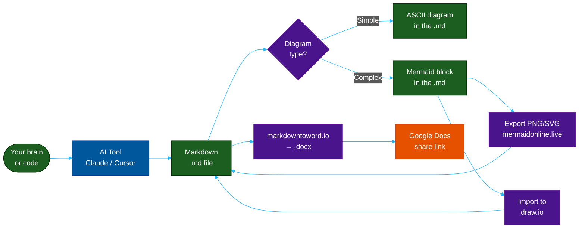

# Fast Documentation Workflow for Engineers

**Author:** ichamrong  
**Date:** 2026-05-16  
**Tags:** #documentation #ai-tools #workflow #productivity #mermaid #ascii  
**Category:** Developer Habits  
**Read Time:** ~15 min  

---

## 📌 Table of Contents
- [Why Engineers Skip Documentation](#why-engineers-skip-documentation)
- [The Full Pipeline at a Glance](#the-full-pipeline-at-a-glance)
- [Part 1 — AI Tools for Writing Docs Fast](#part-1-ai-tools-for-writing-docs-fast)
  - [The Core Idea](#the-core-idea)
  - [Tool-by-Tool Guide](#tool-by-tool-guide)
    - [Claude (claude.ai or Claude Code CLI)](#claude-claudeai-or-claude-code-cli)
    - [Cursor (AI-powered IDE)](#cursor-ai-powered-ide)
    - [Gemini CLI](#gemini-cli)
    - [Codex / GitHub Copilot](#codex-github-copilot)
    - [Antigravity (antigravity.ai)](#antigravity-antigravityai)
  - [The Universal AI Doc Prompt Template](#the-universal-ai-doc-prompt-template)
- [Part 2 — Markdown to Word to Google Docs](#part-2-markdown-to-word-to-google-docs)
  - [Why Markdown First](#why-markdown-first)
  - [The Conversion Pipeline](#the-conversion-pipeline)
    - [Step 1: Write your doc in Markdown](#step-1-write-your-doc-in-markdown)
    - [Step 2: Convert at markdowntoword.io](#step-2-convert-at-markdowntowordio)
    - [Step 3: Upload to Google Docs](#step-3-upload-to-google-docs)
  - [Quick Reference: What Survives the Conversion](#quick-reference-what-survives-the-conversion)
- [Part 3 — ASCII Diagrams: Small, Portable, Always Readable](#part-3-ascii-diagrams-small-portable-always-readable)
  - [Why ASCII for Shared Docs](#why-ascii-for-shared-docs)
  - [ASCII Diagram Size Rule](#ascii-diagram-size-rule)
  - [When to Use ASCII vs Mermaid in a Shared Doc](#when-to-use-ascii-vs-mermaid-in-a-shared-doc)
- [Part 4 — Mermaid Diagrams: Export to PNG/SVG or Import to draw.io](#part-4-mermaid-diagrams-export-to-pngsvg-or-import-to-drawio)
  - [The Problem with Mermaid in Word/Google Docs](#the-problem-with-mermaid-in-wordgoogle-docs)
  - [Option A: Export to PNG via mermaidonline.live](#option-a-export-to-png-via-mermaidonlinelive)
  - [Option B: Import Mermaid into draw.io](#option-b-import-mermaid-into-drawio)
  - [The Mermaid Export Decision Tree](#the-mermaid-export-decision-tree)
- [Part 5 — The Complete Fast Doc Workflow](#part-5-the-complete-fast-doc-workflow)
  - [Full Pipeline: Code → Published Google Doc in 20 Minutes](#full-pipeline-code-published-google-doc-in-20-minutes)
  - [Cheat Sheet: Tool → Best Use Case](#cheat-sheet-tool-best-use-case)
  - [Quick Prompts to Bookmark](#quick-prompts-to-bookmark)
- [References](#references)
- [📚 Cross-References & Related Reading](#cross-references-related-reading)

---

## Why Engineers Skip Documentation

The honest answer: writing docs feels 10× slower than writing code. By the time you finish a feature, the last thing you want to do is context-switch into Word or Confluence and explain it.

The fix isn't discipline — it's a **faster pipeline**. This guide shows how to go from zero to a shared, polished document in under 20 minutes using AI tools, the right diagram format, and a two-step publish workflow.

---

## The Full Pipeline at a Glance



---

## Part 1 — AI Tools for Writing Docs Fast

### The Core Idea

AI doesn't write your documentation for you — it **removes the blank-page problem**. Give it your code, your notes, or even just a feature name, and it produces a first draft you edit, not a blank document you fill.

### Tool-by-Tool Guide

---

#### Claude (claude.ai or Claude Code CLI)

Best for: long-form docs, ADRs, READMEs, post-mortems, explanations of complex systems.

**Tip: Paste your code, ask for the doc**

```
Prompt:
"Here is a Java class [paste code].
Write a README section explaining:
1. What it does
2. How to use it (with a code example)
3. Edge cases and limitations
Use Markdown. Keep it under 300 words."
```

**Tip: Ask for specific doc types**

```
"Write an Architecture Decision Record (ADR) for using Redis
as our session store instead of Postgres. Cover: context,
decision, consequences, alternatives considered."
```

**Tip: Claude Code CLI — doc while you code**

```bash
# In your terminal, inside your project
claude "Read UserService.java and write a technical spec 
       for this service in Markdown. Include: purpose, 
       public API, dependencies, error handling."
```

Claude Code can read your actual files directly — no copy-paste needed.

---

#### Cursor (AI-powered IDE)

Best for: writing docs inline with code, keeping docs and code in sync.

**Tip: Cmd+K on any file**

```
Select your code → Cmd+K → "Write a JSDoc comment for this function"
Select your code → Cmd+K → "Write a README section for this module"
```

**Tip: Cursor Chat for architecture docs**

```
@codebase "Write a system overview document explaining how 
           the authentication flow works end-to-end. 
           Include a Mermaid sequence diagram."
```

Cursor's `@codebase` reads your entire project — the diagram it generates will reference your actual class names and file structure.

---

#### Gemini CLI

Best for: quick summaries, converting rough notes to structured Markdown, integrating with Google Workspace.

```bash
# Install
pip install google-generativeai

# Quick doc generation
gemini "Given this API endpoint definition: [paste spec]
        Write a developer guide section in Markdown.
        Include: description, request format, response format,
        error codes, and a curl example."
```

**Tip: Gemini → Google Docs direct pipeline**

Gemini is Google's model — it integrates natively with Google Docs via AppScript or Workspace add-ons. You can push a generated doc directly to Drive without any conversion step.

---

#### Codex / GitHub Copilot

Best for: inline doc comments, function-level documentation as you type.

```
// Write a doc comment for this function
// [type the function signature and Copilot autocompletes the full JSDoc]
```

**Tip: Copilot Chat for module-level docs**

```
/explain  → Copilot explains selected code in plain English
/doc      → Generates documentation for selected symbol
```

---

#### Antigravity (antigravity.ai)

Best for: converting meeting notes and voice memos into structured documents.

```
Workflow:
1. Record a voice memo explaining the feature you just built
2. Paste the transcript into Antigravity
3. Prompt: "Convert this into a technical design document with
            sections: Overview, Architecture, API, Trade-offs"
4. Export as Markdown
```

---

### The Universal AI Doc Prompt Template

Use this template with any AI tool:

```
I need to write [DOCUMENT TYPE] for [AUDIENCE].

Context:
- [Paste code / paste notes / describe the system]

The document should cover:
1. [Section 1]
2. [Section 2]
3. [Section 3]

Constraints:
- Format: Markdown
- Length: [short / medium / detailed]
- Tone: [technical / accessible / executive]
- Include: [diagrams / code examples / tables]
```

**Document type examples:**
- `a README for a new microservice`
- `an ADR (Architecture Decision Record)`
- `a runbook for the on-call team`
- `a post-mortem for the 2026-05-16 incident`
- `a technical spec for the new auth module`
- `an onboarding guide for new engineers`

---

## Part 2 — Markdown to Word to Google Docs

### Why Markdown First

Writing in Markdown is faster than writing directly in Word or Google Docs because:
- No mouse required — pure keyboard
- Works in any editor (VS Code, Vim, Cursor, Obsidian)
- Version control friendly (`git diff` works on text)
- AI tools output Markdown natively

### The Conversion Pipeline

```
.md file  →  markdowntoword.io  →  .docx  →  Google Docs
```

#### Step 1: Write your doc in Markdown

```markdown
# Feature: User Authentication

## Overview
The auth module handles JWT-based session management...

## Architecture
[ASCII or Mermaid diagram here]

## API Reference
| Endpoint | Method | Description |
|----------|--------|-------------|
| /login   | POST   | Authenticate user |
```

#### Step 2: Convert at markdowntoword.io

1. Go to **https://markdowntoword.io/**
2. Paste your Markdown or upload the `.md` file
3. Click **Convert**
4. Download the `.docx` file

The converter preserves:
- Headings (H1–H6)
- Tables
- Code blocks (with monospace font)
- Bold, italic, lists
- Links

> **Tip for diagrams:** ASCII diagrams survive the conversion perfectly inside code blocks. Mermaid diagrams do not render — export them to PNG first (see Part 3), then paste the image into the `.docx` before uploading to Google Docs.

#### Step 3: Upload to Google Docs

```
Google Drive → New → File upload → select .docx
→ Right-click → Open with Google Docs
→ Share → Copy link
```

Google Docs auto-converts `.docx` on open. The formatting, tables, and code blocks all translate cleanly.

---

### Quick Reference: What Survives the Conversion

| Element | markdowntoword.io | Google Docs (from .docx) |
| :--- | :--- | :--- |
| Headings H1–H3 | ✓ Preserved | ✓ Preserved |
| Tables | ✓ Preserved | ✓ Preserved |
| Code blocks | ✓ Monospace font | ✓ Monospace font |
| Bold / italic | ✓ | ✓ |
| Ordered / unordered lists | ✓ | ✓ |
| ASCII diagrams (in code block) | ✓ Monospace — readable | ✓ Readable |
| Inline images | ✓ If URL is accessible | ✓ |
| Mermaid blocks | ✗ Renders as raw text | ✗ |
| HTML tags | ~ Partial | ~ Partial |

---

## Part 3 — ASCII Diagrams: Small, Portable, Always Readable

### Why ASCII for Shared Docs

When a document travels — email, Slack, copy-paste into Jira, Google Docs, Word — images break. Links rot. But ASCII diagrams survive everything because they are just text.

In Google Docs, an ASCII diagram inside a code block renders in monospace font and looks clean:

```
┌─────────────────┐     ┌─────────────────┐
│   Web Browser   │────▶│   API Gateway   │
└─────────────────┘     └────────┬────────┘
                                  │
                    ┌─────────────┴─────────────┐
                    │                           │
           ┌────────▼────────┐       ┌──────────▼────────┐
           │   Auth Service  │       │   Order Service   │
           └────────┬────────┘       └──────────┬────────┘
                    │                           │
           ┌────────▼────────┐       ┌──────────▼────────┐
           │     Redis       │       │    PostgreSQL      │
           │   (sessions)    │       │    (orders)        │
           └─────────────────┘       └───────────────────┘
```

### ASCII Diagram Size Rule

ASCII diagrams are small enough for Google Docs when they fit within **80 characters wide** — the standard terminal width. Beyond 80 chars, horizontal scrollbars appear in Docs code blocks.

```
Max width formula:
  80 chars × monospace char width ≈ 560px in Google Docs default font

Safe box width:  ≤ 16 chars content + 4 border = 20 chars per box
Safe columns:    80 / (box_width + gap) = 80 / (20 + 4) ≈ 3 boxes per row
```

**3-column layout fits in 80 chars:**
```
+------------------+    +------------------+    +------------------+
|   Service A      |───▶|   Service B      |───▶|   Service C      |
+------------------+    +------------------+    +------------------+
  20 chars wide            20 chars wide           20 chars wide
  total: 3×20 + 3×4(gaps) = 72 chars ✓
```

**4-column layout overflows:**
```
total: 4×20 + 4×4 = 96 chars ✗  →  use 2-row layout instead
```

### When to Use ASCII vs Mermaid in a Shared Doc

| Situation | Use | Reason |
| :--- | :--- | :--- |
| Simple component layout (≤3 boxes) | ASCII | No export step, survives copy-paste |
| Sequence of 3–4 steps | ASCII | Readable inline as text |
| Tree / file structure | ASCII | `├──` / `└──` renders perfectly |
| Complex flow (>6 nodes) | Mermaid → PNG | Too wide for 80-char limit |
| UML class diagram | Mermaid → PNG | ASCII UML is unreadable |
| State machine | Mermaid → PNG | Arrow complexity too high |
| Architecture with 5+ services | Mermaid → PNG | Use draw.io for full control |

---

## Part 4 — Mermaid Diagrams: Export to PNG/SVG or Import to draw.io

### The Problem with Mermaid in Word/Google Docs

Mermaid diagrams are code blocks — they only render in environments that have a Mermaid renderer (GitHub, Notion, GitLab, this blog). Word and Google Docs don't render them. The solution is to **export the diagram as an image first**, then embed the image.

### Option A: Export to PNG via mermaidonline.live

**URL:** https://www.mermaidonline.live/mermaid-to-png

**Steps:**
1. Write your Mermaid diagram in your `.md` file
2. Copy the Mermaid code (without the triple backticks)
3. Go to **https://www.mermaidonline.live/mermaid-to-png**
4. Paste the code into the editor
5. Click **Export PNG** or **Export SVG**
6. Save the file as `diagram-name.png`
7. In your `.md` file, replace the Mermaid code block with: ``
8. When converting to Word, the image is embedded automatically

**PNG vs SVG:**

| Format | Use When | Google Docs | Word | Scales? |
| :--- | :--- | :--- | :--- | :--- |
| **PNG** | Sharing, embedding | ✓ Perfect | ✓ Perfect | ✗ Pixelates when zoomed |
| **SVG** | Print, high-DPI | ✓ with workaround | ~ Limited | ✓ Infinite zoom |

> **Tip:** Export at 2× or 3× scale if the tool supports it — the PNG will look crisp on retina screens in Google Docs.

---

### Option B: Import Mermaid into draw.io

draw.io (also known as diagrams.net) is a free diagramming tool that supports Mermaid import natively. This is the best option when you need to **further edit the diagram** with custom styling, additional shapes, or connector routing that Mermaid doesn't support.

**Steps:**
1. Open **https://app.diagrams.net/** (or the desktop app)
2. Create a new diagram or open existing
3. Menu → **Extras → Edit Diagram**
4. In the dropdown at the top of the editor, select **Mermaid**
5. Paste your Mermaid code
6. Click **OK** — draw.io converts it to a native diagram
7. Edit freely: change colors, resize, add icons
8. Export: **File → Export as → PNG / SVG / PDF**

**After editing in draw.io:**
- Export as PNG and embed in your `.md` file
- Or export as SVG and embed for crisp quality
- Or embed the draw.io file URL directly if sharing within a team that uses draw.io

---

### The Mermaid Export Decision Tree

```
Do you need to edit the diagram after export?
│
├── No → Export PNG from mermaidonline.live
│         Fast, one step, embed in .md
│
└── Yes → Import to draw.io
          ├── Add custom shapes or icons?  → draw.io
          ├── Need precise layout control? → draw.io
          ├── Need PDF export?             → draw.io
          └── Just change colors?          → edit %%{init}%% in Mermaid instead
```

---

## Part 5 — The Complete Fast Doc Workflow

### Full Pipeline: Code → Published Google Doc in 20 Minutes

```
TIME    ACTION
──────────────────────────────────────────────────────
 0:00   Decide doc type (README / ADR / Runbook / Spec)

 0:01   Open Claude Code / Cursor / any AI tool

 0:02   Paste code or describe feature
        Use the Universal Prompt Template (Part 1)

 0:05   AI generates first draft in Markdown
        Review, edit headings and key facts

 0:08   Add diagrams:
        - Simple flow / tree → write ASCII in code block
        - Complex diagram → write Mermaid block

 0:12   If Mermaid diagrams:
        → Copy to mermaidonline.live → export PNG
        → Replace Mermaid block with 

 0:14   Final Markdown review:
        □ Headings clear?
        □ Tables formatted?
        □ Code blocks in backticks?
        □ ASCII diagrams ≤80 chars wide?
        □ PNG images embedded?

 0:15   Go to markdowntoword.io
        Paste Markdown → Convert → Download .docx

 0:17   Upload .docx to Google Drive
        Open with Google Docs

 0:18   Quick visual check in Google Docs:
        □ Tables rendering?
        □ Images visible?
        □ Code blocks in monospace?

 0:19   Share → Copy link → Done
```

---

### Cheat Sheet: Tool → Best Use Case

| Tool | Best For | Output |
| :--- | :--- | :--- |
| **Claude / Claude Code** | Long docs, ADRs, READMEs, post-mortems | Markdown |
| **Cursor** | Inline docs, code-adjacent writing | Markdown |
| **Gemini CLI** | Quick summaries, Google Workspace integration | Markdown |
| **GitHub Copilot** | Function/class-level doc comments | Inline code |
| **Antigravity** | Voice memo → structured doc | Markdown |
| **ASCII diagrams** | Simple layout, survives any format | Plain text |
| **Mermaid** | Complex diagrams, version-controlled | Code block |
| **mermaidonline.live** | Mermaid → PNG/SVG for embedding | Image file |
| **draw.io** | Mermaid → editable diagram | Diagram file |
| **markdowntoword.io** | Markdown → .docx | Word file |
| **Google Docs** | Sharing, collaboration, comments | Shared link |

---

### Quick Prompts to Bookmark

```bash
# README for a new service
"Read [file]. Write a README with: Overview, Installation,
Usage examples, Configuration, API reference. Markdown."

# ADR
"Write an ADR for [decision]. Context, decision,
consequences, alternatives. Markdown."

# Post-mortem
"Write a post-mortem for [incident]. Timeline, root cause,
impact, immediate fix, prevention. Markdown."

# Runbook
"Write an on-call runbook for [service]. Symptoms,
diagnosis steps, remediation, escalation. Markdown."

# Onboarding doc
"Write a new-engineer onboarding guide for [codebase].
Setup, architecture overview, key files, first tasks. Markdown."

# API reference
"Document this API [paste spec]. Endpoints, auth, request/
response format, error codes, curl examples. Markdown."
```

---

## References

- **markdowntoword.io** — https://markdowntoword.io/
- **mermaidonline.live** — https://www.mermaidonline.live/mermaid-to-png
- **draw.io** — https://app.diagrams.net/
- **Claude Code** — https://claude.ai/code
- **Cursor** — https://cursor.sh
- **Antigravity** — https://antigravity.ai
- **Mermaid.js** — https://mermaid.js.org

---

---

## 📚 Cross-References & Related Reading
- **Agile & Process:** [DoR vs DoD](../management/dor-and-dod-guide.md) | [SDLC Comparison Matrix](../management/sdlc-05-comparison-matrix.md) | [What is SDLC?](../management/sdlc-00-what-is-sdlc.md)
- **Documentation & Flow:** [Visual Communication Guide](./visual-communication-guide.md) | [Fast Documentation](./fast-documentation-workflow.md) | [MCP Guide](./mcp-development-guide.md)

---

**Share this post:** [Share on LinkedIn](#) | [Discuss](#)

*Last updated: 2026-05-16*

## Related

- [Career Paths](../concepts/career-paths/README.md)
- [Mental Models & Concepts](../concepts/README.md)
- [Management & SDLC](../management/README.md)
