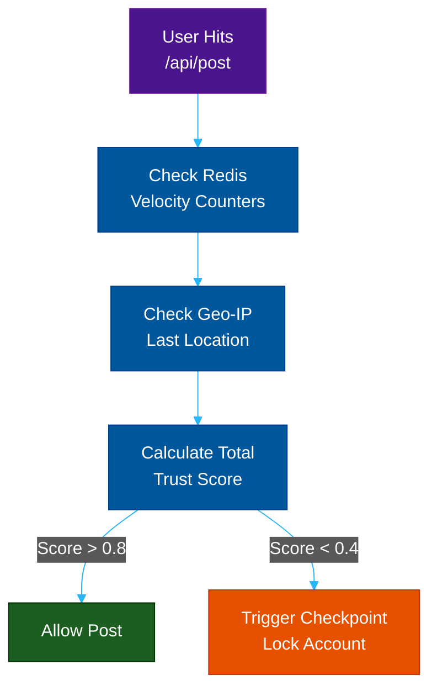

# Detection: Trust & Velocity Scoring

**Author:** ichamrong  
**Category:** Security & Architecture  
**Read Time:** ~10 min  

---

## 📌 Table of Contents
- [1. The Trust Engine](#1-the-trust-engine)
- [2. The Four Triggers](#2-the-four-triggers)
  - [A. Velocity Limits (The Speed Trap)](#a-velocity-limits-the-speed-trap)
  - [B. Impossible Travel (Geo-Velocity)](#b-impossible-travel-geo-velocity)
  - [C. Content Fingerprinting (The Hash Ban)](#c-content-fingerprinting-the-hash-ban)
  - [D. Account Age & Historical Trust](#d-account-age-historical-trust)
  - [E. Disposable Email Filtering (The Burner Block)](#e-disposable-email-filtering-the-burner-block)
- [3. The Backend Flow](#3-the-backend-flow)
- [📚 References & Tools](#references-tools)

---

## 1. The Trust Engine

Platforms do not just look at *what* you post; they look at *how* you post. 

Before a user is allowed to publish a post or send a friend request, your backend API must calculate their **Trust Score**. A Trust Score is a floating-point number (0.0 to 1.0) derived from four core behavioral metrics.

---

## 2. The Four Triggers

### A. Velocity Limits (The Speed Trap)
A human has physical limitations. If an account likes 50 posts in 60 seconds, or comments on 100 posts in an hour, they have tripped a Velocity Trigger. Your database must utilize **Redis Rate Limiting** to track actions per minute per user ID.

### B. Impossible Travel (Geo-Velocity)
If an account logs in from New York at 1:00 PM, and then performs an action from an IP address in Vietnam at 1:05 PM, this is physically impossible. The system flags this as a compromised account or a proxy-farm bot.

### C. Content Fingerprinting (The Hash Ban)
When a spammer posts a malicious link (e.g., a phishing site), your backend must hash that URL. If 5,000 different accounts try to post that exact same hashed URL, the system instantly links all 5,000 accounts together as a coordinated botnet.

### D. Account Age & Historical Trust
A 5-year-old account with a verified phone number, 500 friends, and organic chat history has a high Trust Score. A 1-hour-old account with no profile picture has a zero Trust Score. 

### E. Disposable Email Filtering (The Burner Block)
Bot developers rarely use their real Gmail addresses to create thousands of accounts. They use temporary "10-Minute Mail" domains. During the API registration flow, your backend must check the user's email domain against an actively maintained open-source **Disposable Email Blacklist** (e.g., `mailinator.com`, `temp-mail.org`). If the domain is caught, instantly drop the registration or assign a Trust Score of 0.0.

**Architectural Rule:** You must apply *Dynamic Rate Limits*. 
- A high-trust account is allowed to post 50 links a day.
- A zero-trust account will trigger an anti-spam lockdown after posting just 2 links.

---

## 3. The Backend Flow

## 📚 References & Tools
- **Redis Rate Limiting Patterns** — [redis.com/redis-best-practices/basic-rate-limiting/](https://redis.com/redis-best-practices/basic-rate-limiting/)
- **Sift Science Trust Scoring** — [sift.com](https://sift.com/)

---

**Navigation:** [Next: The Checkpoint Funnel](./02-the-checkpoint-funnel.md) | [Anti-Spam Index](./README.md)

*Last updated: 2026-05-17*

## Related

- [Bot Protection & CAPTCHAs](../bot-protection/README.md)
- [DDoS Defense & Rate Limiting](../ddos-defense/README.md)
- [Session & Cookie Security](../session-and-cookie-security/README.md)
