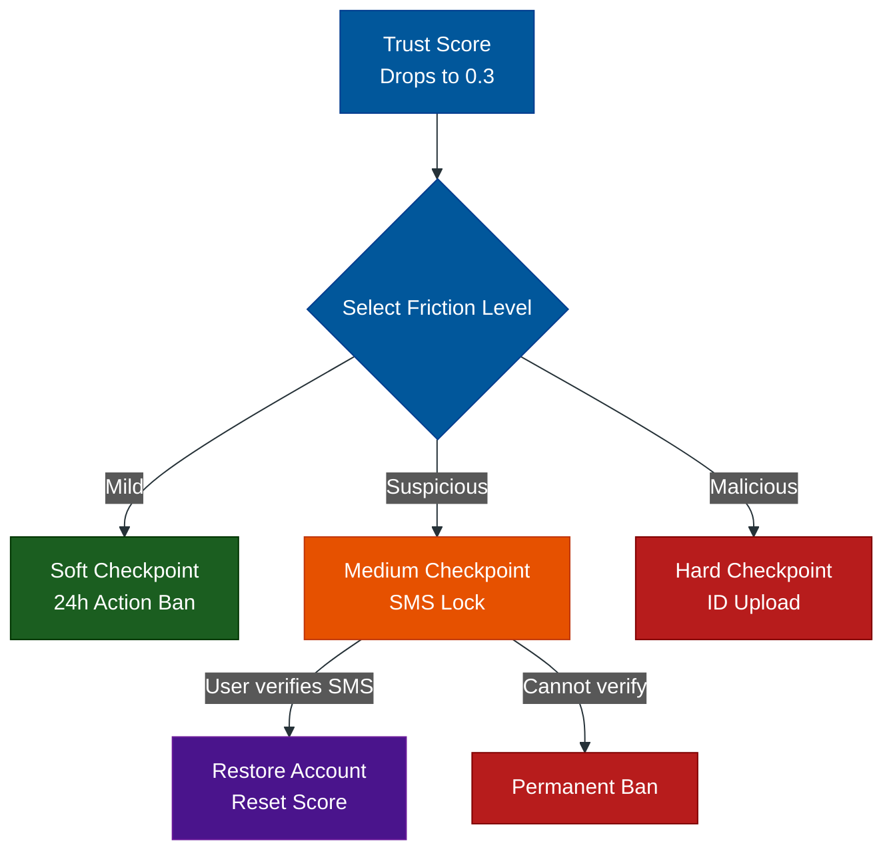

# Interception: The Checkpoint Funnel

**Author:** ichamrong  
**Category:** Security & Architecture  
**Read Time:** ~10 min  

---

## 📌 Table of Contents
- [1. What is a Checkpoint?](#1-what-is-a-checkpoint)
- [2. The Three Levels of Friction](#2-the-three-levels-of-friction)
  - [Level 1: The Soft Checkpoint (The Cooldown)](#level-1-the-soft-checkpoint-the-cooldown)
  - [Level 2: The Medium Checkpoint (The Financial Burn)](#level-2-the-medium-checkpoint-the-financial-burn)
  - [Level 3: The Hard Checkpoint (The Identity Burn)](#level-3-the-hard-checkpoint-the-identity-burn)
- [3. The Backend State Machine](#3-the-backend-state-machine)
- [📚 References & Tools](#references-tools)

---

## 1. What is a Checkpoint?

When a user's Trust Score drops too low, or they trip a Velocity Trigger (e.g., sending 50 friend requests in a minute), you do not permanently ban them immediately. It might just be an enthusiastic human.

Instead, you throw them into a **Checkpoint Funnel**. A Checkpoint is a "State Machine" of increasing friction designed to prove identity and burn the resources of bot developers.

---

## 2. The Three Levels of Friction

### Level 1: The Soft Checkpoint (The Cooldown)
- **Trigger:** Mild velocity violation (e.g., sending 20 messages in 5 minutes).
- **Action:** The system blocks the specific API endpoint but keeps the rest of the account open. 
- **Message:** *"You are moving too fast. Please take a break. You can send messages again in 24 hours."*
- **Architecture:** Write a 24-hour TTL (Time-to-Live) key to Redis.

### Level 2: The Medium Checkpoint (The Financial Burn)
- **Trigger:** Impossible travel, or logging in from an unrecognized device using an aged account.
- **Action:** The entire account is temporarily locked. The user cannot view the feed or interact.
- **Message:** *"We noticed suspicious activity. Please verify your phone number via SMS."*
- **Why this defeats bots:** Bot developers can buy millions of fake emails for pennies. However, buying real SMS phone numbers from Twilio or SIM farms is expensive ($1.00+ per number). By forcing an SMS checkpoint, you are actively burning the bot developer's money. If they can't pay, the bot dies.

### Level 3: The Hard Checkpoint (The Identity Burn)
- **Trigger:** Coordinated botnet activity (e.g., 50 accounts created from the same datacenter IP address in Russia).
- **Action:** The account is deeply locked. 
- **Message:** *"Upload a photo of your government ID or record a video selfie looking left and right."*
- **Why this defeats bots:** It is incredibly difficult, unscalable, and illegal for bot farms to generate thousands of fake government IDs or deepfake videos that pass liveness checks. This is the ultimate kill-switch.

---

## 3. The Backend State Machine

## 📚 References & Tools
- **Twilio Verify (SMS/Email)** — [twilio.com/verify](https://www.twilio.com/verify)
- **Google reCAPTCHA Enterprise** — [cloud.google.com/recaptcha-enterprise](https://cloud.google.com/recaptcha-enterprise)

---

**Navigation:** [Previous: Trust & Velocity](./01-trust-and-velocity-scoring.md) | [Next: Shadowbanning](./03-shadowbanning-and-tarpits.md) | [Anti-Spam Index](./README.md)

*Last updated: 2026-05-17*

## Related

- [Bot Protection & CAPTCHAs](../bot-protection/README.md)
- [DDoS Defense & Rate Limiting](../ddos-defense/README.md)
- [Session & Cookie Security](../session-and-cookie-security/README.md)
