# Deception: Shadowbanning & Tarpits

**Author:** ichamrong  
**Category:** Security & Architecture  
**Read Time:** ~10 min  

---

## 📌 Table of Contents
- [1. The Philosophy of Deception](#1-the-philosophy-of-deception)
- [2. Shadowbanning (The Ghost Town)](#2-shadowbanning-the-ghost-town)
  - [How it works:](#how-it-works-1)
- [3. API Tarpits (The Time Sink)](#3-api-tarpits-the-time-sink)
  - [How it works:](#how-it-works-1)
- [📚 References & Tools](#references-tools)

---

## 1. The Philosophy of Deception

Sometimes, alerting a bot that it has been caught is a terrible architectural decision. 

If you lock a bot's account with an error message (`403 Forbidden`), the bot developer instantly knows their automated script failed. They will look at the error logs, realize you caught them, and rewrite a better script to bypass your rules.

Instead of fighting them directly, you must deceive them. 

---

## 2. Shadowbanning (The Ghost Town)

**Shadowbanning** is the practice of letting a malicious user use the platform normally, but hiding their actions from every other human on the internet.

### How it works:
1. The bot attempts to post a malicious phishing link.
2. Your Trust Engine hashes the URL and flags it as severe spam.
3. Instead of returning an error, your API returns an `HTTP 200 OK` success message. 
4. The backend database saves the post, but adds a metadata flag: `visibility: false` or `is_shadowbanned: true`.
5. When the bot renders its own profile page, the frontend shows the post perfectly. 
6. However, when *any other user* loads the main feed, the backend database filters out all posts where `visibility: false`.

**The Result:** The bot developer thinks their script was highly successful. The bot continues to waste CPU cycles, bandwidth, and money posting millions of links into a void. No human will ever see the spam. 

```mermaid
%%{init: {'theme': 'dark', 'themeVariables': {'primaryColor': '#37474f', 'primaryTextColor': '#ffffff', 'lineColor': '#263238',
    'background': '#1e1e1e'},
  'themeCSS': 'svg { background-color: #1e1e1e !important; padding: 1rem !important; border-radius: 8px !important; } .edgeLabel rect { fill: #1e1e1e !important; } text, tspan, .messageText, .signalText, .edgeLabel, .edgeLabel span, .pointLabel, .axisLabel, .quadrantTitle, .quadrantLabel { fill: #ffffff !important; color: #ffffff !important; stroke: none !important; }'
}}%%
flowchart LR
    classDef bot fill:#e65100,stroke:#bf360c,color:#fff
    classDef db fill:#01579b,stroke:#003c8f,color:#fff
    classDef human fill:#4a148c,stroke:#6a1b9a,color:#fff
    
    A[Botnet Posts Link]:::bot -->|HTTP 200 OK| B[Database saves with<br/>visibility: false]:::db
    B -->|Renders Post| A
    
    C[Real Human Loads Feed]:::human -->|Filter out false| B
    B -->|Returns Empty Feed| C
```

---

## 3. API Tarpits (The Time Sink)

Another advanced deception technique is the **Tarpit**. 

Bots rely on speed to be profitable. If a bot can test 10,000 stolen passwords a second, it makes money. If it can only test 1 password a second, the server costs outweigh the profit.

Instead of blocking a suspicious IP address (which causes the bot to immediately switch to a new proxy IP), you send them to the Tarpit.

### How it works:
When the API detects a malicious bot, instead of closing the connection, the server intentionally slows down the response. It sends the HTTP headers, and then sends 1 byte of data every 10 seconds. 

The bot's connection is kept open, hanging in limbo. The bot thinks the server is just slow and waits. This ties up the bot's threads and memory, drastically reducing their attack velocity from 10,000 requests per second down to 10 requests a minute. 

## 📚 References & Tools
- **OWASP AppSensor (Deception)** — [owasp.org/www-project-appsensor/](https://owasp.org/www-project-appsensor/)
- **Nginx Tarpit Module** — [github.com/chrisboulton/nginx-tarpit](https://github.com/chrisboulton/nginx-tarpit)

---

**Navigation:** [Previous: The Checkpoint Funnel](./02-the-checkpoint-funnel.md) | [Anti-Spam Index](./README.md)

*Last updated: 2026-05-17*

## Related

- [Bot Protection & CAPTCHAs](../bot-protection/README.md)
- [DDoS Defense & Rate Limiting](../ddos-defense/README.md)
- [Session & Cookie Security](../session-and-cookie-security/README.md)
