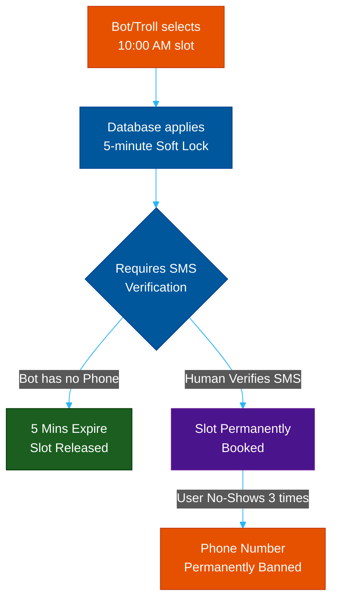

# Marketplace Defense: Airbnb, Booking & Doctolib

**Author:** ichamrong  
**Category:** Security & Architecture  
**Read Time:** ~12 min  

---

## 📌 Table of Contents
- [1. The Two-Sided Marketplace Threat](#1-the-two-sided-marketplace-threat)
- [2. Airbnb: Communication Escrow & NLP Redaction](#2-airbnb-communication-escrow-nlp-redaction)
- [3. Booking.com: Device Graphing & Review Rings](#3-bookingcom-device-graphing-review-rings)
- [4. Doctolib: Inventory Hoarding & Denial of Service](#4-doctolib-inventory-hoarding-denial-of-service)
- [📚 References & Tools](#references-tools)

---

## 1. The Two-Sided Marketplace Threat

While social networks (Facebook, X) fight *engagement spam* (fake likes, fake links), platforms like Airbnb, Booking.com, and Doctolib face a much more dangerous threat: **Financial Fraud and Inventory Hoarding**. 

In a marketplace, spammers are trying to steal real money or deny real services. To combat this, these platforms use completely different architectural strategies than social networks.

---

## 2. Airbnb: Communication Escrow & NLP Redaction

**The Threat:** A fake "Host" uploads beautiful photos of a villa in Bali. When a user tries to book, the Host messages them: *"Don't book through Airbnb, email me at scammer@gmail.com and pay via Western Union for a 50% discount."* The user pays, and the villa doesn't exist.

**The Strategy:** Airbnb utilizes aggressive **Natural Language Processing (NLP)** and **Communication Escrow**. 

Before a booking is confirmed, the Host and Guest are communicating through a heavily monitored proxy chat. If the NLP engine detects an email address, a phone number, or keywords like "Western Union", "Wire Transfer", or "WhatsApp", the system instantly redacts the text in real-time. 

```mermaid
%%{init: {'theme': 'dark', 'themeVariables': {'primaryColor': '#4a148c', 'primaryTextColor': '#ffffff', 'lineColor': '#6a1b9a',
    'background': '#1e1e1e'},
  'themeCSS': 'svg { background-color: #1e1e1e !important; padding: 1rem !important; border-radius: 8px !important; } .edgeLabel rect { fill: #1e1e1e !important; } text, tspan, .messageText, .signalText, .edgeLabel, .edgeLabel span, .pointLabel, .axisLabel, .quadrantTitle, .quadrantLabel { fill: #ffffff !important; color: #ffffff !important; stroke: none !important; }'
}}%%
flowchart LR
    classDef scam fill:#e65100,stroke:#bf360c,color:#fff
    classDef nlp fill:#01579b,stroke:#003c8f,color:#fff
    classDef user fill:#1b5e20,stroke:#003300,color:#fff
    
    A[Scammer Host]:::scam -->|Writes: 'Email me at<br/>scam@gmail.com'| B[Airbnb NLP<br/>Chat Engine]:::nlp
    B -->|Detects Regex Pattern<br/>Redacts Text| C[Message Saved<br/>to Database]:::nlp
    C -->|Delivers to Guest| D[Guest sees:<br/>Email me at HIDDEN]:::user
```

*Additionally, Airbnb holds the guest's money in a financial escrow. The host does not get paid until 24 hours **after** the guest successfully checks in. This destroys the economic incentive for fake listings.*

---

## 3. Booking.com: Device Graphing & Review Rings

**The Threat:** A new hotel opens and wants to rank #1. The owner creates 50 fake guest accounts, books their own cheapest room 50 times, and writes 50 fake 5-star reviews. Alternatively, they book their competitor's hotel and leave 1-star reviews.

**The Strategy:** Booking.com uses **Device Graphing and Strict Payment Funnels**. 

Unlike Yelp or Google Maps where anyone can leave a review, Booking.com enforces a *Verified Stay* rule. You must physically check in to leave a review. But how do they stop the owner from booking their own hotel?

They build a **Device Graph**. If the IP address, Browser Fingerprint, or Credit Card BIN used to book the "Guest" room matches the IP address or Bank Details used by the "Host" to log into their partner dashboard, the system silently links the accounts. The reviews are instantly flagged as a "Review Ring" and shadowbanned. 

---

## 4. Doctolib: Inventory Hoarding & Denial of Service

**The Threat:** Doctolib (the massive European medical booking platform) faces a unique threat. Malicious bots or rival clinics will write scripts to book *every available time slot* for a popular doctor. Real patients cannot book, and the doctor loses thousands of dollars in missed appointments.

**The Strategy:** Doctolib uses **High-Friction Database Row Locking** and **No-Show Penalties**.

1. **The Inventory Lock:** When you click a 10:00 AM slot, Doctolib places a temporary 5-minute lock on that row in the database. During those 5 minutes, you *must* verify a local SMS phone number. Bots cannot scale SMS verifications cheaply. If the SMS isn't verified in 5 minutes, the database row unlocks.
2. **The Ghost Penalty:** If a verified user books 3 appointments across 3 different doctors in a 24-hour period and cancels them at the last minute (or no-shows), Doctolib's algorithm permanently blacklists that phone number and device fingerprint. That user is permanently banned from booking medical appointments online and must call clinics directly.

## 📚 References & Tools
- **AWS Rekognition (Image Moderation)** — [aws.amazon.com/rekognition/](https://aws.amazon.com/rekognition/)
- **Perspective API (Text Toxicity)** — [perspectiveapi.com](https://perspectiveapi.com/)

---

**Navigation:** [Previous: Shadowbanning](./03-shadowbanning-and-tarpits.md) | [Anti-Spam Index](./README.md)

*Last updated: 2026-05-17*

## Related

- [Bot Protection & CAPTCHAs](../bot-protection/README.md)
- [DDoS Defense & Rate Limiting](../ddos-defense/README.md)
- [Session & Cookie Security](../session-and-cookie-security/README.md)
