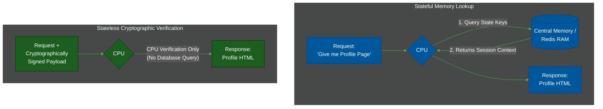
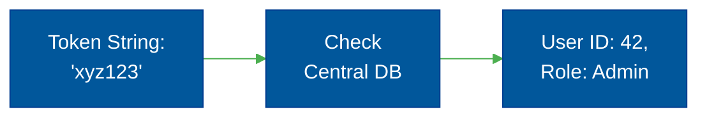
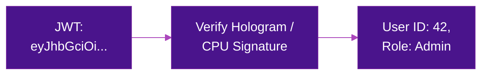
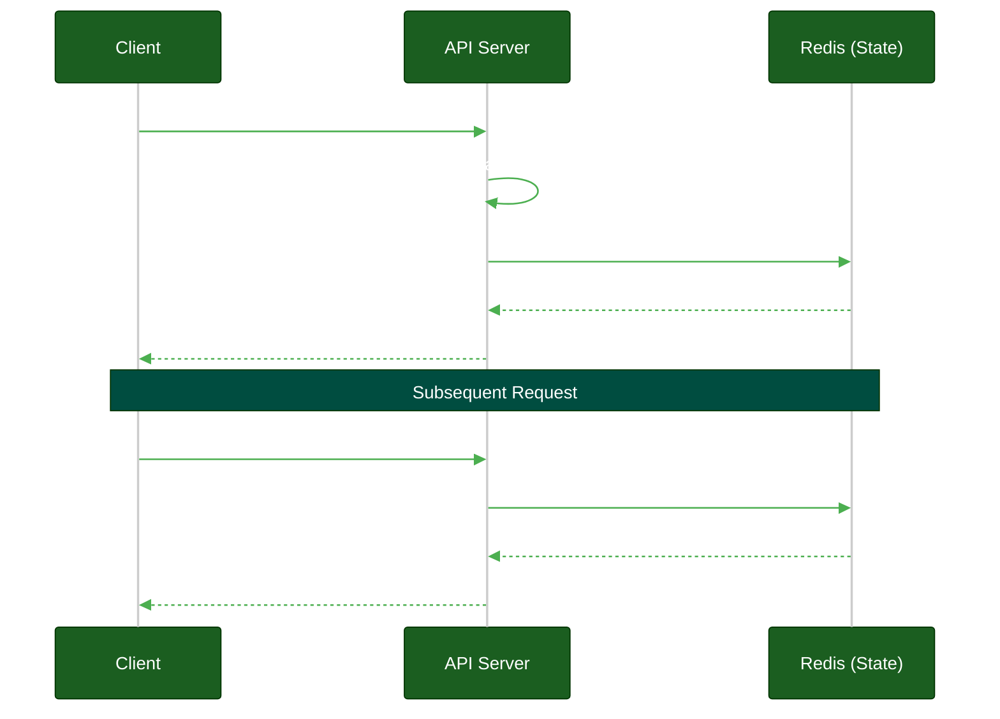
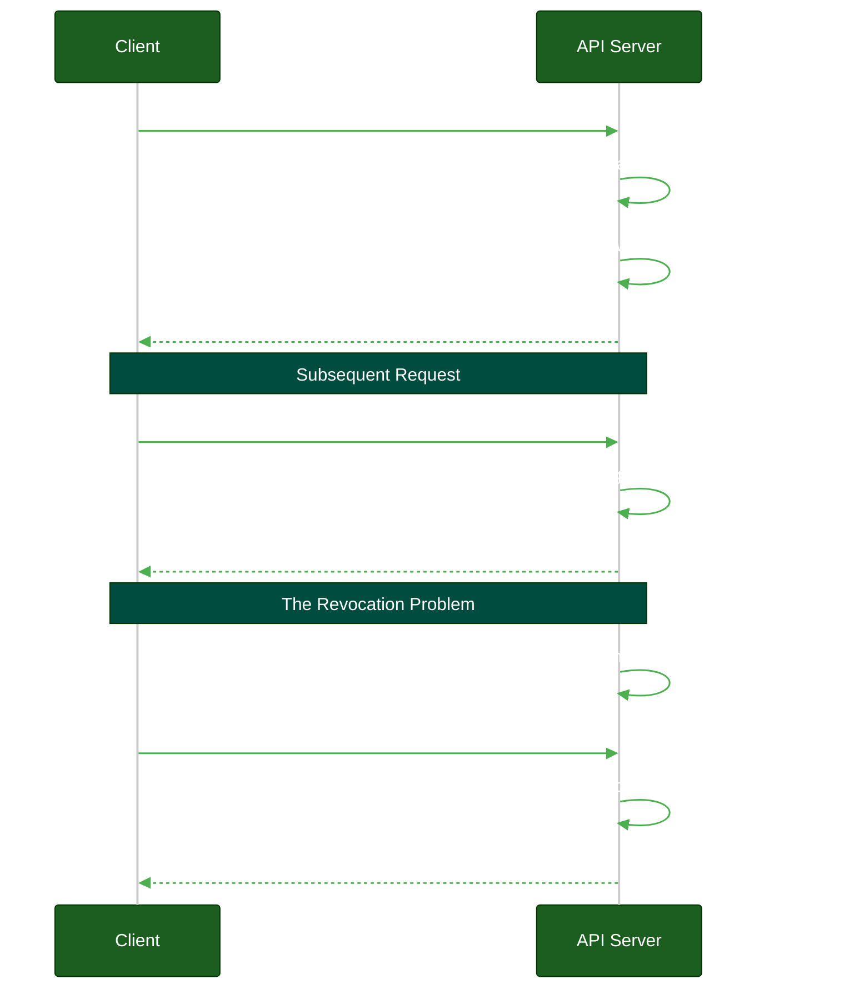

# Stateful vs. Stateless Sessions

**Author:** ichamrong  
**Category:** Authentication Architecture  
**Read Time:** ~10 min  

---

## 📌 Table of Contents
- [1. The Terminology: State, Sessions, and Tokens](#1-the-terminology-state-sessions-and-tokens)
  - [What is "State"?](#what-is-state)
  - [What is a Session?](#what-is-a-session)
  - [What is a Token?](#what-is-a-token)
- [2. Stateful Sessions (Opaque Tokens)](#2-stateful-sessions-opaque-tokens)
- [3. Stateless Sessions (JWT - JSON Web Tokens)](#3-stateless-sessions-jwt-json-web-tokens)
- [4. The Enterprise Verdict](#4-the-enterprise-verdict)
- [📚 References & Tools](#references-tools)

---

## Table of Contents
- [1. The Terminology: State, Sessions, and Tokens](#1-the-terminology-state-sessions-and-tokens)
  - [What is "State"?](#what-is-state)
  - [What is a Session?](#what-is-a-session)
  - [What is a Token?](#what-is-a-token)
- [2. Stateful Sessions (Opaque Tokens)](#2-stateful-sessions-opaque-tokens)
- [3. Stateless Sessions (JWT - JSON Web Tokens)](#3-stateless-sessions-jwt-json-web-tokens)
- [4. The Enterprise Verdict](#4-the-enterprise-verdict)
---

The debate between **Stateful** (Opaque Tokens + Redis) and **Stateless** (JWTs) sessions is the most misunderstood topic in modern web architecture. Developers frequently choose JWTs because "they scale better," completely ignoring the catastrophic security trade-offs.

## 1. The Terminology: State, Sessions, and Tokens

Before diving into architectures, we must clarify the terminology. Many engineers confuse these three concepts.

### What is "State"?
> **💡 The Core Concept:** State is the memory a system uses to remember past events. A stateful system requires a database lookup to remember you; a stateless system verifies you cryptographically without checking a database.

**The "ELI5" Analogy (The Coat Check vs. The Vending Machine):**
Imagine you go to a fancy restaurant and hand the coat check attendant your jacket. He gives you a ticket with the number "42". When you return, the attendant must look at his ledger (his memory) to know that ticket 42 belongs to the leather jacket. The coat check is **Stateful**—it relies entirely on remembering past events. 

Alternatively, a vending machine is **Stateless**. It has amnesia. It doesn't remember who you are or what you bought yesterday. Every time you walk up, you must insert exactly $1.50 and press "A1". The machine has all the information it needs in that exact moment to process the request. It relies on zero memory.

**The MIT Professor Explanation (First Principles):**
In computer science, "State" refers to the memory or historical context a system must keep track of to evaluate a transaction.
- A **Stateful** system requires the server to maintain an internal data structure (a database or RAM hash map) representing active contexts. Evaluating a request requires a lookup against this central memory mechanism.
- A **Stateless** system dictates that every HTTP request must be completely self-contained. The server evaluates the request exclusively using cryptographic verification of the payload, requiring absolutely zero historical database lookups. 

### What is a Session?
> **💡 The Core Concept:** A session is not a physical object; it is the abstract window of time representing your active, logged-in relationship with the server.

**The "ELI5" Analogy (The Movie Theater):**
A **Session** is not a physical object; it is an abstract window of time. When your ticket is torn at the movie theater door, your "session" begins. When the credits roll and you leave, your "session" ends. 

**The MIT Professor Explanation:**
A Session is the logical relationship and authorization boundary established between a specific client and the server over a finite period. It represents the active state of trust.

### What is a Token?
> **💡 The Core Concept:** A token is the physical string of characters (like an ID badge) used to mathematically prove that your session exists.

**The "ELI5" Analogy (The Barcode vs. The Driver's License):**
A **Token** is the physical object used to prove that a session exists. 
- An **Opaque Token** is like an employee ID badge with just a barcode (`abc-123`) on it. It means nothing on its own. The security guard must scan it and check the central database to see who you are.
- A **JSON Web Token (JWT)** is like a Driver's License. It actually contains your name, your age, and your photo, all sealed with a tamper-proof hologram (a cryptographic signature). The bouncer doesn't need to call the DMV to verify it; they just look at the hologram.

**Opaque Token (The Barcode):**
An Opaque Token holds zero information inside itself. The server must take the token and check the database to see who you are.

**JSON Web Token (The Driver's License):**
A JWT holds all profile and permission data inside itself. The server just verifies the cryptographic signature (the hologram) locally via the CPU without checking any database.

**The MIT Professor Explanation:**
The debate in modern architecture is not "Sessions vs. Tokens." You always have a session, and you always use a token to track it. The architectural debate is whether the authorization verification should be a **Stateful** database lookup (Opaque Token) or a **Stateless** cryptographic CPU verification (JWT).

---

## 2. Stateful Sessions (Opaque Tokens)

**How it Works:** 
The server generates a random string (e.g., `abc-123`) and sends it to the client as a cookie. The server stores `abc-123` in a database (usually Redis) along with the user's ID and permissions. Every time the user makes a request, the server looks up `abc-123` in Redis to verify they are logged in.

**Pros:**
- **Instant Revocation:** If a user's laptop is stolen, you delete `abc-123` from Redis. They are instantly logged out. This is a **Kill Switch**.
- **Absolute Control:** You can force users out, limit concurrent sessions (e.g., "Max 3 devices"), and easily track idle timeouts.
- **No Data Leakage:** The token itself contains no information. If it's intercepted, the attacker cannot decode it to find the user's email or roles.

**Cons:**
- **Database Lookup:** Requires a database call (Redis) on *every single request*.

---

## 3. Stateless Sessions (JWT - JSON Web Tokens)

**How it Works:** 
The server cryptographically signs a JSON object containing the user's ID and permissions (`{user_id: 42, role: admin}`). The server sends this JWT to the client. On the next request, the server simply verifies the cryptographic signature using its CPU. It does *not* talk to a database.

**Pros:**
- **No Database Lookup:** Saves a 1ms network call to Redis.
- **Distributed Microservices:** Any microservice with the public key can verify the token independently.

**Cons (The Fatal Flaw):**
- **Cannot be Revoked:** Because the server does not look up the token in a database, it has no way to know if you banned the user 5 seconds ago. **The JWT remains valid until its expiration time.** 
- **The Workaround Nightmare:** To fix the revocation problem, developers build "Blocklists" in Redis... which completely defeats the purpose of being stateless, as now you are doing a Redis lookup on every request anyway!

---

## 4. The Enterprise Verdict

In modern enterprise architectures (FinTech, Healthcare, E-Commerce), **Stateful Sessions are mandatory for user-facing applications.** 

The argument that "Redis doesn't scale" is objectively false. Redis can handle 100,000+ reads per second on a tiny instance with sub-millisecond latency. You will run out of application servers long before Redis bottlenecks.

**The Golden Rule:**
1. **Use Stateful (Opaque) Tokens for Users:** Browsers should receive an opaque Session ID cookie backed by Redis. This allows for admin kill-switches and immediate revocation.
2. **Use Stateless (JWT) Tokens for Microservices:** The API Gateway translates the user's Opaque Session ID into a short-lived internal JWT (valid for 5 minutes). The internal microservices pass this JWT around.

## 📚 References & Tools
- **OWASP Session Management** — [cheatsheetseries.owasp.org/cheatsheets/Session_Management_Cheat_Sheet.html](https://cheatsheetseries.owasp.org/cheatsheets/Session_Management_Cheat_Sheet.html)
- **Stop Using JWT for Sessions** — [redis.com/blog/json-web-tokens-jwt-are-dangerous-for-user-sessions/](https://redis.com/blog/json-web-tokens-jwt-are-dangerous-for-user-sessions/)

---

**Navigation:** [Next: OAuth 2.0 & Delegated Access](./02-oauth2-and-delegated-access.md) | [Auth & Identity Index](./README.md)

## Related

- [Session & Cookie Security](../session-and-cookie-security/README.md)
- [OWASP ASVS 5.0 Verification](../owasp-asvs-5.0/README.md)
- [Bot Protection & CAPTCHAs](../bot-protection/README.md)
