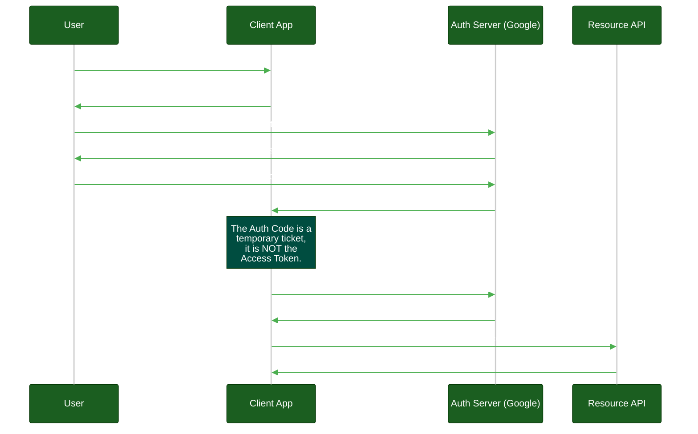
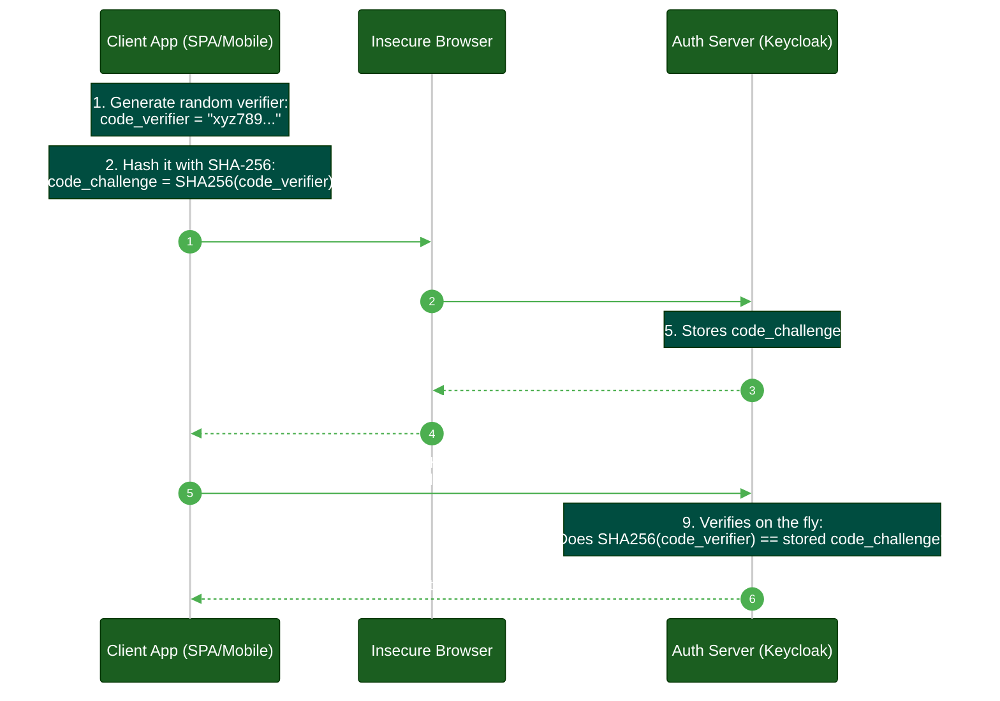

# OAuth 2.0 & Delegated Access

**Author:** ichamrong  
**Category:** Authentication Architecture  
**Read Time:** ~10 min  

---

## 📌 Table of Contents
- [1. What is OAuth 2.0?](#1-what-is-oauth-20)
  - [What is a "Protocol"?](#what-is-a-protocol)
- [2. The Authorization Code Flow (with PKCE)](#2-the-authorization-code-flow-with-pkce)
  - [What is the "Authorization Code"?](#what-is-the-authorization-code)
- [3. Why PKCE? (Proof Key for Code Exchange)](#3-why-pkce-proof-key-for-code-exchange)
- [4. Why OAuth is NOT Authentication](#4-why-oauth-is-not-authentication)
  - [AuthN vs AuthZ (The Golden Rule)](#authn-vs-authz-the-golden-rule)
- [📚 References & Tools](#references-tools)

---

## Table of Contents
- [1. What is OAuth 2.0?](#1-what-is-oauth-20)
  - [What is a "Protocol"?](#what-is-a-protocol)
- [2. The Authorization Code Flow (with PKCE)](#2-the-authorization-code-flow-with-pkce)
  - [What is the "Authorization Code"?](#what-is-the-authorization-code)
- [3. Why PKCE? (Proof Key for Code Exchange)](#3-why-pkce-proof-key-for-code-exchange)
- [4. Why OAuth is NOT Authentication](#4-why-oauth-is-not-authentication)
  - [AuthN vs AuthZ (The Golden Rule)](#authn-vs-authz-the-golden-rule)
---

The most dangerous misconception in software development is believing that OAuth 2.0 is an authentication protocol. **It is not.** OAuth 2.0 is an *Authorization* protocol.

## 1. What is OAuth 2.0?

> **💡 The Core Concept:** OAuth 2.0 is an authorization protocol that lets a third-party app access your data without ever seeing your actual password.

**The "ELI5" Analogy (The Valet Key):**
Imagine you pull up to a fancy hotel and want the valet to park your car. 
Before OAuth, you had to give the valet your *Master Key*. The valet could park your car, but they could also unlock the trunk, steal your belongings, and open your house door.
**OAuth 2.0 is the Valet Key.** You give the valet a special, restricted key that only turns on the ignition and drives the car for 10 miles. It physically cannot open the trunk. In software, this restricted "Valet Key" is called an **Access Token**.

**The MIT Professor Explanation (First Principles):**
OAuth 2.0 is fundamentally a protocol for *Delegated Authorization*. 
The core problem it solves is avoiding the anti-pattern of sharing master credentials (passwords) with third-party clients. Instead of credential sharing, OAuth establishes a trusted orchestration flow where the Resource Owner (User) explicitly authorizes an Authorization Server to issue a cryptographically verifiable, time-bound, and scope-restricted Access Token to a Client application. The Client can then present this token to a Resource Server (API) without ever touching the user's root credentials.

### What is a "Protocol"?

Before explaining the flow, we must define the word **Protocol**. 
A protocol is not a piece of software you can download or install (like a database or an NPM package). It is a strict set of architectural **rules and guidelines** (like traffic laws). 
When we say "OAuth 2.0 is a protocol," we mean it is a universally agreed-upon sequence of steps. If Google, Microsoft, and your custom backend all follow these exact same rules, they can securely communicate with each other without needing to write custom, proprietary code for every single integration.

## 2. The Authorization Code Flow (with PKCE)

This is the industry-standard flow for logging in or granting permissions via a web browser or mobile app. The legacy "Implicit Flow" is dead and insecure.

**The Actors:**
Before looking at the sequence diagram, you must understand the official terminology for the servers involved. These terms are used across the entire industry.

1. **Resource Owner (The User):** The human being who owns the data.
2. **Client (The Application):** The 3rd-party application trying to access the data (e.g., a "Calendar Printer" web app).
3. **Authorization Server (The Bouncer):** The central security server that authenticates the user and issues the Access Tokens. It is the only server that ever sees the user's actual password. (e.g., Google's login screen, Keycloak, or Okta). 
4. **Resource Server (The API):** The backend server that holds the actual data (e.g., the Google Calendar API). It does not know how to log people in; it only knows how to validate Access Tokens and return data.
5. **IAM (Identity and Access Management):** You will frequently hear this term. "IAM" is the overarching umbrella term for the entire security infrastructure. A modern IAM platform (like Keycloak) usually acts as both the *Authorization Server* (issuing OAuth tokens) and the *Identity Provider* (verifying OIDC passwords) simultaneously.

### What is the "Authorization Code"?

In the sequence diagram above, you'll notice the Auth Server doesn't immediately hand the Client the `Access Token` in step 5. First, it hands the Client an **Authorization Code**. Why?

**The "ELI5" Analogy (The Coat Check Ticket):**
Imagine you hand your coat to a coat-check attendant. They don't immediately hand your coat to your friend who is standing nearby. Instead, they give you a small numbered ticket. Your friend must take that ticket, walk up to the secure counter, show their ID, and *exchange* the ticket for the coat. 
The **Authorization Code** is that small numbered ticket. It is a temporary voucher that is useless on its own. 

**The MIT Professor Explanation (First Principles):**
The web browser (the "front-channel") is a highly insecure environment vulnerable to interception (e.g., malicious browser extensions, exposed URL histories, or compromised Wi-Fi). If the Auth Server returned the highly-privileged Access Token directly via the browser redirect URL, it could easily be stolen. 
Instead, the server returns a short-lived, single-use cryptographic string called the **Authorization Code**. The Client Application must take this code and make a secure, direct server-to-server HTTP request (the "back-channel") to exchange it for the Access Token. This ensures the Access Token is safely delivered to the backend and never touches the user's insecure browser.

## 3. Why PKCE? (Proof Key for Code Exchange)

> **💡 The Core Concept:** PKCE prevents hackers from stealing your Access Token by dynamically generating a temporary secret that proves the app requesting the token is the exact same app that started the login.

**The "ELI5" Analogy (The Torn Dollar Bill):**
Imagine you go to a chaotic, crowded bank. You shout to the teller, "I want to withdraw $100!" The teller says, "Okay, I need to go to the vault to get it. Take this torn half of a dollar bill. When I come back out to the crowd, the person who has the exact matching other half gets the $100." 
Even if a thief overheard you shouting your request, they don't have the matching torn dollar bill, so they cannot steal the final money. 

**The MIT Professor Explanation (First Principles):**
Historically, mobile apps and SPAs suffered from "Authorization Code Interception Attacks" because they lacked a secure backend to store a hardcoded Client Secret.
PKCE (Proof Key for Code Exchange) solves this by dynamically generating a temporary secret for every single login request. 
1. The Client generates a random string (`code_verifier`) and applies a SHA-256 hash to it (`code_challenge`).
2. It sends the hash to the Auth Server during the first redirect. 
3. When exchanging the temporary Auth Code for the final Access Token, the client sends the *original plaintext* string.
4. The Auth Server hashes the plaintext on the fly. If it exactly matches the hash provided in step 2, it mathematically guarantees that the client requesting the Access Token is the exact same client that initiated the flow.

## 4. Why OAuth is NOT Authentication

> **💡 The Core Concept:** OAuth 2.0 (Access Token) only proves what you are allowed to *do*. It does not prove *who you are*.

### AuthN vs AuthZ (The Golden Rule)

To understand this, you must memorize the difference between the two fundamental security concepts:
- **Authentication (AuthN):** The process of proving *who you are*. (e.g., checking a Driver's License, verifying a password, or scanning a fingerprint). 
- **Authorization (AuthZ):** The process of proving *what you are allowed to do*. (e.g., checking a VIP wristband, verifying an OAuth Scope like `read:calendar`).

OAuth handles **AuthZ**. It does not handle **AuthN**.

**The "ELI5" Analogy (The VIP Wristband):**
If you go to a music festival, they put a VIP wristband on your arm. That wristband is an **Access Token**. It tells the security guard, "Let this person into the VIP tent." 
However, the wristband *does not know your name*, your email, or your age. It is just a generic pass. If you want to know *who* the person is, you need to check their actual ID card.

**The MIT Professor Explanation:**
OAuth 2.0 generates an **Access Token**, which is a pure authorization primitive. It explicitly states: *"The bearer of this token has permission X."* 
It **DOES NOT** assert identity. If a client application relies on an OAuth Access Token to create a user session, it suffers from a critical vulnerability known as the "Confused Deputy Problem." To establish true identity (Authentication), the industry developed **OpenID Connect (OIDC)**, an identity layer built on top of OAuth 2.0 that introduces a specialized, identity-asserting `ID Token`.

## 📚 References & Tools
- **OAuth 2.0 RFC 6749** — [rfc-editor.org/rfc/rfc6749](https://www.rfc-editor.org/rfc/rfc6749)
- **OAuth 2.0 for Browser-Based Apps (PKCE)** — [datatracker.ietf.org/doc/html/draft-ietf-oauth-browser-based-apps](https://datatracker.ietf.org/doc/html/draft-ietf-oauth-browser-based-apps)

---

**Navigation:** [Previous: Stateful vs Stateless](./01-stateful-vs-stateless-sessions.md) | [Next: OpenID Connect](./03-openid-connect-and-sso.md) | [Auth & Identity Index](./README.md)

## Related

- [Session & Cookie Security](../session-and-cookie-security/README.md)
- [OWASP ASVS 5.0 Verification](../owasp-asvs-5.0/README.md)
- [Bot Protection & CAPTCHAs](../bot-protection/README.md)
