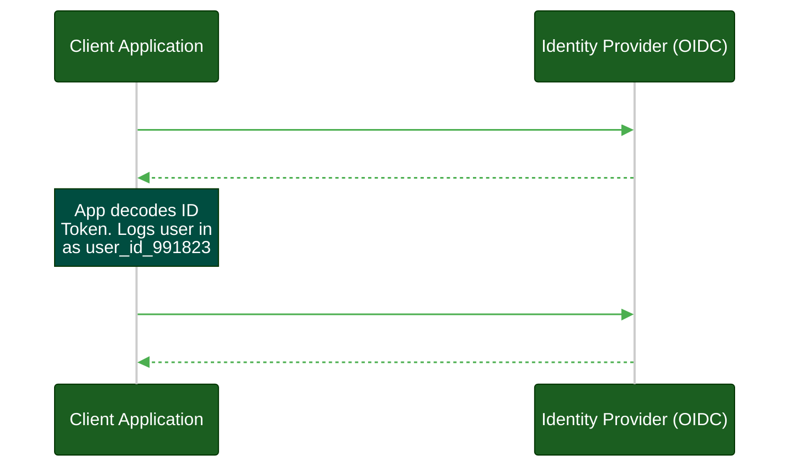
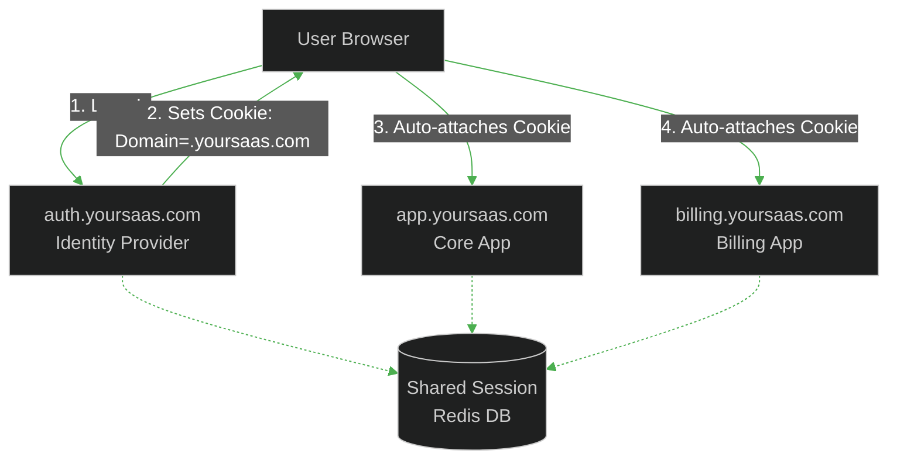
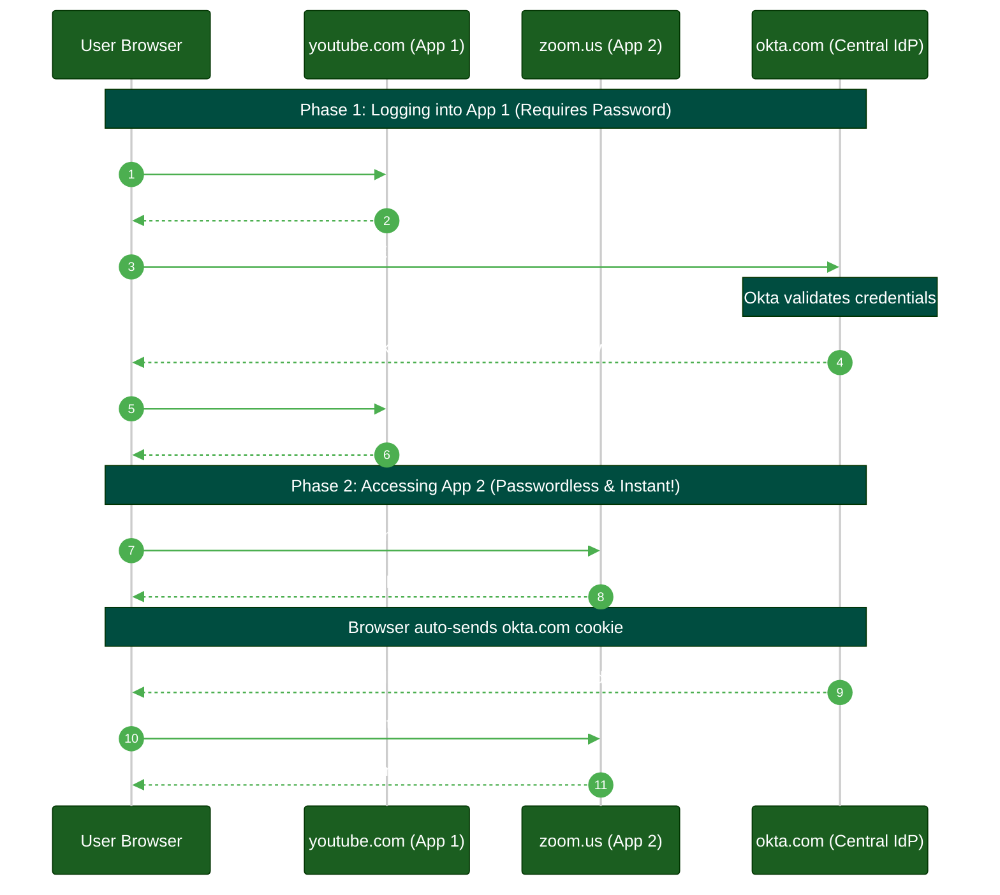
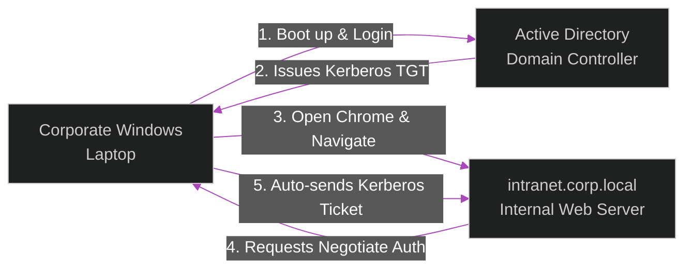

# OpenID Connect (OIDC) & Single Sign-On

**Author:** ichamrong  
**Category:** Authentication Architecture  
**Read Time:** ~10 min  

---

## 📌 Table of Contents
- [1. The Magic of the ID Token](#1-the-magic-of-the-id-token)
  - [What is a "Claim"? (Inside the Token)](#what-is-a-claim-inside-the-token)
- [2. Access Token vs. ID Token: The Cardinal Sin](#2-access-token-vs-id-token-the-cardinal-sin)
- [3. The Standard OIDC Endpoints (UserInfo, Introspect, Revoke)](#3-the-standard-oidc-endpoints-userinfo-introspect-revoke)
  - [1. The `/userinfo` Endpoint](#1-the-userinfo-endpoint)
  - [2. The `/introspect` Endpoint](#2-the-introspect-endpoint)
  - [3. The `/revoke` Endpoint](#3-the-revoke-endpoint)
  - [4. The `/token` Endpoint](#4-the-token-endpoint)
- [4. What is Single Sign-On (SSO)?](#4-what-is-single-sign-on-sso)
  - [How Many Types of SSO Are There?](#how-many-types-of-sso-are-there)
    - [Type 1: Cross-Subdomain SSO (Seamless SSO)](#type-1-cross-subdomain-sso-seamless-sso)
    - [Type 2: Federated SSO (OIDC / SAML)](#type-2-federated-sso-oidc-saml)
    - [Type 3: Broker-Based / Desktop SSO (Kerberos)](#type-3-broker-based-desktop-sso-kerberos)
- [📚 References & Tools](#references-tools)

---

## Table of Contents
- [1. The Magic of the ID Token](#1-the-magic-of-the-id-token)
  - [What is a "Claim"? (Inside the Token)](#what-is-a-claim-inside-the-token)
- [2. Access Token vs. ID Token: The Cardinal Sin](#2-access-token-vs-id-token-the-cardinal-sin)
- [3. The Standard OIDC Endpoints (UserInfo, Introspect, Revoke)](#3-the-standard-oidc-endpoints-userinfo-introspect-revoke)
- [4. What is Single Sign-On (SSO)?](#4-what-is-single-sign-on-sso)
  - [How Many Types of SSO Are There?](#how-many-types-of-sso-are-there)
---

OAuth 2.0 was designed for Authorization (letting apps talk to APIs). **OpenID Connect (OIDC)** is a thin identity layer built on top of OAuth 2.0 designed specifically for Authentication (proving who the user is).

If you see a "Log in with Google" or "Log in with Apple" button, you are using OpenID Connect.

## 1. The Magic of the ID Token

When you complete an OIDC flow, the Authorization Server returns **two** tokens:
1. **Access Token:** (OAuth) Used to call APIs.
2. **ID Token:** (OIDC) A cryptographically signed JSON Web Token (JWT) containing information about the user.

### What is a "Claim"? (Inside the Token)

> **💡 The Core Concept:** A "Claim" is simply a piece of information asserted about a user (like their name, ID, or email), packaged as a key-value pair inside the JSON token.

**The "ELI5" Analogy (The Driver's License Fields):**
If an ID Token is a Driver's License, then a **Claim** is just one single line of text printed on the plastic card. 
Line 1 says `Eye Color: Brown`. Line 2 says `Height: 5'10"`. In the security world, the government is mathematically *claiming* that your eyes are brown. A token is just a collection of these individual claims.

**The MIT Professor Explanation (First Principles):**
In Identity Access Management (IAM), an Identity Provider (IdP) acts as the authoritative system of record. When the IdP generates a JSON Web Token (JWT), it embeds verified assertions about the entity. These assertions are officially called **Claims**.
There are three structural types of claims in a standard JWT payload:
1. **Registered Claims:** Required/Standardized by the IETF (e.g., `iss` for Issuer, `exp` for Expiry, `sub` for Subject/User ID).
2. **Public Claims:** Common, agreed-upon profile fields like `email`, `name`, or `picture`.
3. **Private (Custom) Claims:** Proprietary data specific to your application's domain, like `company_role: admin` or `tenant_id: 12345`.

Here is exactly what those claims look like inside the decoded JSON payload of an ID Token:

```json
{
  "iss": "https://accounts.google.com",   // Issuer (Who generated this?)
  "sub": "user_id_991823",                // Subject (The unique User ID)
  "aud": "my-client-app-id",              // Audience (Who is this for?)
  "exp": 1699999999,                      // Expiry time
  "iat": 1699990000,                      // Issued at time
  
  // Profile Information
  "email": "user@example.com",
  "email_verified": true,
  "name": "Jane Doe",
  "picture": "https://example.com/jane.jpg"
}
```

## 2. Access Token vs. ID Token: The Cardinal Sin

> **💡 The Core Concept:** An ID Token proves *who you are* (to the frontend client). An Access Token proves *what you can do* (to the backend API). Never send an ID Token to an API.

**The "ELI5" Analogy (The Driver's License vs. The Club Wristband):**
The most common and dangerous mistake developers make is confusing these two tokens.
- **The ID Token is your Driver's License.** You look at it to prove *who you are*. You **NEVER** hand your Driver's License to the bouncer and let him keep it to get into the club. You also don't use it to pay for drinks. 
- **The Access Token is your Club Wristband.** You show it to the bouncer (the API) to gain entry. The bouncer doesn't care about your real name, your address, or your age; they just care that the wristband is mathematically valid. 

**The MIT Professor Explanation (First Principles):**
If you send an ID token to a Resource Server (API) instead of an Access Token, you are committing a severe architectural flaw. The ID Token is strictly intended for the Client Application to consume to establish a local authentication context. An API has no cryptographic or logical mechanism to verify if an ID Token was stolen, replayed, or generated for a completely different client application, leading directly to unauthorized privilege escalation.

## 3. The Standard OIDC Endpoints (UserInfo, Introspect, Revoke)

Because OIDC and OAuth 2.0 are strict protocols, Identity Providers (like Keycloak, Okta, or Google) expose a standard set of URLs (endpoints) that your backend application uses to manage tokens and sessions.

### 1. The `/userinfo` Endpoint
> **💡 The Core Concept:** A secure API provided by the IdP that returns the user's full profile data.

Sometimes, ID Tokens are kept intentionally small so they don't bloat the HTTP headers. The application takes the **Access Token** it received and makes a secure backend call to the IdP's `/userinfo` endpoint to fetch the remaining profile data (e.g., physical address, department role).

**Example Request:**
```http
GET /userinfo HTTP/1.1
Authorization: Bearer <access_token>
```

**Example Response:**
```json
{
  "sub": "248289761001",
  "name": "Jane Doe",
  "email": "janedoe@example.com",
  "email_verified": true,
  "department": "Engineering"
}
```

### 2. The `/introspect` Endpoint
> **💡 The Core Concept:** The endpoint your API uses to ask the IdP: "Is this token still valid?"

If you are using **Opaque Tokens** (random strings) instead of JWTs, the Resource Server (API) cannot mathematically verify the token on its own. Instead, it makes a secure backend call to the IdP's `/introspect` endpoint, sending the token. The IdP checks its database and responds with `{"active": true}` or `false`. 
*Note: This is highly secure (detects revoked tokens instantly) but causes higher network latency because every API request requires a database lookup.*

**Example Request:**
```http
POST /introspect HTTP/1.1
Content-Type: application/x-www-form-urlencoded
Authorization: Basic <base64_encoded_client_id:client_secret>

token=<opaque_token>
```

**Example Response (Active):**
```json
{
  "active": true,
  "scope": "read:calendar",
  "client_id": "my-app",
  "username": "janedoe",
  "exp": 1614088012
}
```

**Example Response (Revoked or Expired):**
```json
{
  "active": false
}
```

### 3. The `/revoke` Endpoint
> **💡 The Core Concept:** The "Kill Switch" endpoint used to destroy a session.

When a user clicks "Log Out" in your application, deleting the token from their browser is not enough. The token still exists! Your backend must send the token to the IdP's `/revoke` endpoint. The IdP will immediately invalidate the token in its database. If someone tries to `/introspect` or use that token 5 seconds later, the IdP will return `false`.

**Example Request:**
```http
POST /revoke HTTP/1.1
Content-Type: application/x-www-form-urlencoded
Authorization: Basic <base64_encoded_client_id:client_secret>

token=<access_or_refresh_token>
```

**Example Response:**
```http
HTTP/1.1 200 OK
```
*(A successful revocation simply returns a 200 OK status code).*

### 4. The `/token` Endpoint
> **💡 The Core Concept:** The cash register where temporary tickets (Auth Codes or Refresh Tokens) are exchanged for final Access Tokens.

This is the secure back-channel endpoint where the client application sends its Client Secret and the temporary Authorization Code to receive the actual Access and ID tokens.

**Example Request:**
```http
POST /token HTTP/1.1
Content-Type: application/x-www-form-urlencoded
Authorization: Basic <base64_encoded_client_id:client_secret>

grant_type=authorization_code&code=SplxlOBeZQQYbYS6WxSbIA&redirect_uri=https://client.example.com/cb
```

**Example Response:**
```json
{
  "access_token": "SlAV32hkKG...",
  "token_type": "Bearer",
  "refresh_token": "8xLOxBtZp8...",
  "expires_in": 3600,
  "id_token": "eyJhbGciOiJIUzI1Ni... (JWT)"
}
```



## 4. What is Single Sign-On (SSO)?

> **💡 The Core Concept:** SSO allows a user to authenticate once with a central Identity Provider, and then seamlessly access multiple different applications without entering their password again.

**The "ELI5" Analogy (The Amusement Park):**
Imagine going to a massive Amusement Park that has a hotel, a water park, and roller coasters. If there was no SSO, you would have to show your ID, pay, and get a new ticket at every single ride, every time you went to the hotel, and every time you got in the pool. 
**SSO is the front gate.** You show your ID once, pay once, and they give you a magic stamp on your hand. For the rest of the day, you walk freely between the hotel, the water park, and the rides.

**The MIT Professor Explanation (First Principles):**
Single Sign-On (SSO) is a centralized authentication paradigm that delegates the verification of credentials to a single, trusted Identity Provider (IdP). This allows a user to establish an authentication session once, and seamlessly traverse multiple independent software domains or microservices without subsequent credential challenges, drastically reducing password fatigue and centralizing audit trails.

### How Many Types of SSO Are There?

Architecturally, SSO is implemented differently depending on domain boundaries and network topologies. There are three primary types:

#### Type 1: Cross-Subdomain SSO (Seamless SSO)
**Use Case:** Multiple micro-frontends or apps hosted on the same root domain (e.g., `app.yoursaas.com`, `billing.yoursaas.com`, `admin.yoursaas.com`).
**How it works:** 
This is the simplest and most seamless form of SSO. When the user logs in at `auth.yoursaas.com`, the server sets an HTTP cookie with a broad `Domain` attribute: `Set-Cookie: session=xyz123; Domain=.yoursaas.com`. 
Because the root domain matches, the browser will automatically attach this exact same session cookie when the user navigates to `billing.yoursaas.com`. The billing server shares the same Redis database, reads the cookie, and instantly knows who the user is. 
*Zero redirects, zero OIDC protocols, completely invisible to the user.*



#### Type 2: Federated SSO (OIDC / SAML)
**Use Case:** Applications hosted on completely different root domains (e.g., logging into `youtube.com` and `zoom.us` using a single corporate `okta.com` account).
**How it works:**
Because web browsers strictly enforce the **Same-Origin Policy**, a cookie set on `okta.com` cannot be read by `youtube.com` or `zoom.us`. Cross-Subdomain SSO is impossible here.
Instead, the Identity Provider (Okta) acts as a centralized gatekeeper using OIDC/SAML redirects. 

The true magic of SSO is revealed when you access **multiple** apps:
1. **App 1 (YouTube):** You visit YouTube, you get redirected to Okta, and you type your password. Okta stores a session cookie in your browser for the `okta.com` domain. Okta redirects you back to YouTube with an Auth Code. YouTube logs you in.
2. **App 2 (Zoom):** You then visit Zoom and click "Log in with Okta". Zoom redirects you to Okta. Because your browser *already has* the `okta.com` session cookie from your YouTube login, Okta recognizes you instantly. **You do not type your password.** Okta immediately redirects you back to Zoom with an Auth Code. Zoom logs you in.
*The user logs in exactly ONCE, but gains access to both separate applications seamlessly.*



#### Type 3: Broker-Based / Desktop SSO (Kerberos)
**Use Case:** Internal corporate office networks and Enterprise Windows environments.
**How it works:**
When an employee logs into their physical Windows laptop, the Active Directory Domain Controller issues a Kerberos Ticket-Granting Ticket (TGT). When the user opens Chrome and navigates to the internal `intranet.corp.local`, Chrome detects it is an internal zone and uses Integrated Windows Authentication (IWA). It silently passes a Kerberos service ticket in the background via the HTTP `Authorization: Negotiate` header. The web server trusts the Domain Controller and logs the user in.
*No web forms, no redirects, native OS integration.*



## 📚 References & Tools
- **OpenID Connect Core 1.0 Specification** — [openid.net/specs/openid-connect-core-1_0.html](https://openid.net/specs/openid-connect-core-1_0.html)
- **Keycloak (Open Source IdP)** — [keycloak.org](https://www.keycloak.org/)

---

**Navigation:** [Previous: OAuth 2.0](./02-oauth2-and-delegated-access.md) | [Next: SAML 2.0 & Enterprise](./04-saml-and-enterprise-b2b.md) | [Auth & Identity Index](./README.md)

## Related

- [Session & Cookie Security](../session-and-cookie-security/README.md)
- [OWASP ASVS 5.0 Verification](../owasp-asvs-5.0/README.md)
- [Bot Protection & CAPTCHAs](../bot-protection/README.md)
