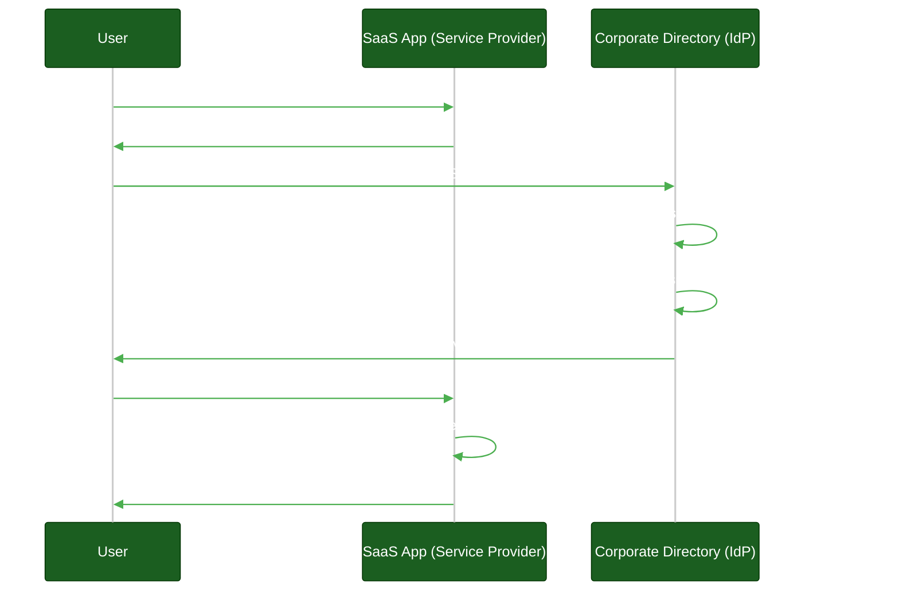
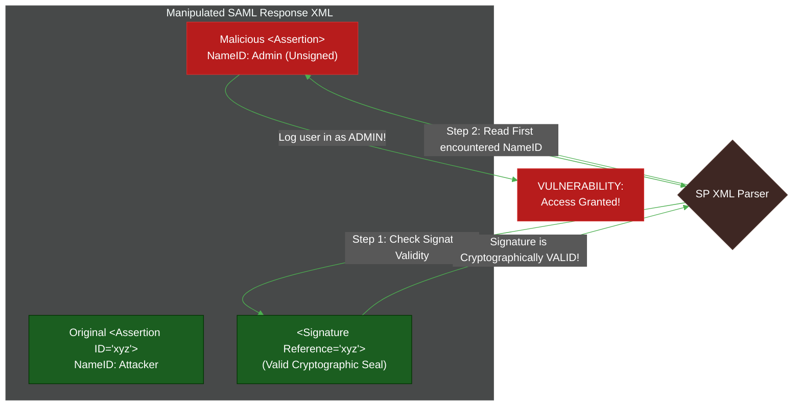

# SAML 2.0 & Enterprise B2B

**Author:** ichamrong  
**Category:** Authentication Architecture  
**Read Time:** ~10 min  

---

## 📌 Table of Contents
- [1. Why Enterprises Demand SAML](#1-why-enterprises-demand-saml)
- [2. The SAML Authentication Flow](#2-the-saml-authentication-flow)
  - [SP-Initiated Flow](#sp-initiated-flow)
- [3. The Anatomy of a SAML Assertion](#3-the-anatomy-of-a-saml-assertion)
- [4. SAML Security Vulnerabilities](#4-saml-security-vulnerabilities)
  - [XML Signature Wrapping (XSW)](#xml-signature-wrapping-xsw)
  - [The Defense](#the-defense)
- [📚 References & Tools](#references-tools)

---

## Table of Contents
- [1. Why Enterprises Demand SAML](#1-why-enterprises-demand-saml)
- [2. The SAML Authentication Flow](#2-the-saml-authentication-flow)
  - [SP-Initiated Flow](#sp-initiated-flow)
- [3. The Anatomy of a SAML Assertion](#3-the-anatomy-of-a-saml-assertion)
- [4. SAML Security Vulnerabilities](#4-saml-security-vulnerabilities)
  - [XML Signature Wrapping (XSW)](#xml-signature-wrapping-xsw)
  - [The Defense](#the-defense)
---

If you are building a B2C application, you use OAuth 2.0 and OIDC. If you are building a B2B SaaS application targeting Fortune 500 companies or government entities, you **must** support SAML 2.0. 

SAML (Security Assertion Markup Language) is older, heavier, and entirely XML-based. However, it is deeply entrenched in legacy enterprise systems like Microsoft Active Directory and Ping Identity.

## 1. Why Enterprises Demand SAML

> **💡 The Core Concept:** Enterprises use SAML so they can act as the authoritative Identity Provider, allowing them to instantly enforce MFA, password rules, and one-click offboarding across all external SaaS applications.

**The "ELI5" Analogy (The Bouncer and the Guest List):**
Imagine you are hosting a massive corporate party at a club. You don't want your 50,000 employees to have to register for a new club membership just to get in. 
Instead, you tell the club bouncer (the SaaS app), "Do not issue your own ID cards. When someone walks up, tell them to come to my tent across the street. I will check their corporate badge, and if they are allowed, I will hand them a sealed, stamped letter saying 'Let Bob in.' The bouncer reads the letter, verifies the stamp, and lets Bob in." 
Because you control the stamp, if Bob gets fired, you simply stop issuing him letters. The bouncer instantly rejects him because he has no letter.

**The MIT Professor Explanation (First Principles):**
Enterprise IT departments require strict centralization of identity lifecycle management to enforce corporate policies (MFA, password complexity, immediate offboarding). 
SAML facilitates this by decoupling authentication from authorization. The enterprise acts as the authoritative **Identity Provider (IdP)**, while your SaaS application acts as the relying **Service Provider (SP)**. Your application delegates the cryptographic burden of user verification entirely to the IdP, creating a zero-trust boundary where the SP never processes or stores root credentials, relying exclusively on asymmetric public-key cryptography to verify XML assertions.

## 2. The SAML Authentication Flow

SAML flows are almost entirely browser-based redirects. There are two primary flows: SP-Initiated (user goes to your app first) and IdP-Initiated (user goes to their corporate portal first).

### SP-Initiated Flow

## 3. The Anatomy of a SAML Assertion

A SAML Assertion is a bloated XML document, but it contains three critical statements:
1. **Authentication Statement:** "I, the IdP, authenticated this user at 9:00 AM using MFA."
2. **Attribute Statement:** "This user's email is bob@ge.com, and their role is 'Manager'."
3. **Authorization Decision Statement:** (Rarely used, but allows the IdP to say "Bob is allowed to access the reporting module.")

## 4. SAML Security Vulnerabilities

Because XML is inherently complex and hierarchical, parsing it securely is notoriously difficult.

### XML Signature Wrapping (XSW)
> **💡 The Core Concept:** Hackers manipulate complex XML files by hiding the valid signature at the bottom of the document and inserting forged, unsigned data at the top for the application to read.

**The "ELI5" Analogy (The Forged Contract):**
Imagine a legal contract signed by a CEO on the very last page. A hacker wants to change the contract, but if they erase the text, the signature becomes mathematically invalid. 
So, the hacker leaves the original signed page intact at the back of the folder. Then, they insert a *brand new, fake page* at the very front of the folder. If the lawyer is lazy and only reads the first page, and then flips to the back to see "Yep, there's a valid signature," the hacker wins.

**The MIT Professor Explanation (First Principles):**
A SAML response contains an embedded digital signature to guarantee immutability. In an XML Signature Wrapping (XSW) attack, the adversary manipulates the XML DOM tree. They preserve the original, cryptographically valid signed `<Assertion>` node but bury it deep within the document. They then inject a malicious, unsigned `<Assertion>` node (changing the `<NameID>` from an attacker to an admin) at the root level. If the SP's XML parser blindly validates the document's signature but the application logic naively extracts the first `<NameID>` node it encounters, it will process the malicious payload.

### The Defense
1. **Never write your own SAML parser.** Use enterprise-grade, audited libraries.
2. Ensure your library checks that the signature applies to the *exact* node being used for authorization.
3. Disable XML External Entities (XXE) in your XML parser to prevent server-side request forgery (SSRF).

## 📚 References & Tools
- **SAML 2.0 Core Specification** — [docs.oasis-open.org/security/saml/v2.0/saml-core-2.0-os.pdf](http://docs.oasis-open.org/security/saml/v2.0/saml-core-2.0-os.pdf)
- **OWASP SAML Security Cheat Sheet** — [cheatsheetseries.owasp.org/cheatsheets/SAML_Security_Cheat_Sheet.html](https://cheatsheetseries.owasp.org/cheatsheets/SAML_Security_Cheat_Sheet.html)

---

**Navigation:** [Previous: OpenID Connect](./03-openid-connect-and-sso.md) | [Next: Token Lifecycles](./05-token-lifecycle-and-rotation.md) | [Auth & Identity Index](./README.md)

## Related

- [Session & Cookie Security](../session-and-cookie-security/README.md)
- [OWASP ASVS 5.0 Verification](../owasp-asvs-5.0/README.md)
- [Bot Protection & CAPTCHAs](../bot-protection/README.md)
