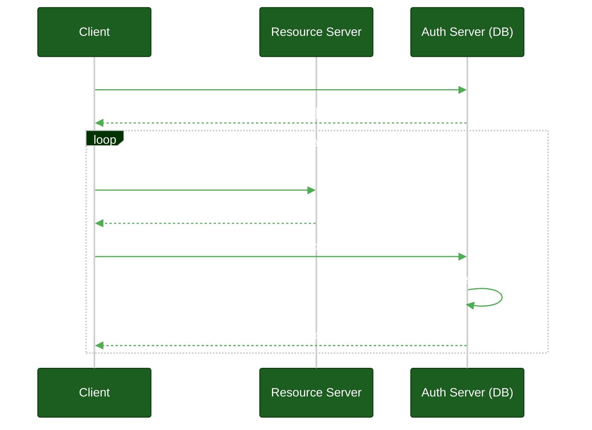
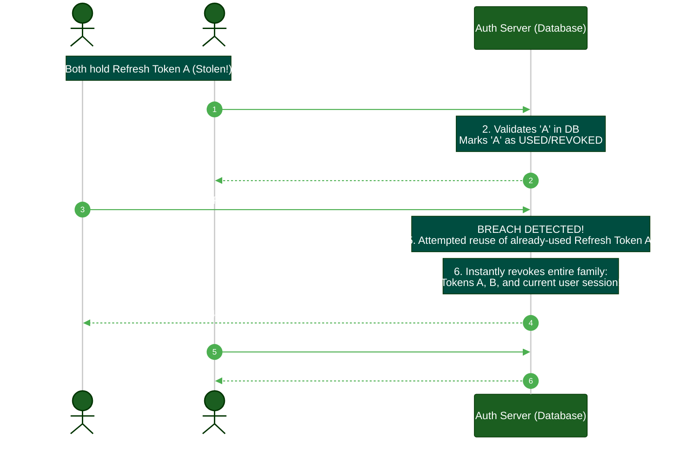

# Token Lifecycles & Rotation

**Author:** ichamrong  
**Category:** Authentication Architecture  
**Read Time:** ~10 min  

---

## 📌 Table of Contents
- [1. The Access Token & Refresh Token Paradigm](#1-the-access-token-refresh-token-paradigm)
- [2. Refresh Token Rotation (RTR)](#2-refresh-token-rotation-rtr)
  - [The Threat Detection Mechanism](#the-threat-detection-mechanism)
- [3. Sliding Windows vs. Absolute Expiry](#3-sliding-windows-vs-absolute-expiry)
- [📚 References & Tools](#references-tools)

---

## Table of Contents
- [1. The Access Token & Refresh Token Paradigm](#1-the-access-token-refresh-token-paradigm)
- [2. Refresh Token Rotation (RTR)](#2-refresh-token-rotation-rtr)
  - [The Threat Detection Mechanism](#the-threat-detection-mechanism)
- [3. Sliding Windows vs. Absolute Expiry](#3-sliding-windows-vs-absolute-expiry)
---

A token that lasts forever is a password that cannot be changed. Establishing rigorous token lifecycles and rotation strategies is the only way to mitigate the risk of token theft.

## 1. The Access Token & Refresh Token Paradigm

> **💡 The Core Concept:** Access Tokens expire quickly to limit damage if stolen. Refresh Tokens live longer but are securely checked against the database to negotiate new Access Tokens.

**The "ELI5" Analogy (The Hotel Room Key vs. The Front Desk):**
When you stay at a hotel, you don't get a key that works forever. 
- **The Access Token is your plastic room key.** It gets you through the door quickly, but it expires every single day at noon. If you lose it in the hallway, a thief can only use it for a few hours. 
- **The Refresh Token is you going back to the Front Desk.** When your plastic key stops working, you must walk to the front desk, prove you are still a guest (by showing your ID), and they hand you a *new* plastic room key for another 24 hours. The thief cannot do this because they don't have your ID.

**The MIT Professor Explanation (First Principles):**
When dealing with stateless Access Tokens (JWTs) that cannot be easily revoked via database lookup, the primary architectural defense is **Time**. 
- **Access Token:** A highly privileged, short-lived bearer token (5 to 15 minutes). It minimizes the window of exploitation if exfiltrated.
- **Refresh Token:** A highly restricted, long-lived credential (7 to 30 days) used *exclusively* to negotiate a new Access Token against the Authorization Server. Because it is evaluated centrally by the Auth Server rather than distributed Resource Servers, it inherently possesses state and can be instantaneously revoked.

## 2. Refresh Token Rotation (RTR)

While Refresh Tokens are harder to steal, they are not immune. If an attacker steals a 30-day Refresh Token, they can generate Access Tokens for a month.

**Refresh Token Rotation** solves this by treating the Refresh Token as single-use. 
1. The user uses `Refresh Token A` to get a new Access Token.
2. The server invalidates `Refresh Token A` and returns a new Access Token AND a brand new `Refresh Token B`.

### The Threat Detection Mechanism
Because RTR forces single-use, it inherently detects theft:
1. Attacker steals `Refresh Token A`.
2. Legitimate user is offline.
3. Attacker uses `Refresh Token A`. The server accepts it, gives the attacker `Refresh Token B`, and invalidates `A`.
4. Legitimate user comes online and tries to use their stored `Refresh Token A`.
5. The server sees an attempt to use an **already-used** Refresh Token.
6. The server realizes a theft has occurred and instantly revokes the entire family of tokens (including `B`). Both the attacker and the user are logged out.

## 3. Sliding Windows vs. Absolute Expiry

When designing session lengths, you must configure two distinct timeouts:

- **Idle Timeout (Sliding Window):** If the user is inactive for X hours, the session expires. Every time they are active, the timer resets. 
- **Absolute Expiry:** Regardless of activity, the user must re-authenticate every Y days. This prevents a stolen token from being kept alive indefinitely by an automated script pinging the server every hour.

In enterprise systems (banking, medical), Idle Timeouts are strict (15 minutes) and Absolute Expiries are aggressive (24 hours).

## 📚 References & Tools
- **OAuth 2.0 Security Best Current Practice** — [datatracker.ietf.org/doc/html/draft-ietf-oauth-security-topics](https://datatracker.ietf.org/doc/html/draft-ietf-oauth-security-topics)
- **Auth0 Refresh Token Rotation** — [auth0.com/docs/secure/tokens/refresh-tokens/refresh-token-rotation](https://auth0.com/docs/secure/tokens/refresh-tokens/refresh-token-rotation)

---

**Navigation:** [Previous: OpenID Connect](./03-openid-connect-and-sso.md) | [Auth & Identity Index](./README.md)

## Related

- [Session & Cookie Security](../session-and-cookie-security/README.md)
- [OWASP ASVS 5.0 Verification](../owasp-asvs-5.0/README.md)
- [Bot Protection & CAPTCHAs](../bot-protection/README.md)
