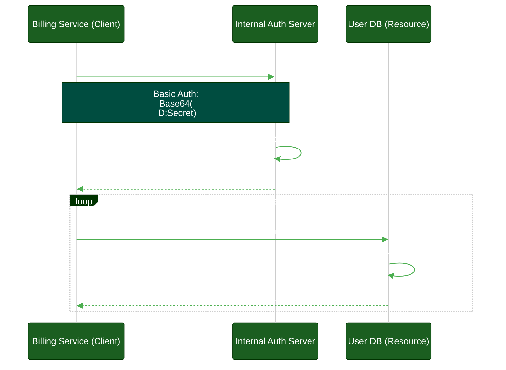
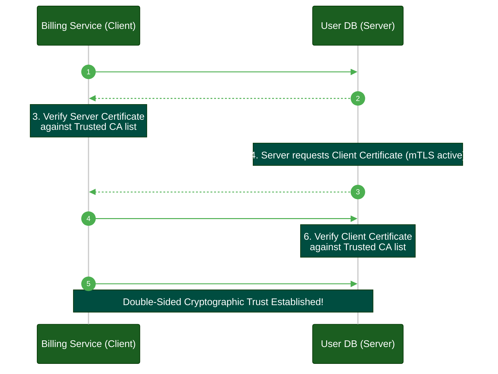

# Machine-to-Machine (M2M) Authentication

**Author:** ichamrong  
**Category:** Authentication Architecture  
**Read Time:** ~10 min  

---

## 📌 Table of Contents
- [1. The Legacy Mistake: Static API Keys](#1-the-legacy-mistake-static-api-keys)
- [2. The Standard: OAuth 2.0 Client Credentials Grant](#2-the-standard-oauth-20-client-credentials-grant)
- [3. The Cloud-Native Solution: IAM & Workload Identity](#3-the-cloud-native-solution-iam-workload-identity)
- [4. The Zero Trust Standard: mTLS (Mutual TLS)](#4-the-zero-trust-standard-mtls-mutual-tls)
- [📚 References & Tools](#references-tools)

---

## Table of Contents
- [1. The Legacy Mistake: Static API Keys](#1-the-legacy-mistake-static-api-keys)
- [2. The Standard: OAuth 2.0 Client Credentials Grant](#2-the-standard-oauth-20-client-credentials-grant)
- [3. The Cloud-Native Solution: IAM & Workload Identity](#3-the-cloud-native-solution-iam-workload-identity)
- [4. The Zero Trust Standard: mTLS (Mutual TLS)](#4-the-zero-trust-standard-mtls-mutual-tls)
---

When humans authenticate, they use browsers, passwords, and MFA. When your backend `Billing Microservice` needs to talk to the `User Database Microservice`, there is no browser and no human to press a YubiKey. 

This is **Machine-to-Machine (M2M)** authentication. M2M traffic makes up over 80% of enterprise network volume, yet it is often the most poorly secured.

## 1. The Legacy Mistake: Static API Keys

> **💡 The Core Concept:** Hardcoding static API keys is dangerous because they never expire, are easily leaked, and require application downtime to replace.

**The "ELI5" Analogy (The House Key Under the Mat):**
Using a static API key is like leaving a spare house key permanently hidden under the welcome mat so your dog-walker can get in. 
It never expires. If a burglar finds it, they can use it forever. If you fire the dog-walker, you don't know if they made a copy of the key, so you are forced to change the locks on the entire house.

**The MIT Professor Explanation (First Principles):**
The oldest and most hazardous form of M2M authentication is the static API Key. A developer hardcodes a long, non-expiring cryptographic string into a microservice's environment configuration. 
This breaks the fundamental principle of credential rotation. Because the key lacks temporal bounds (expiration) and contextual bounds (identity assertion), a leaked key grants perpetual, unauditable access. Furthermore, rotating the key requires a coordinated, highly disruptive deployment across multiple services.

## 2. The Standard: OAuth 2.0 Client Credentials Grant

To solve the static key problem, we use OAuth 2.0, but without a human involved. This is called the **Client Credentials Flow**.

The `Billing` service is given a `Client ID` and a `Client Secret`. It uses these to ask the internal Authorization Server for a short-lived **JWT Access Token**. 

**Why this is better:**
The `Client Secret` is only ever sent to the tightly-secured Auth Server. The `User DB` never sees it. If the JWT is intercepted on the internal network, the attacker only has access for 60 minutes before the token expires and becomes useless.

## 3. The Cloud-Native Solution: IAM & Workload Identity

> **💡 The Core Concept:** Modern cloud environments eliminate passwords entirely by dynamically injecting short-lived cryptographic identities into microservices at runtime.

**The "ELI5" Analogy (The Telepathic Security Guard):**
Instead of giving your dog-walker a physical key to carry around, imagine if your house had a telepathic security guard. When the dog-walker walks up to the door, the guard looks at their face, instantly recognizes them, and opens the door for exactly 5 minutes. The dog-walker never carries a key, so they can never lose one.

**The MIT Professor Explanation (First Principles):**
Even with OAuth Client Credentials, the architectural burden of securely storing and rotating the underlying `Client Secret` remains. Modern orchestrators (like Kubernetes, AWS IAM) eliminate secrets entirely through **Workload Identity**. 
Rather than injecting a static secret, the cloud provider cryptographically injects an ephemeral identity context into the container instance at runtime. The workload queries the local hypervisor/metadata API, which provisions a short-lived cryptographic token derived from the platform's root of trust. The attack surface of stored secrets is mathematically reduced to zero.

## 4. The Zero Trust Standard: mTLS (Mutual TLS)

Tokens prove *Identity*, but they don't protect against a compromised network. If an attacker breaches your internal corporate network, they can sniff the traffic and steal the JWTs as they travel between microservices.

**Mutual TLS (mTLS)** solves this. In standard HTTPS, only the server proves its identity with a certificate. In mTLS, *both* the client and the server present certificates to each other.

1. `Billing` connects to `User DB`.
2. `User DB` presents its certificate. `Billing` verifies it.
3. `Billing` presents its certificate. `User DB` verifies it.
4. An encrypted tunnel is established. 

With mTLS via service meshes (like Istio or Linkerd), even if an attacker is inside your network, they cannot read the traffic, and they cannot forge requests because they do not possess the private cryptographic certificates.

## 📚 References & Tools
- **OAuth 2.0 Client Credentials** — [oauth.net/2/grant-types/client-credentials/](https://oauth.net/2/grant-types/client-credentials/)
- **Istio Mutual TLS** — [istio.io/latest/docs/concepts/security/#mutual-tls-authentication](https://istio.io/latest/docs/concepts/security/#mutual-tls-authentication)

---

**Navigation:** [Previous: Token Lifecycles](./05-token-lifecycle-and-rotation.md) | [Auth & Identity Index](./README.md)

## Related

- [Session & Cookie Security](../session-and-cookie-security/README.md)
- [OWASP ASVS 5.0 Verification](../owasp-asvs-5.0/README.md)
- [Bot Protection & CAPTCHAs](../bot-protection/README.md)
