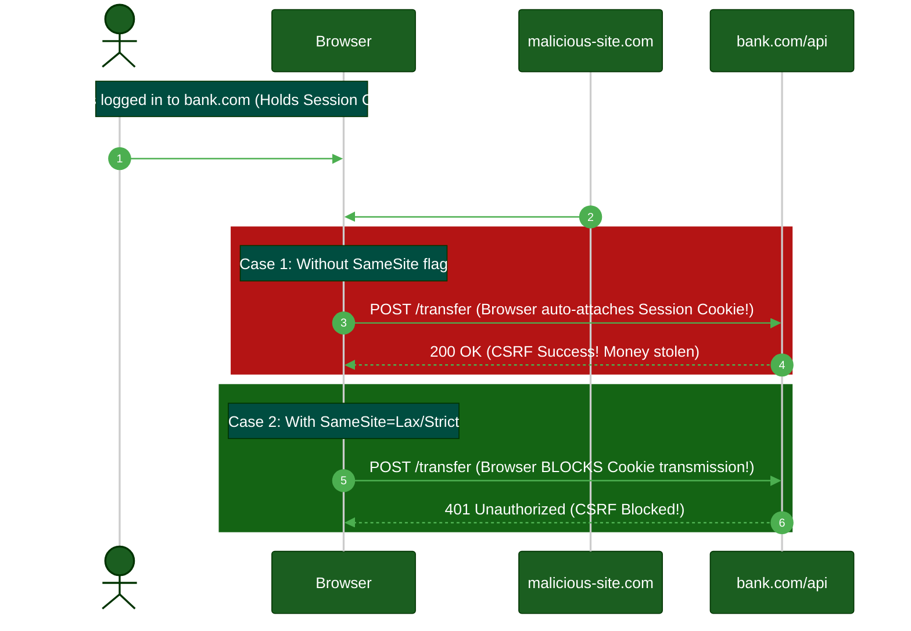

# Browser Storage Security: Where to Store Tokens?

**Author:** ichamrong  
**Category:** Authentication Architecture  
**Read Time:** ~10 min  

---

## 📌 Table of Contents
- [1. LocalStorage](#1-localstorage)
- [2. SessionStorage](#2-sessionstorage)
- [3. In-Memory (JavaScript Variables)](#3-in-memory-javascript-variables)
- [4. HTTP Cookies](#4-http-cookies)
  - [The Critical Cookie Security Flags](#the-critical-cookie-security-flags)
  - [Summary: The Ultimate Architecture Matrix](#summary-the-ultimate-architecture-matrix)
- [📚 References & Tools](#references-tools)

---

## Table of Contents
- [1. LocalStorage](#1-localstorage)
- [2. SessionStorage](#2-sessionstorage)
- [3. In-Memory (JavaScript Variables)](#3-in-memory-javascript-variables)
- [4. HTTP Cookies](#4-http-cookies)
  - [The Critical Cookie Security Flags](#the-critical-cookie-security-flags)
  - [Summary: The Ultimate Architecture Matrix](#summary-the-ultimate-architecture-matrix)
---

Once the server issues an authentication token (whether it is an Opaque Session ID or a Stateless JWT), the frontend browser must store it somewhere. 

Choosing *where* to store the token is one of the most critical security decisions in web architecture. The wrong choice exposes your users to **Cross-Site Scripting (XSS)** or **Cross-Site Request Forgery (CSRF)**.

Here is a breakdown of the four primary storage mechanisms in modern browsers.

## 1. LocalStorage

`window.localStorage` allows JavaScript to store key/value pairs in the browser indefinitely. The data survives page refreshes, tab closures, and computer reboots.

- **What it's good for:** User preferences (dark mode, language selection), shopping cart drafts.
- **Security Posture:** **Extremely Dangerous for Tokens.**
- **The Vulnerability (XSS):** Any JavaScript running on your domain can read LocalStorage. If an attacker injects a malicious script via a vulnerable NPM package or a stored XSS attack in a comment section, that script can simply execute `console.log(localStorage.getItem('token'))` and send your user's token to a hacker's server. 

## 2. SessionStorage

`window.sessionStorage` is identical to LocalStorage, but its lifespan is tied strictly to the specific browser tab. If you duplicate the tab or close the tab, the data is wiped. 

- **What it's good for:** Multi-step form wizards, temporary UI state.
- **Security Posture:** **Extremely Dangerous for Tokens.**
- **The Vulnerability (XSS):** Just like LocalStorage, SessionStorage is 100% readable by any JavaScript executing in that specific tab. An XSS attack will steal tokens stored here just as easily as LocalStorage.

## 3. In-Memory (JavaScript Variables)

Storing the token in a standard JavaScript variable (e.g., inside a React Context or a Redux store).

- **What it's good for:** Ultra-secure single-page application (SPA) architectures.
- **Security Posture:** **Highly Secure.**
- **The Vulnerability:** Because it is stored in memory, an XSS payload cannot easily scrape it (unless it actively overwrites the `fetch` function to intercept outbound requests). 
- **The Drawback:** The moment the user hits "Refresh" (F5), the RAM is cleared, and the user is logged out. To fix this, architectures use **Silent Auth** (an invisible iframe that relies on a Secure Cookie to fetch a new token into memory upon refresh).

## 4. HTTP Cookies

> **💡 The Core Concept:** Cookies configured with the `HttpOnly` flag are physically inaccessible to JavaScript, making them completely immune to XSS token theft.

**The "ELI5" Analogy (The Locked Briefcase):**
If LocalStorage is a sticky note on your desk, an `HttpOnly` Cookie is a titanium briefcase handcuffed to your wrist. 
You can carry the briefcase to the bank, and the bank teller has the key to open it, read it, and put it back. But *you* (and anyone looking over your shoulder) physically cannot open it to see what's inside. 

**The MIT Professor Explanation (First Principles):**
Cookies represent the original web state management protocol, natively integrated into the browser engine. Unlike DOM-accessible storage, cookies support rigid security directives enforced at the C++ level of the browser executable.
When configured with the `HttpOnly` flag, the browser explicitly blocks the JavaScript engine from accessing the `document.cookie` interface for that specific payload. This fundamentally nullifies the threat of Cross-Site Scripting (XSS) exfiltration, as the payload remains inaccessible to the DOM regardless of code execution vulnerabilities.

### The Critical Cookie Security Flags
To make a cookie secure, the server must set specific flags when issuing it:

1. **`HttpOnly`:** This is the ultimate defense against XSS. When a cookie is marked `HttpOnly`, the browser's JavaScript engine is physically blocked from reading it. `document.cookie` will return empty. Even if an attacker executes malicious JavaScript on your page, they cannot steal the token.
2. **`Secure`:** The browser will only send the cookie over an encrypted HTTPS connection. It will never leak over plaintext HTTP.
3. **`SameSite=Lax` or `Strict`:** Because cookies are automatically attached to outgoing requests, they are historically vulnerable to CSRF (Cross-Site Request Forgery). The `SameSite` flag tells the browser: *"If a request is coming from an evil domain (hacker.com) trying to hit my API, do NOT attach my cookie."*



### Summary: The Ultimate Architecture Matrix

| Storage Mechanism | Survives Refresh? | Vulnerable to XSS? | Vulnerable to CSRF? | Verdict for Auth Tokens |
|-------------------|-------------------|--------------------|---------------------|-------------------------|
| **LocalStorage** | Yes | **YES** (Trivial to steal) | No | ❌ **NEVER** |
| **SessionStorage**| No (Tab Only) | **YES** (Trivial to steal) | No | ❌ **NEVER** |
| **JS Memory** | No | Partially (Harder to steal) | No | ⚠️ Acceptable (Needs Silent Auth) |
| **HttpOnly Cookie**| Yes | **NO** (Immune to theft) | **YES** (Requires SameSite) | ✅ **THE STANDARD** |

```mermaid
%%{init: {'theme': 'dark', 'themeVariables': {'primaryColor': '#1b5e20', 'primaryBorderColor': '#003300', 'primaryTextColor': '#ffffff', 'lineColor': '#4caf50', 'secondaryColor': '#01579b', 'tertiaryColor': '#4a148c', 'mainBkg': '#1b5e20', 'nodeBorder': '#003300', 'clusterBkg': '#37474f', 'titleColor': '#ffffff', 'edgeLabelBackground': '#2d2d2d', 'classText': '#ffffff',
    'background': '#1e1e1e'},
  'themeCSS': 'svg { background-color: #1e1e1e !important; padding: 1rem !important; border-radius: 8px !important; } .edgeLabel rect { fill: #1e1e1e !important; } text, tspan, .messageText, .signalText, .edgeLabel, .edgeLabel span, .pointLabel, .axisLabel, .quadrantTitle, .quadrantLabel { fill: #ffffff !important; color: #ffffff !important; stroke: none !important; }'
}}%%
flowchart TD
    API[API Server] -- HttpOnly Cookie --> BROWSER[Web Browser]
    
    subgraph BROWSER [User's Browser]
        COOKIE[HttpOnly Cookie Store]
        LS[LocalStorage / SessionStorage]
        JS[Malicious XSS Script]
    end
    
    JS -.->|Attempt to read| LS
    Note over JS,LS: Attacker easily steals data here
    
    JS -.->|Attempt to read| COOKIE
    Note over JS,COOKIE: Browser engine BLOCKS access!<br/>Token is safe.
    
    BROWSER -->|Auto-attaches Cookie| API
```

## 📚 References & Tools
- **OWASP HTML5 Security Cheat Sheet** — [cheatsheetseries.owasp.org/cheatsheets/HTML5_Security_Cheat_Sheet.html](https://cheatsheetseries.owasp.org/cheatsheets/HTML5_Security_Cheat_Sheet.html)
- **SameSite Cookies Explained** — [web.dev/samesite-cookies-explained/](https://web.dev/samesite-cookies-explained/)

---

**Navigation:** [Previous: Machine-to-Machine Auth](./06-machine-to-machine-auth.md) | [Auth & Identity Index](./README.md)

## Related

- [Session & Cookie Security](../session-and-cookie-security/README.md)
- [OWASP ASVS 5.0 Verification](../owasp-asvs-5.0/README.md)
- [Bot Protection & CAPTCHAs](../bot-protection/README.md)
