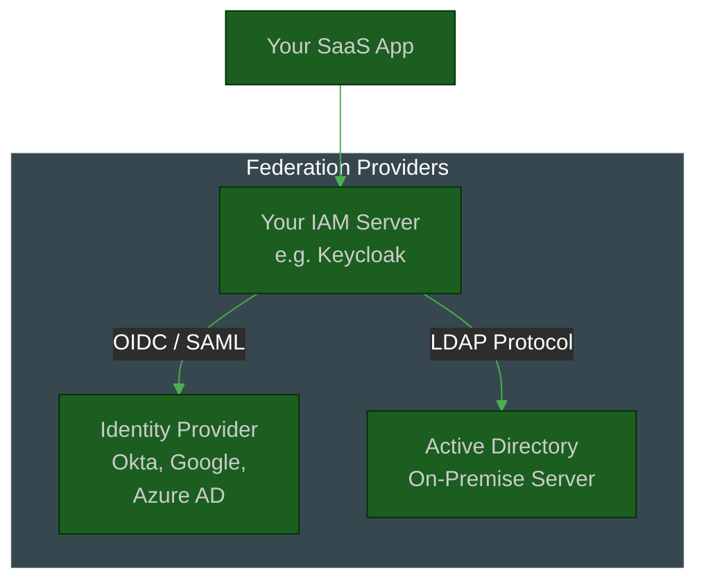
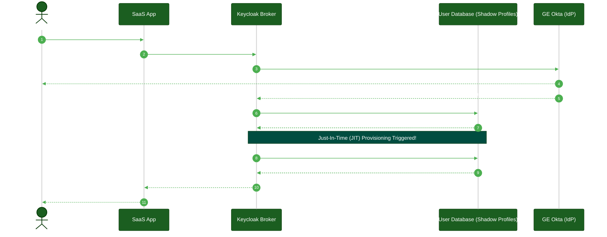

# User Federation & Directory Synchronization

**Author:** ichamrong  
**Category:** Authentication Architecture  
**Read Time:** ~10 min  

---

## 📌 Table of Contents
- [1. What is User Federation?](#1-what-is-user-federation)
  - [Type 1: LDAP / Active Directory Federation](#type-1-ldap-active-directory-federation)
  - [Type 2: Identity Provider (IdP) Federation (Identity Brokering)](#type-2-identity-provider-idp-federation-identity-brokering)
- [2. The Benefits of Federation](#2-the-benefits-of-federation)
- [📚 References & Tools](#references-tools)

---

## Table of Contents
- [1. What is User Federation?](#1-what-is-user-federation)
  - [Type 1: LDAP / Active Directory Federation](#type-1-ldap-active-directory-federation)
  - [Type 2: Identity Provider (IdP) Federation (Identity Brokering)](#type-2-identity-provider-idp-federation-identity-brokering)
- [2. The Benefits of Federation](#2-the-benefits-of-federation)
---

As an application scales, managing users in an isolated local database becomes unsustainable. **User Federation** is the architectural pattern of linking an external Identity Provider (or Directory) to your system so that you do not have to manage passwords, credentials, or user lifecycles manually.

Instead of duplicating user data, your Identity Access Management (IAM) server (like Keycloak or Auth0) "federates" or brokers the authentication request to an external system.

## 1. What is User Federation?

> **💡 The Core Concept:** User Federation means an application does not own the credentials of a user; instead, it asks a trusted partner (like Okta or Active Directory) to verify the user and vouch for their identity.

**The "ELI5" Analogy (The Subcontractor):**
Imagine you own a huge construction company, but you don't want to hire and manage plumbers yourself. So, you make a deal with a separate Plumbing Company. When you need a plumber, you don't look in your own employee roster. You just call the Plumbing Company and say, "Send over Bob, and vouch for him." 
**User Federation is subcontracting your logins.** Your app doesn't want to store or protect passwords. So when Bob tries to log in, your app calls Google (or Active Directory) and says, "Can you check Bob's password and vouch for him?"

**The MIT Professor Explanation (First Principles):**
At its core, User Federation is the architectural pattern of delegating identity assertion to an external, authoritative System of Record. 
Instead of duplicating user state (credentials, lifecycle status) into a local persistence layer, your Identity Access Management (IAM) broker intercepts the authentication request and proxies it to an external Identity Provider (IdP) or Directory Service. This creates a zero-trust credential boundary: the local application never processes the cryptographic secret (password), relying entirely on the trusted token or LDAP bind response returned by the federated system.

There are two primary types of User Federation used in enterprise architecture:

### Type 1: LDAP / Active Directory Federation
**Use Case:** Integrating with legacy, on-premise corporate networks.

In a traditional office, every employee has a Windows account managed by **Microsoft Active Directory (AD)** using the **LDAP (Lightweight Directory Access Protocol)**. 
If you deploy a new internal HR tool, you do not want employees to create a new password. Instead, you configure your IAM server to "federate" with the corporate LDAP server.

**How it works:**
1. The user goes to your HR tool and types their standard Windows password.
2. Your IAM server receives the password but **does not** check its local database.
3. Instead, your IAM server securely binds to the corporate LDAP server over a private network and attempts to log in with those credentials.
4. If LDAP says "Success," your IAM server logs the user in and pulls their LDAP attributes (like "Department: Sales" or "Title: Manager").

*Note: In modern deployments, IAM systems can either sync the LDAP users into a local cache periodically or act as a real-time proxy.*

### Type 2: Identity Provider (IdP) Federation (Identity Brokering)
**Use Case:** Cloud-native B2B integrations, Social Logins, and modern SaaS.

Instead of talking directly to a raw database protocol like LDAP, the IAM server delegates the entire login experience to a modern web-based Identity Provider (IdP) using standard protocols like **SAML 2.0** or **OIDC**. 
This is often called **Identity Brokering**.

**How it works:**
1. A user from `General Electric (GE)` visits your SaaS app.
2. They enter their email: `bob@ge.com`.
3. Your IAM server recognizes the `@ge.com` domain and realizes that GE is a federated client.
4. Your IAM server redirects the user's browser entirely to GE's corporate Okta server.
5. The user logs into Okta (using whatever MFA Okta requires).
6. Okta redirects the user back to your IAM server with a cryptographically signed token.
7. Your IAM server accepts the token, dynamically creates a shadow profile for Bob in your database (Just-In-Time Provisioning), and logs him in.

## 2. The Benefits of Federation

1. **Zero Password Liability:** Your application never stores, sees, or hashes passwords. If your database is breached, no passwords are stolen.
2. **Centralized Offboarding:** If an employee is fired, the IT admin disables their account in the central Active Directory. Because your app uses Federation, the employee is instantly locked out of your app as well, without you having to do anything.
3. **Just-In-Time (JIT) Provisioning:** You do not need to manually create 10,000 accounts for a new client. When users log in for the first time via Federation, your system automatically provisions their account on the fly based on the SAML/OIDC claims.

## 📚 References & Tools
- **Keycloak User Federation** — [keycloak.org/docs/latest/server_admin/#_user-storage-federation](https://www.keycloak.org/docs/latest/server_admin/#_user-storage-federation)
- **Active Directory / LDAP** — [learn.microsoft.com/en-us/windows-server/identity/ad-ds/active-directory-domain-services](https://learn.microsoft.com/en-us/windows-server/identity/ad-ds/active-directory-domain-services)

---

**Navigation:** [Previous: Browser Storage Security](./07-browser-storage-security.md) | [Next: WebAuthn & Passkeys](./08-webauthn-and-passkeys.md) | [Auth & Identity Index](./README.md)

## Related

- [Session & Cookie Security](../session-and-cookie-security/README.md)
- [OWASP ASVS 5.0 Verification](../owasp-asvs-5.0/README.md)
- [Bot Protection & CAPTCHAs](../bot-protection/README.md)
