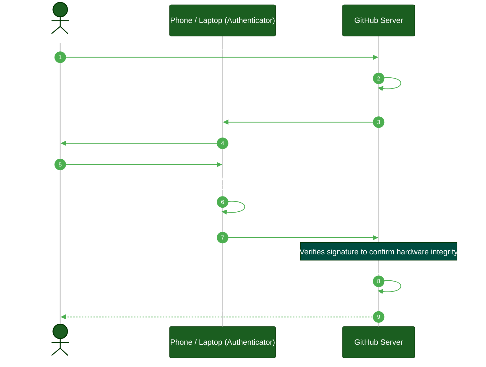
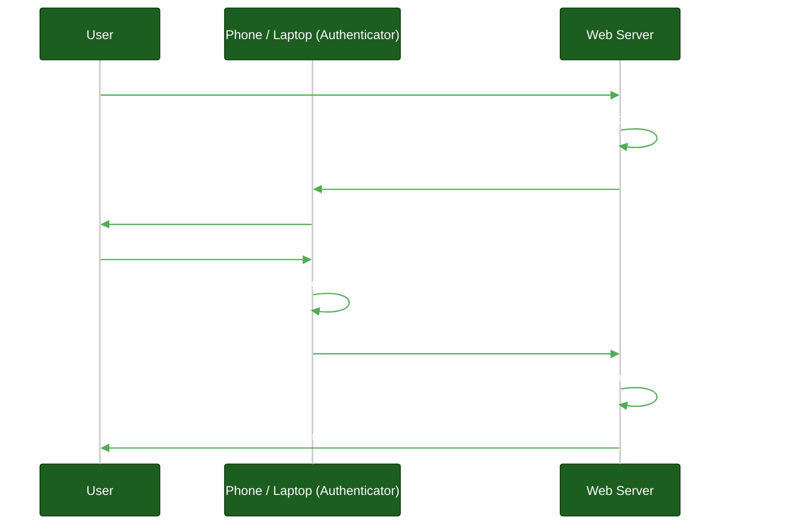

# AuthN, WebAuthn, & Passkeys

**Author:** ichamrong  
**Category:** Authentication Architecture  
**Read Time:** ~10 min  

---

## 📌 Table of Contents
- [1. AuthN vs AuthZ](#1-authn-vs-authz)
- [2. What are Passkeys (WebAuthn)?](#2-what-are-passkeys-webauthn)
  - [How Passkeys Work (The Mechanics)](#how-passkeys-work-the-mechanics)
    - [1. Passkey Registration (Initial Sign Up)](#1-passkey-registration-initial-sign-up)
    - [2. Passkey Authentication (Subsequent Logins)](#2-passkey-authentication-subsequent-logins)
- [3. Why Passkeys are Unphishable](#3-why-passkeys-are-unphishable)
- [4. The Future of Authentication](#4-the-future-of-authentication)
- [📚 References & Tools](#references-tools)

---

## Table of Contents
- [1. AuthN vs AuthZ](#1-authn-vs-authz)
- [2. What are Passkeys (WebAuthn)?](#2-what-are-passkeys-webauthn)
  - [How Passkeys Work (The Mechanics)](#how-passkeys-work-the-mechanics)
- [3. Why Passkeys are Unphishable](#3-why-passkeys-are-unphishable)
- [4. The Future of Authentication](#4-the-future-of-authentication)
---

When discussing modern identity architecture, engineers frequently use abbreviations like **AuthN** and mention **Passkeys** or **WebAuthn**. These technologies represent the absolute frontier of identity security and the ultimate death of the password.

## 1. AuthN vs AuthZ

Before diving into Passkeys, we must define the abbreviations:

- **AuthN (Authentication):** Proving *who you are*. (e.g., Checking a password, scanning a fingerprint, verifying a YubiKey).
- **AuthZ (Authorization):** Proving *what you are allowed to do*. (e.g., Checking if the user has the `ADMIN` role, verifying OAuth 2.0 Scopes).

OIDC handles AuthN. OAuth 2.0 handles AuthZ.

## 2. What are Passkeys (WebAuthn)?

For decades, AuthN has relied on "shared secrets" (passwords). The user knows the password, and the server knows the hash of the password. This is fundamentally flawed because passwords can be phished, leaked, or guessed.

**WebAuthn (Web Authentication API)** is an open standard created by the FIDO Alliance and the W3C. 
**Passkeys** are the consumer-friendly brand name for WebAuthn credentials, championed by Apple, Google, and Microsoft.

Passkeys replace passwords entirely using **Public Key Cryptography**.

### How Passkeys Work (The Mechanics)

When you register a Passkey on a website (e.g., GitHub), your device (iPhone, Macbook, or a physical YubiKey) generates a unique pair of cryptographic keys specifically for `github.com`.

1. **The Public Key:** Sent to the GitHub server and stored in their database. It is mathematically impossible to derive the private key from the public key.
2. **The Private Key:** Stored securely in your device's hardware enclave (e.g., the Apple Secure Enclave or Android Titan M chip). It *never* leaves your device.

#### 1. Passkey Registration (Initial Sign Up)

Before authenticating, the user must register a Passkey once.

#### 2. Passkey Authentication (Subsequent Logins)

When you attempt to log in, the flow looks like this:

## 3. Why Passkeys are Unphishable

> **💡 The Core Concept:** Passkeys eliminate phishing because the cryptographic signature is mathematically locked to the exact domain name of the website. A fake website physically cannot ask for the real website's keys.

**The "ELI5" Analogy (The Magical Door Lock):**
Imagine a magical lock on your house. To open it, you don't need a key; you just say a secret password out loud. The problem? A thief could hide in the bushes, record you saying the password, and play it back later. This is traditional phishing.
**Passkeys are a lock that only opens if your specific face is matched while standing exactly on your front porch.** If a thief builds a fake house that looks exactly like yours (a phishing website, `g1thub.com`), your face won't open the door because the lock mathematically proves you are at the wrong address. The thief gets nothing to record.

**The MIT Professor Explanation (First Principles):**
Passkeys neutralize credential harvesting (phishing) by strictly enforcing **Origin Binding**.
In a legacy password system, the shared secret (the password) is context-agnostic; it works regardless of where it is entered. WebAuthn fundamentally changes this by binding the cryptographic signature directly to the specific `Relying Party ID` (the exact DNS domain, e.g., `github.com`).
During authentication, the browser cryptographically hashes the current web origin and incorporates it into the payload signed by the Secure Enclave. If an attacker tricks a user into visiting `g1thub.com`, the hardware enclave will hash `g1thub.com`, discover that no private key exists for that origin, and physically refuse to generate a signature. The credential cannot be extracted or spoofed.

## 4. The Future of Authentication

Enterprise environments are rapidly moving toward a **Passwordless Architecture**. 
By utilizing WebAuthn, users never create a password. They simply scan their fingerprint or face on their laptop, and the cryptographic keys handle the rest. If the server's database is hacked, the hackers only steal useless Public Keys.

## 📚 References & Tools
- **WebAuthn Guide** — [webauthn.guide](https://webauthn.guide/)
- **FIDO Alliance: Passkeys** — [fidoalliance.org/passkeys/](https://fidoalliance.org/passkeys/)

---

**Navigation:** [Previous: User Federation](./08-user-federation-and-directories.md) | [Auth & Identity Index](./README.md)

## Related

- [Session & Cookie Security](../session-and-cookie-security/README.md)
- [OWASP ASVS 5.0 Verification](../owasp-asvs-5.0/README.md)
- [Bot Protection & CAPTCHAs](../bot-protection/README.md)
