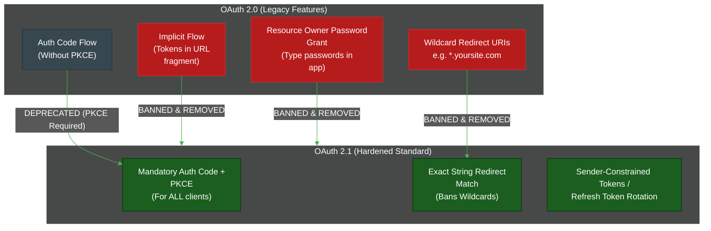

# The Evolution of OAuth: 1.0 to 2.1 and Beyond

**Author:** ichamrong  
**Category:** Authentication Architecture  
**Read Time:** ~10 min  

---

## 📌 Table of Contents
- [1. OAuth 1.0 and 1.0a (2007 - 2009)](#1-oauth-10-and-10a-2007-2009)
- [2. OAuth 2.0 (2012) - RFC 6749](#2-oauth-20-2012-rfc-6749)
- [3. OAuth 2.1 (The Modern Hardening)](#3-oauth-21-the-modern-hardening)
  - [What changes in OAuth 2.1?](#what-changes-in-oauth-21)
- [4. What's Next? (GNAP / "OAuth 3.0")](#4-whats-next-gnap-oauth-30)
- [📚 References & Tools](#references-tools)

---

## Table of Contents
- [1. OAuth 1.0 and 1.0a (2007 - 2009)](#1-oauth-10-and-10a-2007-2009)
- [2. OAuth 2.0 (2012) - RFC 6749](#2-oauth-20-2012-rfc-6749)
- [3. OAuth 2.1 (The Modern Hardening)](#3-oauth-21-the-modern-hardening)
  - [What changes in OAuth 2.1?](#what-changes-in-oauth-21)
- [4. What's Next? (GNAP / "OAuth 3.0")](#4-whats-next-gnap-oauth-30)
---

The OAuth standard has evolved significantly over the last 15 years in response to shifting application architectures (from server-side rendering to Single Page Applications to mobile apps) and new security threats.

Understanding the history of OAuth versions helps clarify *why* certain architectural patterns are now strictly enforced.

## 1. OAuth 1.0 and 1.0a (2007 - 2009)

In the early days of the web, if you wanted a 3rd-party service to access your Twitter account, you had to give them your actual Twitter password. OAuth 1.0 was created to solve this by introducing delegated access.

**Architecture:** 
OAuth 1.0 required the client to cryptographically sign *every single HTTP request* using an HMAC-SHA1 algorithm and a shared secret.

- **Pros:** It was incredibly secure. Even if the request was sent over plaintext HTTP (which was common in 2007), an attacker could not forge or alter the request.
- **Cons:** It was famously difficult for developers to implement. A single misplaced space or header would cause the cryptographic signature to fail. Mobile app developers struggled immensely to integrate it.

*(Note: OAuth 1.0a was a minor revision released in 2009 to fix a specific session fixation vulnerability).*

## 2. OAuth 2.0 (2012) - RFC 6749

Because OAuth 1.0 was so hard to adopt, the IETF completely rewrote the protocol. OAuth 2.0 threw away the complex per-request cryptographic signatures and relied entirely on **HTTPS (TLS)** for security.

Instead of signing requests, OAuth 2.0 introduced the concept of the **Bearer Token** (if you hold the token, you have the power). It also introduced multiple "Grant Types" to handle different scenarios:

1. **Authorization Code Grant:** For servers that could securely hold a Client Secret.
2. **Implicit Grant:** Designed for browser-based JavaScript apps (SPAs) that couldn't hold a secret. It returned the token directly in the URL hash.
3. **Resource Owner Password Credentials (ROPC):** Allowed users to type their password directly into a highly trusted 1st-party mobile app to get a token.
4. **Client Credentials:** For Machine-to-Machine (M2M) communication.

**The Problem:** OAuth 2.0 was too flexible. As years passed, the Implicit Grant and ROPC grants were proven to be highly insecure against modern browser attacks and malware.

## 3. OAuth 2.1 (The Modern Hardening)

> **💡 The Core Concept:** OAuth 2.1 is not a new protocol; it is simply a hardened version of OAuth 2.0 that officially bans outdated, insecure practices like the Implicit flow.

**The "ELI5" Analogy (Patching the Leaky Boat):**
Imagine you build a massive, beautiful boat (OAuth 2.0). It works great for 10 years, but people start using it in ways you never imagined, and a few small leaks appear. 
Instead of building a brand-new boat from scratch (OAuth 3.0), you just take the existing boat, strictly ban the dangerous areas where people were falling overboard, and permanently seal the leaks. 
**OAuth 2.1 is exactly that.** It is not a new protocol. It is just OAuth 2.0 with all the dangerous, outdated options officially deleted.

**The MIT Professor Explanation (First Principles):**
OAuth 2.1 is currently in its final draft stages. It is not a paradigm shift; it is an architectural consolidation. 
Over the lifecycle of RFC 6749 (OAuth 2.0), the security landscape evolved, exposing structural vulnerabilities in specific grant types (like the Implicit Grant relying on URL fragments). OAuth 2.1 deprecates these vulnerable flows, codifying 10 years of security best current practices (BCPs) into a hardened baseline standard. If you are building a modern OAuth 2.0 implementation today using PKCE and eliminating implicit flows, you are likely already compliant with OAuth 2.1.

### What changes in OAuth 2.1?

1. **PKCE is Mandatory:** Proof Key for Code Exchange (PKCE) is now strictly required for *all* clients using the Authorization Code flow, not just mobile apps.
2. **Implicit Grant is Dead:** The Implicit flow is completely removed. SPAs must now use the Authorization Code flow with PKCE.
3. **Password Grant (ROPC) is Dead:** The flow where a user types their password directly into the client app is removed. All human logins must be redirected to the Identity Provider's secure browser window.
4. **Refresh Token Rotation:** Refresh tokens must either be sender-constrained (tied to a specific client certificate) or they must utilize Refresh Token Rotation (one-time use).
5. **Exact Redirect URIs:** Redirect URIs must be compared using exact string matching. Wildcards (`*`) are banned to prevent Open Redirect attacks.

## 4. What's Next? (GNAP / "OAuth 3.0")

While OAuth 2.1 fixes the flaws of 2.0, the underlying architecture of browser redirects is still rigid. The IETF is currently working on the next generation of authorization, currently named **GNAP (Grant Negotiation and Authorization Protocol)**, which many refer to informally as "OAuth 3.0".

**The Vision of GNAP:**
- Instead of rigid redirects, GNAP treats authorization as an interactive "negotiation" between the client, the user, and the authorization server.
- It removes the hard dependency on the browser, making it natively support smart TVs, IoT devices, and command-line tools.
- It natively supports multiple Identity Providers (e.g., combining a medical license verification from the government with a standard Google login in a single transaction).

## 📚 References & Tools
- **OAuth 2.1 Draft Specification** — [datatracker.ietf.org/doc/html/draft-ietf-oauth-v2-1](https://datatracker.ietf.org/doc/html/draft-ietf-oauth-v2-1)
- **GNAP Working Group** — [datatracker.ietf.org/wg/gnap/about/](https://datatracker.ietf.org/wg/gnap/about/)

---

**Navigation:** [Previous: WebAuthn & Passkeys](./09-webauthn-and-passkeys.md) | [Auth & Identity Index](./README.md)

## Related

- [Session & Cookie Security](../session-and-cookie-security/README.md)
- [OWASP ASVS 5.0 Verification](../owasp-asvs-5.0/README.md)
- [Bot Protection & CAPTCHAs](../bot-protection/README.md)
