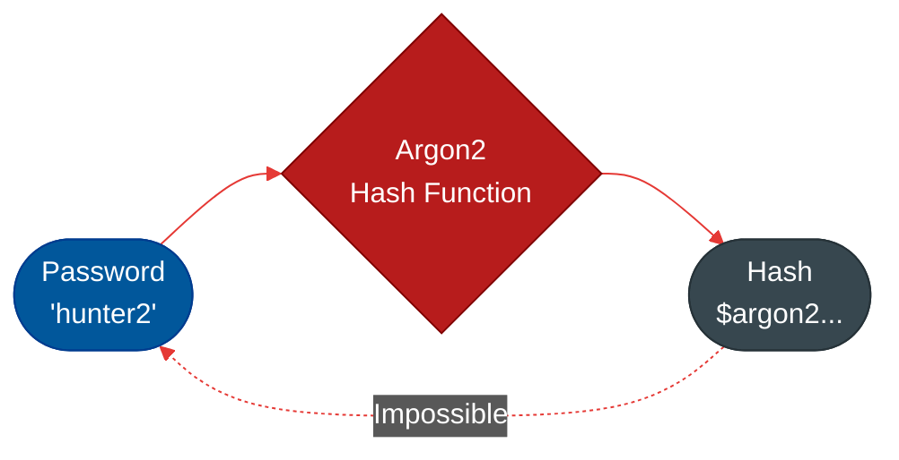
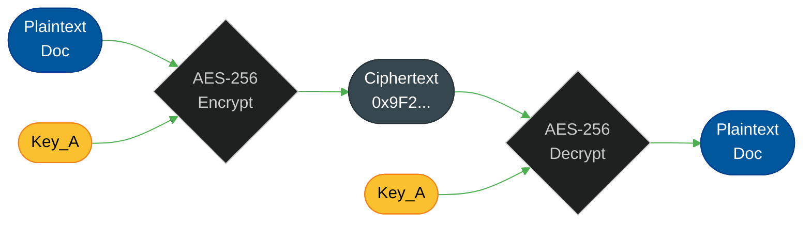
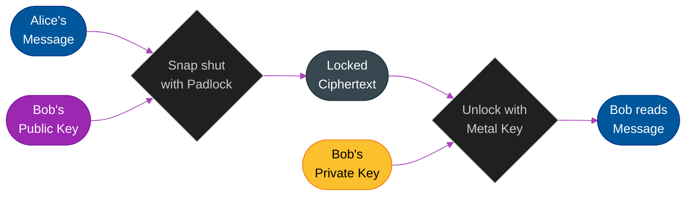
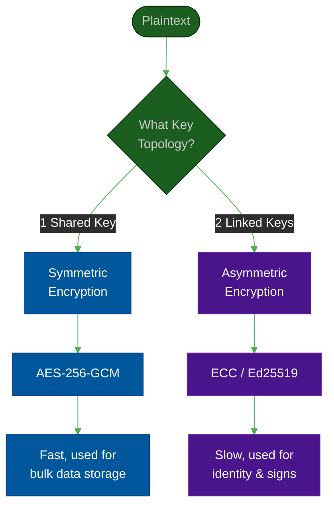
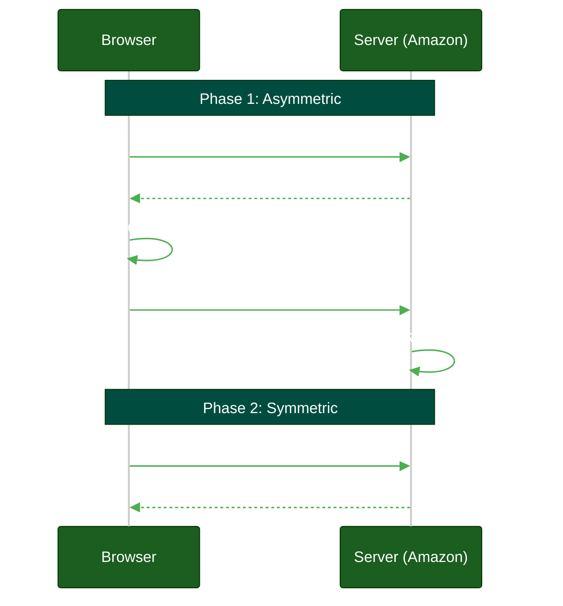
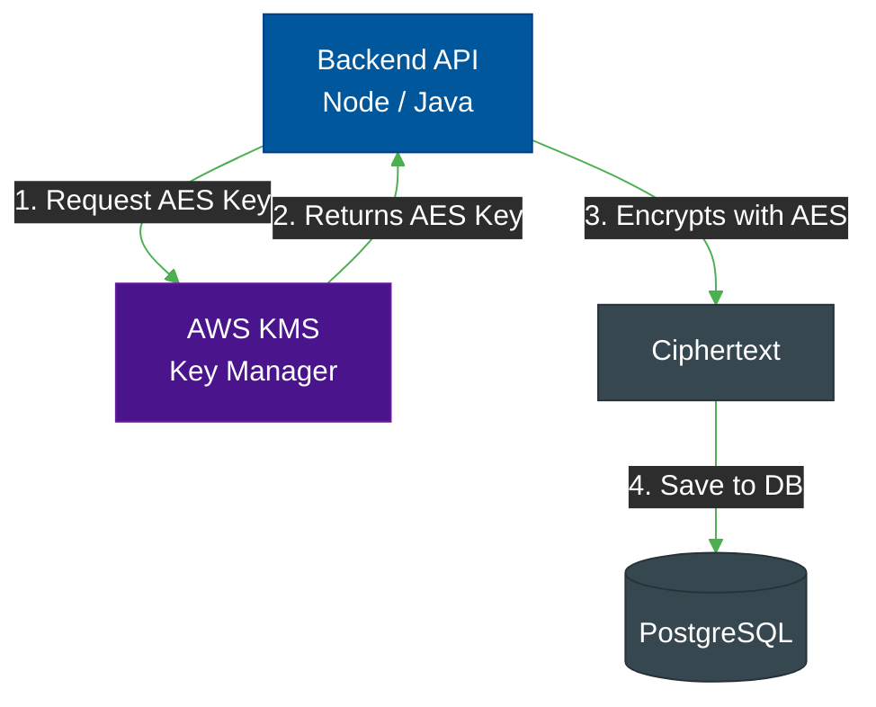

# Cryptography Fundamentals: Encryption & Hashing

**Author:** ichamrong  
**Category:** Authentication Architecture  
**Read Time:** ~15 min  

---

## 📌 Table of Contents
- [1. Core Terminology: Plaintext vs. Ciphertext](#1-core-terminology-plaintext-vs-ciphertext)
- [2. One-Way vs. Two-Way Cryptography](#2-one-way-vs-two-way-cryptography)
  - [One-Way (Hashing)](#one-way-hashing)
  - [Two-Way (Encryption)](#two-way-encryption)
- [3. Symmetric vs Asymmetric Encryption (Two-Way)](#3-symmetric-vs-asymmetric-encryption-two-way)
  - [Symmetric Encryption (The Fast Workhorse)](#symmetric-encryption-the-fast-workhorse)
  - [Asymmetric Encryption (Public Key Cryptography)](#asymmetric-encryption-public-key-cryptography)
- [4. The Real World: The Hybrid Approach (TLS/HTTPS)](#4-the-real-world-the-hybrid-approach-tlshttps)
- [5. Data at Rest (Databases & Redis)](#5-data-at-rest-databases-redis)
  - [Encrypting Sessions in Redis](#encrypting-sessions-in-redis)
  - [The Three Levels of Database Encryption](#the-three-levels-of-database-encryption)
    - [1. Infrastructure-Level (Disk Encryption / TDE)](#1-infrastructure-level-disk-encryption-tde)
    - [2. Database-Level (Engine Encryption)](#2-database-level-engine-encryption)
    - [3. Application-Level (Client-Side Field-Level Encryption)](#3-application-level-client-side-field-level-encryption)
- [📚 References & Tools](#references-tools)

---

## Table of Contents
- [1. Core Terminology: Plaintext vs. Ciphertext](#1-core-terminology-plaintext-vs-ciphertext)
- [2. One-Way vs. Two-Way Cryptography](#2-one-way-vs-two-way-cryptography)
  - [One-Way (Hashing)](#one-way-hashing)
  - [Two-Way (Encryption)](#two-way-encryption)
- [3. Symmetric vs Asymmetric Encryption (Two-Way)](#3-symmetric-vs-asymmetric-encryption-two-way)
  - [Symmetric Encryption (The Fast Workhorse)](#symmetric-encryption-the-fast-workhorse)
  - [Asymmetric Encryption (Public Key Cryptography)](#asymmetric-encryption-public-key-cryptography)
- [4. The Real World: The Hybrid Approach (TLS/HTTPS)](#4-the-real-world-the-hybrid-approach-tlshttps)
- [5. Data at Rest (Databases & Redis)](#5-data-at-rest-databases-redis)
  - [Encrypting Sessions in Redis](#encrypting-sessions-in-redis)
  - [The Three Levels of Database Encryption](#the-three-levels-of-database-encryption)

---

Before architecting secure identity systems, engineers must understand the core tools of cryptography. Many developers use the word "encryption" interchangeably with "hashing," which leads to catastrophic security failures (like storing user passwords incorrectly).

## 1. Core Terminology: Plaintext vs. Ciphertext

Before touching algorithms, you must know the two states of data in cryptography:

- **Plaintext (Cleartext):** The raw, unencrypted, readable data. This is what you see on your screen. It can be a password (`hunter2`), a JSON document (`{"role": "admin"}`), or a video file. If a hacker steals Plaintext, they win instantly.
- **Ciphertext:** The scrambled, unreadable result after the Plaintext has been run through a mathematical algorithm. It looks like random garbage (`0x9F2B4...`). If a hacker steals Ciphertext, they have nothing but useless data unless they can crack the math.

The entire goal of cryptography is converting Plaintext into Ciphertext before it travels across the internet, and converting it back to Plaintext when it reaches the authorized destination.

---

## 2. One-Way vs. Two-Way Cryptography

There is a fundamental split in cryptography based on whether the data is *supposed* to be readable again.

### One-Way (Hashing)

> **💡 The Core Concept:** Hashing is a one-way street. You turn a password into a scramble of letters, but it is mathematically impossible to reverse the scramble back into the password.

**"Encryption that CANNOT be decrypted"**

**The "ELI5" Analogy (The Meat Grinder):**
A hash function is a mathematical "meat grinder." You put a file or a password into the grinder, and it spits out a fixed-length string of gibberish (e.g., `a1b2c3d4...`). You cannot put ground meat back together to form the original steak.
- **Rule:** It is mathematically impossible to reverse the hash back into the original data.
- **Use Case:** Passwords. When a user creates a password, you hash it and store the hash. When they log in, you hash what they typed and compare the two hashes. The server *never* knows the actual password.

**The Hashing Algorithms:**
1. **Argon2 (The Modern Gold Standard):** Winner of the Password Hashing Competition. It is uniquely designed to be "Memory Hard." This means it requires a massive amount of RAM to compute the hash. Hackers try to crack passwords by buying thousands of GPUs (which are great at math but have very little RAM). Argon2 physically breaks their GPUs' ability to crack passwords fast.
2. **Bcrypt (The Battle-Tested Standard):** Created in 1999, it is still the default in most frameworks (Spring, Django, Rails). It uses "work factors" (rounds) to intentionally make the hashing process slow. If computers get twice as fast in 5 years, you just increase the rounds to keep the hash slow.
3. **SHA-256 (Secure Hash Algorithm):** Invented by the NSA. It is extremely fast. **Because it is fast, you must NEVER use it for passwords.** A modern GPU can guess 10 billion SHA-256 hashes per second. However, because it is fast, it is the perfect algorithm for verifying file integrity (checking if a downloaded file is corrupted) or blockchain hashing.

### Two-Way (Encryption)
**"Encryption that CAN be decrypted"**

Encryption takes plaintext, applies a mathematical algorithm, and uses a **Key** to turn it into ciphertext. As long as you have the correct key, you can reverse the process and read the data.
- **Use Case:** Storing credit card numbers, encrypting hard drives, sending chat messages.

---

## 3. Symmetric vs Asymmetric Encryption (Two-Way)

Within Two-Way encryption, there are two distinct families. Understanding when to use which is the foundation of network security.

### Symmetric Encryption (The Fast Workhorse)

> **💡 The Core Concept:** Symmetric Encryption uses the exact same key to lock and unlock the data. It is extremely fast but requires you to safely hand the key to the other person.

**Concept:** There is only **one shared key**. The same key that locks the door is used to unlock it.

- **How it works:** Alice uses `Key_A` to encrypt a PDF. She sends the PDF to Bob. Bob uses `Key_A` to decrypt it.
- **The Strength:** It is incredibly fast. It uses CPU hardware acceleration and can encrypt gigabytes of video or database files in milliseconds.
- **The Weakness:** *The Key Distribution Problem*. How does Alice safely give `Key_A` to Bob? If a hacker intercepts the key while Alice is sending it, the encryption is useless.

**The Symmetric Algorithms:**
1. **AES-256-GCM (Advanced Encryption Standard):** The undisputed king of enterprise encryption, approved by the US Government for Top Secret information. "256" refers to the key size (which is so massive that guessing it would take all the computers on Earth longer than the age of the universe). "GCM" stands for Galois/Counter Mode, which means the algorithm not only encrypts the data but mathematically proves that nobody tampered with it while it was traveling. It is hardware-accelerated on almost all modern Intel and AMD CPUs.
2. **ChaCha20-Poly1305:** Developed by Google. While AES is incredibly fast on a powerful laptop, it can be slow on cheap, low-end mobile phones or IoT devices that lack AES hardware acceleration chips. ChaCha20 is a software-optimized algorithm that runs 3x faster than AES on cheap hardware while providing the exact same level of military-grade security.

### Asymmetric Encryption (Public Key Cryptography)

> **💡 The Core Concept:** Asymmetric Encryption uses two mathematically linked keys: a Public Key (given to everyone to lock boxes) and a Private Key (kept hidden by you to unlock those boxes).

**Concept:** There are **two keys**: a Public Key and a Private Key. They are mathematically linked.

**The "ELI5" Open Padlock Analogy:**
Imagine you want people to send you secret letters, but you don't want to meet them in person to give them a key. 
1. You buy hundreds of **open padlocks**. These open padlocks are your **Public Key**.
2. You hand these open padlocks out to everyone in town. You leave them on the sidewalk. You put them on your website. 
3. When Alice wants to send you a secret letter, she puts it in a metal box and snaps your open padlock shut on it. *(She encrypts it with your Public Key).*
4. *Here is the magic:* Once the padlock snaps shut, **even Alice cannot open it anymore**. If a hacker intercepts the box, they cannot open it. 
5. The only thing in the universe that can open that locked box is the single **metal key** you kept hidden in your pocket. That is your **Private Key**.

**The MIT Professor Explanation (First Principles):**
To achieve this in software, we need a "One-Way Mathematical Trapdoor." 
The only way to achieve this is by finding a math problem that is incredibly easy to compute in one direction, but practically impossible to reverse without a specific cheat code. 
For example, it takes a computer 1 millisecond to multiply two massive prime numbers (`P × Q`) to get a giant number `N`. But if you only give a computer `N`, it will take 10,000 years to reverse-engineer which two prime numbers were used to create it. 
- The massive product `N` is published as your **Public Key** (the open padlock).
- The secret prime numbers `P` and `Q` are kept as your **Private Key** (the metal key).

- **The Strength:** Solves the key distribution problem. You don't have to hide your Public Key. This is the foundation of WebAuthn/Passkeys and JWT signatures.
- **The Weakness:** It is computationally heavy and extremely slow. You cannot use it to encrypt a 1GB video file; your CPU would choke.

**The Asymmetric Algorithms:**
1. **RSA (Rivest-Shamir-Adleman):** Invented in 1977, this is the grandfather of the modern internet. It relies on the mathematical difficulty of factoring massively huge prime numbers. However, because computers have gotten so fast, RSA keys have had to become gigantic (2048 or 4096 bits) to stay secure. This makes them bloated and very slow to process.
2. **ECC (Elliptic Curve Cryptography):** The modern replacement for RSA. Instead of prime numbers, it uses the algebraic structure of elliptic curves over finite fields. The math is so efficient that a tiny 256-bit ECC key provides the exact same security as a massive 3072-bit RSA key. It is vastly faster and saves battery life on mobile devices.
3. **Ed25519 (Edwards-curve Digital Signature Algorithm):** A specific, highly-optimized version of Elliptic Curve cryptography. It is completely immune to several common side-channel attacks that plague RSA. If you are generating a new SSH key or setting up modern JWTs today, Ed25519 is the absolute best choice.

---

## 4. The Real World: The Hybrid Approach (TLS/HTTPS)

If Symmetric is fast but hard to share keys, and Asymmetric is easy to share keys but too slow... **how does the internet work?**

The internet uses both at the same time. This is called a **Hybrid System**, and it is exactly how your browser establishes a secure HTTPS connection.

1. **The Handshake (Asymmetric):** When you connect to Amazon, your browser uses Asymmetric cryptography (Amazon's Public Key) to securely negotiate a brand new, temporary, highly-secure Symmetric Key.
2. **The Session (Symmetric):** Once both sides agree on the temporary Symmetric Key, they throw the slow Asymmetric keys away and use the hyper-fast Symmetric AES key to encrypt the actual web traffic (HTML, images, videos) for the rest of the session.

---

## 5. Data at Rest (Databases & Redis)

When data is moving across the internet, we protect it with TLS. But what happens when the data reaches your server and needs to be saved to a database or a file? This is called "Data at Rest."

### Encrypting Sessions in Redis
**Must we encrypt sessions in Redis? Yes.** Redis is exceptionally fast because it stores everything in RAM, but it is often run inside internal networks without strict access controls. 
If an attacker compromises your internal network and reads your Redis database, they could steal all active Session IDs and impersonate thousands of users. 

- **The Solution:** Never store the raw Plaintext Session ID in Redis. The application should generate a random Opaque Token (e.g., `abc-123`), send `abc-123` to the user's browser cookie, but store the **Hash** (`SHA-256(abc-123)`) in Redis. When the user makes a request with `abc-123`, the server hashes it and compares it to the Redis database. If the Redis database is leaked, the attacker only gets hashes and cannot hijack active sessions.

### The Three Levels of Database Encryption

When saving data, there are three entirely different layers where encryption can happen. You must know when to use which to achieve compliance.

#### 1. Infrastructure-Level (Disk Encryption / TDE)
**What it is:** The cloud provider or Operating System encrypts the entire physical hard drive (e.g., AWS EBS Encryption, BitLocker).
- **When to use it:** **Always.** It requires zero code changes and is a mandatory baseline for any compliance framework (SOC2, HIPAA, PCI).
- **When it FAILS:** If a hacker gets SQL Injection access, or a rogue database admin runs a `SELECT *` query, Disk Encryption does absolutely nothing. The OS automatically decrypts the data for the database engine on the fly. 
- **The Shared Hosting Danger:** If you deploy your app on cheap Shared Hosting (where multiple tenants share the same database server), Infrastructure encryption will not protect you from other users on that same machine.

#### 2. Database-Level (Engine Encryption)
**What it is:** The Database Engine itself encrypts specific columns (e.g., PostgreSQL `pgcrypto` or SQL Server Always Encrypted). The database holds the encryption keys.
- **When to use it:** When you need to protect specific fields without changing your backend application code.
- **When it FAILS:** If a hacker gets superuser access to the database environment, they can extract the keys from the database and decrypt everything. It is better than Disk Encryption, but still vulnerable if the DB server itself is fully compromised.

#### 3. Application-Level (Client-Side Field-Level Encryption)
**What it is:** Your backend code (Node/Java) encrypts specific fields *before* generating the `INSERT` SQL query. The database only ever receives unreadable `Ciphertext` and *never* sees the keys.
- **When to use it:** For strict compliance (HIPAA, PCI-DSS) protecting PII (Personally Identifiable Information), or when running on shared/untrusted infrastructure. It completely neutralizes SQL injection attacks—the hacker just steals encrypted gibberish.
- **WHAT to encrypt:** Social Security Numbers, Credit Card Numbers, medical records, or API Keys belonging to your users.
- **WHAT NOT to encrypt:** Foreign keys, timestamps, or fields you need to query frequently (e.g., you cannot efficiently run `SELECT * WHERE first_name = 'Bob'` if `first_name` is encrypted).
- **HOW to encrypt:** Use **Symmetric Encryption** (`AES-256-GCM`). 
  - **The Architecture:** Do NOT hardcode the `AES` key in your `.env` file. Instead, use a Key Management Service (like AWS KMS or HashiCorp Vault). Your application asks AWS KMS to provide a temporary "Data Key" to perform the AES-256-GCM encryption locally before sending the data to the database.

## 📚 References & Tools
- **OWASP Password Storage** — [cheatsheetseries.owasp.org/cheatsheets/Password_Storage_Cheat_Sheet.html](https://cheatsheetseries.owasp.org/cheatsheets/Password_Storage_Cheat_Sheet.html)
- **NIST Cryptographic Standards** — [csrc.nist.gov/projects/cryptographic-standards-and-guidelines](https://csrc.nist.gov/projects/cryptographic-standards-and-guidelines)

---

**Navigation:** [Previous: The Evolution of OAuth](./10-oauth-version-history-and-2.1.md) | [Auth & Identity Index](./README.md)

## Related

- [Session & Cookie Security](../session-and-cookie-security/README.md)
- [OWASP ASVS 5.0 Verification](../owasp-asvs-5.0/README.md)
- [Bot Protection & CAPTCHAs](../bot-protection/README.md)
