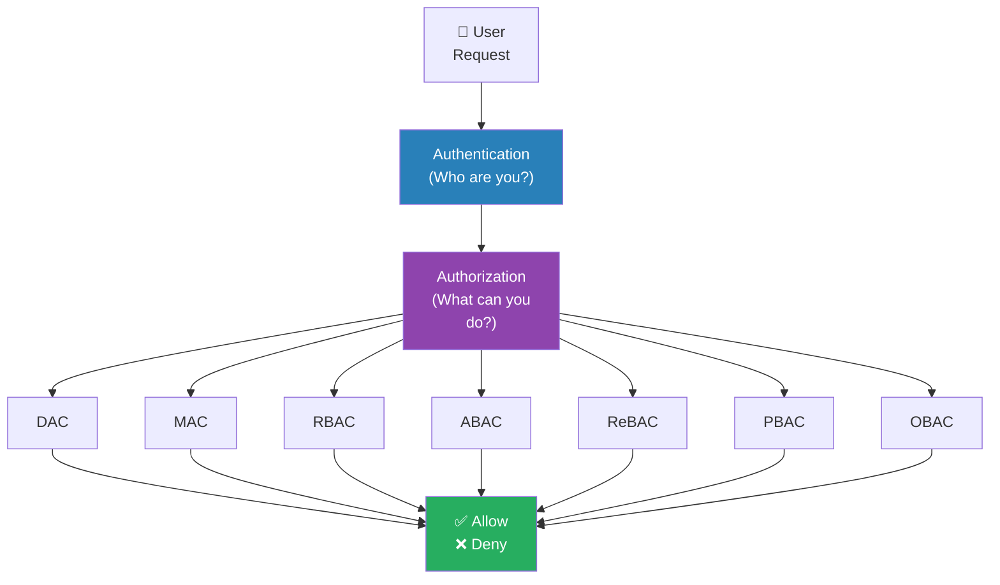
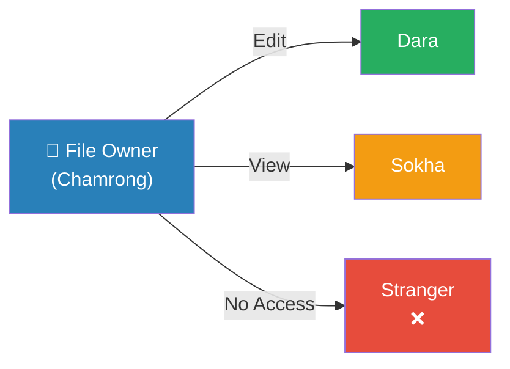
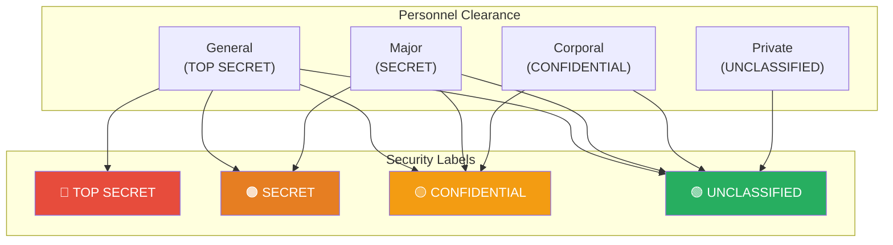
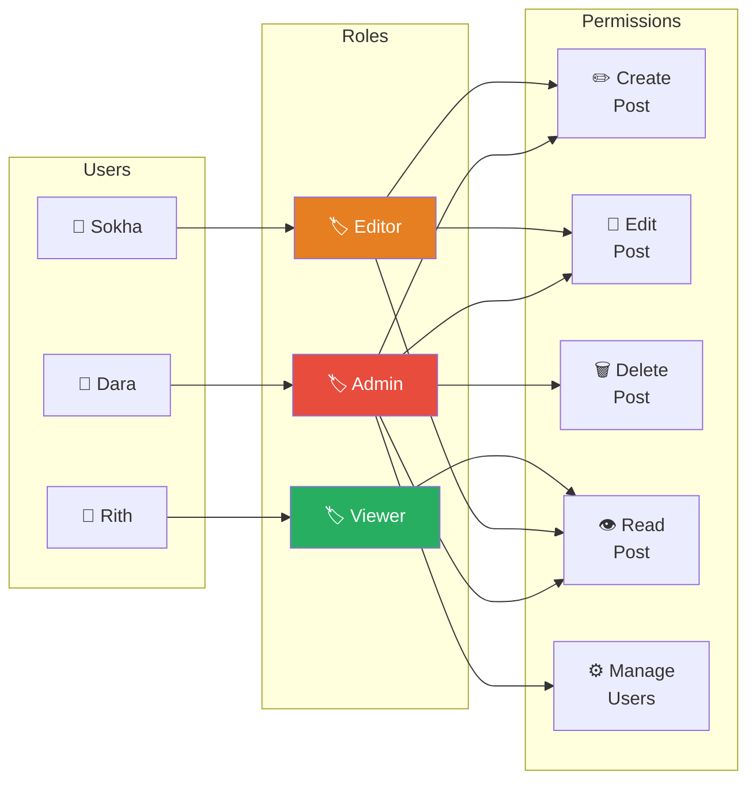
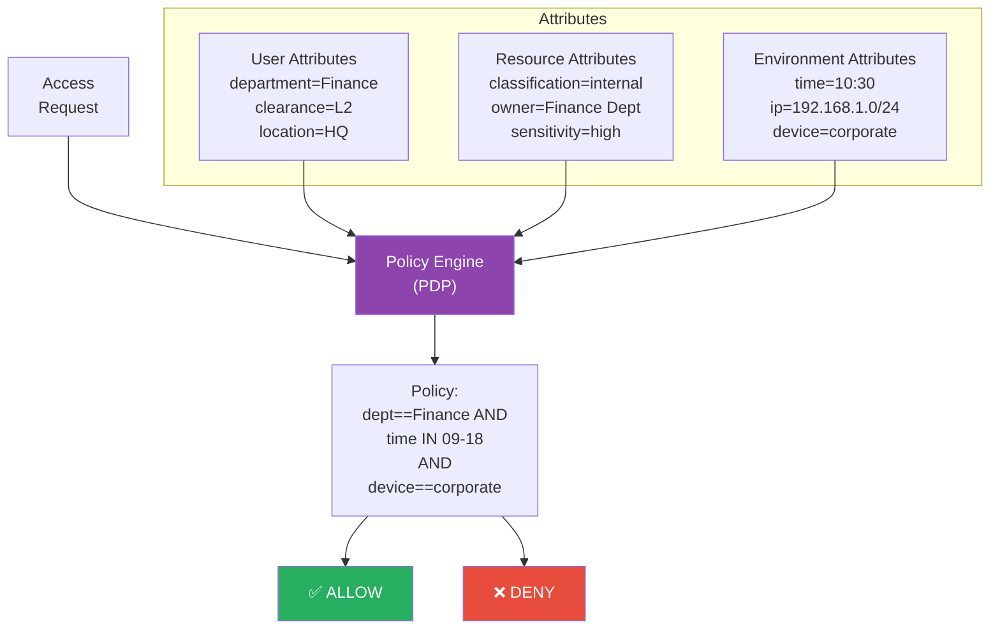
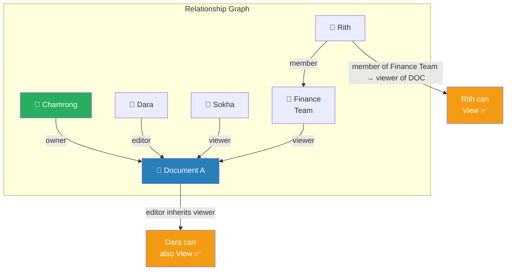
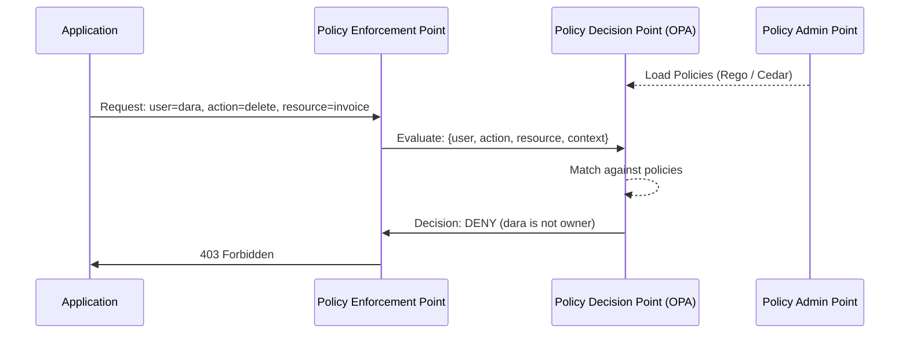
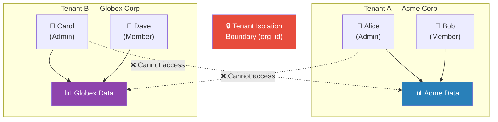
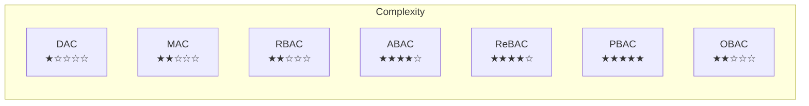
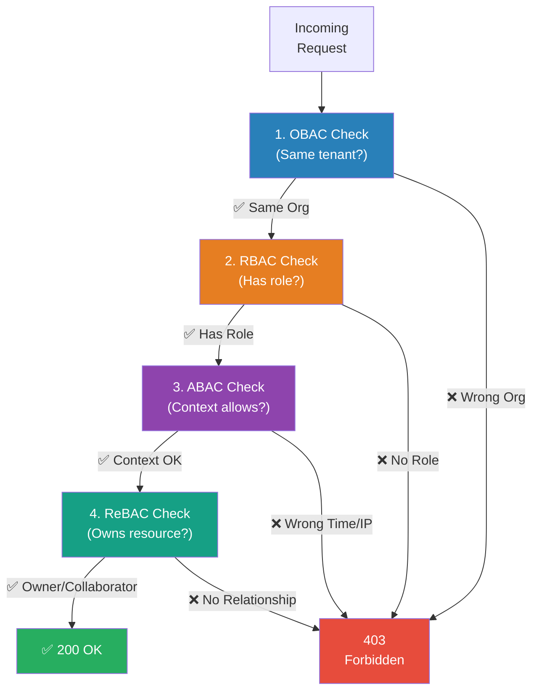

# Access Control Models: DAC, MAC, RBAC, ABAC, ReBAC, PBAC, OBAC

**Author:** ichamrong  
**Category:** Authentication Architecture  
**Read Time:** ~15 min  

---

## 📌 Table of Contents
- [The Core Question: Authorization vs Authentication](#the-core-question-authorization-vs-authentication)
- [1. DAC — Discretionary Access Control](#1-dac-discretionary-access-control)
- [2. MAC — Mandatory Access Control](#2-mac-mandatory-access-control)
- [3. RBAC — Role-Based Access Control](#3-rbac-role-based-access-control)
- [4. ABAC — Attribute-Based Access Control](#4-abac-attribute-based-access-control)
- [5. ReBAC — Relationship-Based Access Control](#5-rebac-relationship-based-access-control)
- [6. PBAC — Policy-Based Access Control](#6-pbac-policy-based-access-control)
- [7. OBAC — Organization-Based Access Control](#7-obac-organization-based-access-control)
- [Comparison & When to Use Which](#comparison-when-to-use-which)
- [Combining Models in Practice](#combining-models-in-practice)
- [References & Tools](#references-tools)

---

## The Core Question: Authorization vs Authentication

> **Authentication (AuthN):** *Who are you?* → Login, Tokens, Passwords  
> **Authorization (AuthZ):** *What are you allowed to do?* → Access Control Models

Every access control model below answers the AuthZ question differently. They are not mutually exclusive — most production systems layer two or more of them together.



---

## 1. DAC — Discretionary Access Control

**DAC** is the simplest and oldest model. The **owner of a resource decides** who can access it. Access rights are at the owner's discretion — hence *Discretionary*.

> **The Analogy:** You own a Google Doc. You decide to share it with Dara (Edit) and Sokha (View). You are the owner; it is your call. No administrator needs to approve.



### How It Works
Each resource has an **Access Control List (ACL)** — a list of subjects (users/groups) and their permitted operations. The owner modifies this list freely.

### Strengths & Weaknesses

| Strengths | Weaknesses |
|:---|:---|
| Simple to implement | No central governance — owners can grant anything |
| Flexible — owners control their own data | Audit is hard — no single view of "who has what" |
| Built into every OS (Linux `chmod`, Windows ACL) | Privilege creep — access accumulates over time |

### Where It Appears
- Linux/macOS file permissions (`chmod 755`)
- Google Drive, Dropbox sharing
- S3 Bucket ACLs

---

## 2. MAC — Mandatory Access Control

**MAC** is the opposite philosophy to DAC. Instead of the owner deciding, the **system itself enforces access** based on labels and clearance levels. No individual user can override these rules.

> **The Analogy:** A military document stamped **TOP SECRET** can only be read by personnel with **TOP SECRET clearance**. The general cannot decide to show it to a private just because he wants to. The classification label makes the decision.



### How It Works
Every subject (user) has a **clearance level** and every object (file, record) has a **classification label**. The system applies the **Bell-LaPadula model**: you can only read at or below your level (no read up), and only write at or above your level (no write down — to prevent leaking secrets into lower-classified documents).

### Strengths & Weaknesses

| Strengths | Weaknesses |
|:---|:---|
| Maximum security — no owner override | Extremely rigid and expensive to manage |
| Provably correct access decisions | Poor fit for commercial applications |
| Mandatory — users cannot accidentally share secrets | Requires classification of every resource |

### Where It Appears
- Military / Government systems (SELinux, AppArmor)
- Healthcare: document classification by sensitivity tier
- Database: column-level security labels

---

## 3. RBAC — Role-Based Access Control

**RBAC** is the most widely used model in commercial software. Instead of assigning permissions directly to users, you assign **permissions to Roles**, then assign **Roles to Users**.

> **The Analogy:** A hospital has roles: `Doctor`, `Nurse`, `Receptionist`, `Admin`. Each role has a defined set of permissions. When a new doctor joins, you assign them the `Doctor` role — they instantly get all doctor permissions. When they quit, remove the role — all permissions gone.



### How It Works
Three core concepts:
- **User → Role assignment**: Dara is assigned the `Admin` role
- **Role → Permission assignment**: `Admin` role has `delete:post` permission
- **Permission check**: When Dara tries to delete a post, system checks: does Dara's role include `delete:post`?

### RBAC Variants

| Variant | Description |
|:---|:---|
| **Flat RBAC** | Simple user → role → permission, no hierarchy |
| **Hierarchical RBAC** | Roles inherit from parent roles (`Admin` inherits all `Editor` permissions) |
| **Constrained RBAC** | Separation of Duty (SoD) — one user cannot hold two conflicting roles simultaneously |

### Strengths & Weaknesses

| Strengths | Weaknesses |
|:---|:---|
| Easy to audit — list roles per user | Role explosion — large systems end up with hundreds of roles |
| Fast permission checks | Context-blind — cannot say "only in business hours" |
| Industry standard — supported by Keycloak, Auth0, AWS IAM | Cannot express "owner of this document" without custom code |

### Where It Appears
- Keycloak, Auth0, Okta realm roles
- AWS IAM roles (`AmazonS3ReadOnlyAccess`)
- Linux `sudo` groups
- Most CMS, ERP, and SaaS admin panels

---

## 4. ABAC — Attribute-Based Access Control

**ABAC** moves beyond roles and uses **attributes** — properties of the user, the resource, and the environment — to make access decisions. Every access check evaluates a policy written in terms of these attributes.

> **The Analogy:** A bank vault allows access if: `user.department == "Finance"` AND `document.classification == "internal"` AND `environment.time >= 09:00` AND `environment.time <= 18:00`. No role alone can open it — the combination of attributes must match.



### How It Works
ABAC uses a **Policy Decision Point (PDP)** that evaluates policies against attributes:
- **Subject attributes**: `user.role`, `user.department`, `user.clearance`
- **Resource attributes**: `document.owner`, `document.sensitivity`, `record.status`
- **Environment attributes**: `request.time`, `request.ip`, `request.device`
- **Action**: `read`, `write`, `delete`, `approve`

Policy example (XACML / OPA style):
```
ALLOW if:
  subject.department == resource.department
  AND subject.clearance >= resource.sensitivity
  AND environment.time BETWEEN "09:00" AND "18:00"
  AND environment.network == "corporate"
```

### Strengths & Weaknesses

| Strengths | Weaknesses |
|:---|:---|
| Extremely fine-grained control | Complex to design, test, and debug |
| Context-aware (time, location, device) | Policy drift — policies accumulate and conflict |
| No role explosion — attributes scale naturally | Requires a PDP engine (OPA, Cedar, XACML) |
| Expresses dynamic, multi-factor conditions | Slower than RBAC — policies must be evaluated |

### Where It Appears
- AWS IAM condition keys (`aws:RequestedRegion`, `s3:prefix`)
- Open Policy Agent (OPA) with Kubernetes
- Azure AD Conditional Access Policies
- XACML-based enterprise systems

---

## 5. ReBAC — Relationship-Based Access Control

**ReBAC** grants access based on **the relationship between the user and the resource** — not roles or attributes. The canonical implementation is Google's **Zanzibar** system (which powers Google Drive, Docs, Calendar, YouTube).

> **The Analogy:** You can edit a Google Doc because you are its **owner**. Dara can comment because she is a **collaborator**. The access decision comes from the graph of relationships, not from a role called "Doc Editor."



### How It Works
Access is stored as **tuples**: `(object, relation, subject)`
```
document:A#owner@user:chamrong
document:A#editor@user:dara
document:A#viewer@group:finance
group:finance#member@user:rith
```
To check if Rith can view Document A:
1. Is `document:A#viewer@user:rith`? → No direct tuple
2. Is `document:A#viewer@group:finance`? → Yes
3. Is `group:finance#member@user:rith`? → Yes
4. **Result: ALLOW**

### Strengths & Weaknesses

| Strengths | Weaknesses |
|:---|:---|
| Natural fit for hierarchical data (Docs, Folders, Orgs) | Complex graph traversal at query time |
| Scales to billions of relations (Zanzibar processes 10M+ checks/sec) | Hard to reason about — debugging requires graph tooling |
| Expresses "sharing" semantics perfectly | Not widely supported — requires Zanzibar-compatible backend |

### Where It Appears
- Google Drive / Docs / Calendar (Zanzibar)
- **OpenFGA** (open-source Zanzibar by Okta)
- **SpiceDB** (AuthZed)
- GitHub repository collaborators

---

## 6. PBAC — Policy-Based Access Control

**PBAC** is a superset of ABAC. Where ABAC focuses on attributes, **PBAC focuses on centralized, machine-readable policies** that can express any combination of RBAC, ABAC, and ReBAC logic. The policies are the single source of truth and are decoupled from the application code.

> **The Analogy:** ABAC is a custom lock on each door. PBAC is a central security booth that holds a rulebook. Every door in the building calls the booth, which consults the rulebook and says allow or deny. The rulebook can be updated without touching the doors.



### PBAC Architecture Components

| Component | Role |
|:---|:---|
| **PAP** (Policy Administration Point) | Where admins write and manage policies |
| **PDP** (Policy Decision Point) | Evaluates policies against input and returns allow/deny |
| **PEP** (Policy Enforcement Point) | Intercepts requests and enforces PDP decisions |
| **PIP** (Policy Information Point) | Provides attribute data to the PDP at query time |

### Strengths & Weaknesses

| Strengths | Weaknesses |
|:---|:---|
| Single source of truth for all authorization logic | Adds a network hop (PDP must be fast and highly available) |
| Policies are testable, version-controlled, and auditable | Policy language has a learning curve (Rego, Cedar) |
| Decouples authZ from application code | Operational overhead of running a PDP cluster |
| Expresses any access model (RBAC + ABAC + ReBAC) | |

### Where It Appears
- **Open Policy Agent (OPA)** — Kubernetes, Envoy, Terraform
- **AWS Cedar** — Amazon Verified Permissions
- **Casbin** — Go/Java/Node open-source policy engine
- Enterprise Zero Trust architectures

---

## 7. OBAC — Organization-Based Access Control

**OBAC** scopes access to the **organizational unit (tenant, team, department, company)** the user belongs to. It is the foundational model behind every **multi-tenant SaaS** application.

> **The Analogy:** Airbnb hosts can only manage their own listings. A host from Company A cannot see Company B's listings — not because of a role check, but because every data query is scoped to `organization_id = current_user.org_id`.



### How It Works
Every row in the database carries an `org_id` (or `tenant_id`). Every query appends `WHERE org_id = :current_org`. A middleware layer enforces this automatically — no application code can "forget" it.

```sql
-- Without OBAC (dangerous — can cross tenants)
SELECT * FROM invoices WHERE id = :invoice_id;

-- With OBAC (safe — always scoped)
SELECT * FROM invoices WHERE id = :invoice_id AND org_id = :current_org_id;
```

OBAC is often combined with RBAC — you check the org boundary first (OBAC), then check the role within that org (RBAC).

### Strengths & Weaknesses

| Strengths | Weaknesses |
|:---|:---|
| Essential for multi-tenant SaaS isolation | Does not handle fine-grained resource permissions alone |
| Simple to implement via middleware / ORM scope | Cross-tenant collaboration requires explicit design |
| Prevents entire class of data leakage bugs (IDOR across tenants) | Admin/super-admin must explicitly bypass the scope |

### Where It Appears
- Every multi-tenant SaaS (Slack workspaces, Notion teams, GitHub orgs)
- Row-Level Security (RLS) in PostgreSQL
- Stripe Connect (platform vs. connected accounts)
- Keycloak realms

---

## Comparison & When to Use Which



| Model | Question Answered | Best For | Avoid When |
|:---|:---|:---|:---|
| **DAC** | Owner decides who | File systems, simple apps | Regulated industries, audit requirements |
| **MAC** | Label + clearance decides | Military, government, healthcare | Flexible commercial apps |
| **RBAC** | What role does the user have? | Most enterprise apps, CMS, ERP | Fine-grained per-resource permissions |
| **ABAC** | Do user + resource + environment attributes match? | Banking, healthcare, context-aware access | Simple apps without dynamic conditions |
| **ReBAC** | What is the user's relationship to this resource? | Drive, Docs, collaborative tools | Flat data without hierarchy |
| **PBAC** | Does the centralized policy allow this? | Large systems, Zero Trust, multi-team | Small teams without dedicated policy infra |
| **OBAC** | Are user and resource in the same org? | Multi-tenant SaaS | Single-tenant applications |

---

## Combining Models in Practice

Real-world systems almost never use a single model. The common production stack:



**Example: Google Docs**
1. **OBAC** — Are you in the same Google Workspace org? (or is it public?)
2. **RBAC** — Are you an org admin who can see all docs?
3. **ABAC** — Is the doc shared externally enabled for your account?
4. **ReBAC** — Are you the owner, editor, or commenter on this specific doc?

---

## References & Tools

| Tool | Model | Use Case |
|:---|:---|:---|
| **Keycloak** | RBAC + ABAC | Identity & role management |
| **Open Policy Agent (OPA)** | PBAC (ABAC) | Policy engine for K8s, APIs |
| **OpenFGA** | ReBAC | Zanzibar-compatible authZ |
| **SpiceDB** | ReBAC | High-scale relationship authZ |
| **AWS Cedar** | PBAC | Amazon Verified Permissions |
| **Casbin** | RBAC + ABAC + ReBAC | Embeddable policy engine |
| **PostgreSQL RLS** | OBAC | Row-level tenant isolation |

---

*Last updated: 2026-05-25*
