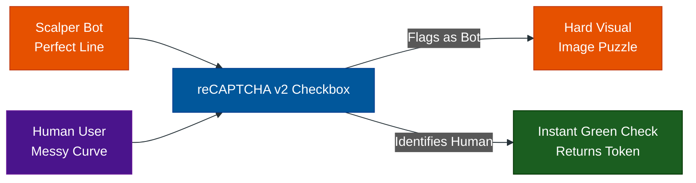

# Visual Challenges: Legacy & reCAPTCHA v2

**Author:** ichamrong  
**Category:** Security & Architecture  
**Read Time:** ~10 min  

---

## 📌 Table of Contents
- [1. The Legacy Text CAPTCHA](#1-the-legacy-text-captcha)
  - [What is it?](#what-is-it-1)
  - [Why did it fail?](#why-did-it-fail)
- [2. Google reCAPTCHA v2 ("I am not a robot")](#2-google-recaptcha-v2-i-am-not-a-robot)
  - [What is it?](#what-is-it-1)
  - [How does it actually work?](#how-does-it-actually-work)
  - [Case Study #1: Stopping Ticket Scalpers](#case-study-1-stopping-ticket-scalpers)
  - [The Downside (and Vulnerabilities) of v2](#the-downside-and-vulnerabilities-of-v2)
- [📚 References & Tools](#references-tools)

---

## 1. The Legacy Text CAPTCHA

### What is it?
In the early 2000s, to stop bots from spamming forums, websites used distorted, squiggly text images. The user had to type the letters they saw into a box.

### Why did it fail?
As Optical Character Recognition (OCR) and Machine Learning advanced, bots became *better* at reading distorted text than actual humans. The arms race caused websites to distort the text so heavily that legitimate users were locked out, resulting in massive frustration and lost revenue.

---

## 2. Google reCAPTCHA v2 ("I am not a robot")

### What is it?
Google purchased reCAPTCHA in 2009. They revolutionized the space with the "I am not a robot" checkbox. If the system was suspicious, it would present an Image Challenge: *"Select all squares with traffic lights."*

### How does it actually work?
The checkbox is a trap. Google isn't just looking at the click; they are analyzing:
- **Mouse Trajectory:** Humans move their mice in slightly erratic, curved paths. Bots teleport their cursors in perfect straight lines.
- **Browser Fingerprinting:** Google looks at your cookies, your IP address, your browser history, and whether you are logged into a Gmail account. If you are a logged-in Gmail user with 5 years of history, the checkbox instantly passes.
- **The Secret Goal:** The image challenges aren't random. Google is crowdsourcing human labor to train their AI. Choosing the traffic lights helps train Google's Waymo self-driving cars. Choosing storefront text helps train Google Maps Street View.

### Case Study #1: Stopping Ticket Scalpers
- **The Problem:** Ticketmaster releases Taylor Swift tickets. A scalping ring writes a bot script to instantly buy 10,000 tickets the millisecond the cart opens.
- **The Solution:** Ticketmaster places **reCAPTCHA v2** on the "Add to Cart" button.
- **The Result:** The bot teleports its mouse and clicks the button. Google instantly flags the robotic movement and hits the bot with a punishing visual challenge (Find the Crosswalks). The bot is stuck. Meanwhile, a real human with an erratic mouse movement gets the green checkmark and proceeds.

### The Downside (and Vulnerabilities) of v2
Despite its dominance, reCAPTCHA v2 has massive, easily exploitable vulnerabilities:

1. **The Audio Bypass Exploit:** Because Google must provide accessibility options for visually impaired users, there is a "Headphones" icon to hear an audio challenge. Bot makers wrote scripts that click the audio button, download the MP3, send it to **Google's own Speech-to-Text API**, and instantly paste the text back into the box. Bots defeated Google by using Google's own AI against them.
2. **Human Click Farms (CAPTCHA Solving Services):** Why write complex AI to defeat traffic lights when human labor is cheap? Bot developers use API services like **2Captcha**, where they pay $1 to have 1,000 CAPTCHAs solved by humans in low-wage countries. The bot intercepts the image, sends it to the API, a human clicks the traffic lights, and the API sends the valid Token back to the bot. *Visual CAPTCHAs cannot stop human click farms.*
3. **Friction:** Real users hate doing puzzles. It hurts conversion rates and frustrates legitimate customers.
4. **Privacy:** Google hoovers up massive amounts of tracking data across the web to build your profile to determine if you are human.

## 📚 References & Tools
- **Death of the CAPTCHA (W3C)** — [w3.org/TR/turingtest/](https://www.w3.org/TR/turingtest/)
- **2Captcha (Bypass Service)** — [2captcha.com](https://2captcha.com/)

---

**Navigation:** [Next: reCAPTCHA v3](./02-invisible-scoring-captchas.md) | [CAPTCHA Index](./README.md)

*Last updated: 2026-05-17*

## Related

- [DDoS Defense & Rate Limiting](../ddos-defense/README.md)
- [Anti-Spam & Trust Scoring](../anti-spam-architecture/README.md)
- [Session & Cookie Security](../session-and-cookie-security/README.md)
