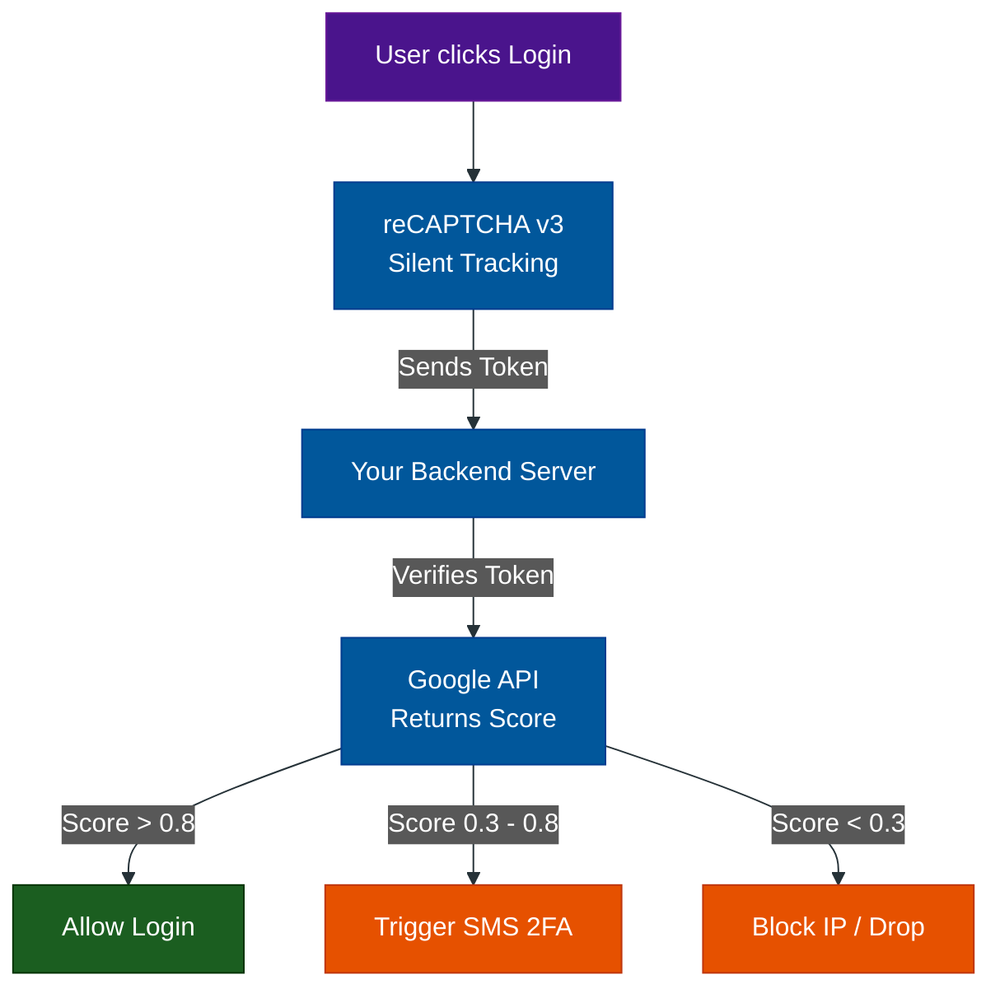

# The Invisible Scorer: reCAPTCHA v3

**Author:** ichamrong  
**Category:** Security & Architecture  
**Read Time:** ~10 min  

---

## 📌 Table of Contents
- [1. What is reCAPTCHA v3?](#1-what-is-recaptcha-v3)
- [2. How does it work?](#2-how-does-it-work)
  - [The Key Difference](#the-key-difference)
- [3. Case Study #2: E-Commerce Credential Stuffing](#3-case-study-2-e-commerce-credential-stuffing)
  - [The Downside of v3](#the-downside-of-v3)
- [📚 References & Tools](#references-tools)

---

## 1. What is reCAPTCHA v3?

Because users despised the visual puzzles of v2, Google introduced **reCAPTCHA v3**. 

Unlike v2, **v3 is completely invisible**. There is no "I am not a robot" checkbox. There are no traffic lights to click. Instead, a silent JavaScript library runs in the background of your website, monitoring the user's behavior.

## 2. How does it work?

When the user clicks the "Submit Payment" button, Google calculates a **Score** based on everything the user did leading up to that click (mouse movements, time spent reading, device fingerprint).

The score ranges from `0.0` (Definitely a Bot) to `1.0` (Definitely a Human). 

### The Key Difference
In v2, Google decides if the user is blocked. In v3, Google simply hands the Score to your backend server, and **your server must decide what to do.**

## 3. Case Study #2: E-Commerce Credential Stuffing

- **The Problem:** An E-commerce platform is under a "Credential Stuffing" attack. A botnet is taking 50,000 stolen passwords from a data breach and testing them on the login page at 1,000 requests per second. The company doesn't want to add a visual CAPTCHA because it hurts the login conversion rate for real users.
- **The Solution:** They install **reCAPTCHA v3** globally across the site.
- **The Architecture Logic:**
  - If Score `> 0.8`: The user is human. Log them in immediately.
  - If Score `< 0.3`: This is a bot. Silently drop the request or return a fake error.
  - If Score `0.3 to 0.8`: We aren't sure. Step-up authentication by sending an SMS 2FA code to their phone.

### The Downside of v3
While the UX is frictionless, the privacy concerns are massive. To get an accurate score, Google requires you to put the v3 tracking script on *every single page* of your website, not just the login page. This allows Google to map out user behavior across your entire ecosystem, feeding their advertising machine.

## 📚 References & Tools
- **reCAPTCHA v3 Docs** — [developers.google.com/recaptcha/docs/v3](https://developers.google.com/recaptcha/docs/v3)
- **Puppeteer Stealth Plugin** — [github.com/berstend/puppeteer-extra](https://github.com/berstend/puppeteer-extra)

---

**Navigation:** [Previous: Legacy & v2](./01-legacy-visual-captchas.md) | [Next: hCaptcha & Turnstile](./03-privacy-first-captchas.md) | [CAPTCHA Index](./README.md)

*Last updated: 2026-05-17*

## Related

- [DDoS Defense & Rate Limiting](../ddos-defense/README.md)
- [Anti-Spam & Trust Scoring](../anti-spam-architecture/README.md)
- [Session & Cookie Security](../session-and-cookie-security/README.md)
