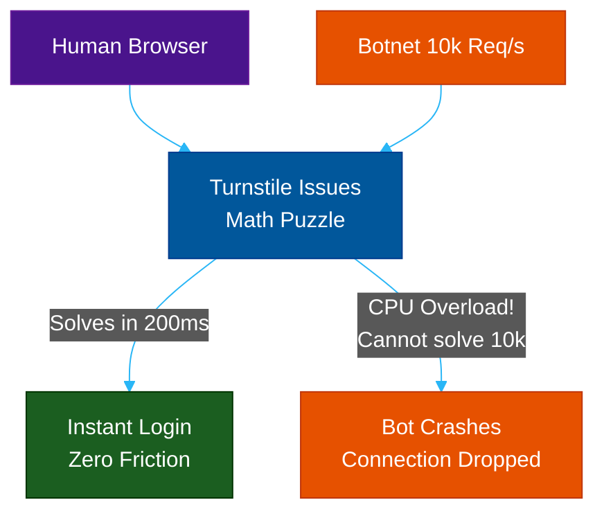

# Privacy & Frictionless: hCaptcha & Turnstile

**Author:** ichamrong  
**Category:** Security & Architecture  
**Read Time:** ~12 min  

---

## 📌 Table of Contents
- [1. hCaptcha (The Privacy-First Monetizer)](#1-hcaptcha-the-privacy-first-monetizer)
  - [What is it?](#what-is-it-1)
  - [Why use it?](#why-use-it)
  - [Case Study #3: Cloudflare Drops Google](#case-study-3-cloudflare-drops-google)
  - [The Cat-and-Mouse Game: Rotating Techniques](#the-cat-and-mouse-game-rotating-techniques)
- [2. Cloudflare Turnstile (The Cryptographic Solution)](#2-cloudflare-turnstile-the-cryptographic-solution)
  - [What is it?](#what-is-it-1)
  - [How does it work?](#how-does-it-work)
  - [Case Study #4: Frictionless Banking Login](#case-study-4-frictionless-banking-login)
- [📚 References & Tools](#references-tools)

---

As Google dominated the bot-protection market, two massive shifts occurred: companies became highly sensitive to GDPR/Privacy laws, and Google began aggressively charging enterprise customers for reCAPTCHA usage.

This created a massive opening for two major alternatives.

## 1. hCaptcha (The Privacy-First Monetizer)

### What is it?
hCaptcha is a drop-in replacement for reCAPTCHA. From the user's perspective, it looks very similar: you click a box and solve an image puzzle. However, the philosophy behind it is entirely different.

### Why use it?
1. **Privacy:** hCaptcha does not rely on massive behavioral tracking or cookie profiling to determine if you are human. It is heavily focused on GDPR and CCPA compliance.
2. **Monetization:** When users solve reCAPTCHA, Google gets free labor to train their AI. When users solve hCaptcha, hCaptcha actually *pays the website owner* a micro-transaction in cryptocurrency for the labor of labeling the AI data.

### Case Study #3: Cloudflare Drops Google
- **The Catalyst:** Historically, Cloudflare used reCAPTCHA to protect billions of edge requests. In 2020, Google changed their pricing model, which would have cost Cloudflare millions of dollars a month.
- **The Shift:** Cloudflare ripped out Google and replaced it globally with **hCaptcha**. This single move proved hCaptcha could scale to handle enterprise traffic without the privacy violations of Google.

### The Cat-and-Mouse Game: Rotating Techniques
Because bots constantly train AI models (like YOLO or OpenCV) to solve visual puzzles, massive platforms like **LinkedIn** use hCaptcha to constantly rotate the *type* of puzzle. One day users are asked to "Select the traffic lights." The next day, they must "Draw a bounding box around the boat." The next day, they must "Rotate the animal so it stands up straight." By constantly shifting the challenge format, hCaptcha prevents bot developers from training a single AI model to defeat the system.

---

## 2. Cloudflare Turnstile (The Cryptographic Solution)

### What is it?
After using hCaptcha for a few years, Cloudflare realized that *any* visual puzzle is fundamentally bad for UX and accessibility. So, they built their own competitor: **Turnstile**.

### How does it work?
Turnstile is completely invisible. It does not use visual puzzles. It does not use heavy cookie tracking. 

Instead, Turnstile uses **Cryptographic Proof of Work (PoW)** combined with **IP Reputation Tracking**. 

1. **Proof of Work:** When a browser visits a site, Turnstile silently sends a complex mathematical puzzle. A human's browser solves it in a fraction of a second. A malicious botnet attempting 10,000 requests per second is forced to solve 10,000 math puzzles, instantly maxing out its CPU and crashing the bot.
2. **Global IP Reputation:** Because Cloudflare routes 20% of the world's internet traffic, they know if a specific IP address was used to spam a different website 5 seconds ago. If your IP has a bad global reputation, Turnstile makes the math puzzle significantly harder or drops the connection entirely.

**Turnstile doesn't try to prove you are human visually. It simply makes it too expensive for bots to operate.**

### Case Study #4: Frictionless Banking Login
- **The Problem:** A major digital bank has an elderly customer base. When they used reCAPTCHA v2, elderly users couldn't see the tiny traffic lights and kept getting locked out of their accounts. When they used reCAPTCHA v3, the privacy team vetoed it due to GDPR tracking concerns.
- **The Solution:** The bank deploys **Cloudflare Turnstile**.
- **The Result:** The login page simply shows a brief "Verifying connection..." spinner. In the background, the user's browser solves a cryptographic puzzle in 200ms. The user logs in with zero visual friction, and the bank remains 100% GDPR compliant because no personal tracking data is stored.

## 📚 References & Tools
- **Cloudflare Turnstile** — [cloudflare.com/products/turnstile/](https://www.cloudflare.com/products/turnstile/)
- **hCaptcha** — [hcaptcha.com](https://www.hcaptcha.com/)

---

**Navigation:** [Previous: reCAPTCHA v3](./02-invisible-scoring-captchas.md) | [Next: Comparison Matrix](./04-captcha-comparison-matrix.md) | [CAPTCHA Index](./README.md)

*Last updated: 2026-05-17*

## Related

- [DDoS Defense & Rate Limiting](../ddos-defense/README.md)
- [Anti-Spam & Trust Scoring](../anti-spam-architecture/README.md)
- [Session & Cookie Security](../session-and-cookie-security/README.md)
