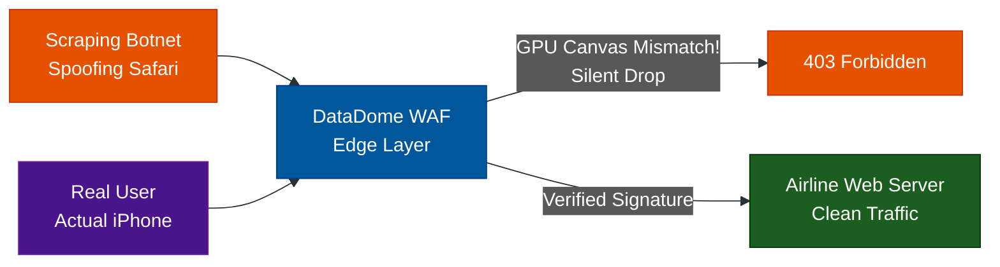

# Enterprise Bot Managers: Beyond CAPTCHA

**Author:** ichamrong  
**Category:** Security & Architecture  
**Read Time:** ~12 min  

---

## 📌 Table of Contents
- [1. The Death of the CAPTCHA](#1-the-death-of-the-captcha)
- [2. The Titans: DataDome, PerimeterX & Akamai](#2-the-titans-datadome-perimeterx-akamai)
  - [What are they?](#what-are-they)
  - [How do they work?](#how-do-they-work)
  - [Case Study #5: Airlines vs. Price Scraping Bots](#case-study-5-airlines-vs-price-scraping-bots)
- [3. reCAPTCHA Enterprise](#3-recaptcha-enterprise)
  - [What is it?](#what-is-it)
  - [How is it different from v3?](#how-is-it-different-from-v3)
- [📚 References & Tools](#references-tools)

---

## 1. The Death of the CAPTCHA

If you are running a massive Fortune 500 company (like an Airline, a global Bank, or Amazon), you do not want to show *any* user a CAPTCHA. Even invisible CAPTCHAs (like reCAPTCHA v3 or Turnstile) still rely on the frontend browser to do work. 

Modern Botnets are too smart for this. They use "Headless Browsers" (Puppeteer/Playwright) to perfectly simulate human mouse movements and solve cryptographic puzzles. To defeat them, you need **Enterprise Bot Management**.

## 2. The Titans: DataDome, PerimeterX & Akamai

### What are they?
These are not simple JavaScript widgets. These are massive Machine Learning engines that sit at the absolute Edge of your network (usually integrated directly into your WAF or Nginx proxy). 

### How do they work?
They use **Deep Fingerprinting**. Before your HTML even loads, these systems analyze:
- **TCP/IP Fingerprinting:** Is this IP address routing through a known residential proxy farm?
- **Browser Fingerprinting:** Is the GPU rendering canvas pixels exactly the same way a headless Linux server would? Does the browser claim to be Chrome on Mac, but its font-rendering engine behaves like Firefox on Windows?
- **Behavioral ML:** Is this user clicking through the checkout flow exactly 12% faster than the global average of human users?

### Case Study #5: Airlines vs. Price Scraping Bots
- **The Problem:** A major airline's website is incredibly slow. Why? Because competitor airlines and travel agencies are using massive botnets to scrape ticket prices 10,000 times a second. If the airline uses a visual CAPTCHA, real customers will get annoyed and buy from a competitor.
- **The Solution:** The airline deploys **DataDome** directly into their AWS CloudFront Edge network.
- **The Result:** DataDome analyzes the TCP signatures of incoming requests. It realizes that 80% of the traffic claiming to be "Safari on iPhone" is actually originating from an AWS data center in Frankfurt (a clear sign of a headless bot). DataDome silently drops the connection at the edge. The bot sees a `403 Forbidden` error before it ever reaches the airline's web servers. Zero CAPTCHAs are shown to humans.

---

## 3. reCAPTCHA Enterprise

### What is it?
Google realized that reCAPTCHA v3 wasn't enough for massive corporations, so they built **reCAPTCHA Enterprise**.

### How is it different from v3?
While v3 relies heavily on the frontend script, **Enterprise** allows you to feed your own backend data into Google's Machine Learning model. 
For example, if you know a user just tried 5 different credit cards that all declined, your backend server securely tells Google: *"Hey, this session ID is highly suspicious."* Google then adapts its global ML model specifically for your website. It is highly adaptive, incredibly expensive, and deeply integrated into Google Cloud.

## 📚 References & Tools
- **DataDome Bot Management** — [datadome.co](https://datadome.co/)
- **Akamai Bot Manager** — [akamai.com/products/bot-manager](https://www.akamai.com/products/bot-manager)

---

**Navigation:** [Previous: Privacy-First CAPTCHAs](./03-privacy-first-captchas.md) | [Next: Open Source & Honeypots](./05-open-source-and-honeypots.md) | [CAPTCHA Index](./README.md)

*Last updated: 2026-05-17*

## Related

- [DDoS Defense & Rate Limiting](../ddos-defense/README.md)
- [Anti-Spam & Trust Scoring](../anti-spam-architecture/README.md)
- [Session & Cookie Security](../session-and-cookie-security/README.md)
