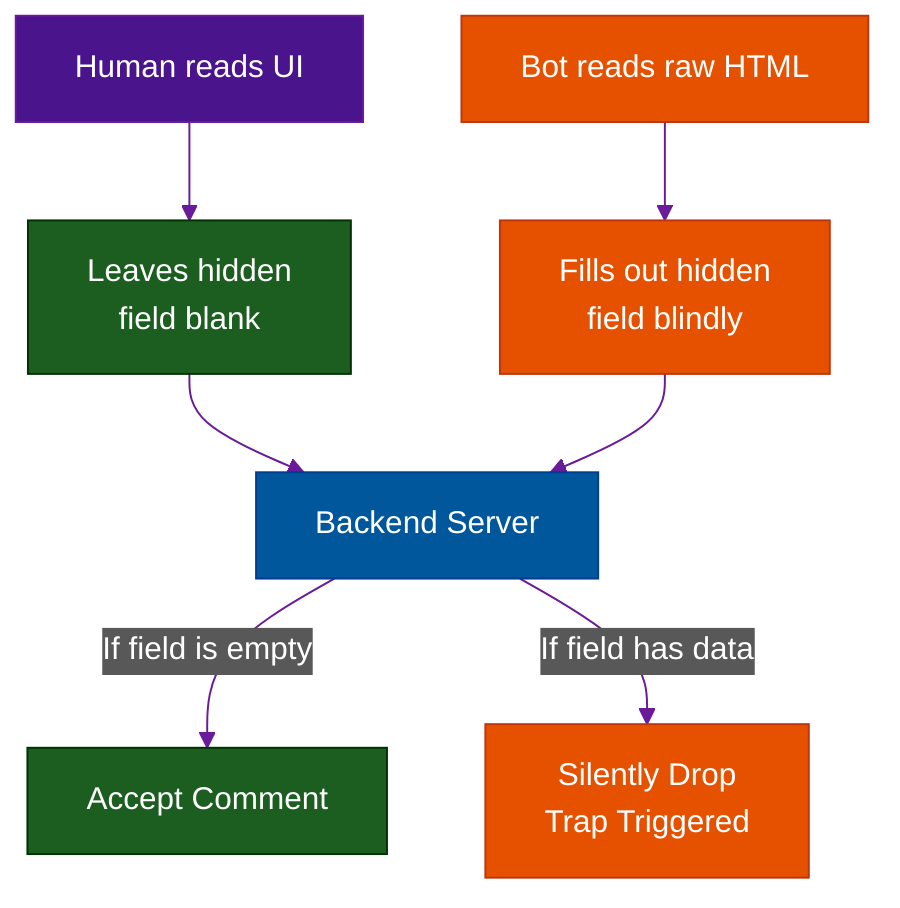

# Open Source PoW & The Classic Honeypot

**Author:** ichamrong  
**Category:** Security & Architecture  
**Read Time:** ~10 min  

---

## 📌 Table of Contents
- [1. Altcha (Self-Hosted Proof of Work)](#1-altcha-self-hosted-proof-of-work)
  - [What is it?](#what-is-it-1)
  - [Why use it?](#why-use-it)
  - [How does it work?](#how-does-it-work-1)
- [2. The Classic CSS Honeypot](#2-the-classic-css-honeypot)
  - [What is it?](#what-is-it-1)
  - [How does it work?](#how-does-it-work-1)
  - [Case Study #6: Zero-JS WordPress Spam Protection](#case-study-6-zero-js-wordpress-spam-protection)
- [📚 References & Tools](#references-tools)

---

If you are a startup, a blog, or a developer who refuses to hand over user data to giant corporations like Google (reCAPTCHA) or Cloudflare (Turnstile), you have two incredibly powerful, self-hosted alternatives.

## 1. Altcha (Self-Hosted Proof of Work)

### What is it?
Altcha is an open-source alternative to Cloudflare Turnstile. It operates on the exact same principle: **Cryptographic Proof of Work (PoW)**. 

### Why use it?
Turnstile requires you to load a JavaScript file from Cloudflare's servers. This means Cloudflare knows the IP address of every user who visits your site. 
**Altcha is 100% self-hosted.** You run the Altcha library directly on your own Node.js/Go backend. There are no third-party tracking cookies, no GDPR headaches, and no external dependencies. 

### How does it work?
Your backend server generates a complex random number challenge. The user's browser must use its CPU to guess the answer (mining). Once the browser finds the answer, it submits it with the form. Your backend instantly verifies the math. Bots get stuck wasting CPU cycles, and real users notice nothing.

---

## 2. The Classic CSS Honeypot

### What is it?
Sometimes, the oldest tricks are still the best. A "Honeypot" is a trap designed specifically to catch automated bots by exploiting how they interact with HTML.

### How does it work?
Bots do not have eyes. They do not render CSS visually. They simply read the raw HTML DOM and fill out every `<input>` field they can find to spam your database.

You create an `<input type="text" name="phone_number">` field on your registration form. However, you use CSS to make it completely invisible to humans (`display: none;` or `opacity: 0; position: absolute; left: -9999px;`).

- A **Human** will never see the field, so they will leave it blank.
- A **Bot** will read the HTML, see an input named "phone_number", and automatically fill it with fake data.

When the form is submitted to your backend, you simply check: `if (body.phone_number !== "") { return ERROR }`. 

### Case Study #6: Zero-JS WordPress Spam Protection
- **The Problem:** A massively popular WordPress blog is getting 500 spam comments an hour. The owner refuses to add reCAPTCHA because the JavaScript slows down the page load speed (hurting SEO), and they don't want to annoy their readers with puzzles.
- **The Solution:** The owner edits the PHP template and adds a **CSS Honeypot** field named `website_url_2`. 
- **The Result:** The spam bots blindly fill out the hidden `website_url_2` field. The backend PHP script silently drops any comment where that field is filled. Spam drops by 99% instantly. Page load speed remains lightning fast, and humans experience zero friction.

## 📚 References & Tools
- **FingerprintJS (Open Source)** — [github.com/fingerprintjs/fingerprintjs](https://github.com/fingerprintjs/fingerprintjs)
- **Project Honeypot** — [projecthoneypot.org](https://www.projecthoneypot.org/)

---

**Navigation:** [Previous: Enterprise Bot Managers](./04-enterprise-bot-managers.md) | [Next: Comparison Matrix](./06-captcha-comparison-matrix.md) | [CAPTCHA Index](./README.md)

*Last updated: 2026-05-17*

## Related

- [DDoS Defense & Rate Limiting](../ddos-defense/README.md)
- [Anti-Spam & Trust Scoring](../anti-spam-architecture/README.md)
- [Session & Cookie Security](../session-and-cookie-security/README.md)
