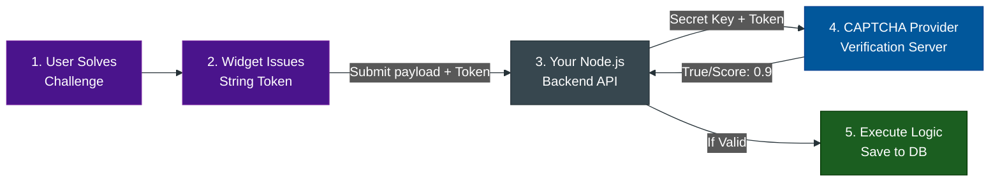

# CAPTCHA Comparison Matrix

**Author:** ichamrong  
**Category:** Security & Architecture  
**Read Time:** ~5 min  

---

## 📌 Table of Contents
- [1. The Decision Matrix](#1-the-decision-matrix)
- [2. The Architectural Integration Flow](#2-the-architectural-integration-flow)
- [📚 References & Tools](#references-tools)

---

## 1. The Decision Matrix

When architecting a public-facing application (Login, Registration, Checkout), choosing the right bot protection involves balancing Security, Privacy (GDPR), and User Experience (UX).

| Technology | Core Mechanism | UX Friction | Privacy / Tracking | Best Use Case |
| :--- | :--- | :--- | :--- | :--- |
| **reCAPTCHA v2** | Visual Puzzles (Traffic Lights) | **High.** Users hate puzzles. | **High.** Tracks Google cookies to bypass puzzles. | Legacy systems, or when you explicitly want to slow down human abusers. |
| **reCAPTCHA v3** | Silent Behavioral Scoring (0.0 to 1.0) | **Zero.** Completely invisible. | **Extreme.** Google tracks mouse movement across all pages. | Modern E-commerce where a backend server can dynamically trigger SMS 2FA based on score. |
| **hCaptcha** | Visual Puzzles (Privacy Focused) | **High.** Sometimes harder than Google's puzzles. | **Low.** GDPR/CCPA compliant. Does not track identity. | Sites prioritizing GDPR compliance, or sites looking to monetize bot-traffic. |
| **Turnstile** | Cryptographic Proof of Work (PoW) | **Zero.** "Verifying connection..." spinner. | **Low.** Does not use behavioral tracking or cookies. | Modern SaaS, Banking, or any app needing absolute zero UX friction while remaining GDPR compliant. |
| **DataDome / Akamai** | Deep Browser Fingerprinting at Edge | **Zero.** Blocked at WAF layer. | **Medium.** Analyzes deep hardware/network metrics. | Fortune 500s (Airlines, Banks) stopping massive scraping networks. |
| **Altcha** | Self-Hosted Proof of Work | **Zero.** Solved in background. | **Ultimate.** Zero third-party scripts. | Open-source purists and highly strict government/healthcare apps. |
| **CSS Honeypot** | Invisible Trap Fields in HTML | **Zero.** Humans never see it. | **Ultimate.** No JS required. | Simple blogs, contact forms, and static sites wanting zero overhead. |

---

## 2. The Architectural Integration Flow

No matter which CAPTCHA provider you choose from the matrix above, your backend implementation must follow this strict verification pipeline to be secure.

**Crucial Security Warning:** 
Many junior developers implement the CAPTCHA widget on the frontend and use JavaScript to simply disable the "Submit" button until the CAPTCHA is solved. **This is useless.** A bot does not use a browser; it sends raw cURL HTTP requests directly to your backend API, completely bypassing the disabled frontend button. You *must* verify the token on the backend server.

## 📚 References & Tools
- **OWASP Automated Threat Handbook** — [owasp.org/www-project-automated-threats-to-web-applications/](https://owasp.org/www-project-automated-threats-to-web-applications/)
- **Cloudflare Bot Fight Mode** — [cloudflare.com/products/bot-management/](https://www.cloudflare.com/products/bot-management/)

---

**Navigation:** [Previous: Open Source & Honeypots](./05-open-source-and-honeypots.md) | [CAPTCHA Index](./README.md)

*Last updated: 2026-05-17*

## Related

- [DDoS Defense & Rate Limiting](../ddos-defense/README.md)
- [Anti-Spam & Trust Scoring](../anti-spam-architecture/README.md)
- [Session & Cookie Security](../session-and-cookie-security/README.md)
