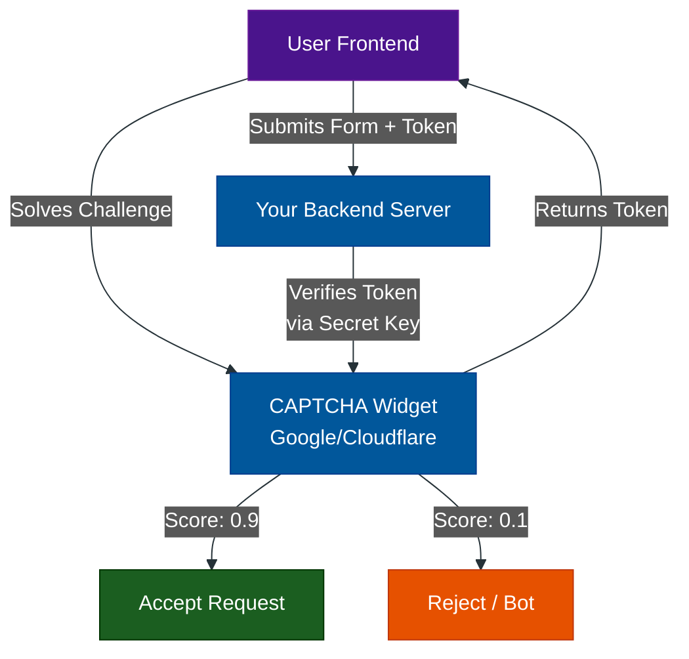

# The War on Bots: CAPTCHA Evolution

**Author:** ichamrong  
**Category:** Security & Architecture  
**Read Time:** ~5 min  

---

## 1. The Turing Test

**CAPTCHA** stands for *Completely Automated Public Turing test to tell Computers and Humans Apart*. 

As the internet has evolved, so has the sophistication of malicious bots. What started as simple scripts trying to spam blog comments has evolved into massive, AI-driven botnets attempting Credential Stuffing, Ticket Scalping, and DDoS attacks. 

To stop them, the industry has evolved from frustrating visual puzzles to invisible, privacy-first cryptographic challenges.

## 2. The Bot Protection Library

This documentation suite breaks down the major CAPTCHA systems in the world, how they actually work under the hood, and how to choose the right one for your architecture.

| Category | Technologies Covered | Document |
| :--- | :--- | :--- |
| **1. The Visual Challenges** | Legacy Text, reCAPTCHA v2 | [View Guide](./01-legacy-visual-captchas.md) |
| **2. The Invisible Scorers** | reCAPTCHA v3 | [View Guide](./02-invisible-scoring-captchas.md) |
| **3. Privacy & Frictionless** | hCaptcha, Cloudflare Turnstile | [View Guide](./03-privacy-first-captchas.md) |
| **4. Enterprise Bot Managers** | DataDome, Akamai, reCAPTCHA Enterprise | [View Guide](./04-enterprise-bot-managers.md) |
| **5. Open Source & Honeypots** | Altcha (Self-Hosted PoW), CSS Honeypots | [View Guide](./05-open-source-and-honeypots.md) |
| **6. The Master Comparison** | Summary Matrix & Architecture Flow | [View Matrix](./06-captcha-comparison-matrix.md) |

---

## 3. The Core Architecture

Regardless of which CAPTCHA you choose, the architectural implementation is almost always identical. It is a two-step verification process:

1. **The Frontend Challenge:** The user solves the CAPTCHA (or it runs invisibly in their browser). The CAPTCHA provider returns a temporary string called a **Token**.
2. **The Backend Verification:** The user submits the form with the Token. Your backend server takes that Token and securely pings the CAPTCHA provider's server via a Secret Key to ask, "Is this Token valid?" 

*Never trust the frontend. If you don't verify the token on the backend, a bot can just bypass the CAPTCHA entirely.*

---

*Last updated: 2026-05-17*
