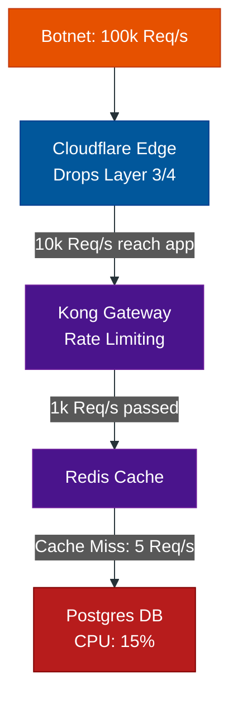

# The Anatomy of a DDoS: Layers & Tools

**Author:** ichamrong  
**Category:** Security & Architecture  
**Read Time:** ~10 min  

---

## 📌 Table of Contents
- [1. Layer 3 & Layer 4: Volumetric Attacks](#1-layer-3-layer-4-volumetric-attacks)
- [2. Layer 7: The Application Attack](#2-layer-7-the-application-attack)
- [📚 References & Tools](#references-tools)

---

To properly defend an architecture, you must understand the two fundamentally different types of DDoS attacks. 

## 1. Layer 3 & Layer 4: Volumetric Attacks
**The Goal:** Overwhelm the physical network pipes. If your data center has a 10 Gigabit per second (Gbps) internet connection, the attacker sends 100 Gbps of garbage data. Your pipe gets clogged, and legitimate traffic cannot enter.

**The Tools:** 
- **Mirai Botnet:** Attackers hack hundreds of thousands of cheap IoT devices (security cameras, smart fridges) that have default passwords, forming a massive botnet to blast UDP traffic simultaneously.
- **Amplification Attacks:** The attacker sends a 1-byte request to a vulnerable DNS or NTP server on the internet, spoofing *your* IP address as the return address. The server responds with a 50-byte payload to your server. The attacker has just "amplified" their attack power by 50x.

**The Architectural Defense: Anycast Edges**
You cannot stop a 1 Tbps volumetric attack with Nginx or a single Linux server. The data will clog the ISP before it even reaches your server. 
The *only* defense is an **Anycast Edge Network** (like Cloudflare or AWS Shield). These providers have thousands of data centers globally. When a 1 Tbps attack hits, Cloudflare absorbs the traffic locally in 150 different countries, breaking the massive attack down into harmless chunks of 6 Gbps per data center.

---

## 2. Layer 7: The Application Attack
**The Goal:** Overwhelm the CPU or Database. The attacker is not trying to fill the bandwidth pipe. Instead, they send perfectly valid HTTP requests to the most "expensive" endpoint on your application.

**The Execution:** If an attacker sends 1,000 requests per second to your `/search` endpoint, it forces your Postgres database to execute 1,000 complex `LIKE %query%` SQL operations per second. Your database CPU hits 100% and the server crashes.

**The Tools:**
- **LOIC (Low Orbit Ion Cannon):** A classic, simple tool that blasts HTTP GET requests.
- **Headless Botnets:** Modern attackers use networks of Puppeteer/Playwright instances to perfectly simulate human browsers, clicking search buttons to trigger heavy backend processes.

**The Architectural Defense: API Gateways & Caching**
To survive Layer 7, you must stop the requests *before* they reach the database.
1. **Aggressive Caching:** Put Redis or Varnish in front of the database. If the attacker queries the same search term 1,000 times, the database is only hit once. The cache serves the other 999 from RAM.
2. **Gateway Rate Limiting:** Use Kong or HAProxy to strictly limit users to 5 searches per minute.

## 📚 References & Tools
- **Cloudflare Anycast Network** — [cloudflare.com/network](https://www.cloudflare.com/network/)
- **AWS Shield Advanced** — [aws.amazon.com/shield](https://aws.amazon.com/shield/)
- **Mirai Botnet Analysis** — [us-cert.cisa.gov/ncas/alerts/TA16-288A](https://www.cisa.gov/uscert/ncas/alerts/TA16-288A)

---

**Navigation:** [Next: Dynamic Proxy Attacks](./02-dynamic-proxy-attacks.md) | [DDoS Index](./README.md)

*Last updated: 2026-05-17*

## Related

- [Bot Protection & CAPTCHAs](../bot-protection/README.md)
- [Session & Cookie Security](../session-and-cookie-security/README.md)
- [API Gateways & Reverse Proxies](../../devops/api-gateways/README.md)
