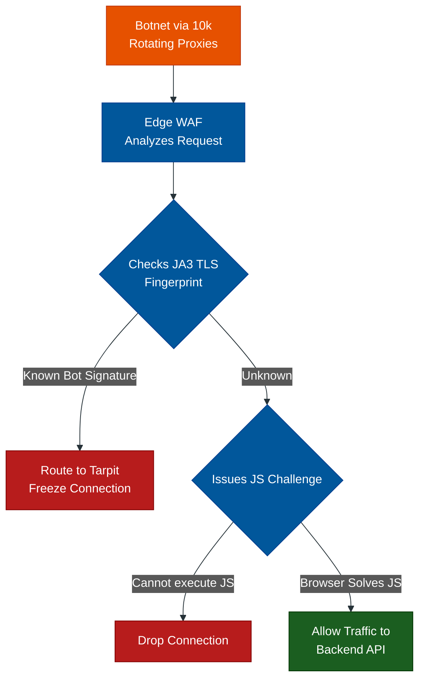

# Defeating Dynamic Round-Robin Proxies

**Author:** ichamrong  
**Category:** Security & Architecture  
**Read Time:** ~12 min  

---

## 📌 Table of Contents
- [1. The Ultimate Threat: Rotating Residential Proxies](#1-the-ultimate-threat-rotating-residential-proxies)
- [2. Architectural Defenses Against Proxy Swarms](#2-architectural-defenses-against-proxy-swarms)
  - [A. The Global JS Challenge (Cloudflare "Under Attack" Mode)](#a-the-global-js-challenge-cloudflare-under-attack-mode)
  - [B. Deep TLS Fingerprinting (JA3 Signatures)](#b-deep-tls-fingerprinting-ja3-signatures)
  - [C. ASN & Datacenter Blocking](#c-asn-datacenter-blocking)
  - [D. The Dynamic Tarpit](#d-the-dynamic-tarpit)
- [📚 References & Tools](#references-tools)

---

## 1. The Ultimate Threat: Rotating Residential Proxies

When defending against a Layer 7 DDoS attack, developers usually rely on IP-based Rate Limiting (e.g., *"Ban any IP that sends more than 100 requests a minute"*).

**Advanced attackers know this.** To bypass it, they rent access to massive "Residential Proxy Networks" (like BrightData or Oxylabs). These networks consist of millions of hacked IoT devices or home routers across the globe. 

The attacker configures their attack tool to use a **Dynamic Round-Robin Proxy**. 
- Request 1 comes from a home in Texas.
- Request 2 comes from an iPhone in Tokyo.
- Request 3 comes from a coffee shop in London.

**Why Traditional Defense Fails:** 
If the attacker launches 10,000 requests per second, your Nginx rate limiter sees 10,000 *different* IP addresses, each sending exactly 1 request. Nginx assumes these are 10,000 normal, independent humans and allows the attack through, crashing your database.

---

## 2. Architectural Defenses Against Proxy Swarms

When IP addresses become meaningless, you must shift your defense strategy to **Behavioral Analysis** and **Client Verification**.

### A. The Global JS Challenge (Cloudflare "Under Attack" Mode)
Bots written in Python (`requests`) or Go (`http`) are fast, but they are not real browsers. They cannot execute JavaScript. 
When a dynamic proxy attack begins, you instantly toggle your WAF to force a JS Challenge (or Cryptographic Turnstile) on every single connection. 
- A real human visits the site, their browser solves the math in 2 seconds, and they get a valid session cookie.
- The Python proxy bot receives the math problem, crashes because it doesn't have a JavaScript V8 engine, and is dropped at the edge. 

### B. Deep TLS Fingerprinting (JA3 Signatures)
Even if the attacker changes their IP address 10,000 times, the underlying script they wrote (e.g., a Python script using the `urllib` library) negotiates SSL/TLS encryption in a very specific, mathematical way. 
Enterprise WAFs (like Cloudflare or DataDome) calculate a **JA3 Fingerprint** based on how the client encrypts the connection. If you see 10,000 requests coming from 10,000 different IPs, but they all share the exact same rare Python JA3 fingerprint, you block the *Fingerprint*, not the IP.

### C. ASN & Datacenter Blocking
Many cheap proxy networks don't actually use residential homes; they use cheap rented servers in Datacenters (AWS, DigitalOcean, OVH). 
Real grandmothers do not browse Facebook from an AWS Datacenter. Your firewall should automatically challenge or block traffic originating from known Cloud Provider ASNs (Autonomous System Numbers). This forces the attacker to buy highly expensive "True Residential" proxies, destroying their ROI.

### D. The Dynamic Tarpit
If an attacker uses a massive proxy pool, they pay their proxy provider *per gigabyte of bandwidth* or *per minute of connection time*.
Instead of returning a `429 Too Many Requests` (which frees up the attacker's thread to attack again instantly), you route the malicious proxy to an API Tarpit. The server holds the connection open and sends 1 byte every 30 seconds. This ties up the attacker's threads, crashes their scripts, and massively inflates their proxy billing costs. 

## 📚 References & Tools
- **JA3 TLS Fingerprinting** — [github.com/salesforce/ja3](https://github.com/salesforce/ja3)
- **FingerprintJS** — [fingerprint.com](https://fingerprint.com)
- **Nginx map module (for routing)** — [nginx.org/en/docs/http/ngx_http_map_module.html](http://nginx.org/en/docs/http/ngx_http_map_module.html)

---

**Navigation:** [Previous: The Anatomy of a DDoS](./01-the-anatomy-of-a-ddos.md) | [DDoS Index](./README.md)

*Last updated: 2026-05-17*

## Related

- [Bot Protection & CAPTCHAs](../bot-protection/README.md)
- [Session & Cookie Security](../session-and-cookie-security/README.md)
- [API Gateways & Reverse Proxies](../../devops/api-gateways/README.md)
