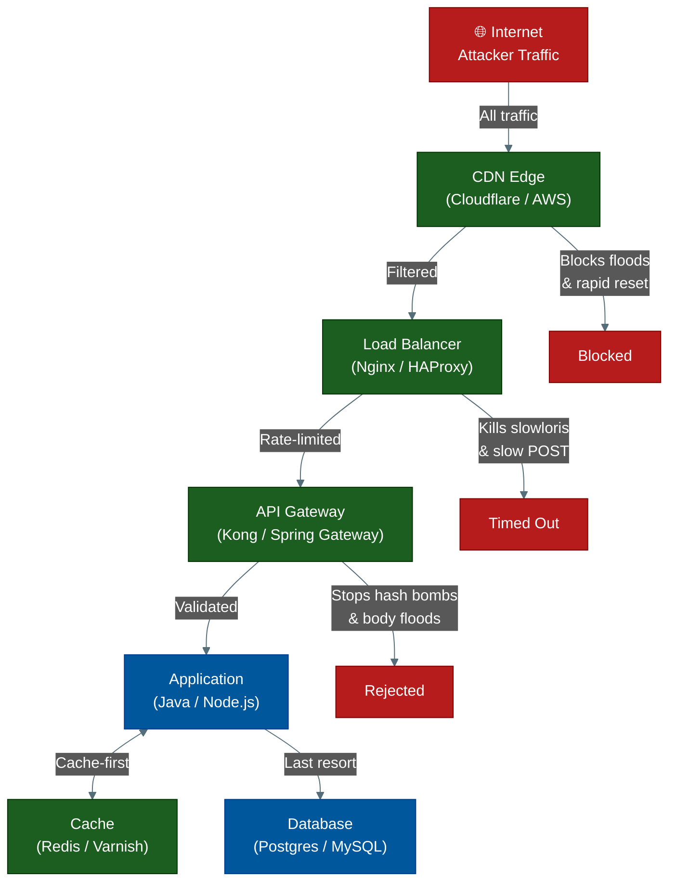
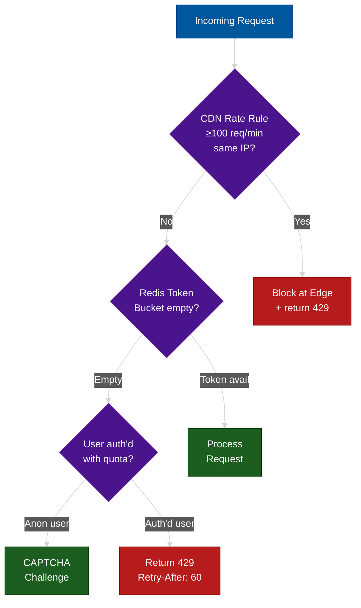
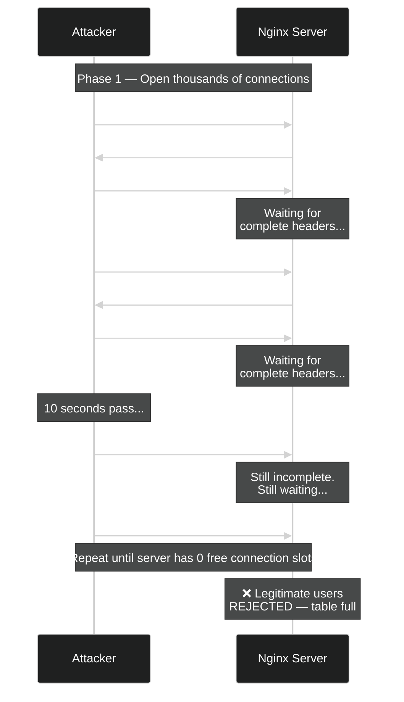
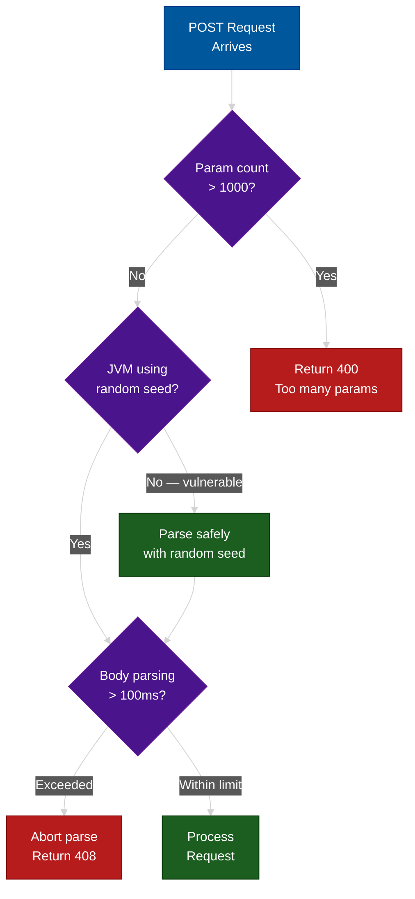
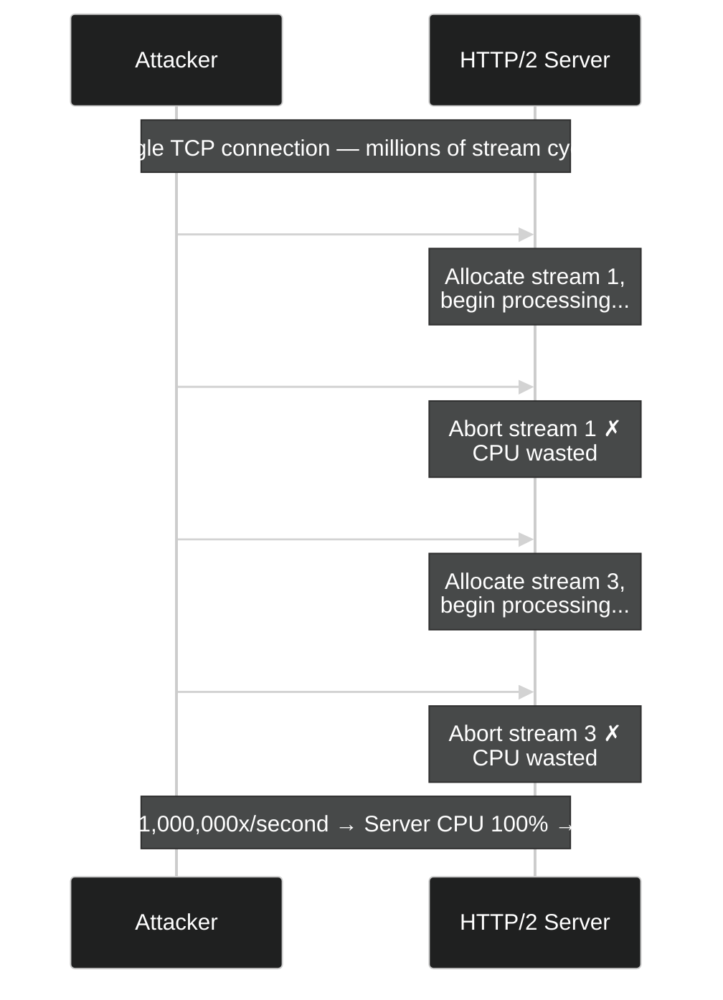

# HTTP Layer 7 DDoS Defense: Every Attack, Every Defense

**Author:** ichamrong
**Category:** Security & Architecture
**Read Time:** ~20 min

---

## 📌 Table of Contents
- [Overview: The Defense Perimeter](#overview-the-defense-perimeter)
- [1. HTTP Flood (GET & POST)](#1-http-flood-get-post)
  - [Attack Mechanism](#attack-mechanism-7)
  - [Defense Architecture](#defense-architecture-7)
- [2. Slowloris Attack](#2-slowloris-attack)
  - [Attack Mechanism](#attack-mechanism-7)
  - [Defense Architecture](#defense-architecture-7)
- [3. Slow POST (R.U.D.Y. Attack)](#3-slow-post-rudy-attack)
  - [Attack Mechanism](#attack-mechanism-7)
  - [Defense Architecture](#defense-architecture-7)
- [4. Hash Collision / Algorithmic Complexity Attack](#4-hash-collision-algorithmic-complexity-attack)
  - [Attack Mechanism](#attack-mechanism-7)
  - [Defense Architecture](#defense-architecture-7)
- [5. Cache Busting](#5-cache-busting)
  - [Attack Mechanism](#attack-mechanism-7)
  - [Defense Architecture](#defense-architecture-7)
- [6. HTTP/2 Rapid Reset Attack (CVE-2023-44487)](#6-http2-rapid-reset-attack-cve-2023-44487)
  - [Attack Mechanism](#attack-mechanism-7)
  - [Defense Architecture](#defense-architecture-7)
- [7. ZIP Bomb / Response Expansion](#7-zip-bomb-response-expansion)
  - [Attack Mechanism](#attack-mechanism-7)
  - [Defense Architecture](#defense-architecture-7)
- [8. Large Request Body Attack](#8-large-request-body-attack)
  - [Attack Mechanism](#attack-mechanism-7)
  - [Defense Architecture](#defense-architecture-7)
- [Defense Checklist: Production Configuration](#defense-checklist-production-configuration)
- [Complete Nginx Hardened Configuration](#complete-nginx-hardened-configuration)
- [The Attacker's Cost vs. Your Defense Cost](#the-attackers-cost-vs-your-defense-cost)
- [📚 References & Tools](#references-tools)

---

Layer 7 DDoS attacks are a war of asymmetry. The attacker spends 1 millisecond crafting a request. Your server spends 500 milliseconds processing it. The attacker wins by mathematics alone — unless you understand exactly how each weapon works and where to cut the kill chain.

This lecture covers every major HTTP-layer attack: the mechanism first, then the precise architectural defense.

---

## Overview: The Defense Perimeter

Before diving into each attack, understand the layers at which you can intercept:



Each subsequent section maps one attack type to one or more layers on this diagram.

---

## 1. HTTP Flood (GET & POST)

### Attack Mechanism

The HTTP Flood is the most straightforward Layer 7 weapon. The attacker sends millions of syntactically valid HTTP requests to a computationally expensive endpoint. No malware is needed — a simple scripted loop is sufficient.

```
[Botnet Node 1] ──────┐
[Botnet Node 2] ──────┤──→ GET /search?q=laptop 1,000,000x ──→ [Your Server 💀]
[Botnet Node 3] ──────┤
[Botnet Node 4] ──────┘
```

Three variants exist, each defeating a different naive defense:

**Variant A — Cacheable URL Flood**
```
GET /products/shoes HTTP/1.1
```
Targets a URL that a CDN *should* cache, but the attacker probes before your cache is warm or targets URLs just outside your cache rules.

**Variant B — Cache-Busting Flood**
```
GET /products/shoes?r=a1b2c3 HTTP/1.1
GET /products/shoes?r=d4e5f6 HTTP/1.1
GET /products/shoes?r=g7h8i9 HTTP/1.1
```
The attacker appends a unique random query parameter to every single request. The CDN sees each as a distinct cache key — a cache miss every time. Every request hits your origin database. This is covered in depth in Section 5.

**Variant C — POST Body Flood**
```
POST /api/search HTTP/1.1
Content-Type: application/json

{"query": "laptop", "filters": {"brand": "...", "price": {...}}}
```
POST requests cannot be cached. The attacker hits your most expensive write or search endpoint.

### Defense Architecture

The defense operates on three tiers simultaneously:



**Nginx rate limiting (Tier 1 — connection layer):**

```nginx
# nginx.conf

# Define shared memory zone: 10MB stores ~160,000 IP states
limit_req_zone $binary_remote_addr zone=per_ip:10m rate=30r/m;

# Stricter zone for expensive endpoints
limit_req_zone $binary_remote_addr zone=search_ip:10m rate=5r/m;

server {
    location /api/search {
        limit_req zone=search_ip burst=10 nodelay;
        limit_req_status 429;
        add_header Retry-After 60;
        proxy_pass http://backend;
    }

    location / {
        limit_req zone=per_ip burst=20 nodelay;
        limit_req_status 429;
        proxy_pass http://backend;
    }
}
```

**Redis Token Bucket (Tier 2 — application layer):**

```java
@Service
public class RateLimitService {

    private final StringRedisTemplate redis;

    // Token bucket: 10 tokens, refill 1 per second
    private static final int CAPACITY = 10;
    private static final int REFILL_RATE_PER_SEC = 1;

    public boolean isAllowed(String clientIp, String endpoint) {
        String key = "ratelimit:" + endpoint + ":" + clientIp;
        long now = Instant.now().getEpochSecond();

        List<Object> result = redis.execute(new SessionCallback<>() {
            @Override
            public List<Object> execute(RedisOperations ops) {
                ops.multi();
                ops.opsForHash().multiGet(key, List.of("tokens", "last"));
                ops.expire(key, Duration.ofMinutes(5));
                return ops.exec();
            }
        });

        List<?> fields = (List<?>) result.get(0);
        double tokens = fields.get(0) != null
            ? Double.parseDouble(fields.get(0).toString()) : CAPACITY;
        long last = fields.get(1) != null
            ? Long.parseLong(fields.get(1).toString()) : now;

        // Refill tokens based on elapsed time
        long elapsed = now - last;
        tokens = Math.min(CAPACITY, tokens + elapsed * REFILL_RATE_PER_SEC);

        if (tokens < 1) {
            return false; // Rate limit exceeded
        }

        // Consume one token and persist
        double remaining = tokens - 1;
        redis.opsForHash().put(key, "tokens", String.valueOf(remaining));
        redis.opsForHash().put(key, "last", String.valueOf(now));
        return true;
    }
}
```

**Spring Boot filter wiring:**

```java
@Component
@Order(1)
public class RateLimitFilter extends OncePerRequestFilter {

    @Autowired private RateLimitService rateLimitService;

    @Override
    protected void doFilterInternal(HttpServletRequest req,
            HttpServletResponse res, FilterChain chain)
            throws ServletException, IOException {

        String ip = req.getRemoteAddr();
        String path = req.getRequestURI();

        if (!rateLimitService.isAllowed(ip, path)) {
            res.setStatus(HttpStatus.TOO_MANY_REQUESTS.value());
            res.setHeader("Retry-After", "60");
            res.getWriter().write("{\"error\": \"rate_limit_exceeded\"}");
            return;
        }
        chain.doFilter(req, res);
    }
}
```

**Cloudflare Rate Limiting Rule (Tier 0 — edge):**

```
Rule: HTTP Flood Protection
Expression: (http.request.uri.path contains "/api/search")
Action: Block
Rate: 10 requests per 1 minute
Matching on: IP
```

---

## 2. Slowloris Attack

### Attack Mechanism

Slowloris, published by Robert Hansen in 2009, is elegant in its brutality. It does not flood your bandwidth. It consumes your server's **finite connection table** — one deliberately incomplete HTTP request at a time.



**How Slowloris drip-feeds headers (conceptual pseudocode):**

```
# Attacker's loop — one persistent socket per connection
open_socket to target:80
send "GET / HTTP/1.1\r\n"          # Start but never finish headers
loop forever:
    wait 10 seconds
    send "X-Padding: [random]\r\n"  # Keeps server waiting, resets idle timer
    # Server's client_header_timeout restarts — never reaches the limit
```

The server's default `client_header_timeout` is often 60 seconds. With 1,000 sockets each being "refreshed" every 10 seconds, the attacker holds all connection slots indefinitely for almost zero bandwidth cost.

### Defense Architecture

```
Attack:   1,000 connections × 1 byte/10s = ~100 bytes/second total bandwidth
Defense:  Reduce timeout from 60s → 5s, limit connections per IP to 10
Result:   Attacker cannot keep connections alive → forced to reconnect constantly
```

**Nginx configuration (the critical fix):**

```nginx
# nginx.conf

events {
    worker_connections 10240;  # Ensure capacity for legitimate users
}

http {
    # CRITICAL: Reduce header timeout from default 60s to 5s
    # Attacker cannot keep connection alive with a 10s drip interval
    client_header_timeout 5s;

    # Also protect against slow body senders
    client_body_timeout 10s;

    # Drop connections that stall during response sending
    send_timeout 10s;

    # Hard limit: maximum 20 concurrent connections from one IP
    # Default is unlimited — this is the most important setting
    limit_conn_zone $binary_remote_addr zone=addr:10m;

    server {
        limit_conn addr 20;
        limit_conn_status 503;

        # For public endpoints, be more aggressive
        location /api/ {
            limit_conn addr 5;
        }
    }
}
```

**Key insight on the timeout value:** The default Apache `Timeout` is 300 seconds. Default Nginx `client_header_timeout` is 60 seconds. Setting it to 5 seconds means an attacker's 10-second drip immediately fails — the connection drops before they can send the next keep-alive frame, forcing reconnection and burning their own resources instead.

**System-level enforcement (Linux):**

```bash
# Speed up TIME_WAIT socket recycling
sysctl -w net.ipv4.tcp_fin_timeout=10
sysctl -w net.ipv4.tcp_keepalive_time=30
sysctl -w net.ipv4.tcp_keepalive_intvl=10
sysctl -w net.ipv4.tcp_keepalive_probes=3

# Limit simultaneous connections per IP via iptables
iptables -I INPUT -p tcp --dport 80 \
  -m connlimit --connlimit-above 20 --connlimit-mask 32 -j REJECT
```

---

## 3. Slow POST (R.U.D.Y. Attack)

### Attack Mechanism

R.U.D.Y. (R-U-Dead-Yet?) is the POST equivalent of Slowloris, but it bypasses the header timeout fix entirely. The attacker sends a **perfectly valid, complete HTTP header** — so `client_header_timeout` never triggers — and then sends the request body at 1 byte per second.

```
Attacker                                     Server
   |                                            |
   |  POST /api/register HTTP/1.1              |
   |  Content-Length: 1048576  (1 MB!)          |
   |  Content-Type: application/json           |
   |  ─────────────────────────────────────── →|
   |                                            |  Server allocates 1MB buffer
   |                                            |  Waits for body...
   |  { (1 byte, wait 1 second)              → |
   |  " (1 byte, wait 1 second)              → |  Still waiting...
   |  u (1 byte, wait 1 second)              → |
   |  s (1 byte, wait 1 second)              → |
   |  e (1 byte, wait 1 second...)           → |
   |                                            |
   |  [1,048,576 seconds later = ~12 DAYS]      |  Thread held entire time
```

With 100 concurrent connections doing this, a server with 100 worker threads is completely saturated. CPU is idle; only memory and thread slots are exhausted.

### Defense Architecture

```nginx
# nginx.conf

http {
    # Maximum time between two successive read operations on client body.
    # Default is 60s — attacker sends 1 byte/s and keeps timer reset.
    # Set to 5s: if body transmission stalls for >5s, drop the connection.
    client_body_timeout 5s;

    # Hard cap on request body size — refuse anything over 10MB at intake.
    # Nginx drops the connection before passing to your backend.
    client_max_body_size 10m;

    # Buffer body to disk rather than RAM only (prevents RAM exhaustion)
    client_body_buffer_size 128k;
    client_body_temp_path /var/nginx/client_body_temp;
}
```

**Spring Boot: enforce minimum throughput at application layer:**

```java
@Component
public class SlowPostFilter extends OncePerRequestFilter {

    private static final long MIN_BYTES_PER_SECOND = 500;   // 500 B/s floor
    private static final long MEASUREMENT_WINDOW_MS = 5000; // measure over 5s

    @Override
    protected void doFilterInternal(HttpServletRequest req,
            HttpServletResponse res, FilterChain chain)
            throws ServletException, IOException {

        if ("POST".equalsIgnoreCase(req.getMethod())) {
            long contentLength = req.getContentLengthLong();
            if (contentLength > 0) {
                long start = System.currentTimeMillis();
                ServletInputStream in = req.getInputStream();
                long bytesRead = 0;
                byte[] buf = new byte[1024];
                int n;

                while ((n = in.read(buf)) != -1) {
                    bytesRead += n;
                    long elapsed = System.currentTimeMillis() - start;

                    // After 5 seconds, check throughput
                    if (elapsed > MEASUREMENT_WINDOW_MS) {
                        double rate = (double) bytesRead / (elapsed / 1000.0);
                        if (rate < MIN_BYTES_PER_SECOND) {
                            // Attacker sending too slowly — terminate
                            res.setStatus(408); // Request Timeout
                            return;
                        }
                        // Reset measurement window
                        start = System.currentTimeMillis();
                        bytesRead = 0;
                    }
                }
            }
        }
        chain.doFilter(req, res);
    }
}
```

---

## 4. Hash Collision / Algorithmic Complexity Attack

### Attack Mechanism

This attack exploits a fundamental property of hash tables: in the worst case, all keys land in the same bucket, degrading O(1) lookup to O(n) and overall processing from O(n) to O(n²).

```
Normal HashMap:
  Key "user_id"   → Hash 0x4A2F → Bucket 12 → [value]   O(1) lookup
  Key "email"     → Hash 0x9B1C → Bucket 31 → [value]   O(1) lookup
  Key "name"      → Hash 0x2D88 → Bucket 07 → [value]   O(1) lookup

Collision Attack (keys crafted by attacker):
  Key "Aa"        → Hash 0x1000 → Bucket 01 → [link]
                                                  ↓
  Key "BB"        → Hash 0x1000 → Bucket 01 → [link]  ← all same bucket!
                                                  ↓
  Key "C#"        → Hash 0x1000 → Bucket 01 → [link]
                                                  ↓
  ... 50,000 more keys, all in Bucket 01 ...

  Lookup of any key now traverses the entire chain: O(n) per op → O(n²) total
```

The attack against Java, PHP, Ruby, and Python (pre-3.3) was devastating. An attacker posts a JSON body or multipart form with 100,000 crafted key-value pairs. On an unpatched JDK, processing the HashMap takes minutes of CPU time per request.

The keys `Aa` and `BB` produce identical hash codes in Java's default `String.hashCode()` because `'A'` × 31 + `'a'` = `'B'` × 31 + `'B'`. An attacker can generate hundreds of thousands of such pairs algorithmically.

### Defense Architecture



**JVM-level fix — randomized hash seeds (enabled by default in Java 8+):**

```bash
# Verify your JVM has hash randomization (default post-Java 8)
# For JDK 7 and earlier, explicitly enable:
java -DRANDOMHASHSEED=true -jar your-application.jar
```

**Nginx: cap body size before it reaches your application:**

```nginx
location /api/ {
    client_max_body_size 1m;    # Reject anything over 1MB
    client_body_timeout 5s;     # Drop slow senders
}
```

**Spring Boot: enforce parameter limits with a filter:**

```java
@Component
@Order(Ordered.HIGHEST_PRECEDENCE)
public class HashCollisionProtectionFilter extends OncePerRequestFilter {

    private static final int MAX_PARAM_COUNT = 1000;
    private static final long MAX_PARSE_DURATION_MS = 100;

    @Override
    protected void doFilterInternal(HttpServletRequest req,
            HttpServletResponse res, FilterChain chain)
            throws ServletException, IOException {

        String contentType = req.getContentType();
        boolean isForm = contentType != null &&
            (contentType.contains("application/x-www-form-urlencoded") ||
             contentType.contains("multipart/form-data"));

        if (isForm) {
            long start = System.currentTimeMillis();

            // getParameterMap() triggers parsing — time it
            Map<String, String[]> params = req.getParameterMap();

            long elapsed = System.currentTimeMillis() - start;
            if (elapsed > MAX_PARSE_DURATION_MS) {
                res.setStatus(408);
                res.getWriter().write("{\"error\": \"parsing_timeout\"}");
                return;
            }

            if (params.size() > MAX_PARAM_COUNT) {
                res.setStatus(400);
                res.getWriter().write("{\"error\": \"too_many_parameters\"}");
                return;
            }
        }

        chain.doFilter(req, res);
    }
}
```

**Jackson JSON parser: configure key and nesting limits:**

```java
@Bean
public ObjectMapper objectMapper() {
    return JsonMapper.builder()
        .streamReadConstraints(StreamReadConstraints.builder()
            .maxNestingDepth(20)
            .maxStringLength(500_000)
            .maxNumberLength(1000)
            .build())
        .build();
}
```

---

## 5. Cache Busting

### Attack Mechanism

Cache busting turns your CDN from a shield into an expensive passthrough. Every modern CDN caches responses by URL. The attacker exploits this by appending a unique random parameter to every request — making each URL appear distinct to the cache.

```
Normal traffic (CDN works perfectly):
  Request 1: GET /products/laptop          → MISS  → origin → cache → serve
  Request 2: GET /products/laptop          → HIT   → cache → serve (origin untouched)
  Request 3: GET /products/laptop          → HIT   → cache → serve
  Origin cost: 1 database query for all 3 requests

Cache-busting attack:
  Request 1: GET /products/laptop?cb=a1b2c3  → MISS → origin → serve (unique key)
  Request 2: GET /products/laptop?cb=x9y8z7  → MISS → origin → serve (different key)
  Request 3: GET /products/laptop?cb=p3q4r5  → MISS → origin → serve (different key)
  100,000 req/s → 100,000 database queries/s → database at 100% → outage
```

Common random parameter names used by attackers: `?r=`, `?rand=`, `?cb=`, `?_=`, `?nocache=`, `?ts=` (timestamp).

### Defense Architecture

The fix lives entirely in your CDN cache key configuration — strip or ignore random parameters **before** computing the cache key.

**Cloudflare Cache Rules (Cache Key normalization):**

```
Rule Name: Strip Cache Busting Parameters

Expression:
  (http.request.uri.query contains "cb=") or
  (http.request.uri.query contains "rand=") or
  (http.request.uri.query contains "nocache=") or
  (http.request.uri.query contains "_=")

Cache Key Settings:
  Exclude query string parameters: cb, rand, nocache, _, r, ts, v, ver
```

**Nginx: strip parameters before proxying to cache:**

```nginx
http {
    # Normalize URI to path-only for cache key computation
    map $request_uri $normalized_uri {
        ~^(?P<path>[^?]*)(?:\?.*)?$ $path;
    }

    proxy_cache_path /var/cache/nginx levels=1:2
                     keys_zone=my_cache:10m max_size=1g
                     inactive=60m use_temp_path=off;

    server {
        location /products/ {
            # Cache key uses only the path — all query params ignored
            proxy_cache_key "$scheme$request_method$host$normalized_uri";
            proxy_cache my_cache;
            proxy_cache_valid 200 5m;
            proxy_cache_use_stale error timeout updating;

            proxy_pass http://backend;
        }
    }
}
```

**Varnish VCL — stripping parameters from cache hash:**

```vcl
sub vcl_hash {
    # Remove cache-busting params before computing the cache hash
    set req.url = regsuball(req.url,
        "[?&](cb|rand|nocache|_|r|ts)=[^&]*", "");
    set req.url = regsub(req.url, "[?&]$", "");
    hash_data(req.url);
    hash_data(req.http.host);
    return(lookup);
}
```

---

## 6. HTTP/2 Rapid Reset Attack (CVE-2023-44487)

### Attack Mechanism

Disclosed in October 2023, this is the most sophisticated protocol-level attack discovered in years. It exploits the HTTP/2 multiplexing design in a way the spec's authors never anticipated.

In HTTP/2, multiple requests share a single TCP connection via **streams**. Each stream is initiated with a `HEADERS` frame and can be cancelled with a `RST_STREAM` frame.

```
Normal HTTP/2:
  Client → HEADERS (stream 1: GET /page)
  Server → HEADERS + DATA (200 OK, body)  ← server works, client gets result

Rapid Reset Attack:
  Client → HEADERS (stream 1: GET /search)   ← server starts processing
  Client → RST_STREAM (stream 1)              ← server MUST abort (per spec)
  Client → HEADERS (stream 3: GET /search)   ← server starts processing again
  Client → RST_STREAM (stream 3)             ← abort again
  Client → HEADERS (stream 5)               ← and again...
  [repeat 1,000,000 times per second on a single connection]

Server cost: CPU allocates, begins processing, then tears down — every cycle
Attacker cost: ~0 (never receives any data, just sends tiny frames)
```

The attack achieved 398 million requests per second in real-world tests — 7.5× larger than the previous record DDoS.



### Defense Architecture

**Patch immediately — this is the primary and most effective defense:**

```
Nginx:         1.25.3+ (October 2023 patch)
Go:            1.21.3+ or 1.20.10+
HAProxy:       2.8.3+
Apache httpd:  2.4.58+
Node.js:       18.18.2+, 20.8.1+
Java (Netty):  4.1.100.Final+
```

```bash
# Verify your Nginx version
nginx -v
# nginx version: nginx/1.25.3  ← safe

# Verify Go runtime version (in your service containers)
go version
# go1.21.3 linux/amd64  ← safe
```

**Nginx: limit concurrent streams and connections per IP:**

```nginx
http {
    # Limit HTTP/2 concurrent streams (default 128, reduce to 64)
    http2_max_concurrent_streams 64;

    limit_conn_zone $binary_remote_addr zone=http2_conn:10m;

    server {
        listen 443 ssl http2;

        # Cap HTTP/2 connections per IP
        limit_conn http2_conn 10;
        # Patched Nginx 1.25.3 handles RST_STREAM rate-limiting internally
    }
}
```

**Go application layer — HTTP/2 server configuration:**

```java
// Go equivalent concept shown in Java/Spring for consistency with this stack
@Bean
public TomcatServletWebServerFactory tomcatFactory() {
    TomcatServletWebServerFactory factory = new TomcatServletWebServerFactory();
    factory.addConnectorCustomizers(connector -> {
        // HTTP/2 via Tomcat — limit concurrent streams per connection
        // Requires Tomcat 9.0.x with HTTP/2 support
        connector.setProperty("maxConcurrentStreamExecution", "50");
    });
    return factory;
}
```

**Note:** If you are behind Cloudflare, it automatically mitigated CVE-2023-44487 at the edge. However, your origin server must still be patched — traffic that bypasses the proxy (direct-to-origin attacks) will still reach an unpatched server.

---

## 7. ZIP Bomb / Response Expansion

### Attack Mechanism

A decompression bomb exploits the CPU and memory cost of expansion. The attack has two distinct variants:

**Variant A — Attacker serves a bomb to your server:**
Your application fetches external URLs (webhooks, RSS feeds, user-provided endpoints). The attacker hosts a 1 KB gzip file that expands to 4 GB. If your HTTP client auto-decompresses responses, your server hits 100% memory and crashes.

**Variant B — Attacker forces your server to process a bomb:**
An attacker uploads a crafted compressed file to your platform. Your backend decompresses it for processing (virus scan, image resize, etc.) and hits memory exhaustion.

```
42.zip → (42 KB on disk)
  └── layer1.zip (4.2 MB decompressed)
        └── layer2.zip (420 MB decompressed)
              └── layer3.zip (42 GB decompressed)
                    └── zeros.txt (4.2 TB decompressed) ← OOM kill

Your server fetches "image.zip" from attacker's CDN:
  httpClient.get(attackerUrl) → auto-decompress → 4.2 TB → process killed
```

### Defense Architecture

**Nginx: response size and decompression limits:**

```nginx
http {
    # Disable automatic decompression of upstream responses
    # Do not blindly gunzip what the backend sends
    gunzip off;

    # Cap buffered response size
    proxy_max_temp_file_size 1024m;
    proxy_buffer_size 16k;
    proxy_buffers 4 64k;

    server {
        location /api/download {
            proxy_read_timeout 60s;
            proxy_pass http://backend;
        }
    }
}
```

**Spring Boot: safe HTTP client with decompression guard:**

```java
@Bean
public RestTemplate safeRestTemplate() {
    CloseableHttpClient httpClient = HttpClients.custom()
        .setMaxConnTotal(100)
        .setMaxConnPerRoute(20)
        // Disable automatic content decompression — handle manually
        .disableContentCompression()
        .build();

    HttpComponentsClientHttpRequestFactory factory =
        new HttpComponentsClientHttpRequestFactory(httpClient);
    factory.setConnectTimeout(5000);
    factory.setReadTimeout(30000);
    return new RestTemplate(factory);
}

// When decompression is required, enforce a hard size limit
public byte[] safeDecompress(InputStream gzipStream, long maxBytes)
        throws IOException {
    try (GZIPInputStream gis = new GZIPInputStream(gzipStream);
         ByteArrayOutputStream baos = new ByteArrayOutputStream()) {

        byte[] buffer = new byte[4096];
        long totalRead = 0;
        int n;

        while ((n = gis.read(buffer)) != -1) {
            totalRead += n;
            if (totalRead > maxBytes) {
                throw new IllegalStateException(
                    "Decompressed content exceeds " + maxBytes
                    + " bytes — possible decompression bomb");
            }
            baos.write(buffer, 0, n);
        }
        return baos.toByteArray();
    }
}
```

**File upload scanning — validate compression ratio before full decompression:**

```java
@Service
public class UploadSafetyService {

    private static final long MAX_COMPRESSED_SIZE   = 50  * 1024 * 1024L; // 50 MB
    private static final long MAX_DECOMPRESSED_SIZE = 200 * 1024 * 1024L; // 200 MB
    private static final double MAX_RATIO           = 20.0;               // 20:1 max

    public void validateUpload(MultipartFile file) throws IOException {
        long compressedSize = file.getSize();

        if (compressedSize > MAX_COMPRESSED_SIZE) {
            throw new ResponseStatusException(HttpStatus.PAYLOAD_TOO_LARGE,
                "File exceeds " + MAX_COMPRESSED_SIZE + " bytes compressed");
        }

        if (isGzip(file)) {
            long decompressedSize = measureDecompressedSize(
                file.getInputStream(), MAX_DECOMPRESSED_SIZE + 1);

            double ratio = (double) decompressedSize / compressedSize;
            if (ratio > MAX_RATIO) {
                throw new ResponseStatusException(HttpStatus.BAD_REQUEST,
                    "Suspicious compression ratio: " + String.format("%.1f", ratio) + ":1");
            }
        }
    }

    private boolean isGzip(MultipartFile file) throws IOException {
        byte[] header = new byte[2];
        file.getInputStream().read(header);
        return header[0] == (byte) 0x1f && header[1] == (byte) 0x8b;
    }
}
```

---

## 8. Large Request Body Attack

### Attack Mechanism

The simplest attack on this list. The attacker sends a legitimate-looking multipart POST request with an enormous body — 10 GB, 100 GB — relying on your server to buffer the entire thing before processing.

```
POST /api/upload HTTP/1.1
Content-Type: multipart/form-data; boundary=----XYZ
Content-Length: 10737418240   (10 GB — declared up front)

------XYZ
Content-Disposition: form-data; name="file"; filename="photo.jpg"

[10 GB of random bytes... server buffers all of it to disk]
------XYZ--
```

Without a body size limit:
- Server allocates 10 GB of disk per request
- 10 concurrent attackers → 100 GB disk exhaustion in seconds
- System `write()` calls start failing → application crashes

A subtler variant: the attacker omits `Content-Length` and uses chunked transfer encoding. The server cannot pre-reject based on declared size and must buffer indefinitely.

### Defense Architecture

**Nginx: the first and most important line of defense:**

```nginx
http {
    # Global maximum: reject any request body over 10MB.
    # Returns 413 Request Entity Too Large immediately.
    # Server NEVER buffers the body — connection is dropped at intake.
    client_max_body_size 10m;

    server {
        # For file upload endpoints: allow more but still cap
        location /api/upload {
            client_max_body_size 50m;    # Increase only where needed
            client_body_timeout 30s;     # Drop stalled uploads
            client_body_buffer_size 1m;  # 1MB in RAM, rest to disk
            proxy_pass http://backend;
        }

        location /api/ {
            client_max_body_size 1m;     # All other APIs: 1MB max
        }
    }
}
```

**Spring Boot: Content-Length validation before buffering:**

```java
@RestController
@RequestMapping("/api/upload")
public class UploadController {

    private static final long MAX_FILE_SIZE = 50 * 1024 * 1024L; // 50 MB

    @PostMapping
    public ResponseEntity<String> upload(HttpServletRequest req,
            @RequestHeader(value = "Content-Length", required = false)
            Long contentLength) {

        // Step 1: Reject if Content-Length header declares too large
        // This check costs nothing — no buffering has occurred yet
        if (contentLength != null && contentLength > MAX_FILE_SIZE) {
            return ResponseEntity.status(413)
                .body("{\"error\": \"file_too_large\"}");
        }

        // Step 2: For chunked transfer (no Content-Length), enforce during read
        try (LimitedInputStream limited = new LimitedInputStream(
                req.getInputStream(), MAX_FILE_SIZE)) {

            byte[] data = limited.readAllBytes();
            // process data...
            return ResponseEntity.ok("{\"status\": \"uploaded\"}");

        } catch (IOException e) {
            return ResponseEntity.status(413)
                .body("{\"error\": \"stream_exceeded_limit\"}");
        }
    }
}
```

**Spring Boot application properties — global multipart limits:**

```properties
# Embedded Tomcat max file and request size
spring.servlet.multipart.max-file-size=50MB
spring.servlet.multipart.max-request-size=51MB

# Tomcat connector limits
server.tomcat.max-swallow-size=100MB
server.tomcat.max-http-post-size=52428800

# Write temp files to disk rather than RAM
spring.servlet.multipart.location=/tmp/upload-temp
```

**Kong API Gateway — global body size policy:**

```yaml
plugins:
  - name: request-size-limiting
    config:
      allowed_payload_size: 10     # MB
      size_unit: megabytes
      require_content_length: false # Enforce even for chunked transfers
```

---

## Defense Checklist: Production Configuration

| Attack | Primary Defense | Config Directive | Recommended Value |
| :--- | :--- | :--- | :--- |
| HTTP Flood (GET) | CDN Rate Limit | Cloudflare Rate Rule | 30 req/min per IP |
| HTTP Flood (POST) | App Rate Limit | Redis Token Bucket | 10 req/min per user |
| Slowloris | Header Timeout | `client_header_timeout` | 5s |
| Slowloris | Conn Limit | `limit_conn` | 20 per IP |
| Slow POST | Body Timeout | `client_body_timeout` | 5–10s |
| Slow POST | Body Size | `client_max_body_size` | 10m global |
| Hash Collision | Param Count | App-level filter | 1,000 params max |
| Hash Collision | JVM | `RANDOMHASHSEED` | enabled (Java 8+ default) |
| Cache Busting | CDN Cache Key | Strip random params | cb, rand, _, nocache |
| HTTP/2 Reset | Server Patch | Nginx / Go / Node.js | See CVE-2023-44487 |
| HTTP/2 Reset | Stream Limit | `http2_max_concurrent_streams` | 50–64 |
| ZIP Bomb | Decompression Guard | Manual size check | 200 MB decompressed max |
| ZIP Bomb | Ratio Check | Application filter | 20:1 ratio max |
| Large Body | Size Cap | `client_max_body_size` | 10m global, 50m upload |
| Large Body | Body Timeout | `client_body_timeout` | 30s |

---

## Complete Nginx Hardened Configuration

```nginx
# /etc/nginx/nginx.conf — production-hardened against Layer 7 DDoS

worker_processes auto;
worker_rlimit_nofile 65535;

events {
    worker_connections 16384;
    use epoll;
    multi_accept on;
}

http {
    # ── Connection & Timeout Hardening ──────────────────────────────────
    client_header_timeout    5s;     # Kills Slowloris
    client_body_timeout      10s;    # Kills Slow POST / R.U.D.Y.
    send_timeout             10s;
    keepalive_timeout        30s;
    keepalive_requests       100;

    # ── Request Size Limits ──────────────────────────────────────────────
    client_max_body_size     10m;    # Kills Large Body attack globally
    client_body_buffer_size  128k;
    large_client_header_buffers 4 16k;

    # ── Rate Limiting Zones ──────────────────────────────────────────────
    limit_req_zone  $binary_remote_addr zone=global:10m  rate=60r/m;
    limit_req_zone  $binary_remote_addr zone=api:10m     rate=30r/m;
    limit_req_zone  $binary_remote_addr zone=search:10m  rate=5r/m;
    limit_conn_zone $binary_remote_addr zone=conn_limit:10m;

    # ── HTTP/2 Configuration ─────────────────────────────────────────────
    http2_max_concurrent_streams 64;   # Mitigates HTTP/2 Rapid Reset

    # ── Proxy Cache ──────────────────────────────────────────────────────
    proxy_cache_path /var/cache/nginx levels=1:2
                     keys_zone=app_cache:10m max_size=1g
                     inactive=60m use_temp_path=off;

    server {
        listen 443 ssl http2;
        listen [::]:443 ssl http2;

        ssl_protocols TLSv1.2 TLSv1.3;
        ssl_session_cache shared:SSL:10m;

        # ── Global Connection Limit ──────────────────────────────────────
        limit_conn conn_limit 20;     # Kills Slowloris
        limit_conn_status 503;

        # ── Search Endpoint — strictest limits ───────────────────────────
        location /api/search {
            limit_req zone=search burst=5 nodelay;
            limit_req_status 429;
            add_header Retry-After 60;
            client_max_body_size 1m;
            proxy_pass http://backend;
        }

        # ── General API — standard limits ────────────────────────────────
        location /api/ {
            limit_req zone=api burst=20 nodelay;
            limit_req_status 429;
            limit_conn conn_limit 5;
            client_max_body_size 1m;
            proxy_pass http://backend;
        }

        # ── File Upload — larger body, longer timeout ────────────────────
        location /api/upload {
            limit_req zone=api burst=5 nodelay;
            client_max_body_size 50m;
            client_body_timeout 60s;
            proxy_pass http://backend;
        }

        # ── Product pages — cache with normalized key ────────────────────
        location /products/ {
            # Strip all query params from cache key (defeats cache busting)
            proxy_cache_key "$scheme$request_method$host$uri";
            proxy_cache app_cache;
            proxy_cache_valid 200 5m;
            proxy_cache_use_stale error timeout updating;
            proxy_pass http://backend;
        }

        # ── Security Headers ─────────────────────────────────────────────
        add_header X-Content-Type-Options nosniff;
        add_header X-Frame-Options DENY;
        add_header Referrer-Policy strict-origin-when-cross-origin;
    }
}
```

---

## The Attacker's Cost vs. Your Defense Cost

Understanding asymmetry tells you where to invest:

| Attack | Attacker Cost | Your Cost (Undefended) | Your Cost (Defended) |
| :--- | :--- | :--- | :--- |
| HTTP Flood | $5/hr botnet | $50k/hr incident response | ~$0 (edge blocks it) |
| Slowloris | $0 — a laptop | Full outage | 1 line of Nginx config |
| Slow POST | $0 — a laptop | Full outage | 1 line of Nginx config |
| Hash Collision | $0 — 1 request | 100% CPU per request | JVM version check |
| Cache Busting | $5/hr botnet | Origin overload → crash | 1 CDN cache key rule |
| HTTP/2 Reset | Moderate | 398M req/s overwhelm | Server patch + restart |
| ZIP Bomb | $0 — 1 file | OOM crash | 10 lines of Java |
| Large Body | $0 — 1 request | Disk exhaustion | 1 line of Nginx config |

The pattern is consistent: for application-layer attacks, the attacker's marginal cost approaches zero. Your defense investment is also near zero — if you configure correctly. The vulnerability is almost always a missing default that framework designers left unconfigured for development convenience. Production systems require you to revisit every default.

## 📚 References & Tools
- **Nginx limit_req module** — [nginx.org/en/docs/http/ngx_http_limit_req_module.html](http://nginx.org/en/docs/http/ngx_http_limit_req_module.html)
- **HAProxy Stick Tables** — [haproxy.com/blog/introduction-to-haproxy-stick-tables/](https://www.haproxy.com/blog/introduction-to-haproxy-stick-tables/)
- **HTTP/2 Rapid Reset (CVE-2023-44487)** — [cloud.google.com/blog/products/identity-security/how-it-works-the-novel-http2-rapid-reset-ddos-attack](https://cloud.google.com/blog/products/identity-security/how-it-works-the-novel-http2-rapid-reset-ddos-attack)

---

[← DDoS Index](./README.md) | [WebSocket Defense →](./04-websocket-defense.md)

## Related

- [Bot Protection & CAPTCHAs](../bot-protection/README.md)
- [Session & Cookie Security](../session-and-cookie-security/README.md)
- [API Gateways & Reverse Proxies](../../devops/api-gateways/README.md)
