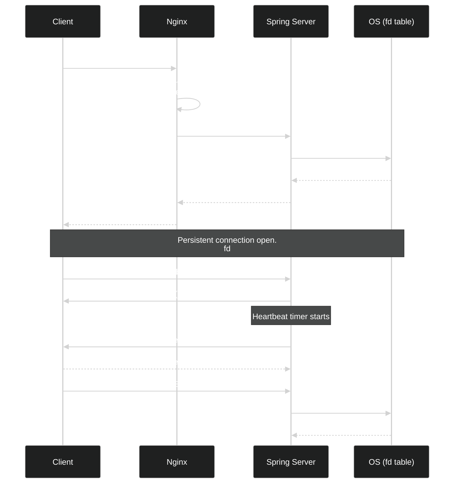
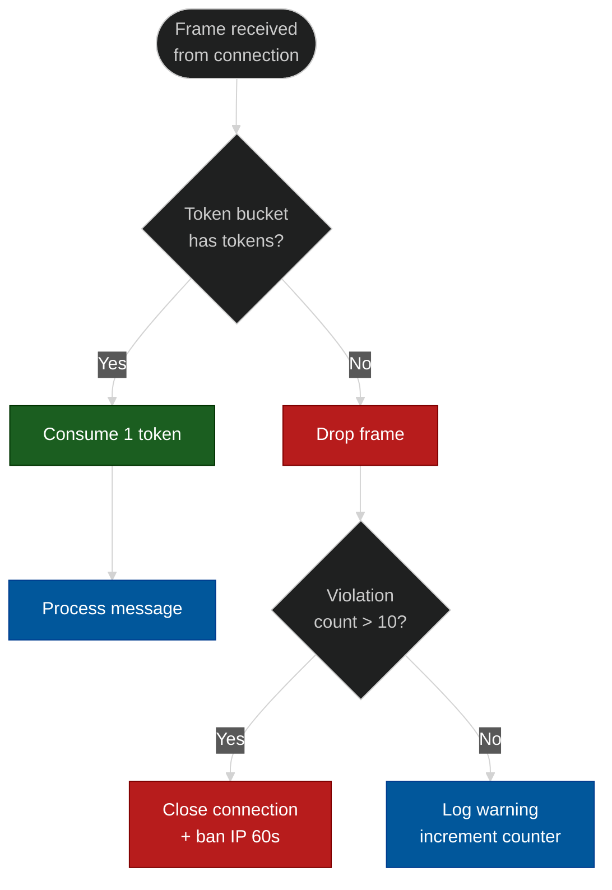
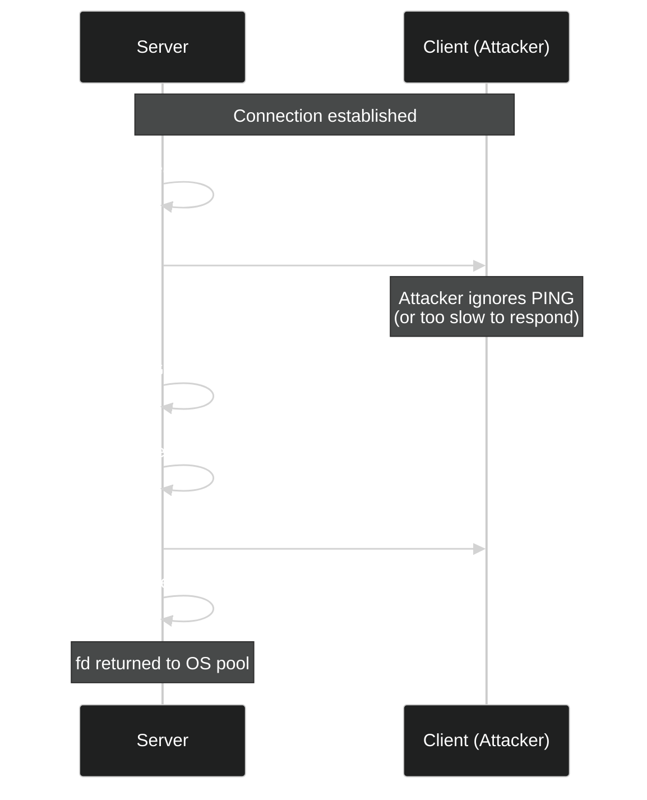
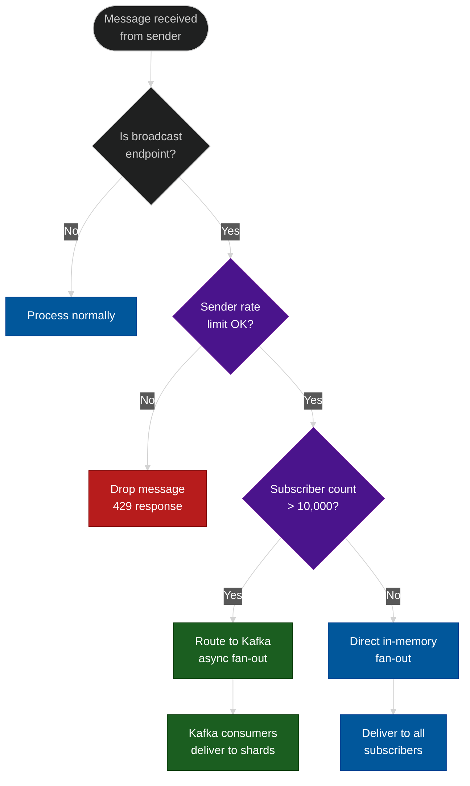
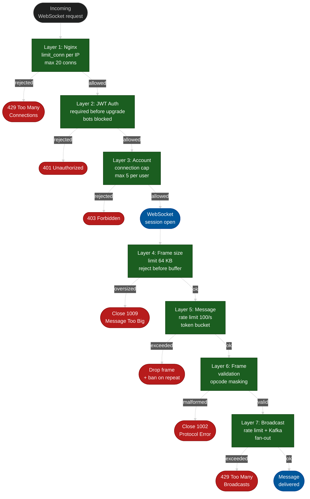

# WebSocket DDoS Attacks and Defenses

**Author:** ichamrong  
**Category:** Security & Architecture  
**Read Time:** ~18 min

---

## 📌 Table of Contents
- [Connection Lifecycle](#connection-lifecycle)
- [Attack 1: Connection Exhaustion](#attack-1-connection-exhaustion)
  - [The Attack](#the-attack-6)
  - [Defense](#defense-6)
- [Attack 2: Message Flooding](#attack-2-message-flooding)
  - [The Attack](#the-attack-6)
  - [Defense](#defense-6)
- [Attack 3: Large Frame Attack](#attack-3-large-frame-attack)
  - [The Attack](#the-attack-6)
  - [Defense](#defense-6)
- [Attack 4: Slow WebSocket (WebSocket Slowloris)](#attack-4-slow-websocket-websocket-slowloris)
  - [The Attack](#the-attack-6)
  - [Defense](#defense-6)
- [Attack 5: Ping Flood](#attack-5-ping-flood)
  - [The Attack](#the-attack-6)
  - [Defense](#defense-6)
- [Attack 6: Malformed Frame Attack](#attack-6-malformed-frame-attack)
  - [The Attack](#the-attack-6)
  - [Defense](#defense-6)
- [Attack 7: Amplification via Broadcast](#attack-7-amplification-via-broadcast)
  - [The Attack](#the-attack-6)
  - [Defense](#defense-6)
- [Layered Defense Architecture](#layered-defense-architecture)
- [Quick Reference](#quick-reference)
- [📚 References & Tools](#references-tools)

---

[← HTTP Defense](./03-http-layer7-defense.md) | [SSE Defense →](./05-sse-defense.md)

---

WebSocket is a persistent, full-duplex protocol that lives in a fundamentally different threat landscape from stateless HTTP. A stateless HTTP request lives for milliseconds. A WebSocket connection lives for hours. That persistence is the attack surface. Each of the seven attack types below exploits a different property of the WebSocket lifecycle: the upgrade handshake, the message stream, the frame structure, the control plane, or the broadcast fan-out. We cover the attack mechanism first — exactly how an attacker thinks — then the layered defense.

---

## Connection Lifecycle

Before the attacks, understand what a WebSocket connection actually is at the OS level.



Every connection that completes the upgrade occupies one file descriptor in the OS file descriptor table. The OS has a hard limit (`ulimit -n`). This single fact is the root cause of attacks 1 and 4.

---

## Attack 1: Connection Exhaustion

### The Attack

The attacker script opens 100,000 WebSocket connections. Each connection completes the HTTP Upgrade handshake (so it looks legitimate to naive filters), then sits completely idle. No messages are ever sent. The connections just exist.

```
[Attacker Machine]
  for i in range(100,000):
      ws = websocket.connect("wss://target.com/chat")
      # never send anything, never close
      sleep(forever)
```

```
+-------------------+         +--------------------+
|   Attacker Host   |         |    Target Server   |
|                   |         |                    |
|  thread 1  ----WS-upgrade-->  fd #1001  (idle)  |
|  thread 2  ----WS-upgrade-->  fd #1002  (idle)  |
|  thread 3  ----WS-upgrade-->  fd #1003  (idle)  |
|     ...                        ...               |
|  thread 100k --WS-upgrade-->  fd #65535 (idle)  |
|                   |         |                    |
|                   |         |  ulimit -n = 65536 |
|                   |         |  EXHAUSTED         |
|                   |         |  new connections   |
|                   |         |  -> ENOFILE error  |
+-------------------+         +--------------------+
```

Each idle connection consumes: 1 file descriptor + ~4 KB kernel socket buffer + thread or event loop slot. At 100,000 connections with 4 KB buffers, that is 400 MB of kernel memory just for socket buffers, before your application allocates anything.

### Defense

**Layer 1 — Nginx: limit_conn per IP before upgrade.**

```nginx
http {
    # Track connection count per IP
    limit_conn_zone $binary_remote_addr zone=ws_conn:10m;

    server {
        location /ws {
            # Max 20 concurrent WebSocket connections per IP
            limit_conn ws_conn 20;
            limit_conn_status 429;

            proxy_pass http://spring_backend;
            proxy_http_version 1.1;
            proxy_set_header Upgrade $http_upgrade;
            proxy_set_header Connection "upgrade";
        }
    }
}
```

**Layer 2 — Require JWT before upgrade. Bots cannot get a token.**

```java
@Configuration
@EnableWebSocketMessageBroker
public class WebSocketSecurityConfig implements WebSocketMessageBrokerConfigurer {

    @Override
    public void configureClientInboundChannel(ChannelRegistration registration) {
        registration.interceptors(new ChannelInterceptor() {
            @Override
            public Message<?> preSend(Message<?> message, MessageChannel channel) {
                StompHeaderAccessor accessor =
                    MessageHeaderAccessor.getAccessor(message, StompHeaderAccessor.class);

                if (StompCommand.CONNECT.equals(accessor.getCommand())) {
                    String token = accessor.getFirstNativeHeader("Authorization");
                    if (token == null || !jwtService.isValid(token)) {
                        // Reject before WebSocket session is stored
                        throw new MessageDeliveryException("Unauthorized");
                    }
                }
                return message;
            }
        });
    }
}
```

**Layer 3 — Per-account connection cap in application code.**

```java
@Component
public class ConnectionRegistry {

    // Max 5 concurrent WS connections per authenticated user
    private static final int MAX_CONNECTIONS_PER_USER = 5;

    private final ConcurrentHashMap<String, AtomicInteger> userConnectionCount =
        new ConcurrentHashMap<>();

    public boolean tryRegister(String userId) {
        AtomicInteger count = userConnectionCount
            .computeIfAbsent(userId, k -> new AtomicInteger(0));
        int current = count.incrementAndGet();
        if (current > MAX_CONNECTIONS_PER_USER) {
            count.decrementAndGet();
            return false; // Reject: too many connections from this account
        }
        return true;
    }

    public void deregister(String userId) {
        userConnectionCount.computeIfPresent(userId,
            (k, v) -> { v.decrementAndGet(); return v; });
    }
}
```

**Layer 4 — OS ulimit tuning (do not skip this).**

```bash
# /etc/security/limits.conf
# Allow the app user to hold more fds (for legitimate scale)
spring-app  soft  nofile  100000
spring-app  hard  nofile  200000

# Verify after restart:
# cat /proc/$(pgrep java)/limits | grep "open files"
```

| Limit | Value | Rationale |
|---|---|---|
| `limit_conn` per IP (Nginx) | 20 | Legitimate browser opens 1–2 tabs |
| Max connections per user account | 5 | Multi-device use case |
| OS `ulimit -n` (app user) | 200,000 | Enough for legitimate scale |
| JWT expiry | 15 min | Bots must re-authenticate constantly |

---

## Attack 2: Message Flooding

### The Attack

An attacker who holds a valid WebSocket connection (they passed auth) now sends messages at machine speed — 1,000,000 WebSocket frames per second. The server must:

1. Read each frame from the socket buffer
2. Deserialize the JSON payload
3. Validate the message schema
4. Route to the correct handler
5. Write a response

Each step costs CPU. At 1M messages/s from a single connection, the deserialization alone pegs one CPU core at 100%.

```
[Attacker — authenticated]

ws.send({"type":"chat","body":"x"})   <-- 1,000,000 times per second
ws.send({"type":"chat","body":"x"})
ws.send({"type":"chat","body":"x"})
...

[Server]
  Deserialize JSON ... CPU 100%
  Route to handler ... CPU 100%
  Deserialize JSON ... CPU 100%
  (legitimate users get no CPU time)
```

### Defense

**Token bucket rate limiter — 100 messages/second per connection.**



```java
@Component
public class MessageRateLimiter {

    // Token bucket: 100 tokens, refill 100/s
    private static final int BUCKET_CAPACITY = 100;
    private static final Duration REFILL_PERIOD = Duration.ofSeconds(1);

    private final Cache<String, Bucket> buckets = Caffeine.newBuilder()
        .expireAfterAccess(10, TimeUnit.MINUTES)
        .build();

    public boolean tryConsume(String sessionId) {
        Bucket bucket = buckets.get(sessionId, id ->
            Bucket.builder()
                .addLimit(Bandwidth.classic(BUCKET_CAPACITY,
                    Refill.greedy(BUCKET_CAPACITY, REFILL_PERIOD)))
                .build()
        );
        return bucket.tryConsume(1);
    }
}

@Component
public class RateLimitingWebSocketHandler extends TextWebSocketHandler {

    private final MessageRateLimiter rateLimiter;
    private final ConcurrentHashMap<String, AtomicInteger> violationCount =
        new ConcurrentHashMap<>();

    @Override
    protected void handleTextMessage(WebSocketSession session, TextMessage message)
            throws Exception {

        String sessionId = session.getId();

        if (!rateLimiter.tryConsume(sessionId)) {
            int violations = violationCount
                .computeIfAbsent(sessionId, k -> new AtomicInteger(0))
                .incrementAndGet();

            if (violations > 10) {
                session.close(CloseStatus.POLICY_VIOLATION);
                // Backpressure: ban IP for 60 seconds
                ipBanService.ban(getClientIp(session), Duration.ofSeconds(60));
            }
            return; // Drop the frame silently
        }

        processMessage(session, message);
    }
}
```

| Limit | Value |
|---|---|
| Token bucket capacity | 100 messages |
| Refill rate | 100 messages/second |
| Violation threshold before close | 10 dropped frames |
| IP ban duration after close | 60 seconds |

---

## Attack 3: Large Frame Attack

### The Attack

WebSocket frames can carry any payload size. The protocol has no built-in maximum. An attacker sends a single frame with a 100 MB JSON payload. The server reads the frame header, sees "payload length = 104,857,600 bytes", and begins buffering the entire payload into a byte array before it can process a single byte of it.

```
[Attacker]
  ws.send(b"A" * 100_000_000)   # 100 MB single frame

[Server — naive implementation]
  read frame header: length = 100MB
  allocate byte[100,000,000]        <-- 100 MB heap alloc
  buffer entire payload ...
  (1000 connections × 100 MB = 100 GB RAM exhausted → OOM kill)
```

```
Memory impact:

Connection 1:  [============================ 100 MB ============================]
Connection 2:  [============================ 100 MB ============================]
Connection 3:  [============================ 100 MB ============================]
...
Connection 1000: [========================= 100 MB ============================]
                                                           TOTAL: 100 GB -> OOM
```

### Defense

Reject the frame **before buffering** — check the frame header's declared length before allocating any buffer.

```java
@Configuration
public class WebSocketConfig implements WebSocketMessageBrokerConfigurer {

    @Override
    public void configureWebSocketTransport(WebSocketTransportRegistration registration) {
        registration
            // Reject any single message > 64 KB
            .setMaxTextMessageBufferSize(64 * 1024)       // 64 KB text
            .setMaxBinaryMessageBufferSize(64 * 1024)     // 64 KB binary
            // Reject any frame where declared length > 64 KB
            // Spring reads the header, compares, rejects before buffering
            .setSendTimeLimit(15 * 1000)                  // 15s send timeout
            .setSendBufferSizeLimit(512 * 1024);           // 512 KB outbound buffer
    }
}
```

For the raw Netty/Undertow layer (where frames are processed before Spring sees them):

```java
@Bean
public ServerEndpointExporter serverEndpointExporter() {
    return new ServerEndpointExporter();
}

// Undertow WebSocket configuration
@Bean
public UndertowServletWebServerFactory undertowFactory() {
    UndertowServletWebServerFactory factory = new UndertowServletWebServerFactory();
    factory.addDeploymentInfoCustomizers(deploymentInfo ->
        deploymentInfo.addWebSocketExtension(
            new PerMessageDeflateHandshake(false, 12) // compress, reject uncompressed > limit
        )
    );
    return factory;
}
```

Nginx also enforces at the proxy layer:

```nginx
location /ws {
    # Nginx will close the connection if client sends
    # a body this large during the upgrade request
    client_max_body_size 64k;

    proxy_pass http://spring_backend;
    proxy_http_version 1.1;
    proxy_set_header Upgrade $http_upgrade;
    proxy_set_header Connection "upgrade";

    # Read timeout — large frame that trickles in slowly
    proxy_read_timeout 30s;
}
```

| Limit | Value | Rationale |
|---|---|---|
| Max text frame size | 64 KB | Covers all valid chat/API payloads |
| Max binary frame size | 64 KB | File transfers should use HTTP multipart |
| Rejected before buffering | Yes | Header check, no heap allocation |
| Single connection memory cap | ~512 KB outbound buffer | Prevents slow reader exhaustion |

---

## Attack 4: Slow WebSocket (WebSocket Slowloris)

### The Attack

Classic HTTP Slowloris sends headers one byte at a time, keeping the connection open. The WebSocket variant is more dangerous because the connection has already upgraded — the server has committed resources.

After completing the WebSocket handshake, the attacker sends data at minimum speed: 1 byte every 30 seconds. A correctly implemented server cannot close this connection because:

- The connection is "active" (bytes are arriving)
- The protocol requires waiting for a complete frame before processing

```
[Attacker — 50,000 concurrent connections]

conn #1:   [upgrade OK]  b'\x01'  ... 30s ...  b'\x02'  ... 30s ...  (never completes frame)
conn #2:   [upgrade OK]  b'\x01'  ... 30s ...  b'\x02'  ... 30s ...
...
conn #50k: [upgrade OK]  b'\x01'  ... 30s ...  b'\x02'  ... 30s ...

[Server]
  50,000 connections open
  50,000 file descriptors held
  50,000 threads (thread-per-connection model) blocked in read()
  Legitimate users: "connection refused" (fd table full)
```

### Defense

**Heartbeat mechanism: server pings, client must pong.**



```java
@Component
public class HeartbeatScheduler {

    private static final Duration PING_INTERVAL = Duration.ofSeconds(30);
    private static final Duration PONG_TIMEOUT  = Duration.ofSeconds(10);

    private final ScheduledExecutorService scheduler =
        Executors.newScheduledThreadPool(4);

    private final ConcurrentHashMap<String, Instant> lastPongReceived =
        new ConcurrentHashMap<>();

    public void startHeartbeat(WebSocketSession session) {
        String id = session.getId();
        lastPongReceived.put(id, Instant.now());

        scheduler.scheduleAtFixedRate(() -> {
            try {
                // Check if previous pong was received in time
                Instant last = lastPongReceived.get(id);
                if (last != null &&
                    Duration.between(last, Instant.now()).compareTo(
                        PING_INTERVAL.plus(PONG_TIMEOUT)) > 0) {
                    // No pong received — close the zombie connection
                    session.close(CloseStatus.SESSION_NOT_RELIABLE);
                    return;
                }
                // Send ping
                session.sendMessage(new PingMessage());
            } catch (Exception e) {
                // Session already closed
                stopHeartbeat(id);
            }
        }, PING_INTERVAL.toSeconds(), PING_INTERVAL.toSeconds(), TimeUnit.SECONDS);
    }

    public void recordPong(String sessionId) {
        lastPongReceived.put(sessionId, Instant.now());
    }

    public void stopHeartbeat(String sessionId) {
        lastPongReceived.remove(sessionId);
    }
}
```

**Idle read timeout — close connections that send no data at all.**

```java
@Configuration
public class WebSocketConfig implements WebSocketMessageBrokerConfigurer {

    @Override
    public void configureWebSocketTransport(WebSocketTransportRegistration registration) {
        // If no message received for 60 seconds, close the session
        // This handles the pure-idle case (no data at all)
        registration.setSendTimeLimit(60 * 1000);
    }
}
```

At the Nginx layer:

```nginx
location /ws {
    proxy_pass http://spring_backend;
    proxy_http_version 1.1;
    proxy_set_header Upgrade $http_upgrade;
    proxy_set_header Connection "upgrade";

    # If no data in either direction for 60s, Nginx closes the tunnel
    proxy_read_timeout 60s;
    proxy_send_timeout 60s;
}
```

| Timer | Value | Behavior on expiry |
|---|---|---|
| Ping interval | 30 seconds | Server sends PING frame |
| Pong deadline | 10 seconds after PING | Server closes session |
| Idle read timeout (Nginx) | 60 seconds | Nginx closes the tunnel |
| Idle read timeout (app) | 60 seconds | Spring closes session |

---

## Attack 5: Ping Flood

### The Attack

The WebSocket protocol defines two control frames: PING (opcode `0x9`) and PONG (opcode `0xA`). Per RFC 6455, a WebSocket endpoint **must** respond to every PING with a PONG. The attacker exploits this requirement.

```
[Attacker]
  send PING frame (6 bytes)   <-- 10,000 times per second

[Server — compliant RFC 6455 implementation]
  receive PING -> queue PONG response
  receive PING -> queue PONG response
  receive PING -> queue PONG response
  ...
  10,000 PONG writes/second per connection
  × 1,000 connections = 10,000,000 writes/second
  CPU: 100%, network bandwidth: saturated

Frame structure:
  0x89 0x00  (PING, 0-byte payload, 2 bytes total)
  Attacker sends 10,000 of these/second = 20,000 bytes/s per connection (tiny bandwidth cost to attacker)
  Server sends 10,000 PONGs/second = 20,000 bytes/s per connection (same cost, but also CPU overhead)
```

```
+------------------+                     +------------------+
|     Attacker     |                     |      Server      |
|                  |                     |                  |
|  PING PING PING  ===================>  |  CPU for PONG    |
|  PING PING PING  ===================>  |  PONG PONG PONG  |
|  10,000/second   |                     |  10,000/second   |
|                  |    (× 1000 conns)   |  CPU: 100%       |
+------------------+                     +------------------+
```

### Defense

Rate-limit PING frames per connection. RFC 6455 does not mandate any specific PING frequency — legitimate clients ping at most once per heartbeat interval (typically 30–60 seconds).

```java
@Component
public class PingFloodDetector extends AbstractWebSocketHandler {

    // Allow max 1 PING per 10 seconds per connection
    private static final long MIN_PING_INTERVAL_MS = 10_000;

    private final ConcurrentHashMap<String, Long> lastPingTime =
        new ConcurrentHashMap<>();
    private final ConcurrentHashMap<String, AtomicInteger> pingViolations =
        new ConcurrentHashMap<>();

    @Override
    protected void handlePongMessage(WebSocketSession session, PongMessage message)
            throws Exception {
        // Record pong for heartbeat tracker
        heartbeatScheduler.recordPong(session.getId());
    }

    // Override the internal PING handler (via WebSocketHandler adapter)
    public boolean handlePingFrame(WebSocketSession session) {
        String id = session.getId();
        long now = System.currentTimeMillis();
        Long last = lastPingTime.put(id, now);

        if (last != null && (now - last) < MIN_PING_INTERVAL_MS) {
            // PING arrived too soon
            int violations = pingViolations
                .computeIfAbsent(id, k -> new AtomicInteger(0))
                .incrementAndGet();

            if (violations > 5) {
                try {
                    // Close connection — ping flood detected
                    session.close(CloseStatus.POLICY_VIOLATION);
                } catch (IOException e) {
                    // Already closed
                }
                return false; // Do not send PONG
            }
            return false; // Drop this PING silently, no PONG
        }

        pingViolations.remove(id); // Reset violations on valid ping
        return true; // Allow PONG to be sent
    }
}
```

```java
// Register custom handler in WebSocket config
@Configuration
public class WebSocketConfig implements WebSocketMessageBrokerConfigurer {

    @Override
    public void configureWebSocketTransport(WebSocketTransportRegistration registration) {
        // Spring's built-in PONG handler can be replaced with the custom one above
        // via a WebSocketHandlerDecorator
        registration.addDecoratorFactory(handler ->
            new PingFloodDetectingDecorator(handler, pingFloodDetector));
    }
}
```

| Limit | Value |
|---|---|
| Min PING interval per connection | 10 seconds |
| Violations before CLOSE | 5 |
| Close code | 1008 Policy Violation |

---

## Attack 6: Malformed Frame Attack

### The Attack

A WebSocket frame has a specific binary structure: a 2-byte header, optional extended length bytes, optional masking key, then payload. The attacker sends frames that violate the structure:

- **Invalid opcode:** WebSocket opcodes are 4 bits. Values `0x3–0x7` (non-control) and `0xB–0xF` (control) are reserved and must not be used by clients. The server must close the connection if it receives one.
- **Incorrect masking:** Client-to-server frames must be masked. Server receives an unmasked frame — parse error.
- **Fragmentation violation:** A control frame (PING, PONG, CLOSE) must not be fragmented across multiple frames. Attacker sends a fragmented PING.
- **Oversized control frame:** Control frame payload must not exceed 125 bytes. Attacker sends a PING with a 10 KB payload.

Each of these causes the server's frame parser to throw an exception. Exceptions are expensive — each one generates a stack trace (100+ frames deep in a JVM), which the server must allocate, fill, and garbage-collect.

```
[Attacker]
  send frame: opcode=0xB (reserved) -> ParseException -> stack trace allocated
  send frame: unmasked client frame  -> ParseException -> stack trace allocated
  send frame: fragmented PING        -> ParseException -> stack trace allocated
  ... 1,000 per second per connection ...

[Server JVM]
  GC pressure from exception objects
  CPU: 100% in exception handling
  Thread pool saturated waiting on exception construction
```

```
Malformed frame structure (attacker sends this):
  Byte 0:  1000 1011   <- FIN=1, opcode=0xB (RESERVED — invalid)
  Byte 1:  0111 1101   <- MASK=0 (missing — client MUST mask), length=125
  Bytes 2-126: payload

Valid frame structure (what server expects):
  Byte 0:  1000 0001   <- FIN=1, opcode=0x1 (text)
  Byte 1:  1111 1101   <- MASK=1 (present), length=125
  Bytes 2-5:  masking key
  Bytes 6-130: masked payload
```

### Defense

**Fail-fast frame validation — reject before exception, ban on repeated errors.**

```java
@Component
public class FrameValidator {

    private static final Set<Integer> VALID_OPCODES =
        Set.of(0x0, 0x1, 0x2, 0x8, 0x9, 0xA); // continuation, text, binary, close, ping, pong

    private static final int MAX_CONTROL_FRAME_PAYLOAD = 125;

    private final ConcurrentHashMap<String, AtomicInteger> parseErrorCount =
        new ConcurrentHashMap<>();

    /**
     * Called before frame is fully parsed.
     * Returns false if frame should be rejected immediately.
     */
    public boolean validateFrameHeader(String sessionId, int opcode,
                                       boolean masked, long payloadLength,
                                       boolean fin, boolean fragmented) {

        // Rule 1: Opcode must be valid
        if (!VALID_OPCODES.contains(opcode)) {
            recordError(sessionId);
            return false;
        }

        // Rule 2: Client frames must be masked (RFC 6455 Section 5.3)
        if (!masked) {
            recordError(sessionId);
            return false;
        }

        // Rule 3: Control frames must not be fragmented
        boolean isControl = opcode >= 0x8;
        if (isControl && !fin) {
            recordError(sessionId);
            return false;
        }

        // Rule 4: Control frame payload must be <= 125 bytes
        if (isControl && payloadLength > MAX_CONTROL_FRAME_PAYLOAD) {
            recordError(sessionId);
            return false;
        }

        return true;
    }

    private void recordError(String sessionId) {
        int errors = parseErrorCount
            .computeIfAbsent(sessionId, k -> new AtomicInteger(0))
            .incrementAndGet();

        // If > 100 parse errors from one connection in 1 second, close + ban
        if (errors > 100) {
            sessionRegistry.closeAndBan(sessionId, Duration.ofMinutes(5));
        }
    }
}
```

**Monitor exception rate by IP at the infrastructure level.**

```java
@Component
public class ExceptionRateMonitor {

    private static final int MAX_ERRORS_PER_SECOND = 100;

    // Sliding window counter per IP
    private final Cache<String, AtomicInteger> errorRate = Caffeine.newBuilder()
        .expireAfterWrite(1, TimeUnit.SECONDS)
        .build();

    public void recordParseError(String clientIp) {
        int count = errorRate
            .get(clientIp, k -> new AtomicInteger(0))
            .incrementAndGet();

        if (count > MAX_ERRORS_PER_SECOND) {
            ipBanService.ban(clientIp, Duration.ofMinutes(5));
            log.warn("Malformed frame flood from IP {}: {} errors/s — banned 5 min",
                clientIp, count);
        }
    }
}
```

| Rule | Threshold | Action |
|---|---|---|
| Invalid opcode | Any | Reject frame, increment counter |
| Unmasked client frame | Any | Reject frame, increment counter |
| Fragmented control frame | Any | Reject frame, increment counter |
| Control frame > 125 bytes | Any | Reject frame, increment counter |
| Errors per connection | > 100 in 1s | Close session + ban IP 5 min |
| Errors per IP | > 100 in 1s | Ban IP 5 min |

---

## Attack 7: Amplification via Broadcast

### The Attack

This attack exploits the economics of WebSocket broadcast: the attacker pays a cost of 1 message sent; the server pays a cost of N messages delivered (where N = number of subscribers).

In a chat application with 100,000 connected users, an attacker in the room sends 100 messages per second. The server must deliver each message to all 100,000 subscribers — that is 10,000,000 WebSocket writes per second, fan-out from 100 requests/s.

```
[Attacker — 1 authenticated connection]

  ws.send({"room":"global","msg":"x"})   <-- 100 times/second

[Server — synchronous in-memory broadcast]

  for session in room.subscribers:       <-- 100,000 subscribers
      session.send(msg)                  <-- 100,000 writes per message

  = 10,000,000 writes/second total
  CPU: 100%
  Outbound bandwidth: (100,000 × message_size × 100) bytes/second
```

```
                    1 message in
                         |
                    [Server Broadcast]
                   /    |    |    \
                  /     |    |     \
              user1  user2  user3  ... user100k
              (write)(write)(write)    (write)
                100,000 writes for every 1 message received
                Amplification factor: 100,000×
```

### Defense

**Rate limit broadcasts per authenticated user.**



```java
@Service
public class BroadcastService {

    // Max 5 broadcast messages per second per user
    private static final int MAX_BROADCASTS_PER_SECOND = 5;
    // Route through Kafka if more than 10,000 subscribers
    private static final int KAFKA_THRESHOLD = 10_000;

    private final MessageRateLimiter broadcastRateLimiter;
    private final KafkaTemplate<String, ChatMessage> kafkaTemplate;
    private final SimpMessagingTemplate stompTemplate;

    public void broadcast(String senderId, String roomId, ChatMessage message) {
        // Enforce per-user broadcast rate limit
        if (!broadcastRateLimiter.tryConsume(senderId)) {
            throw new TooManyRequestsException(
                "Broadcast rate limit exceeded: max " + MAX_BROADCASTS_PER_SECOND + "/s");
        }

        int subscriberCount = roomRegistry.getSubscriberCount(roomId);

        if (subscriberCount > KAFKA_THRESHOLD) {
            // Large room: async fan-out via Kafka — server is not blocked
            kafkaTemplate.send("ws-broadcast", roomId, message);
        } else {
            // Small room: direct in-memory fan-out is acceptable
            stompTemplate.convertAndSend("/topic/room/" + roomId, message);
        }
    }
}
```

**Kafka consumer that performs the actual fan-out asynchronously.**

```java
@Component
public class BroadcastConsumer {

    @KafkaListener(
        topics = "ws-broadcast",
        concurrency = "8"    // 8 consumer threads for parallelism
    )
    public void consume(ConsumerRecord<String, ChatMessage> record) {
        String roomId = record.key();
        ChatMessage message = record.value();

        // Deliver in batches of 1,000 to avoid blocking one thread for 100k writes
        List<WebSocketSession> subscribers = roomRegistry.getSubscribers(roomId);
        Lists.partition(subscribers, 1_000).forEach(batch -> {
            batch.parallelStream().forEach(session -> {
                try {
                    if (session.isOpen()) {
                        session.sendMessage(new TextMessage(serialize(message)));
                    }
                } catch (IOException e) {
                    // Session closed mid-send — ignore
                }
            });
        });
    }
}
```

**Admin-only broadcast endpoint for system-wide announcements.**

```java
@RestController
@RequestMapping("/admin/broadcast")
public class AdminBroadcastController {

    @PreAuthorize("hasRole('ADMIN')")   // Only admins can do full system broadcast
    @PostMapping("/all")
    public ResponseEntity<Void> broadcastToAll(@RequestBody SystemMessage message) {
        // Admins are trusted; no per-user rate limit needed
        // But still route through Kafka to avoid synchronous fan-out
        kafkaTemplate.send("ws-system-broadcast", "global", message);
        return ResponseEntity.accepted().build();
    }
}
```

| Limit | Value |
|---|---|
| Broadcast rate per user | 5 messages/second |
| Subscriber threshold for Kafka routing | 10,000 |
| Kafka consumer threads | 8 |
| Fan-out batch size | 1,000 sessions per batch |
| System broadcast | Admin role required |

---

## Layered Defense Architecture

All seven defenses stack into layers. An attacker stopped at layer 1 never reaches layer 7.



---

## Quick Reference

| Attack | Root cause | Kill switch | Numeric limit |
|---|---|---|---|
| Connection Exhaustion | File descriptor limit | `limit_conn` 20/IP + JWT | 20 connections/IP |
| Message Flooding | CPU on deserialization | Token bucket | 100 messages/s per connection |
| Large Frame | Heap allocation on buffer | `max_message_size` | 64 KB per frame |
| Slow WebSocket | fd held by idle/slow conn | Heartbeat ping/pong | PONG within 10s of PING |
| Ping Flood | RFC 6455 PONG obligation | Rate-limit PING frames | 1 PING per 10s per connection |
| Malformed Frame | JVM exception cost | Fail-fast validation | Ban after 100 errors/s |
| Broadcast Amplification | 1 message → N writes | Per-user rate limit + Kafka | 5 broadcasts/s per user |

## 📚 References & Tools
- **RFC 6455 (The WebSocket Protocol)** — [rfc-editor.org/rfc/rfc6455](https://www.rfc-editor.org/rfc/rfc6455)
- **Nginx WebSocket Proxying** — [nginx.org/en/docs/http/websocket.html](http://nginx.org/en/docs/http/websocket.html)
- **Redis Pub/Sub** — [redis.io/docs/manual/pubsub/](https://redis.io/docs/manual/pubsub/)

---

[← HTTP Defense](./03-http-layer7-defense.md) | [SSE Defense →](./05-sse-defense.md)

## Related

- [Bot Protection & CAPTCHAs](../bot-protection/README.md)
- [Session & Cookie Security](../session-and-cookie-security/README.md)
- [API Gateways & Reverse Proxies](../../devops/api-gateways/README.md)
