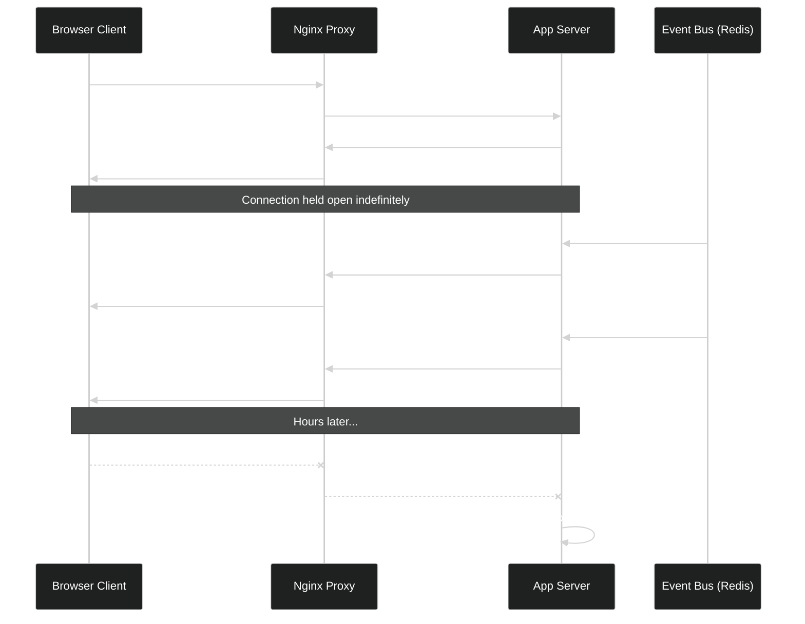
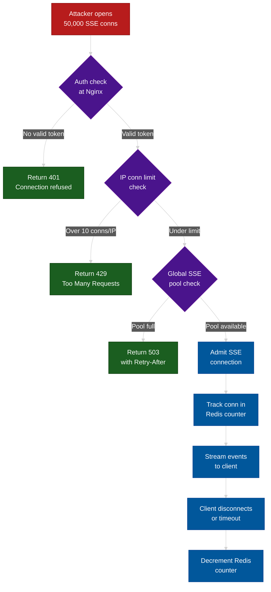
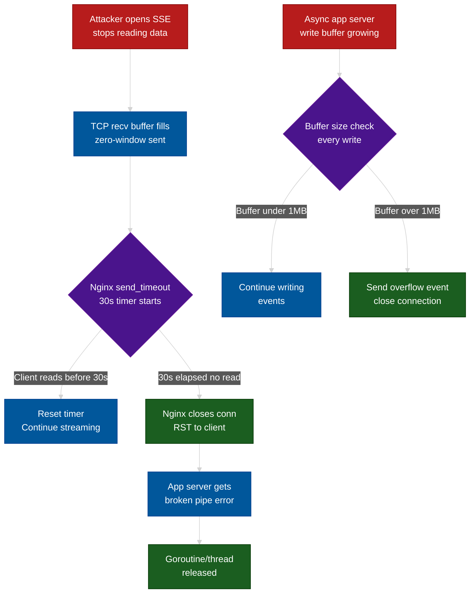
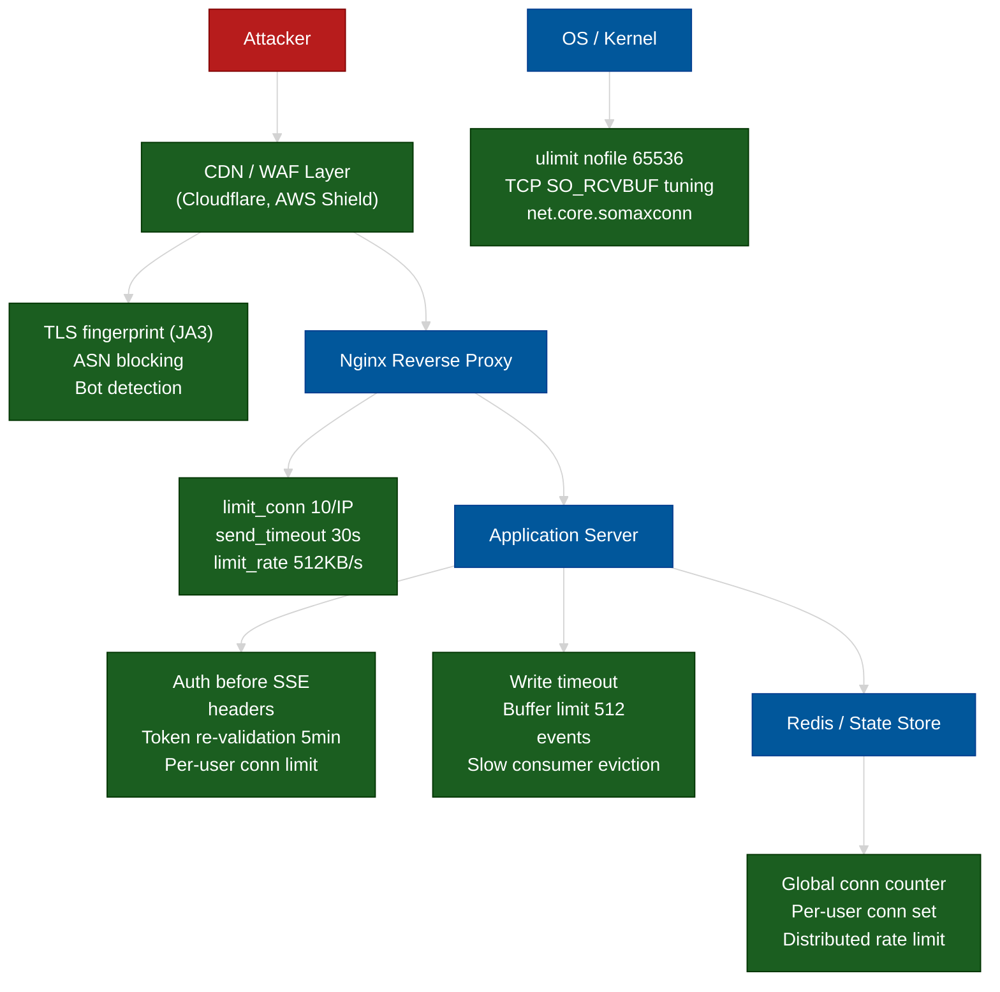

# SSE & Streaming DDoS: Defending Long-Lived HTTP Connections

**Author:** ichamrong  
**Category:** Security & Architecture  
**Read Time:** ~18 min  

---

## 📌 Table of Contents
- [Preface: Why Streaming Connections Are a Different Beast](#preface-why-streaming-connections-are-a-different-beast)
- [What Is SSE? A Precise Definition](#what-is-sse-a-precise-definition)
- [Attack 1: Connection Pool Exhaustion](#attack-1-connection-pool-exhaustion)
  - [The Mechanism](#the-mechanism-5)
  - [Defense: Nginx Connection Limiting](#defense-nginx-connection-limiting)
  - [Defense: Application-Level Connection Tracking](#defense-application-level-connection-tracking)
- [Attack 2: Slow Consumer Attack](#attack-2-slow-consumer-attack)
  - [The Mechanism](#the-mechanism-5)
  - [Defense: Write Timeout and Non-Blocking Detection](#defense-write-timeout-and-non-blocking-detection)
- [Attack 3: Reconnection Storm (Thundering Herd)](#attack-3-reconnection-storm-thundering-herd)
  - [The Mechanism](#the-mechanism-5)
  - [Defense: Client-Side Jitter and Exponential Backoff](#defense-client-side-jitter-and-exponential-backoff)
  - [Defense: Server-Side Rolling Restart and Admission Queue](#defense-server-side-rolling-restart-and-admission-queue)
- [Attack 4: Event Buffer Overflow](#attack-4-event-buffer-overflow)
  - [The Mechanism](#the-mechanism-5)
  - [Defense: Bounded Buffer with Eviction Policy](#defense-bounded-buffer-with-eviction-policy)
- [Attack 5: SSE as a Covert Data Exfiltration Channel](#attack-5-sse-as-a-covert-data-exfiltration-channel)
  - [The Mechanism](#the-mechanism-5)
  - [Defense: Event-Level Rate Limiting and Data Classification](#defense-event-level-rate-limiting-and-data-classification)
- [Attack 6: Authentication Bypass via SSE Upgrade](#attack-6-authentication-bypass-via-sse-upgrade)
  - [The Mechanism](#the-mechanism-5)
  - [Defense: Auth Enforced Before First Byte of SSE](#defense-auth-enforced-before-first-byte-of-sse)
- [gRPC Streaming DDoS](#grpc-streaming-ddos)
  - [Attack: Goroutine Exhaustion via Open Streams](#attack-goroutine-exhaustion-via-open-streams)
  - [Defense: gRPC Server Configuration (Go)](#defense-grpc-server-configuration-go)
- [HTTP/2 Server Push DDoS](#http2-server-push-ddos)
  - [The Attack (Historical — Now Deprecated)](#the-attack-historical-now-deprecated)
  - [Defense: Disable HTTP/2 Server Push Entirely](#defense-disable-http2-server-push-entirely)
- [Defense Layering: The Full Stack](#defense-layering-the-full-stack)
  - [Numeric Defense Limits Reference](#numeric-defense-limits-reference)
- [Key Takeaways](#key-takeaways)
- [📚 References & Tools](#references-tools)

---

[← WebSocket Defense](./04-websocket-defense.md) | [Network & Volumetric →](./06-network-volumetric-defense.md)

---

## Preface: Why Streaming Connections Are a Different Beast

Standard HTTP is a request-response protocol: the client asks, the server answers, and the connection closes. The threat model is simple — too many requests per second.

**Server-Sent Events (SSE), gRPC streaming, and HTTP/2 push break this model entirely.**

A single SSE connection is designed to stay open for hours. The client connects once and the server streams data indefinitely. This creates a fundamentally different attack surface: **an attacker does not need high request throughput. They only need to hold connections open.** One thousand persistent connections, each doing nothing, can bring down a Java thread pool or exhaust a Linux server's file descriptors. The attack is *architectural*, not volumetric.

This document covers every attack class specific to long-lived streaming connections, with concrete defenses at every layer — application, infrastructure, and operating system.

---

## What Is SSE? A Precise Definition

SSE is defined in the HTML Living Standard (WHATWG). The mechanics are deceptively simple:

1. Client opens a standard HTTP GET request to `/events`
2. Server responds with `Content-Type: text/event-stream`
3. Server writes newline-delimited text frames: `data: {"msg":"hello"}\n\n`
4. Connection stays open. Server writes more frames whenever events occur.
5. If the connection drops, the browser automatically reconnects (using the `Last-Event-ID` header to resume).

The wire protocol:

```
GET /events HTTP/1.1
Host: api.example.com
Accept: text/event-stream
Cache-Control: no-cache

HTTP/1.1 200 OK
Content-Type: text/event-stream
Cache-Control: no-cache
X-Accel-Buffering: no

data: {"type":"heartbeat","ts":1716000000}\n\n
data: {"type":"order","id":"abc123"}\n\n
data: {"type":"order","id":"def456"}\n\n
```

The key architectural constraint: **one SSE connection = one long-lived HTTP connection**. In a blocking thread-per-request server (Java Servlet, Rails Puma), this means one thread held for the duration of the connection. In an async server (Node.js, Go), it means one goroutine or one file descriptor registration. Either resource is finite.



---

## Attack 1: Connection Pool Exhaustion

### The Mechanism

This is the most direct and devastating attack on SSE endpoints. The attacker's script opens as many concurrent SSE connections as possible. Each connection consumes a resource on the server. When that resource is exhausted, legitimate users cannot connect.

**The resource being exhausted depends on your server runtime:**

| Runtime | Resource Exhausted | Default Limit |
|---|---|---|
| Java (Tomcat/Spring MVC) | Thread pool | Typically 200 threads |
| Java (Spring WebFlux) | Event loop threads + connections | Limited by Netty config |
| Node.js | File descriptors (fds) | ulimit default: 1024 |
| Go | Goroutines | Soft: millions, but memory-bound |
| Python (Gunicorn/Django) | Worker processes | Typically 4-8 workers |

```
ASCII: Thread Pool Exhaustion on Java Tomcat

Attacker script                  Tomcat Server (maxThreads=200)
     |                                      |
     |--- SSE Connection 1 ---------------> | [Thread 1 HELD]
     |--- SSE Connection 2 ---------------> | [Thread 2 HELD]
     |--- SSE Connection 3 ---------------> | [Thread 3 HELD]
     |         ...                          |         ...
     |--- SSE Connection 200 ------------> | [Thread 200 HELD]
     |                                      |
     |--- SSE Connection 201 ------------> | [BLOCKED - queue]
     |                                      |
Legitimate User:                            |
     |--- GET /api/checkout -------------> | [BLOCKED - no threads]
     |<-- 503 Service Unavailable -------- | (after timeout)
```



### Defense: Nginx Connection Limiting

The first line of defense is at the reverse proxy — before the SSE request ever reaches your application server.

```nginx
# /etc/nginx/nginx.conf

http {
    # Define a shared memory zone to track connections per IP
    # 10MB can track ~160,000 IP addresses
    limit_conn_zone $binary_remote_addr zone=sse_per_ip:10m;

    # Define a global zone for total SSE connections across all IPs
    limit_conn_zone $server_name zone=sse_global:1m;

    server {
        listen 443 ssl http2;
        server_name api.example.com;

        location /events {
            # Max 10 simultaneous SSE connections per IP address
            limit_conn sse_per_ip 10;

            # Max 5000 total SSE connections globally on this server
            limit_conn sse_global 5000;

            # Return 429 (not 503) when limit hit — tells client to back off
            limit_conn_status 429;

            # Disable Nginx output buffering — SSE requires streaming
            proxy_buffering off;

            # Disable proxy response buffering (for SSE chunks)
            proxy_cache off;

            # Tell upstream not to buffer (for Nginx with X-Accel-Buffering)
            proxy_set_header X-Accel-Buffering no;

            # Long read timeout — SSE is intentionally long-lived
            proxy_read_timeout 3600s;

            # Send timeout — if app server doesn't respond at all in 30s, close
            proxy_send_timeout 30s;

            proxy_pass http://app_backend;
        }
    }
}
```

### Defense: Application-Level Connection Tracking

Nginx limits by IP, but a sophisticated attacker distributes connections across many IPs. Track connections at the user account level in your application.

**Java Spring Boot (WebFlux — reactive SSE):**

```java
// SseConnectionRegistry.java
@Component
public class SseConnectionRegistry {

    private static final int MAX_CONNECTIONS_PER_USER = 5;
    private static final int MAX_TOTAL_CONNECTIONS = 10_000;

    // ConcurrentHashMap: userId -> set of active emitter IDs
    private final ConcurrentHashMap<String, Set<String>> userConnections =
        new ConcurrentHashMap<>();
    private final AtomicInteger totalConnections = new AtomicInteger(0);

    public boolean tryRegister(String userId, String emitterId) {
        // Check global pool first
        if (totalConnections.get() >= MAX_TOTAL_CONNECTIONS) {
            return false;
        }

        // Check per-user limit
        Set<String> userConns = userConnections.computeIfAbsent(
            userId, k -> ConcurrentHashMap.newKeySet()
        );

        if (userConns.size() >= MAX_CONNECTIONS_PER_USER) {
            return false;
        }

        userConns.add(emitterId);
        totalConnections.incrementAndGet();
        return true;
    }

    public void deregister(String userId, String emitterId) {
        Set<String> userConns = userConnections.get(userId);
        if (userConns != null) {
            userConns.remove(emitterId);
            totalConnections.decrementAndGet();
        }
    }
}

// SseController.java
@RestController
public class SseController {

    @GetMapping(value = "/events", produces = MediaType.TEXT_EVENT_STREAM_VALUE)
    public Flux<ServerSentEvent<String>> streamEvents(
            @AuthenticationPrincipal UserDetails user,
            HttpServletResponse response) {

        String userId = user.getUsername();
        String emitterId = UUID.randomUUID().toString();

        if (!registry.tryRegister(userId, emitterId)) {
            response.setStatus(429);
            return Flux.error(new TooManyConnectionsException());
        }

        return eventFlux
            .doFinally(signal -> registry.deregister(userId, emitterId));
    }
}
```

**Node.js (Express + SSE):**

```javascript
// sse-registry.js
const MAX_CONNS_PER_IP = 10;
const MAX_TOTAL_CONNS = 5000;

class SseRegistry {
    constructor() {
        this.connsByIp = new Map();   // ip -> Set of response objects
        this.totalConns = 0;
    }

    tryRegister(ip, res) {
        if (this.totalConns >= MAX_TOTAL_CONNS) {
            return false;
        }

        const ipConns = this.connsByIp.get(ip) ?? new Set();
        if (ipConns.size >= MAX_CONNS_PER_IP) {
            return false;
        }

        ipConns.add(res);
        this.connsByIp.set(ip, ipConns);
        this.totalConns++;
        return true;
    }

    deregister(ip, res) {
        const ipConns = this.connsByIp.get(ip);
        if (ipConns) {
            ipConns.delete(res);
            if (ipConns.size === 0) this.connsByIp.delete(ip);
        }
        this.totalConns = Math.max(0, this.totalConns - 1);
    }
}

const registry = new SseRegistry();

// sse-route.js
app.get('/events', authenticate, (req, res) => {
    const ip = req.ip;

    if (!registry.tryRegister(ip, res)) {
        return res.status(429).json({
            error: 'Too many SSE connections',
            retryAfter: 30
        });
    }

    // Set SSE headers
    res.setHeader('Content-Type', 'text/event-stream');
    res.setHeader('Cache-Control', 'no-cache');
    res.setHeader('Connection', 'keep-alive');
    res.flushHeaders(); // Send headers immediately

    const cleanup = () => {
        registry.deregister(ip, res);
        clearInterval(heartbeatInterval);
    };

    req.on('close', cleanup);
    req.on('error', cleanup);

    // Heartbeat to detect dead connections
    const heartbeatInterval = setInterval(() => {
        res.write('data: {"type":"heartbeat"}\n\n');
    }, 30_000);
});
```

**Also increase OS file descriptor limits for Node.js:**

```bash
# /etc/security/limits.conf
# Default is 1024 — catastrophically low for SSE servers
node-user    soft    nofile    65536
node-user    hard    nofile    65536

# Or set in systemd service unit:
# [Service]
# LimitNOFILE=65536
```

---

## Attack 2: Slow Consumer Attack

### The Mechanism

An attacker opens an SSE connection but deliberately reads the response stream at an extremely low rate — or pauses reading entirely. The OS TCP receive buffer on the client side fills up. TCP sends a zero-window advertisement to the server, telling it to stop sending. The server's write call blocks (in synchronous code) or the application's outbound buffer grows unboundedly (in async code).

This attack requires no bandwidth — the attacker's machine simply stops reading. A single machine can hold 10,000+ slow consumer connections.

```
ASCII: Slow Consumer Attack - Blocking Write Path

Server Thread                         Attacker
     |                                    |
     |  SSE frame 1: write() --------->> | [OS recv buffer: 1/64KB used]
     |  SSE frame 2: write() --------->> | [OS recv buffer: 2/64KB used]
     |  SSE frame 3: write() --------->> | [OS recv buffer: ...filling]
     |  SSE frame N: write() --------->> | [OS recv buffer: FULL]
     |                                    |
     |  TCP Window = 0 (zero-window)      | [Attacker stops reading]
     |  write() BLOCKS HERE               |
     |  THREAD HELD INDEFINITELY          |
     |                                    |
     |  [10,000 slow consumers =          |
     |   10,000 blocked threads]          |
```

### Defense: Write Timeout and Non-Blocking Detection

**Java Spring (Async request processing with write timeout):**

```java
// SlowConsumerFilter.java — detects stalled writes
@Component
public class SlowConsumerFilter implements Filter {

    private static final long WRITE_TIMEOUT_MS = 30_000; // 30 seconds

    @Override
    public void doFilter(ServletRequest request,
                         ServletResponse response,
                         FilterChain chain) throws IOException, ServletException {

        HttpServletResponse res = (HttpServletResponse) response;

        // Wrap with a timeout-aware response writer
        TimeoutAwareResponseWrapper wrapper =
            new TimeoutAwareResponseWrapper(res, WRITE_TIMEOUT_MS);

        chain.doFilter(request, wrapper);
    }
}

// In Spring WebFlux — set write timeout on the Flux
@GetMapping(value = "/events", produces = MediaType.TEXT_EVENT_STREAM_VALUE)
public Flux<ServerSentEvent<String>> stream() {
    return eventSource
        .timeout(Duration.ofSeconds(60)) // Close if no write completes in 60s
        .onErrorResume(TimeoutException.class, e -> {
            log.warn("Slow consumer detected, closing SSE connection");
            return Flux.empty(); // Terminates the stream cleanly
        });
}
```

**Go (net/http with deadline on write):**

```go
// sse_handler.go
func sseHandler(w http.ResponseWriter, r *http.Request) {
    flusher, ok := w.(http.Flusher)
    if !ok {
        http.Error(w, "SSE not supported", http.StatusInternalServerError)
        return
    }

    w.Header().Set("Content-Type", "text/event-stream")
    w.Header().Set("Cache-Control", "no-cache")

    // Get the underlying TCP connection to set write deadlines
    rc := http.NewResponseController(w)

    ctx := r.Context()
    eventCh := subscribeToEvents(ctx)

    for {
        select {
        case <-ctx.Done():
            return
        case event, ok := <-eventCh:
            if !ok {
                return
            }

            // Set a write deadline: if write doesn't complete in 10s, connection is killed
            if err := rc.SetWriteDeadline(time.Now().Add(10 * time.Second)); err != nil {
                log.Printf("Failed to set write deadline: %v", err)
                return
            }

            fmt.Fprintf(w, "data: %s\n\n", event)
            flusher.Flush()

            // Reset deadline after successful write
            rc.SetWriteDeadline(time.Time{})
        }
    }
}
```

**Nginx: `send_timeout` directive** — Nginx closes the connection if the client does not receive data within this period. This catches the slow consumer at the proxy layer before it can block the application server:

```nginx
location /events {
    # If client does not acknowledge receipt of data within 30s, close connection
    # This specifically catches slow consumer attacks
    send_timeout 30s;

    # Proxy read timeout: how long Nginx waits for the app server to send a chunk
    proxy_read_timeout 3600s;  # Long — app server may not send events for a while

    proxy_buffering off;
    proxy_pass http://app_backend;
}
```



---

## Attack 3: Reconnection Storm (Thundering Herd)

### The Mechanism

This attack is self-inflicted and frequently surprises engineering teams. The SSE specification mandates that browsers automatically reconnect after a connection is lost. If a server restart (deploy, crash, scale-down) drops 100,000 simultaneous SSE connections, all 100,000 browsers attempt to reconnect at exactly the same second. The server, which just came back online, is immediately overwhelmed before it can warm its connection pool or caches.

```
ASCII: Reconnection Storm - Server Restart

t=0:00  Server has 100,000 SSE connections open
t=0:01  Rolling deploy: server restarts
t=0:01  All 100,000 connections DROP simultaneously
t=0:01  All 100,000 browsers attempt reconnect at t+0s (browser default retry=3s from last event)
         |
         v
t=0:04  Server comes online. Receives 100,000 connection requests in <1 second.
         Thread pool saturated. DB connection pool exhausted. Server crashes again.
         Self-inflicted DDoS loop begins.
```

### Defense: Client-Side Jitter and Exponential Backoff

The SSE specification allows the server to control the client reconnect interval via the `retry:` field. Send this in your initial SSE frame:

```
data: {"type":"connected"}\n\n
retry: 5000\n\n
```

But `retry:` is a fixed interval. The real defense is **jitter**: each client should add a random delay so that 100,000 reconnects are spread over a 30-second window instead of hitting simultaneously.

**Native browser EventSource does not support custom backoff**, so you must implement SSE in JavaScript manually:

```javascript
// resilient-sse-client.js
class ResilientSSEClient {
    constructor(url, onEvent) {
        this.url = url;
        this.onEvent = onEvent;
        this.retryCount = 0;
        this.maxRetry = 8;
        this.baseDelayMs = 1000;
        this.maxDelayMs = 60_000;
        this.lastEventId = null;
        this.controller = null;
        this.connect();
    }

    connect() {
        this.controller = new AbortController();

        const headers = { 'Accept': 'text/event-stream' };
        if (this.lastEventId) {
            headers['Last-Event-ID'] = this.lastEventId;
        }

        fetch(this.url, {
            headers,
            signal: this.controller.signal
        })
        .then(res => {
            if (!res.ok) throw new Error(`HTTP ${res.status}`);
            this.retryCount = 0; // Reset on successful connect
            return this.readStream(res.body.getReader());
        })
        .catch(err => {
            if (err.name === 'AbortError') return; // Intentional close
            this.scheduleReconnect();
        });
    }

    async readStream(reader) {
        const decoder = new TextDecoder();
        while (true) {
            const { done, value } = await reader.read();
            if (done) { this.scheduleReconnect(); break; }
            this.parseSSEChunk(decoder.decode(value));
        }
    }

    scheduleReconnect() {
        if (this.retryCount >= this.maxRetry) {
            console.error('SSE: Max retries reached, giving up');
            return;
        }

        // Exponential backoff with full jitter
        // Full jitter: random(0, min(maxDelay, base * 2^retry))
        const cap = Math.min(this.maxDelayMs, this.baseDelayMs * (2 ** this.retryCount));
        const delay = Math.random() * cap; // Full jitter — NOT cap/2 to cap

        console.log(`SSE reconnecting in ${Math.round(delay)}ms (attempt ${this.retryCount + 1})`);
        this.retryCount++;
        setTimeout(() => this.connect(), delay);
    }

    parseSSEChunk(text) {
        // Parse SSE data: and id: fields
        for (const line of text.split('\n')) {
            if (line.startsWith('id:')) {
                this.lastEventId = line.slice(3).trim();
            } else if (line.startsWith('data:')) {
                try {
                    this.onEvent(JSON.parse(line.slice(5).trim()));
                } catch (_) {}
            }
        }
    }

    close() {
        this.controller?.abort();
    }
}
```

### Defense: Server-Side Rolling Restart and Admission Queue

```nginx
# HAProxy config: stagger SSE reconnects with a queue
backend sse_backend
    balance leastconn
    option http-server-close
    option forwardfor

    # Queue overflow connections rather than rejecting them
    # During restart, new conns queue for up to 10s before getting a slot
    timeout queue 10s

    # Max connections per server before queueing starts
    server app1 10.0.0.1:8080 maxconn 2000 check
    server app2 10.0.0.2:8080 maxconn 2000 check
    server app3 10.0.0.3:8080 maxconn 2000 check
```

```bash
# Rolling restart script — drain SSE connections before killing process
# Kubernetes equivalent: strategy: RollingUpdate, maxUnavailable: 0

# Step 1: Remove one instance from load balancer
curl -X POST http://haproxy-admin/backend/sse_backend/server/app1/disable

# Step 2: Wait for existing SSE connections to drain (or timeout after 60s)
sleep 60

# Step 3: Restart the instance
systemctl restart app-server@1

# Step 4: Re-add to load balancer
curl -X POST http://haproxy-admin/backend/sse_backend/server/app1/enable
```

---

## Attack 4: Event Buffer Overflow

### The Mechanism

SSE servers often buffer undelivered events in memory for slow consumers (so they don't miss events during a transient slow period). An attacker opens many connections and deliberately reads slowly, causing the server to accumulate events in each connection's buffer. If the buffer is unbounded, the server runs out of RAM.

```
ASCII: Unbounded Buffer Memory Exhaustion

Event Bus produces 1000 events/sec

Connection 1 (slow consumer): buffer grows [evt1, evt2, ... evt50000] = 50MB RAM
Connection 2 (slow consumer): buffer grows [evt1, evt2, ... evt50000] = 50MB RAM
...
Connection 100 (slow consumer): buffer grows = 50MB RAM

Total: 100 * 50MB = 5GB RAM → OOM Killer → Server down
```

### Defense: Bounded Buffer with Eviction Policy

**Java (Spring WebFlux with bounded operator):**

```java
// Event publisher with bounded buffer
@Bean
public Flux<ServerSentEvent<String>> boundedEventFlux(EventBus eventBus) {
    return Flux.create(sink -> {
        eventBus.subscribe(event -> sink.next(event));
    })
    // onBackpressureBuffer: buffer up to 512 events per subscriber.
    // If buffer fills, DROP_OLDEST and emit a warning event.
    .onBackpressureBuffer(
        512,
        droppedEvent -> log.warn("Buffer overflow — event dropped for slow consumer"),
        BufferOverflowStrategy.DROP_OLDEST
    )
    .map(event -> ServerSentEvent.<String>builder()
        .data(event.toJson())
        .build()
    );
}

// Detect and evict connections that are too far behind
@Scheduled(fixedDelay = 10_000) // Run every 10 seconds
public void evictStalledConsumers() {
    registry.getAllConnections().forEach(conn -> {
        if (conn.getBufferDepth() > 256) {
            log.warn("Evicting stalled SSE consumer: {}", conn.getId());
            conn.sendAndClose(
                "data: {\"type\":\"evicted\",\"reason\":\"buffer_overflow\"}\n\n"
            );
        }
    });
}
```

**Node.js (with backpressure tracking):**

```javascript
// bounded-sse.js
const MAX_BUFFER_EVENTS = 100;

function createBoundedSseStream(req, res, eventSource) {
    let bufferedCount = 0;
    const queue = [];
    let draining = false;

    function sendEvent(event) {
        if (res.writableEnded) return;

        const canWrite = res.write(`data: ${JSON.stringify(event)}\n\n`);

        if (!canWrite) {
            // TCP send buffer full — track backpressure
            bufferedCount++;

            if (bufferedCount > MAX_BUFFER_EVENTS) {
                // Client is too far behind — evict
                res.write('data: {"type":"evicted","reason":"buffer_overflow"}\n\n');
                res.end();
                return;
            }

            // Wait for drain before sending more
            if (!draining) {
                draining = true;
                res.once('drain', () => {
                    draining = false;
                    bufferedCount = 0;
                    // Flush queued events
                    while (queue.length > 0 && !draining) {
                        sendEvent(queue.shift());
                    }
                });
            }
        }
    }

    const unsubscribe = eventSource.on('event', sendEvent);
    req.on('close', () => unsubscribe());
}
```

---

## Attack 5: SSE as a Covert Data Exfiltration Channel

### The Mechanism

SSE is designed for server-to-client data push. A long-lived SSE connection passes through firewalls and DLP (Data Loss Prevention) systems that inspect request headers, not response bodies streamed over time. An attacker who gains an authenticated SSE connection can extract sensitive data at low bandwidth over hours, never triggering request-count rate limits because they only make a single HTTP request.

This is an insider threat amplifier: a malicious employee or compromised account subscribes to SSE streams that carry business-sensitive events (order data, PII, financial transactions) and siphons the data slowly.

### Defense: Event-Level Rate Limiting and Data Classification

```java
// SseEventRateLimiter.java
@Component
public class SseEventRateLimiter {

    // RateLimiter per connection: max 50 events/second
    private final ConcurrentHashMap<String, RateLimiter> limiters =
        new ConcurrentHashMap<>();

    public boolean allowEvent(String connectionId) {
        RateLimiter limiter = limiters.computeIfAbsent(
            connectionId,
            id -> RateLimiter.create(50.0) // 50 events/sec per connection
        );
        return limiter.tryAcquire();
    }

    public void remove(String connectionId) {
        limiters.remove(connectionId);
    }
}

// SseEventPublisher.java
public void publishToConnection(String connId, SseEvent event) {
    // Rate limit events PER connection
    if (!rateLimiter.allowEvent(connId)) {
        log.warn("SSE event rate limit hit for connection {}", connId);
        return; // Drop the event for this connection
    }

    // Data classification: never send PII fields in broadcast SSE
    SseEvent sanitized = event.withoutFields("email", "ssn", "creditCard", "address");

    emitters.get(connId).send(sanitized);
}
```

**Nginx: Limit SSE response rate (bytes per second):**

```nginx
location /events {
    # Limit SSE stream to 512KB/sec per connection
    # Prevents high-bandwidth data exfiltration via SSE
    limit_rate 524288; # 512KB/s in bytes

    # Only apply limit after the first 64KB (allow initial burst)
    limit_rate_after 65536;

    proxy_buffering off;
    proxy_pass http://app_backend;
}
```

---

## Attack 6: Authentication Bypass via SSE Upgrade

### The Mechanism

Some frameworks apply authentication middleware to routes based on HTTP method and path pattern. SSE endpoints that are added later, or configured under a wildcard route, are sometimes inadvertently excluded from auth checks. Alternatively, a framework might check authentication synchronously before setting `Content-Type`, but an async middleware bug means the SSE stream begins before auth completes.

An attacker probes all `/events`, `/stream`, `/sse`, `/updates`, `/feed` endpoints without any Authorization header. If any return `text/event-stream` without a 401 first, they have an unauthenticated persistent connection into your event bus.

### Defense: Auth Enforced Before First Byte of SSE

The critical invariant: **authentication must be verified before the server sends `Content-Type: text/event-stream`**. Once that header is sent, the browser considers the SSE connection open.

**Java Spring Security — explicit SSE route protection:**

```java
// SecurityConfig.java
@Configuration
@EnableWebSecurity
public class SecurityConfig {

    @Bean
    public SecurityFilterChain filterChain(HttpSecurity http) throws Exception {
        return http
            .authorizeHttpRequests(auth -> auth
                // SSE endpoint MUST be explicitly listed — never rely on wildcard
                .requestMatchers("/events").authenticated()
                .requestMatchers("/events/**").authenticated()
                .requestMatchers("/api/**").authenticated()
                .anyRequest().denyAll() // Fail-closed: deny anything not listed
            )
            // Token re-validation for long-lived connections
            .addFilterBefore(new SseTokenRevalidationFilter(), BasicAuthenticationFilter.class)
            .build();
    }
}

// SseTokenRevalidationFilter.java — re-validates JWT every 5 minutes
public class SseTokenRevalidationFilter extends OncePerRequestFilter {

    @Override
    protected void doFilterInternal(HttpServletRequest request,
                                    HttpServletResponse response,
                                    FilterChain chain) throws IOException, ServletException {

        if (!request.getRequestURI().startsWith("/events")) {
            chain.doFilter(request, response);
            return;
        }

        // Validate token BEFORE any SSE headers are written
        String token = extractBearerToken(request);
        if (token == null || !jwtService.isValid(token)) {
            response.setStatus(HttpServletResponse.SC_UNAUTHORIZED);
            response.setContentType("application/json");
            response.getWriter().write("{\"error\":\"Unauthorized\"}");
            return; // Stop here — no SSE headers sent
        }

        // Schedule token re-validation every 5 minutes for long-lived connections
        scheduleRevalidation(token, response);

        chain.doFilter(request, response);
    }
}
```

**Node.js — auth middleware ordering matters:**

```javascript
// WRONG: Auth middleware not applied to SSE route
app.use('/api', authMiddleware);     // Only covers /api/*
app.get('/events', sseHandler);      // UNPROTECTED

// CORRECT: Auth applied explicitly to SSE route
app.get('/events', authMiddleware, tokenRevalidation, sseHandler);

// Middleware that re-checks token every 5 minutes for long connections
function tokenRevalidation(req, res, next) {
    // Initial check already passed authMiddleware
    // Set up periodic re-validation
    const interval = setInterval(async () => {
        try {
            const token = req.headers.authorization?.split(' ')[1];
            const valid = await jwtService.verify(token);
            if (!valid) {
                res.write('data: {"type":"auth_expired"}\n\n');
                res.end();
            }
        } catch {
            res.end();
        }
    }, 5 * 60 * 1000); // Every 5 minutes

    req.on('close', () => clearInterval(interval));
    next();
}
```

---

## gRPC Streaming DDoS

gRPC server-side streaming is semantically identical to SSE: the client sends one request and the server streams responses indefinitely. The attack vectors are the same, but the protocol layer differs.

### Attack: Goroutine Exhaustion via Open Streams

```
ASCII: gRPC Stream Exhaustion (Go server)

Attacker opens 100,000 gRPC server-streaming calls simultaneously.
Each call: server goroutine starts, begins streaming, never closes.
Go goroutine: ~2KB stack each.
100,000 goroutines = 200MB RAM + scheduler pressure.
Legitimate RPCs: timeout waiting for server goroutines.
```

### Defense: gRPC Server Configuration (Go)

```go
// main.go
import (
    "google.golang.org/grpc"
    "google.golang.org/grpc/keepalive"
)

func main() {
    grpcServer := grpc.NewServer(
        // Max concurrent streams per CLIENT connection
        grpc.MaxConcurrentStreams(100),

        // Keepalive: send ping if client is idle for 30s
        grpc.KeepaliveParams(keepalive.ServerParameters{
            MaxConnectionIdle:     30 * time.Second,  // Close idle connections
            MaxConnectionAge:      10 * time.Minute,  // Force reconnect after 10min
            MaxConnectionAgeGrace: 5 * time.Second,   // Grace period for streams to finish
            Time:                  10 * time.Second,  // Ping interval
            Timeout:               5 * time.Second,   // Ping timeout before kill
        }),

        // Keepalive enforcement policy
        grpc.KeepaliveEnforcementPolicy(keepalive.EnforcementPolicy{
            MinTime:             5 * time.Second, // Min time between client pings
            PermitWithoutStream: false,           // Don't allow keepalive without streams
        }),

        // Max receive message size (prevent massive request attacks)
        grpc.MaxRecvMsgSize(4 * 1024 * 1024), // 4MB
    )

    // Stream interceptor: timeout long-running streams
    grpcServer := grpc.NewServer(
        grpc.StreamInterceptor(streamTimeoutInterceptor(30 * time.Minute)),
    )
}

func streamTimeoutInterceptor(timeout time.Duration) grpc.StreamServerInterceptor {
    return func(srv interface{}, ss grpc.ServerStream, info *grpc.StreamServerInfo,
                handler grpc.UnaryHandler) error {
        ctx, cancel := context.WithTimeout(ss.Context(), timeout)
        defer cancel()
        wrapped := &wrappedStream{ss, ctx}
        return handler(srv, wrapped)
    }
}
```

**Envoy proxy config for gRPC stream limits:**

```yaml
# envoy.yaml
static_resources:
  listeners:
    - name: grpc_listener
      filter_chains:
        - filters:
            - name: envoy.filters.network.http_connection_manager
              typed_config:
                "@type": type.googleapis.com/envoy.extensions.filters.network.http_connection_manager.v3.HttpConnectionManager
                http2_protocol_options:
                  max_concurrent_streams: 100          # Per connection
                  initial_stream_window_size: 65536     # 64KB flow control window
                  initial_connection_window_size: 1048576 # 1MB total per connection
                route_config:
                  virtual_hosts:
                    - routes:
                        - match: { prefix: "/grpc.StreamService" }
                          route:
                            timeout: 1800s              # 30 min max stream lifetime
                            idle_timeout: 60s           # Close if no data for 60s
```

---

## HTTP/2 Server Push DDoS

### The Attack (Historical — Now Deprecated)

HTTP/2 Server Push allowed servers to proactively send resources to clients before they were requested. Attackers could craft requests that caused servers to generate large numbers of `PUSH_PROMISE` frames, each consuming server memory and bandwidth for resources the attacker had no intention of receiving.

### Defense: Disable HTTP/2 Server Push Entirely

HTTP/2 Server Push is now broadly considered a failed feature. Chrome removed support in 2022. No modern browser benefits from it. **The correct defense is to disable it completely.**

```nginx
# nginx.conf
http {
    server {
        listen 443 ssl http2;

        # Disable HTTP/2 server push entirely
        http2_push off;

        # Also disable the push preload header interpretation
        http2_push_preload off;
    }
}
```

```
# Apache httpd.conf
H2Push off
```

If your load balancer or CDN has server push enabled by default, explicitly disable it. There is no legitimate performance case for HTTP/2 server push in 2024 that outweighs the attack surface.

---

## Defense Layering: The Full Stack

No single defense is sufficient. The correct architecture layers defenses from the OS through the CDN:



### Numeric Defense Limits Reference

| Parameter | Recommended Value | Where Configured |
|---|---|---|
| SSE connections per IP | 10 | Nginx `limit_conn` |
| SSE connections per user account | 5 | Application layer |
| Total SSE connections (global) | 5,000 – 10,000 | Application + Nginx |
| Write timeout (slow consumer) | 30s | Nginx `send_timeout` |
| Event buffer per connection | 512 events / 1MB | Application layer |
| Token re-validation interval | 5 minutes | Application layer |
| gRPC concurrent streams per conn | 100 | gRPC server config |
| gRPC max connection age | 10 minutes | gRPC keepalive |
| SSE event rate per connection | 50 events/sec | Application rate limiter |
| SSE max stream lifetime | 60 minutes | Application + Nginx |
| OS file descriptor limit | 65,536 | `/etc/security/limits.conf` |
| Reconnect jitter range | 0 – 30s | Client-side |

---

## Key Takeaways

**SSE and streaming connections invert the DDoS threat model.** Classic HTTP defenses (requests-per-second rate limiting) are insufficient. The attack primitive changes from "send many requests" to "hold many connections". This requires defenses at every layer:

1. **Connection admission control** is the primary defense. Reject unauthorized and over-limit connections before they consume server resources. Auth must be checked before the first SSE byte.

2. **Write timeouts evict slow consumers.** A connection that cannot receive data within 30 seconds is either an attacker or a dead client. Close it.

3. **Bounded event buffers prevent memory exhaustion.** Never allocate unbounded per-connection buffers. Drop oldest events or evict the connection when the limit is hit.

4. **Reconnection storms require client-side jitter.** Implement full-jitter exponential backoff in your SSE client. The SSE spec's default reconnect behavior is thundering-herd by design.

5. **gRPC streaming has the same vulnerabilities.** Apply stream count limits, connection age limits, and idle timeouts via the gRPC server and Envoy/Nginx proxy config.

6. **Disable HTTP/2 server push.** It provides no practical benefit and is a deprecated attack surface. Turn it off unconditionally.

## 📚 References & Tools
- **WHATWG SSE Standard** — [html.spec.whatwg.org/multipage/server-sent-events.html](https://html.spec.whatwg.org/multipage/server-sent-events.html)
- **Spring WebFlux SSE** — [docs.spring.io/spring-framework/reference/web/webflux.html](https://docs.spring.io/spring-framework/reference/web/webflux.html)

---

[← WebSocket Defense](./04-websocket-defense.md) | [Network & Volumetric →](./06-network-volumetric-defense.md)

## Related

- [Bot Protection & CAPTCHAs](../bot-protection/README.md)
- [Session & Cookie Security](../session-and-cookie-security/README.md)
- [API Gateways & Reverse Proxies](../../devops/api-gateways/README.md)
