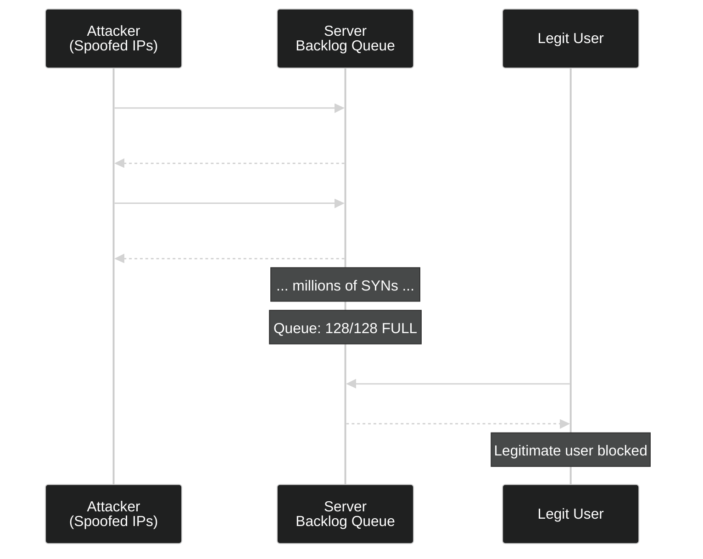
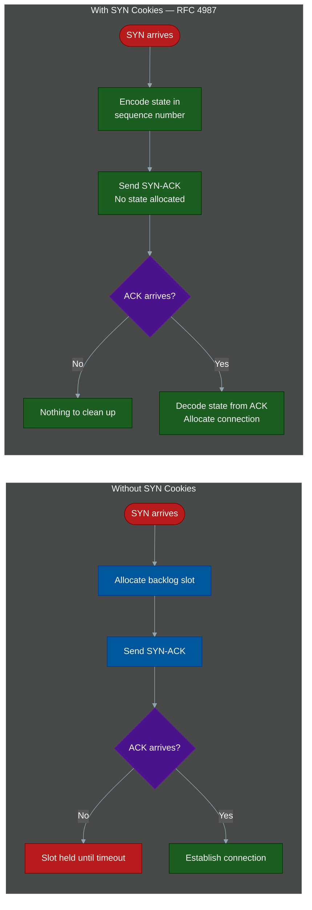
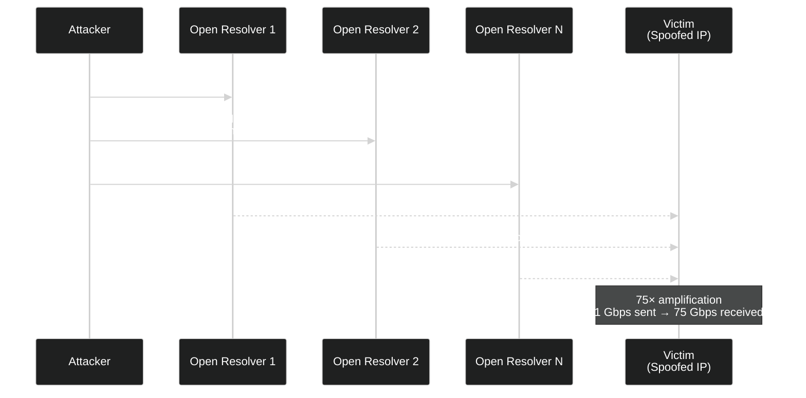
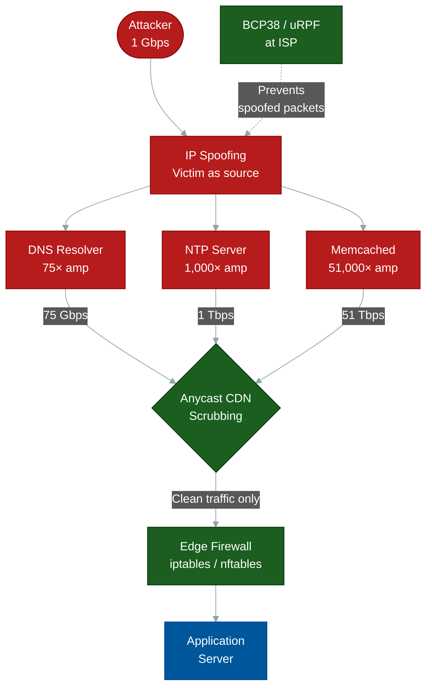

# Network-Level DDoS: Volumetric & Amplification Attacks

**Author:** ichamrong  
**Category:** Security & Architecture  
**Read Time:** ~20 min  

---

## 📌 Table of Contents
- [The Physics of a Volumetric Attack](#the-physics-of-a-volumetric-attack)
- [1. SYN Flood](#1-syn-flood)
  - [How TCP Handshakes Work](#how-tcp-handshakes-work)
  - [The Attack](#the-attack)
  - [Defense: SYN Cookies (RFC 4987)](#defense-syn-cookies-rfc-4987)
- [2. UDP Flood](#2-udp-flood)
  - [The Stateless Protocol Problem](#the-stateless-protocol-problem)
  - [Defense Stack](#defense-stack)
- [3. DNS Amplification Attack](#3-dns-amplification-attack)
  - [The Amplification Mechanic](#the-amplification-mechanic)
  - [Defense](#defense-4)
- [4. NTP Amplification Attack](#4-ntp-amplification-attack)
  - [The MONLIST Command](#the-monlist-command)
  - [Defense](#defense-4)
- [5. Memcached Amplification — 51,000×](#5-memcached-amplification-51000)
  - [The Most Extreme Amplification Vector Known](#the-most-extreme-amplification-vector-known)
  - [Defense](#defense-4)
- [6. ICMP Flood (Ping Flood / Smurf Attack)](#6-icmp-flood-ping-flood-smurf-attack)
  - [Modern Ping Flood](#modern-ping-flood)
  - [The Historic Smurf Attack](#the-historic-smurf-attack)
  - [Defense](#defense-4)
- [7. BGP Hijacking as DDoS Setup](#7-bgp-hijacking-as-ddos-setup)
  - [How BGP Controls the Internet](#how-bgp-controls-the-internet)
  - [The Hijack Mechanism](#the-hijack-mechanism)
  - [Defense](#defense-4)
- [8. Reflection Attacks — The General Pattern](#8-reflection-attacks-the-general-pattern)
  - [The Three Requirements](#the-three-requirements)
  - [Amplification Factor Table](#amplification-factor-table)
  - [The Universal Defense Formula](#the-universal-defense-formula)
- [Infrastructure Defense Stack](#infrastructure-defense-stack)
- [Complete Linux Kernel Hardening Reference](#complete-linux-kernel-hardening-reference)
- [Operational Runbook: Detecting and Responding to a Volumetric Attack](#operational-runbook-detecting-and-responding-to-a-volumetric-attack)
  - [Step 1 — Identify Attack Type](#step-1-identify-attack-type)
  - [Step 2 — Emergency Mitigations](#step-2-emergency-mitigations)
  - [Step 3 — Engage Upstream Defenses](#step-3-engage-upstream-defenses)
- [Key Takeaways](#key-takeaways)
- [📚 References & Tools](#references-tools)

---

[← SSE Defense](./05-sse-defense.md) | [API & GraphQL Defense →](./07-api-graphql-defense.md)

---

Layer 3 and Layer 4 DDoS attacks do not care about your application code. They do not exploit business logic or SQL injection vulnerabilities. They target something far more fundamental: the physical capacity of the network itself. If you can flood a pipe faster than it can drain, nothing behind it can function — regardless of how well-engineered your application is.

This document is a complete engineering reference for every major volumetric attack class, how each one exploits a specific protocol weakness, and the exact defenses that neutralize them.

---

## The Physics of a Volumetric Attack

Before examining individual attack types, internalize the core invariant: **a network link has a fixed bandwidth ceiling.** A data center with a 10 Gbps uplink cannot receive more than 10 Gbps. If an attacker delivers 100 Gbps of traffic to that link, 90% of it is dropped — including legitimate user traffic.

The attacker's engineering problem is: *how do I generate 100 Gbps of attack traffic when I only own hardware capable of 1 Gbps?*

The answer is **amplification** — finding third-party services on the internet that will multiply the attacker's traffic on their behalf, and **directing** that amplified traffic at the victim using IP spoofing.

---

## 1. SYN Flood

### How TCP Handshakes Work

TCP is a *stateful* protocol. Before any data flows, both sides must agree to a connection via a three-way handshake:

1. **Client → Server:** `SYN` — "I want to connect, my sequence number is X."
2. **Server → Client:** `SYN-ACK` — "Acknowledged. My sequence number is Y, waiting for your ACK."
3. **Client → Server:** `ACK` — "Acknowledged. Connection established."

The critical problem: after step 2, the server has committed memory to this half-open connection. The OS allocates a slot in the **SYN backlog queue** to track the pending handshake. On Linux, this queue defaults to **128 entries**. The server waits for the final ACK before the slot is freed.

### The Attack

The attacker sends millions of `SYN` packets per second with **spoofed source IP addresses** — addresses that either do not exist or belong to innocent third parties. The server responds to each with a `SYN-ACK`, allocates a backlog slot, and waits. The ACK never arrives. The backlog queue fills to capacity in milliseconds.

Every new legitimate connection attempt receives a TCP RST (`Connection refused`) because no backlog slots remain. The server appears down — not because it ran out of CPU or bandwidth, but because it ran out of a 128-entry queue.



### Defense: SYN Cookies (RFC 4987)

SYN Cookies eliminate the state allocation problem entirely. The server does **not** allocate a backlog slot on receiving a SYN. Instead, it encodes all connection state into the **sequence number** of the SYN-ACK it sends back.

The sequence number is a cryptographic hash of:
- Client IP and port
- Server IP and port
- A time-based secret

When the legitimate client sends the final ACK, the server **decodes** the connection state from the acknowledgment number (which must equal the sequence number + 1). Only then does it allocate resources.

A spoofed SYN packet whose ACK will never arrive never consumes server memory. The backlog queue is never filled.



**Linux kernel configuration:**

```bash
# /etc/sysctl.conf

# Enable SYN cookies — eliminates half-open connection exhaustion
net.ipv4.tcp_syncookies = 1

# Increase the SYN backlog queue (defense-in-depth alongside SYN cookies)
net.ipv4.tcp_max_syn_backlog = 65535

# Reduce SYN-ACK retransmissions — free slots faster under attack
net.ipv4.tcp_synack_retries = 2

# Reduce how long a half-open connection waits before timeout
net.ipv4.tcp_syn_retries = 3
```

Apply with: `sysctl -p /etc/sysctl.conf`

---

## 2. UDP Flood

### The Stateless Protocol Problem

UDP has no handshake, no connection state, and no built-in flow control. Any machine on the internet can send a UDP datagram to any port on any server with zero negotiation. This is by design — UDP's simplicity makes it ideal for DNS, video streaming, and gaming.

The attacker sends millions of UDP packets per second to random high-numbered ports on the victim. For each packet arriving at a closed port, the Linux kernel must:
1. Look up whether any socket is bound to that port.
2. Determine no socket exists.
3. Generate and send an ICMP "Port Unreachable" (type 3, code 3) response.

The victim's CPU is consumed by this lookup-and-reply loop. The outbound ICMP responses also consume upload bandwidth. The server does not need to exhaust RAM or disk — pure CPU and bandwidth saturation crash it.

### Defense Stack

**At the kernel level** — rate limit ICMP generation to prevent the reply amplification self-attack:

```bash
# Limit ICMP responses to 1000 per second (prevents bandwidth exhaustion from replies)
net.ipv4.icmp_ratelimit = 1000
net.ipv4.icmp_ratemask = 6168
```

**At the firewall (iptables/nftables)** — rate limit UDP per source IP at the edge:

```bash
# Drop UDP packets exceeding 100/sec per source IP
iptables -A INPUT -p udp -m hashlimit \
  --hashlimit-above 100/sec \
  --hashlimit-burst 200 \
  --hashlimit-mode srcip \
  --hashlimit-name udp_flood \
  -j DROP
```

**At the network edge** — the real defense for volumetric UDP floods is upstream. Cloudflare and AWS Shield absorb UDP floods at their anycast Points of Presence. A 500 Gbps UDP flood directed at a Cloudflare-protected IP is absorbed across 300+ global data centers before a single packet reaches your infrastructure.

---

## 3. DNS Amplification Attack

### The Amplification Mechanic

Open DNS resolvers — servers that answer DNS queries from any source IP on the internet — are the weapon. The attacker exploits the asymmetry between query size and response size.

A DNS `ANY` or `TXT` query for a domain with a large record might be 40 bytes. The DNS response can be 3,000–4,000 bytes. The attacker spoofs the victim's IP address as the query source. The DNS resolver obediently sends the 3,000-byte response to the victim.

**The math:**

```
Amplification factor = Response size / Query size
DNS ANY amplification  = 3,000 bytes / 40 bytes = 75×

If attacker sends:   1 Gbps of spoofed DNS queries
Victim receives:     75 Gbps of DNS responses
```

There are millions of open DNS resolvers globally. The attacker does not need to generate 75 Gbps themselves — they distribute 1 Gbps of queries across thousands of resolvers.



### Defense

**Response Rate Limiting (RRL)** on authoritative DNS servers — limits the rate at which the same response is sent to the same IP. An ISC BIND configuration:

```
rate-limit {
    responses-per-second 10;
    window 5;
    slip 2;
    qps-scale 250;
    ipv4-prefix-length 24;
};
```

**Disable open recursion** — authoritative DNS servers should never answer recursive queries from arbitrary IPs:

```
# BIND named.conf
allow-recursion { 127.0.0.1; 10.0.0.0/8; };
allow-query-cache { 127.0.0.1; 10.0.0.0/8; };
```

**Use Cloudflare DNS or AWS Route53** — both implement DDoS scrubbing and RRL internally. Your DNS infrastructure is protected by the same anycast network that absorbs the attack.

**BCP38 at the ISP level** — the root fix is preventing IP spoofing. BCP38 (Unicast Reverse Path Forwarding) requires ISPs to drop packets where the source IP is not routable back through the interface it arrived on. If every ISP implemented uRPF, amplification attacks would be impossible.

---

## 4. NTP Amplification Attack

### The MONLIST Command

NTP (Network Time Protocol) servers maintain a list of the last 600 hosts they synchronized with. The `MONLIST` command returns this entire list — potentially hundreds of kilobytes of data in response to a 8-byte request.

**Amplification factor:** up to **1,000×**

```
Attacker sends:   8-byte MONLIST request to NTP server (spoofing victim IP)
NTP server sends: 8,000 bytes of peer list to victim IP

1 Gbps of MONLIST queries → ~1 Tbps reaching the victim
```

This attack vector was responsible for several record-setting DDoS attacks between 2013 and 2015.

### Defense

**Disable MONLIST** — this is the single most important fix. In `/etc/ntp.conf`:

```
# Disable MONLIST and all monitoring queries from external sources
restrict default kod nomodify notrap nopeer noquery
restrict -6 default kod nomodify notrap nopeer noquery

# Allow localhost
restrict 127.0.0.1
restrict ::1
```

**Migrate to NTPsec** — NTPsec is a hardened fork of the reference NTP implementation that removed MONLIST entirely:

```bash
apt install ntpsec   # Debian/Ubuntu
# MONLIST does not exist in NTPsec
```

**Firewall NTP UDP at the edge** — if you do not provide public NTP service, block inbound UDP port 123 at the network perimeter. Your servers should only receive NTP from designated upstream servers.

---

## 5. Memcached Amplification — 51,000×

### The Most Extreme Amplification Vector Known

Memcached is an in-memory key-value cache used by Facebook, Wikipedia, and virtually every high-traffic application. In 2018, a Memcached amplification attack set the then-record for the largest DDoS ever recorded: **1.35 Tbps** against GitHub and **1.7 Tbps** against an unnamed US service provider.

The attack mechanics exploit two design decisions:
1. Memcached supports **UDP** (no connection overhead).
2. Memcached has **no authentication** on UDP.
3. A single Memcached instance can hold **megabyte-sized values**.

The attacker sends 15 bytes to UDP port 11211 of exposed Memcached instances:

```
\x00\x01\x00\x00\x00\x01\x00\x00gets\r\n
```

This is a `gets` command. If the cache contains a large cached object (which the attacker may have pre-seeded), the Memcached server returns the entire value — potentially **1 MB or more** — to the spoofed victim IP.

**The arithmetic:**

```
Request size:       15 bytes
Response size:      1,000,000 bytes (1MB cached object)
Amplification:      1,000,000 / 15 = 66,666×

Attacker sends:     1 Gbps of Memcached UDP requests
Victim receives:    ~66 Tbps
```

This is not a theoretical maximum — the 1.35 Tbps attack on GitHub in 2018 originated from approximately 50,000 exposed Memcached servers.

### Defense

**Never expose Memcached to the public internet.** This is the primary rule. Memcached must be firewalled:

```bash
# iptables — block all external access to Memcached
iptables -A INPUT -p tcp --dport 11211 -s 127.0.0.1 -j ACCEPT
iptables -A INPUT -p udp --dport 11211 -s 127.0.0.1 -j ACCEPT
iptables -A INPUT -p tcp --dport 11211 -j DROP
iptables -A INPUT -p udp --dport 11211 -j DROP
```

**Disable UDP in Memcached** — if you have no legacy requirement for UDP access, disable it entirely in `/etc/memcached.conf`:

```
# Disable UDP listener — prevents amplification use
-U 0
```

**Bind to Unix socket only** — for applications on the same host:

```
# Bind to Unix socket instead of TCP/UDP
-s /var/run/memcached/memcached.sock
-a 0660
```

Verify no Memcached instances are internet-exposed using:

```bash
# Check for internet-exposed Memcached (run from external host)
echo -e '\x00\x01\x00\x00\x00\x01\x00\x00stats\r\n' | nc -u -w1 <target-ip> 11211
```

---

## 6. ICMP Flood (Ping Flood / Smurf Attack)

### Modern Ping Flood

The attacker sends continuous streams of ICMP echo requests (`ping`) to the victim. Each request forces the victim's kernel to generate an ICMP echo reply. At sufficient volume, this exhausts upload bandwidth and CPU interrupt handling capacity.

Modern ICMP floods are rarely volume-competitive with UDP or amplification attacks, but they are often used as a component of multi-vector attacks — occupying CPU while UDP/SYN attacks fill bandwidth.

### The Historic Smurf Attack

The Smurf attack (named after the Smurf DDoS tool, c. 1997) exploited IP directed broadcasts:
1. Attacker sends ICMP echo request to a **network broadcast address** (e.g., 192.168.1.255).
2. The packet's source IP is spoofed to the victim's address.
3. Every host on that subnet replies to the victim with ICMP echo replies.
4. A /24 subnet with 253 hosts gives 253× amplification with a single packet.

Modern routers disable directed broadcast forwarding by default (`no ip directed-broadcast` in Cisco IOS), rendering Smurf attacks obsolete.

### Defense

**Rate limit ICMP at the edge router** — allow legitimate ping diagnostics while capping flood volume:

```bash
# iptables — rate limit ICMP to 10 per second per source IP
iptables -A INPUT -p icmp --icmp-type echo-request \
  -m limit --limit 10/s --limit-burst 20 -j ACCEPT
iptables -A INPUT -p icmp --icmp-type echo-request -j DROP
```

**Block directed broadcasts at all routers:**

```
# Cisco IOS — disable on every interface
interface GigabitEthernet0/0
  no ip directed-broadcast
```

**Linux kernel ICMP response limiting:**

```bash
# /etc/sysctl.conf
net.ipv4.icmp_echo_ignore_broadcasts = 1
net.ipv4.icmp_ignore_bogus_error_responses = 1
```

---

## 7. BGP Hijacking as DDoS Setup

### How BGP Controls the Internet

The Border Gateway Protocol (BGP) is the routing protocol that connects autonomous systems (AS) — the large networks operated by ISPs, cloud providers, and enterprises. BGP routers advertise which IP prefixes they can reach. Every router on the internet builds a forwarding table based on these advertisements.

BGP operates on trust: any AS can announce a route for any IP prefix, and neighboring routers will accept and propagate it. There is no built-in cryptographic verification.

### The Hijack Mechanism

An attacker with access to a BGP router (directly or through a compromised ISP) announces a **more specific route** (a longer prefix match) for the victim's IP space:

```
Victim legitimately owns:  203.0.113.0/24
Attacker announces:        203.0.113.0/25  ← more specific, preferred by BGP
                           203.0.113.128/25 ← covers the other half
```

BGP routers globally prefer the longer prefix match. Traffic destined for the victim is redirected to the attacker's AS — either dropped (blackhole DoS) or rerouted through a man-in-the-middle.

Notable real-world incidents: Pakistan Telecom hijacking YouTube (2008), Rostelecom hijacking 8,800 prefixes from Amazon, Google, and Cloudflare (2020).

### Defense

**RPKI (Resource Public Key Infrastructure)** — a cryptographic system where IP address holders sign Route Origin Authorizations (ROAs) that specify which AS is permitted to originate each prefix:

```
# ROA example (published to RPKI repository)
Origin AS:   AS64512
Prefix:      203.0.113.0/24
Max length:  24
```

Routers performing RPKI validation reject RPKI-invalid routes — routes where the originating AS does not match the signed ROA. As of 2024, over 50% of internet prefixes are RPKI-signed.

**BGP route filtering** — configure prefix-lists and AS-path filters at peering sessions to only accept routes that make topological sense.

**Continuous monitoring** — services that alert on unauthorized route announcements:
- [RIPE Stat BGP Looking Glass](https://stat.ripe.net)
- BGPmon — real-time prefix hijack alerts
- Cloudflare Radar BGP alerts

---

## 8. Reflection Attacks — The General Pattern

Every amplification attack follows the same structural pattern. Understanding it allows you to identify new amplification vectors before they are weaponized.

### The Three Requirements

1. **Stateless or connectionless protocol** — UDP, ICMP, or any protocol that responds without a handshake (no IP spoofing verification possible).
2. **Asymmetric request/response size** — small request triggers large response.
3. **Widely deployed open services** — millions of instances reachable on the internet.

### Amplification Factor Table

| Protocol | Port | Amplification Factor | Record Attack Size |
|----------|------|---------------------|--------------------|
| Memcached | UDP 11211 | 51,000× | 1.7 Tbps (2018) |
| NTP MONLIST | UDP 123 | 1,000× | 400 Gbps (2014) |
| DNS ANY | UDP 53 | 75× | 1.2 Tbps (2016) |
| CLDAP | UDP 389 | 70× | 24 Gbps (2017) |
| SSDP | UDP 1900 | 30× | 100 Gbps (2015) |
| CharGEN | UDP 19 | 358× | Historical |
| QOTD | UDP 17 | 140× | Historical |

### The Universal Defense Formula

```
Attack_bandwidth = Attacker_bandwidth × Amplification_factor

To survive: CDN_capacity > Attack_bandwidth
```

No single-server defense survives a 1 Tbps attack. The architectural answer is always an anycast CDN with sufficient global absorption capacity.

**The protocol-level fixes:**
- **BCP38 / uRPF** at ISPs: drop packets where source IP is not routable through the ingress interface. Eliminates IP spoofing at the source.
- **Ingress filtering** on all customer-facing router interfaces at ISPs.
- **Protocol-specific hardening**: disable MONLIST, close open resolvers, firewall Memcached.



---

## Infrastructure Defense Stack

Network-level DDoS defense is not a single product — it is a layered architecture where each layer handles the threats it is most capable of absorbing.

```mermaid
%%{init: {'theme': 'dark', 'themeVariables': {'primaryColor': '#37474f', 'primaryTextColor': '#ffffff', 'lineColor': '#90a4ae',
    'background': '#1e1e1e'},
  'themeCSS': 'svg { background-color: #1e1e1e !important; padding: 1rem !important; border-radius: 8px !important; } .edgeLabel rect { fill: #1e1e1e !important; } text, tspan, .messageText, .signalText, .edgeLabel, .edgeLabel span, .pointLabel, .axisLabel, .quadrantTitle, .quadrantLabel { fill: #ffffff !important; color: #ffffff !important; stroke: none !important; }'
}}%%
flowchart TB
    classDef attack fill:#b71c1c,stroke:#7f0000,color:#fff
    classDef defense fill:#1b5e20,stroke:#003300,color:#fff
    classDef process fill:#01579b,stroke:#003c8f,color:#fff
    classDef decision fill:#4a148c,stroke:#6a1b9a,color:#fff

    INTERNET([Internet Traffic<br/>Including Attack]):::attack

    subgraph L1["Layer 1 — Upstream ISP"]
        BGP[BGP Blackholing<br/>RTBH Signaling]:::defense
        RPKI_V[RPKI Validation<br/>Route Filtering]:::defense
        UPRATE[Upstream Rate<br/>Limiting]:::defense
    end

    subgraph L2["Layer 2 — Anycast CDN"]
        ANYCAST[Anycast Absorption<br/>300+ PoPs]:::defense
        SCRUB[Scrubbing Centers<br/>GRE Tunnel Return]:::defense
        AMPRB[Amplification<br/>Reflection Block]:::defense
    end

    subgraph L3["Layer 3 — Server Edge"]
        SYNCK[SYN Cookies<br/>tcp_syncookies=1]:::defense
        IPT[iptables / nftables<br/>Rate Limiting Rules]:::defense
        SYSCTL[Kernel Hardening<br/>sysctl tuning]:::defense
    end

    subgraph L4["Layer 4 — Application"]
        CONNLIM[Connection Limits<br/>per Source IP]:::defense
        RATELIM[App-Level Rate<br/>Limiting]:::defense
        HEALTH[Health Checks<br/>Circuit Breakers]:::defense
    end

    APP([Application<br/>Serves Legit Users]):::process

    INTERNET --> L1
    L1 --> L2
    L2 --> L3
    L3 --> L4
    L4 --> APP
```



| Layer | Owner | Handles | Tools |
|-------|-------|---------|-------|
| ISP Upstream | ISP / Transit Provider | Volumetric floods >100 Gbps, BGP hijacks | RTBH, RPKI, uRPF/BCP38 |
| Anycast CDN | Cloudflare, AWS Shield, Akamai | Amplification attacks, SYN floods, UDP floods | Anycast absorption, scrubbing centers |
| Server Edge | DevOps / SRE | Residual volumetric, connection floods | iptables, nftables, kernel sysctl |
| Application | Engineering | Connection exhaustion, slow attacks | nginx rate limiting, connection pools |

---

## Complete Linux Kernel Hardening Reference

Apply these settings in `/etc/sysctl.conf` and activate with `sysctl -p`:

```bash
# ============================================================
# /etc/sysctl.conf — DDoS Mitigation Kernel Parameters
# ============================================================

# ----- SYN Flood Defense -----
# Enable SYN cookies (RFC 4987) — prevents half-open connection exhaustion
net.ipv4.tcp_syncookies = 1

# Maximum number of queued half-open connections
net.ipv4.tcp_max_syn_backlog = 65535

# Number of SYN-ACK retransmits before giving up on a half-open connection
# Lower value = faster recycling of backlog slots under attack
net.ipv4.tcp_synack_retries = 2

# Client SYN retry limit
net.ipv4.tcp_syn_retries = 3

# ----- Connection Tracking -----
# Maximum tracked connections in conntrack table
net.netfilter.nf_conntrack_max = 1048576

# TCP connection timeout in ESTABLISHED state (seconds)
net.netfilter.nf_conntrack_tcp_timeout_established = 600

# TIME_WAIT state timeout — reduce to recycle ports faster
net.netfilter.nf_conntrack_tcp_timeout_time_wait = 30

# Allow TIME_WAIT sockets to be reused (safe with sequence numbers)
net.ipv4.tcp_tw_reuse = 1

# ----- ICMP Hardening -----
# Ignore ICMP broadcasts (Smurf attack defense)
net.ipv4.icmp_echo_ignore_broadcasts = 1

# Ignore bogus ICMP error responses
net.ipv4.icmp_ignore_bogus_error_responses = 1

# Rate limit ICMP responses generated by the kernel
net.ipv4.icmp_ratelimit = 1000

# ----- IP Spoofing / Source Validation -----
# Enable Reverse Path Filtering (loose mode=2, strict mode=1)
# Drops packets where source IP is not routable back through arrival interface
net.ipv4.conf.all.rp_filter = 1
net.ipv4.conf.default.rp_filter = 1

# Do not accept source routed packets (attacker-specified routing)
net.ipv4.conf.all.accept_source_route = 0
net.ipv4.conf.default.accept_source_route = 0

# ----- Routing & Redirect Defense -----
# Do not accept ICMP redirects (prevents routing table manipulation)
net.ipv4.conf.all.accept_redirects = 0
net.ipv4.conf.default.accept_redirects = 0
net.ipv6.conf.all.accept_redirects = 0

# Do not send ICMP redirects
net.ipv4.conf.all.send_redirects = 0
net.ipv4.conf.default.send_redirects = 0

# ----- TCP Performance Under Load -----
# Increase socket receive/send buffer maximums
net.core.rmem_max = 134217728
net.core.wmem_max = 134217728
net.core.netdev_max_backlog = 300000

# Increase the listen backlog for accept() queue
net.core.somaxconn = 65535

# ----- IPv4 Fragmentation -----
# Limit memory used for packet reassembly
net.ipv4.ipfrag_high_thresh = 8388608
net.ipv4.ipfrag_low_thresh = 6291456
net.ipv4.ipfrag_time = 30
```

---

## Operational Runbook: Detecting and Responding to a Volumetric Attack

### Step 1 — Identify Attack Type

```bash
# Watch real-time packet statistics by protocol
watch -n1 "netstat -s | grep -E 'failed|overflow|SYN|drop'"

# View connection state counts
ss -s

# Count connections per source IP (identify flood sources)
ss -nt | awk 'NR>1 {print $5}' | cut -d: -f1 | sort | uniq -c | sort -rn | head 20

# Check for UDP amplification (port 11211, 53, 123)
tcpdump -nn -c 1000 'udp port 11211 or udp port 53 or udp port 123' | awk '{print $3}' | cut -d. -f1-4 | sort | uniq -c | sort -rn
```

### Step 2 — Emergency Mitigations

```bash
# If under SYN flood — verify SYN cookies are enabled
sysctl net.ipv4.tcp_syncookies

# Temporarily enable null routing for attacking IP range (blackhole)
ip route add blackhole 192.0.2.0/24

# Drop all traffic to a specific port under amplification attack
iptables -A INPUT -p udp --dport 11211 -j DROP

# Rate limit new connections globally during active attack
iptables -A INPUT -p tcp --syn -m limit --limit 500/s --limit-burst 1000 -j ACCEPT
iptables -A INPUT -p tcp --syn -j DROP
```

### Step 3 — Engage Upstream Defenses

Contact your ISP for **Remotely Triggered Black Hole (RTBH)** routing — the ISP drops all traffic to your IP at their upstream router before it reaches your data center link. This kills legitimate traffic too, but protects the link.

If using Cloudflare, enable **Under Attack Mode** via API:

```bash
curl -X PATCH "https://api.cloudflare.com/client/v4/zones/${ZONE_ID}/settings/security_level" \
  -H "Authorization: Bearer ${CF_API_TOKEN}" \
  -H "Content-Type: application/json" \
  --data '{"value":"under_attack"}'
```

---

## Key Takeaways

**On protocol design:** Every amplification attack exists because a protocol was designed with functionality in mind and security as an afterthought. MONLIST was a useful debugging feature. Memcached UDP was a performance optimization. DNS ANY records were a convenience. Each became a weapon because of IP spoofing.

**On defense architecture:** You cannot engineer your way out of a 1 Tbps attack with a single server. The physics are absolute. The architectural answer is distribution — anycast edges with aggregate capacity exceeding the largest realistic attack.

**On IP spoofing:** If every ISP implemented BCP38/uRPF, amplification attacks would be impossible. The challenge is collective action: individual ISPs bear the cost of implementation while the benefit is distributed globally. This is the fundamental governance failure that keeps amplification attacks viable in 2024.

**On the kernel:** The Linux kernel's default network settings are optimized for correctness, not adversarial conditions. Production internet-facing servers must be hardened with the sysctl parameters above before exposure.

## 📚 References & Tools
- **RFC 4987 (SYN Flood Countermeasures)** — [rfc-editor.org/rfc/rfc4987](https://www.rfc-editor.org/rfc/rfc4987)
- **Linux conntrack documentation** — [kernel.org/doc/Documentation/networking/nf_conntrack-sysctl.txt](https://www.kernel.org/doc/Documentation/networking/nf_conntrack-sysctl.txt)

---

[← SSE Defense](./05-sse-defense.md) | [API & GraphQL Defense →](./07-api-graphql-defense.md)

## Related

- [Bot Protection & CAPTCHAs](../bot-protection/README.md)
- [Session & Cookie Security](../session-and-cookie-security/README.md)
- [API Gateways & Reverse Proxies](../../devops/api-gateways/README.md)
