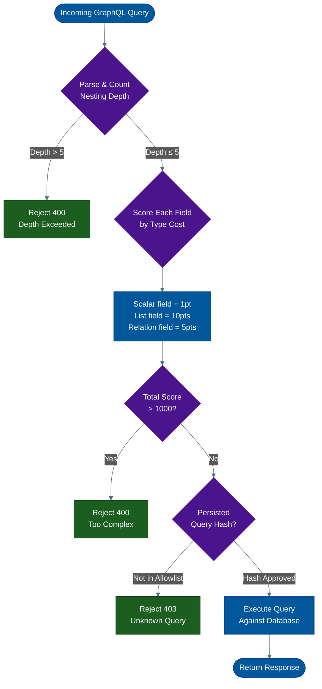
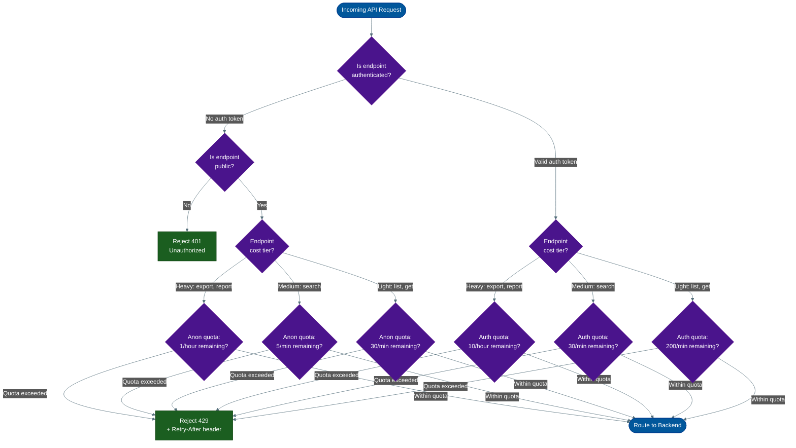
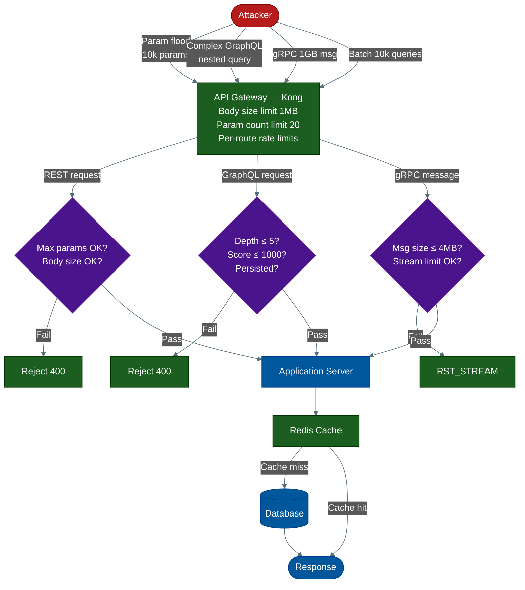

---

## 📌 Table of Contents
- [1. REST API Parameter Flooding](#1-rest-api-parameter-flooding)
  - [The Attack](#the-attack-7)
  - [Defense](#defense-5)
- [2. GraphQL Complexity Attack (Nested Query DDoS)](#2-graphql-complexity-attack-nested-query-ddos)
  - [The Attack](#the-attack-7)
  - [The GraphQL Complexity Scoring Model](#the-graphql-complexity-scoring-model)
  - [Defense — Apollo GraphQL (Node.js)](#defense-apollo-graphql-nodejs)
  - [Defense — Spring GraphQL (Java)](#defense-spring-graphql-java)
- [3. GraphQL Introspection Abuse](#3-graphql-introspection-abuse)
  - [The Attack](#the-attack-7)
  - [Defense](#defense-5)
- [4. GraphQL Batch Query Attack](#4-graphql-batch-query-attack)
  - [The Attack](#the-attack-7)
  - [Defense](#defense-5)
- [5. gRPC Streaming Flood](#5-grpc-streaming-flood)
  - [The Attack](#the-attack-7)
  - [The gRPC Stream Lifecycle](#the-grpc-stream-lifecycle)
  - [Defense — Go gRPC Server](#defense-go-grpc-server)
  - [Defense — Java gRPC Server](#defense-java-grpc-server)
- [6. gRPC Large Message Attack](#6-grpc-large-message-attack)
  - [The Attack](#the-attack-7)
  - [Defense](#defense-5)
- [7. REST Endpoint Enumeration + Targeted Flood](#7-rest-endpoint-enumeration-targeted-flood)
  - [The Attack](#the-attack-7)
  - [Defense](#defense-5)
- [8. Webhook Callback DDoS (Amplification via Your Own Infrastructure)](#8-webhook-callback-ddos-amplification-via-your-own-infrastructure)
  - [The Attack](#the-attack-7)
  - [Defense](#defense-5)
- [Comprehensive Defense Architecture](#comprehensive-defense-architecture)
- [Defense Summary Matrix](#defense-summary-matrix)
- [Key Principles](#key-principles)
- [📚 References & Tools](#references-tools)

---
author: ichamrong
category: Security & Architecture
readTime: ~20 min
---

# API-Layer DDoS: Attacking REST, GraphQL, and gRPC

**Author:** ichamrong  
**Category:** Security & Architecture  
**Read Time:** ~20 min  

---

Every API protocol you expose to the internet creates a new attack surface. REST, GraphQL, and gRPC each have protocol-specific vulnerabilities that go far beyond what a naive rate limiter can catch. A volumetric flood sends noise. An API-layer DDoS sends **perfectly valid protocol messages** that exploit the computational cost of your own business logic. This document dissects every known API DDoS vector and the engineering defenses that neutralize each one.

---

## 1. REST API Parameter Flooding

### The Attack

Most web frameworks — Spring Boot, Express, Django, Rails — parse every query parameter in an incoming URL into an in-memory dictionary before routing reaches your controller. This behavior is unconditional. The framework does not know how many parameters are "normal." It simply obeys the HTTP specification.

An attacker exploits this by crafting a URL with thousands of query parameters:

```
GET /api/search?a1=x&a2=x&a3=x&...&a9999=x HTTP/1.1
```

A 10,000-parameter URL causes the framework to allocate a 10,000-key hash map for every single request. Under concurrent load, this saturates CPU and heap memory. The attack is amplified by the fact that each parameter key-value pair must be URL-decoded and interned as a string object.

The same vector applies to POST bodies. JSON arrays deserve special attention:

```json
POST /api/users/bulk-update
{"ids": [1, 2, 3, 4, ... 1000000]}
```

Your controller receives this, attempts to iterate a million-element array, and issues a million database lookups. One HTTP request. One developer who never thought to check array length.

### Defense

**At the API Gateway (Kong/Nginx) — reject before the app sees it:**

```nginx
# nginx.conf — Gateway-level parameter count enforcement
map $query_string $param_count {
    default 0;
    "~*(([^=&]+=[^&]*)&){20,}" 1;  # flag if 20+ param pairs found
}

server {
    client_max_body_size 1m;        # Reject bodies > 1MB

    location /api/ {
        if ($param_count) {
            return 400 "Too many query parameters";
        }
        proxy_pass http://backend;
    }
}
```

**Kong plugin configuration:**

```yaml
# kong.yml — Request Size Limiting plugin
plugins:
  - name: request-size-limiting
    config:
      allowed_payload_size: 1        # 1MB hard limit
      size_unit: megabytes
      require_content_length: true
```

**JSON Schema validation in Spring Boot — reject oversized arrays:**

```java
// BulkUpdateRequest.java
public class BulkUpdateRequest {

    @Size(max = 1000, message = "Cannot process more than 1000 ids per request")
    @NotNull
    private List<Long> ids;
}
```

```java
// In application.properties — also limit server request parsing
server.tomcat.max-parameter-count=50
server.tomcat.max-swallow-size=512KB
```

**Parameter count limit in Express (Node.js):**

```javascript
// middleware/requestGuard.js
function parameterCountGuard(req, res, next) {
  const paramCount = Object.keys(req.query).length;
  if (paramCount > 20) {
    return res.status(400).json({
      error: "Request exceeds maximum query parameter count (20)"
    });
  }
  next();
}

app.use('/api/', parameterCountGuard);
```

---

## 2. GraphQL Complexity Attack (Nested Query DDoS)

### The Attack

GraphQL's defining feature is field-level granularity. Clients ask for exactly what they need. But this same expressiveness allows an attacker to issue a query that resolves exponentially. Each nesting level does not add — it multiplies. A `friends` field that returns 50 users, nested 6 levels deep, forces the resolver to issue 50^6 = **15,625,000,000** potential node fetches.

```graphql
{
  user(id: 1) {
    friends {
      friends {
        friends {
          friends {
            posts {
              comments {
                likes {
                  user {
                    friends {
                      name
                    }
                  }
                }
              }
            }
          }
        }
      }
    }
  }
}
```

This is a single HTTP request. It is syntactically valid. It passes schema validation. Your GraphQL engine will begin resolving it faithfully, spawning database queries in the thousands before the server collapses.

### The GraphQL Complexity Scoring Model



### Defense — Apollo GraphQL (Node.js)

```javascript
// server.js — Apollo Server with depth and complexity defense
import { ApolloServer } from '@apollo/server';
import depthLimit from 'graphql-depth-limit';
import { createComplexityLimitRule } from 'graphql-validation-complexity';

const server = new ApolloServer({
  typeDefs,
  resolvers,
  introspection: false,                  // CRITICAL: disabled in production
  validationRules: [
    depthLimit(5),                        // Reject queries deeper than 5 levels
    createComplexityLimitRule(1000, {     // Reject if total cost > 1000
      scalarCost: 1,
      objectCost: 5,
      listFactor: 10,
      onCost: (cost) => {
        metrics.histogram('graphql.query.cost', cost);
      },
    }),
  ],
});
```

**Persisted queries — only allow pre-approved query hashes:**

```javascript
// Automatic Persisted Queries (APQ) — clients must register queries first
import { ApolloServer } from '@apollo/server';
import { createPersistedQueryLink } from '@apollo/client/link/persisted-queries';

// Server: reject any non-persisted query in production
const server = new ApolloServer({
  typeDefs,
  resolvers,
  plugins: [
    {
      async requestDidStart() {
        return {
          async didResolveOperation({ request, document }) {
            if (process.env.NODE_ENV === 'production' && !request.extensions?.persistedQuery) {
              throw new ForbiddenError('Only persisted queries are accepted in production');
            }
          }
        };
      }
    }
  ]
});
```

### Defense — Spring GraphQL (Java)

```java
// application.yml — Spring for GraphQL
spring:
  graphql:
    graphiql:
      enabled: false           # Disable GraphiQL UI in production
    schema:
      introspection:
        enabled: false         # Disable introspection

# Custom depth-limiting interceptor
@Component
public class QueryDepthInterceptor implements WebGraphQlInterceptor {

    private static final int MAX_DEPTH = 5;

    @Override
    public Mono<WebGraphQlResponse> intercept(WebGraphQlRequest request, Chain chain) {
        Document document = Parser.parse(request.getDocument());
        int depth = QueryDepthAnalyzer.getMaxDepth(document);

        if (depth > MAX_DEPTH) {
            GraphQLError error = GraphQLError.newError()
                .message("Query depth " + depth + " exceeds maximum allowed depth of " + MAX_DEPTH)
                .errorType(ErrorType.BAD_REQUEST)
                .build();
            return Mono.just(WebGraphQlResponse.create(
                ExecutionResult.newExecutionResult().addError(error).build()
            ));
        }
        return chain.next(request);
    }
}
```

---

## 3. GraphQL Introspection Abuse

### The Attack

GraphQL ships with a built-in introspection system. Any client can send this query and receive a complete machine-readable map of your entire API schema — every type, every field, every relationship, and every argument:

```graphql
{
  __schema {
    types {
      name
      fields {
        name
        type {
          name
          kind
          ofType {
            name
          }
        }
        args {
          name
          type { name }
        }
      }
    }
  }
}
```

Attackers use this output to:
1. Identify every available mutation (looking for destructive ones)
2. Map relationships between types to design maximum-complexity queries
3. Discover hidden or undocumented fields developers assumed were safe by obscurity
4. Feed the schema into automated attack tools that generate worst-case queries automatically

The introspection query itself is also an expensive operation on large schemas — databases with hundreds of types cause the introspection resolver to allocate enormous response payloads.

### Defense

The defense is absolute: **introspection must be off in production.**

```javascript
// Apollo: hard-disable introspection
const server = new ApolloServer({
  introspection: process.env.NODE_ENV !== 'production',
});
```

```java
// Spring: application.yml
spring:
  graphql:
    schema:
      introspection:
        enabled: ${GRAPHQL_INTROSPECTION_ENABLED:false}
```

**If you need introspection for internal tooling:**

```javascript
// Allow introspection only with an admin bearer token
const server = new ApolloServer({
  introspection: true,
  plugins: [
    {
      async requestDidStart({ request }) {
        return {
          async didResolveOperation({ request, operation }) {
            const isIntrospection = operation.selectionSet.selections.some(
              sel => sel.name?.value === '__schema' || sel.name?.value === '__type'
            );
            if (isIntrospection) {
              const token = request.http?.headers.get('x-admin-token');
              if (token !== process.env.ADMIN_INTROSPECTION_TOKEN) {
                throw new ForbiddenError('Introspection requires admin authentication');
              }
            }
          }
        };
      }
    }
  ]
});
```

---

## 4. GraphQL Batch Query Attack

### The Attack

GraphQL servers optionally support query batching — multiple operations submitted as a JSON array in a single HTTP request:

```json
[
  {"query": "{ user(id: 1) { name email } }"},
  {"query": "{ user(id: 2) { name email } }"},
  ...
  {"query": "{ user(id: 10000) { name email } }"}
]
```

The server processes every query in the array, typically in parallel or sequentially, before returning the combined response. An attacker sends an array of 10,000 queries. The server issues 10,000 full resolver chains. From the network's perspective, it was one HTTP request — standard rate limiters that count HTTP requests per second will not catch it.

### Defense

```javascript
// Apollo: configure batch size limit via batching middleware
import { json } from 'body-parser';

// Intercept before Apollo processes the body
app.use('/graphql', (req, res, next) => {
  if (Array.isArray(req.body)) {
    if (req.body.length > 10) {
      return res.status(400).json({
        error: `Batch size ${req.body.length} exceeds maximum allowed batch size of 10`
      });
    }
    // Reject batching entirely for unauthenticated users
    if (!req.headers.authorization) {
      return res.status(403).json({
        error: 'Query batching requires authentication'
      });
    }
  }
  next();
});
```

```javascript
// Apollo Server 4 — disable batching entirely (recommended for most APIs)
const server = new ApolloServer({
  typeDefs,
  resolvers,
  allowBatchedHttpRequests: false,   // Default in AS4: false — leave it off
});
```

```java
// Spring for GraphQL — disable HTTP batch handling
@Configuration
public class GraphQlConfig {

    @Bean
    public WebMvcGraphQlHandlerMapping graphQlHandlerMapping(
            WebGraphQlHandler handler, GraphQlProperties properties) {
        // Spring for GraphQL does not enable batching by default
        // Explicitly reject array-body requests at the servlet filter level
        return new BatchRejectingGraphQlHandlerMapping(handler, properties);
    }
}

@Component
public class GraphQlBatchGuardFilter extends OncePerRequestFilter {

    @Override
    protected void doFilterInternal(HttpServletRequest req,
                                    HttpServletResponse res,
                                    FilterChain chain) throws IOException, ServletException {
        if ("/graphql".equals(req.getRequestURI())) {
            String body = IOUtils.toString(req.getReader());
            if (body.trim().startsWith("[")) {
                res.setStatus(400);
                res.getWriter().write("{\"error\":\"Batch queries are not permitted\"}");
                return;
            }
        }
        chain.doFilter(req, res);
    }
}
```

---

## 5. gRPC Streaming Flood

### The Attack

gRPC supports four call types: unary, server streaming, client streaming, and bidirectional streaming. Client streaming allows the client to open a long-lived connection and push an unlimited stream of messages before the server sends any response.

An attacker opens thousands of client-streaming or bidirectional-streaming RPC calls and sends a continuous flood of messages, never closing the stream. The gRPC server allocates resources for each active stream — goroutines in Go, threads or reactive slots in Java/Kotlin. With enough concurrent streams, the server runs out of scheduling capacity. New legitimate connections are refused.

```
Client A: Open /upload.Service/StreamUpload → sends 10,000,000 messages → never sends EOF
Client B: Open /upload.Service/StreamUpload → sends 10,000,000 messages → never sends EOF
...
Client N: Open /upload.Service/StreamUpload → (server out of goroutines — connection refused)
```

### The gRPC Stream Lifecycle

```mermaid
%%{init: {'theme': 'dark', 'themeVariables': {'primaryTextColor': '#ffffff', 'lineColor': '#546e7a',
    'background': '#1e1e1e'},
  'themeCSS': 'svg { background-color: #1e1e1e !important; padding: 1rem !important; border-radius: 8px !important; } .edgeLabel rect { fill: #1e1e1e !important; } text, tspan, .messageText, .signalText, .edgeLabel, .edgeLabel span, .pointLabel, .axisLabel, .quadrantTitle, .quadrantLabel { fill: #ffffff !important; color: #ffffff !important; stroke: none !important; }'
}}%%
stateDiagram-v2
    [*] --> IDLE : Client connects

    IDLE --> OPEN : RPC call initiated
    OPEN --> RECEIVING : Server accepts stream

    RECEIVING --> RECEIVING : Client sends message<br/>(count tracked)
    RECEIVING --> TIMEOUT_CLOSED : Stream age > 300s
    RECEIVING --> COUNT_CLOSED : Messages > limit
    RECEIVING --> HALF_CLOSED : Client sends EOF

    HALF_CLOSED --> CLOSED : Server sends response
    TIMEOUT_CLOSED --> [*] : RST_STREAM sent<br/>Resources released
    COUNT_CLOSED --> [*] : RST_STREAM sent<br/>Resources released
    CLOSED --> [*] : Stream complete

    note right of TIMEOUT_CLOSED: Defense: 5-min stream timeout
    note right of COUNT_CLOSED: Defense: max 10k msgs/stream
```

### Defense — Go gRPC Server

```go
// server.go — gRPC server with streaming defense
package main

import (
    "google.golang.org/grpc"
    "google.golang.org/grpc/keepalive"
    "time"
)

func main() {
    s := grpc.NewServer(
        // Limit concurrent streams per connection
        grpc.MaxConcurrentStreams(100),

        // Reject messages larger than 4MB
        grpc.MaxRecvMsgSize(4 * 1024 * 1024),
        grpc.MaxSendMsgSize(4 * 1024 * 1024),

        // Close idle connections aggressively
        grpc.KeepaliveParams(keepalive.ServerParameters{
            MaxConnectionIdle:     5 * time.Minute,   // Close if no messages for 5 min
            MaxConnectionAge:      10 * time.Minute,  // Hard max stream lifetime
            MaxConnectionAgeGrace: 30 * time.Second,  // Grace period for inflight RPCs
            Time:                  2 * time.Minute,   // Ping interval
            Timeout:               20 * time.Second,  // Ping timeout before kill
        }),

        // Enforce client keepalive policy — drop misbehaving clients
        grpc.KeepaliveEnforcementPolicy(keepalive.EnforcementPolicy{
            MinTime:             5 * time.Second,  // Min time between client pings
            PermitWithoutStream: false,
        }),
    )
}
```

**Per-stream message count tracking in Go:**

```go
// Streaming RPC handler with message count defense
func (s *UploadServer) StreamUpload(stream pb.UploadService_StreamUploadServer) error {
    const maxMessages = 10000
    messageCount := 0

    // Stream-level deadline — absolute max lifetime
    ctx, cancel := context.WithTimeout(stream.Context(), 5*time.Minute)
    defer cancel()

    for {
        select {
        case <-ctx.Done():
            return status.Error(codes.DeadlineExceeded, "Stream exceeded maximum duration")
        default:
        }

        req, err := stream.Recv()
        if err == io.EOF {
            break
        }
        if err != nil {
            return err
        }

        messageCount++
        if messageCount > maxMessages {
            return status.Errorf(codes.ResourceExhausted,
                "Stream message count exceeded (max %d)", maxMessages)
        }

        // process req...
        _ = req
    }

    return stream.SendAndClose(&pb.UploadResponse{Status: "ok"})
}
```

### Defense — Java gRPC Server

```java
// GrpcServerConfig.java — Spring Boot gRPC with streaming protection
@Configuration
public class GrpcServerConfig {

    @Bean
    public GrpcServerConfigurer grpcServerConfigurer() {
        return serverBuilder -> serverBuilder
            .maxInboundMessageSize(4 * 1024 * 1024)   // 4MB max message
            .maxInboundMetadataSize(8 * 1024)          // 8KB max headers
            .maxConnectionAge(10, TimeUnit.MINUTES)    // Hard stream lifetime
            .maxConnectionAgeGrace(30, TimeUnit.SECONDS)
            .maxConnectionIdle(5, TimeUnit.MINUTES)
            .permitKeepAliveWithoutCalls(false)
            .permitKeepAliveTime(5, TimeUnit.SECONDS);
    }
}
```

---

## 6. gRPC Large Message Attack

### The Attack

Protocol Buffers (protobuf) deserialization is synchronous and in-memory. When your gRPC server receives a message, it reads the entire payload and hydrates it into a proto object before your handler sees a single byte. There is no streaming parser.

An attacker sends a message with a field containing 1GB of data:

```protobuf
message UploadRequest {
    bytes file_data = 1;   // Attacker sets this to 1,073,741,824 bytes
}
```

With 1,000 concurrent connections each sending a 1GB message, the server attempts to allocate **1 terabyte of RAM** for deserialization before any rate limiting or authentication logic runs. The OS OOM killer terminates the process.

The default gRPC maximum message size in most frameworks is 4MB. This is the correct limit. Developers commonly increase it without understanding the implications:

```go
// DANGEROUS — never do this
grpc.MaxRecvMsgSize(1 * 1024 * 1024 * 1024)  // 1GB limit = OOM waiting to happen
```

### Defense

```go
// Correct: enforce 4MB hard limit at server creation, before handler runs
s := grpc.NewServer(
    grpc.MaxRecvMsgSize(4 * 1024 * 1024),   // 4MB — the default, never increase it
)
```

```java
// Java: enforce at the netty channel level
NettyServerBuilder.forPort(9090)
    .maxInboundMessageSize(4 * 1024 * 1024)  // 4MB — rejection happens before deserialization
    .build()
    .start();
```

**For legitimately large payloads (file upload), use chunked client streaming instead of single messages:**

```protobuf
// upload.proto — correct design for large files
service UploadService {
    // Client streams CHUNKS, not one giant message
    rpc StreamUpload(stream UploadChunk) returns (UploadResponse);
}

message UploadChunk {
    bytes data = 1;         // Max 1MB per chunk
    int32 chunk_index = 2;
    bool is_last = 3;
}
```

---

## 7. REST Endpoint Enumeration + Targeted Flood

### The Attack

Attackers do not guess your API endpoints. They read your documentation.

If your OpenAPI/Swagger docs are publicly accessible at `/api/docs` or `/swagger-ui`, an attacker downloads your entire endpoint catalogue in seconds. Automated tools then profile each endpoint to measure its response latency. The attacker finds your slowest operations:

- `GET /api/reports/export?format=xlsx` — generates a 50MB Excel file, takes 8 seconds
- `GET /api/search?q=*` — full-text search across 10M records, takes 3 seconds
- `POST /api/users/bulk-import` — parses CSV and creates thousands of records

A flood of 100 concurrent requests to `/api/reports/export` exhausts your server's thread pool in under a second.

### Defense

**Hide the spec in production:**

```yaml
# application.yml — Spring Boot: disable Swagger in production
springdoc:
  api-docs:
    enabled: ${SWAGGER_ENABLED:false}
  swagger-ui:
    enabled: ${SWAGGER_ENABLED:false}
```

```javascript
// Express: only serve docs in non-production
if (process.env.NODE_ENV !== 'production') {
  app.use('/api/docs', swaggerUi.serve, swaggerUi.setup(swaggerSpec));
}
```

**Apply tiered rate limits by endpoint cost — Kong route-level configuration:**

```yaml
# kong.yml — Different rate limits per endpoint based on computational cost
services:
  - name: api-service
    routes:
      # Expensive: report export — 1 request per hour per user
      - name: report-export
        paths: ["/api/reports/export"]
        plugins:
          - name: rate-limiting
            config:
              minute: null
              hour: 1
              policy: local
              limit_by: consumer

      # Moderate: search — 10 requests per minute per user
      - name: search
        paths: ["/api/search"]
        plugins:
          - name: rate-limiting
            config:
              minute: 10
              policy: local
              limit_by: consumer

      # Light: list endpoints — 100 requests per minute per user
      - name: resource-list
        paths: ["/api/users", "/api/products"]
        plugins:
          - name: rate-limiting
            config:
              minute: 100
              policy: local
              limit_by: consumer
```

**API Rate Limiting Decision Tree:**



---

## 8. Webhook Callback DDoS (Amplification via Your Own Infrastructure)

### The Attack

If your platform allows users to register webhook URLs that receive event notifications, you have inadvertently built a DDoS amplifier. The attacker:

1. Registers a webhook URL pointing to the victim's server: `POST https://victim.com/destroy-me`
2. Triggers a high-volume event on your platform (or finds one that fires frequently)
3. Your platform faithfully POSTs to `https://victim.com/destroy-me` for every event

Your servers become the attack infrastructure. The victim's firewall logs show the attack originating from **your IP addresses**, not the attacker's. This is a **Smurf attack** at the application layer. Your platform is the "amplifier" — you take one attacker action and turn it into thousands of outgoing HTTP requests to the victim.

The same technique can target your own internal network. Attacker registers `http://169.254.169.254/latest/meta-data/` (AWS IMDSv1 metadata endpoint) or `http://10.0.0.1/admin`. Your servers start POSTing to internal infrastructure.

### Defense

**Validate webhook URLs before registering — block private IP ranges:**

```javascript
// webhookValidator.js — Node.js
const dns = require('dns').promises;
const ipaddr = require('ipaddr.js');

const BLOCKED_RANGES = [
  '10.0.0.0/8',
  '172.16.0.0/12',
  '192.168.0.0/16',
  '127.0.0.0/8',
  '169.254.0.0/16',    // AWS IMDS, link-local
  '::1/128',            // IPv6 loopback
  'fc00::/7',           // IPv6 private
];

async function validateWebhookUrl(urlString) {
  let url;
  try {
    url = new URL(urlString);
  } catch {
    throw new Error('Invalid webhook URL format');
  }

  // Only allow HTTPS in production
  if (url.protocol !== 'https:') {
    throw new Error('Webhook URL must use HTTPS');
  }

  // Block known bad hostnames
  const blockedHosts = ['localhost', 'metadata.google.internal'];
  if (blockedHosts.includes(url.hostname)) {
    throw new Error('Webhook URL hostname is not permitted');
  }

  // Resolve DNS and check resolved IPs against private ranges
  const addresses = await dns.lookup(url.hostname, { all: true });
  for (const { address } of addresses) {
    const parsed = ipaddr.parse(address);
    for (const range of BLOCKED_RANGES) {
      if (parsed.match(ipaddr.parseCIDR(range))) {
        throw new Error(`Webhook URL resolves to a private IP address (${address})`);
      }
    }
  }

  return true;
}
```

**Verify the webhook endpoint before saving it (challenge-response):**

```javascript
// webhookRegistration.js — send a challenge before activating
async function registerWebhook(userId, webhookUrl) {
  await validateWebhookUrl(webhookUrl);

  // Generate a one-time challenge token
  const challengeToken = crypto.randomBytes(32).toString('hex');
  const challengeExpiry = Date.now() + 5 * 60 * 1000; // 5 minutes

  // Save as PENDING — not yet active
  const webhook = await db.webhooks.create({
    userId,
    url: webhookUrl,
    status: 'PENDING_VERIFICATION',
    challengeToken,
    challengeExpiry,
  });

  // POST the challenge to the URL — the endpoint must echo it back
  try {
    const response = await fetch(webhookUrl, {
      method: 'POST',
      headers: { 'Content-Type': 'application/json' },
      body: JSON.stringify({ type: 'webhook.verify', challenge: challengeToken }),
      signal: AbortSignal.timeout(10000), // 10s timeout
    });

    const body = await response.json();
    if (body.challenge !== challengeToken) {
      throw new Error('Challenge response mismatch');
    }
  } catch (err) {
    await db.webhooks.delete(webhook.id);
    throw new Error(`Webhook verification failed: ${err.message}`);
  }

  await db.webhooks.update(webhook.id, { status: 'ACTIVE' });
  return webhook;
}
```

**Rate limit webhook delivery per registered URL:**

```javascript
// webhookDelivery.js — don't deliver more than N events/min to one URL
const rateLimiter = new RateLimiterRedis({
  storeClient: redisClient,
  points: 60,          // 60 deliveries
  duration: 60,        // per 60 seconds
  keyPrefix: 'webhook_delivery',
});

async function deliverWebhookEvent(webhook, event) {
  try {
    await rateLimiter.consume(`${webhook.id}`);
  } catch {
    // Throttle delivery — queue for later, do not drop
    await webhookQueue.add('deliver', { webhookId: webhook.id, eventId: event.id }, {
      delay: 60000,
      attempts: 3,
    });
    return;
  }

  await fetch(webhook.url, {
    method: 'POST',
    headers: {
      'Content-Type': 'application/json',
      'X-Webhook-Signature': signPayload(event, webhook.signingSecret),
    },
    body: JSON.stringify(event),
    signal: AbortSignal.timeout(15000),
  });
}
```

---

## Comprehensive Defense Architecture



---

## Defense Summary Matrix

| Attack Vector | Protocol | Key Metric Exploited | Primary Defense | Secondary Defense |
| :--- | :--- | :--- | :--- | :--- |
| Parameter Flooding | REST | Framework parse cost per request | Max param count = 20 (gateway) | Max body size = 1MB |
| JSON Array Overload | REST | ORM iteration cost | Max array length = 1000 (schema) | Request timeout = 5s |
| Nested Query DDoS | GraphQL | Exponential resolver fan-out | Depth limit = 5 | Complexity score limit = 1000 |
| Introspection Abuse | GraphQL | Schema enumeration | Disable in production | Admin-token gated |
| Batch Query Attack | GraphQL | HTTP request multiplier | Max batch size = 10 | No batching for anon users |
| Streaming Flood | gRPC | Goroutine / thread exhaustion | Max streams per connection | Stream lifetime = 5 min |
| Large Message Attack | gRPC | Synchronous deserialization memory | `MaxRecvMsgSize` = 4MB hard cap | Chunked streaming for large data |
| Endpoint Enumeration | REST | Computation cost of heavy endpoints | Hide OpenAPI docs in production | Per-endpoint rate limits by cost |
| Webhook Amplification | REST | Your infra as DDoS amplifier | Validate + block private IPs | Challenge-response before activation |

---

## Key Principles

**Protocol-specific attacks require protocol-specific defenses.** A generic rate limiter counts HTTP requests. It does not know that one GraphQL request can contain 10,000 batched operations, or that a single gRPC message can allocate a gigabyte of memory before your handler runs. Every protocol you expose requires a defense layer that understands its own semantics.

**Reject early. Reject cheaply.** The most expensive place to discover an attack is inside your application code. The cheapest place is at the gateway, before the request is parsed, before authentication runs, before the database is touched. Configure body size limits and parameter count limits at the reverse proxy layer. Let Nginx or Kong absorb the malformed request and return a 400 before the application server sees a single byte.

**Measure the cost of your own operations before your attacker does.** Every endpoint has a computational cost profile. You should know which endpoints are expensive before an attacker benchmarks them. Apply proportional rate limits: cheap endpoints get generous limits, expensive endpoints get aggressive ones. An endpoint that generates a spreadsheet report should serve at most a handful of requests per user per hour, regardless of whether you are under attack.

**Your API is a trust boundary. Treat it like one.** Webhook URLs submitted by users are inputs. Batch query sizes are inputs. Stream message counts are inputs. Every input that controls the amount of work your server performs is a potential attack vector. Apply limits at the boundary, not inside the business logic where it is too late.

## 📚 References & Tools
- **GraphQL Armor** — [escape.tech/graphql-armor/](https://escape.tech/graphql-armor/)
- **Apollo GraphQL Security** — [apollographql.com/docs/router/configuration/security/](https://www.apollographql.com/docs/router/configuration/security/)
- **gRPC Rate Limiting** — [grpc.io/docs/guides/auth/](https://grpc.io/docs/guides/auth/)

---

[← Network Defense](./06-network-volumetric-defense.md) | [Defense Architecture →](./08-defense-architecture.md)

*Last updated: 2026-05-17*

## Related

- [Bot Protection & CAPTCHAs](../bot-protection/README.md)
- [Session & Cookie Security](../session-and-cookie-security/README.md)
- [API Gateways & Reverse Proxies](../../devops/api-gateways/README.md)
