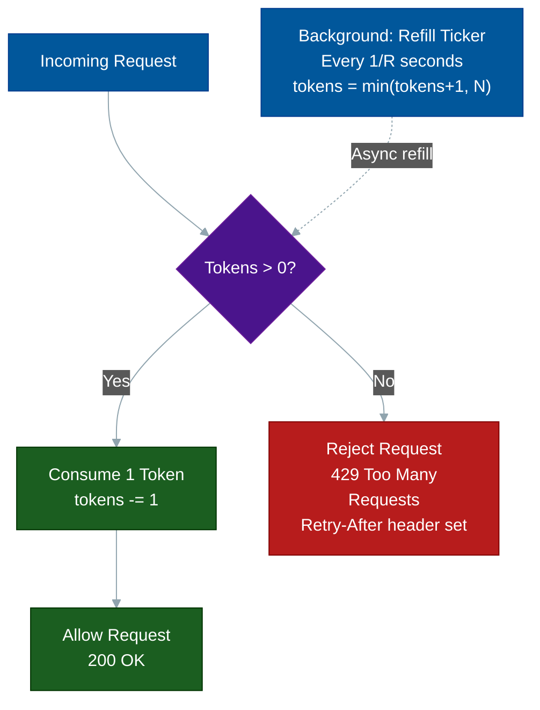

# The Complete DDoS Defense Architecture & Incident Response Playbook

**Author:** ichamrong
**Category:** Security & Architecture
**Read Time:** ~25 min

---

## 📌 Table of Contents
- [Part 1: The Defense-in-Depth Stack](#part-1-the-defense-in-depth-stack)
  - [Layer-by-Layer Analysis](#layer-by-layer-analysis)
    - [Layer 1 — Network Kernel (Linux Host)](#layer-1-network-kernel-linux-host)
    - [Layer 2 — ISP / Transit (BGP Blackholing)](#layer-2-isp-transit-bgp-blackholing)
    - [Layer 3 — Anycast Edge (Cloudflare / AWS Shield Advanced)](#layer-3-anycast-edge-cloudflare-aws-shield-advanced)
    - [Layer 4 — CDN / WAF (CAPTCHA, IP Reputation, Geo-blocking)](#layer-4-cdn-waf-captcha-ip-reputation-geo-blocking)
    - [Layer 5 — Load Balancer (HAProxy / AWS ALB)](#layer-5-load-balancer-haproxy-aws-alb)
    - [Layer 6 — API Gateway (Kong / Nginx + ModSecurity)](#layer-6-api-gateway-kong-nginx-modsecurity)
    - [Layer 7 — Application Logic (Circuit Breakers, Business Rules)](#layer-7-application-logic-circuit-breakers-business-rules)
- [Part 2: Rate Limiting Algorithms](#part-2-rate-limiting-algorithms)
  - [Algorithm 1: Token Bucket — Best for Bursty Traffic](#algorithm-1-token-bucket-best-for-bursty-traffic)
  - [Algorithm 2: Sliding Window Log — Most Accurate](#algorithm-2-sliding-window-log-most-accurate)
  - [Algorithm 3: Sliding Window Counter — Best Balance](#algorithm-3-sliding-window-counter-best-balance)
  - [Algorithm 4: Fixed Window Counter — Simplest, Has Edge Case](#algorithm-4-fixed-window-counter-simplest-has-edge-case)
  - [Algorithm Comparison](#algorithm-comparison)
- [Part 3: Circuit Breaker Pattern for DDoS Resilience](#part-3-circuit-breaker-pattern-for-ddos-resilience)
  - [Java: Resilience4j Implementation](#java-resilience4j-implementation)
- [Part 4: Kubernetes & Cloud DDoS Defenses](#part-4-kubernetes-cloud-ddos-defenses)
  - [Horizontal Pod Autoscaler (HPA) — Scale Up, Not Into Bankruptcy](#horizontal-pod-autoscaler-hpa-scale-up-not-into-bankruptcy)
  - [PodDisruptionBudget — Maintain Availability During Attacks](#poddisruptionbudget-maintain-availability-during-attacks)
  - [NetworkPolicy — Restrict Pod-to-Pod Traffic](#networkpolicy-restrict-pod-to-pod-traffic)
  - [Cloud Provider DDoS Protection Comparison](#cloud-provider-ddos-protection-comparison)
- [Part 5: Incident Response Playbook](#part-5-incident-response-playbook)
  - [Detailed Runbook Steps](#detailed-runbook-steps)
    - [T+0: Alert Fires](#t0-alert-fires)
    - [T+1: Identify Attack Type](#t1-identify-attack-type)
    - [T+5: Enable Under Attack Mode (Cloudflare)](#t5-enable-under-attack-mode-cloudflare)
    - [T+10: Log Analysis — Find the Pattern](#t10-log-analysis-find-the-pattern)
    - [T+15: Block at CDN](#t15-block-at-cdn)
    - [Post-Attack: Permanent Hardening](#post-attack-permanent-hardening)
- [Part 6: Monitoring & Alerting](#part-6-monitoring-alerting)
  - [Key Metrics by Layer](#key-metrics-by-layer)
  - [Prometheus Alert Rules](#prometheus-alert-rules)
  - [Grafana Dashboard Panels](#grafana-dashboard-panels)
- [Part 7: The Cost Equation](#part-7-the-cost-equation)
  - [Attack Cost (Attacker's Perspective)](#attack-cost-attackers-perspective)
  - [Defense Cost](#defense-cost)
  - [The Downtime Equation](#the-downtime-equation)
  - [The Correct Defense Investment Model](#the-correct-defense-investment-model)
- [Putting It All Together](#putting-it-all-together)
- [📚 References & Tools](#references-tools)

---

> "Security is not a product, but a process — and against DDoS, it is a layered war of economic attrition." — This document is the capstone of the DDoS Defense series. It synthesizes every technique into a single, deployable system.

---

## Part 1: The Defense-in-Depth Stack

No single tool stops a modern DDoS attack. The architecture is a **gauntlet**: each layer absorbs a class of attacks so that deeper, more expensive components never see the load. Think of it as a series of successive sieves — each one with a finer mesh than the last.

```mermaid
%%{init: {'theme': 'dark', 'themeVariables': {'primaryColor': '#37474f', 'primaryTextColor': '#ffffff', 'lineColor': '#90a4ae', 'edgeLabelBackground': '#263238',
    'background': '#1e1e1e'},
  'themeCSS': 'svg { background-color: #1e1e1e !important; padding: 1rem !important; border-radius: 8px !important; } .edgeLabel rect { fill: #1e1e1e !important; } text, tspan, .messageText, .signalText, .edgeLabel, .edgeLabel span, .pointLabel, .axisLabel, .quadrantTitle, .quadrantLabel { fill: #ffffff !important; color: #ffffff !important; stroke: none !important; }'
}}%%
graph TD
    classDef attack  fill:#b71c1c,stroke:#7f0000,color:#fff
    classDef defense fill:#1b5e20,stroke:#003300,color:#fff
    classDef process fill:#01579b,stroke:#003c8f,color:#fff
    classDef warning fill:#e65100,stroke:#bf360c,color:#fff

    BOTNET["☠ Botnet / Attacker<br/>1 Tbps UDP<br/>Flood<br/>100k HTTP Req/s"]:::attack

    L1["Layer 1 — OS<br/>Kernel<br/>SYN Cookies · iptables<br/>Drops: SYN Floods<br/>Passes: TCP streams"]:::defense

    L2["Layer 2 — ISP<br/>Transit<br/>BGP Blackholing<br/>Drops: > 100 Gbps<br/>Passes: Clean traffic"]:::defense

    L3["Layer 3 — Anycast<br/>Edge<br/>Cloudflare / AWS Shield<br/>Drops: Volumetric Flood<br/>Passes: Clean HTTP"]:::defense

    L4["Layer 4 — CDN /<br/>WAF<br/>IP Rep · Geo-blocking<br/>Drops: Bot scripts<br/>Passes: Real Browsers"]:::defense

    L5["Layer 5 — Load<br/>Balancer<br/>Connection limits · SSL<br/>Drops: Slow Loris<br/>Passes: Valid sessions"]:::defense

    L6["Layer 6 — API<br/>Gateway<br/>Kong / ModSecurity<br/>Drops: L7 abuse<br/>Passes: Rate-OK reqs"]:::defense

    L7["Layer 7 — App<br/>Logic<br/>Circuit breakers<br/>Drops: Logic attacks<br/>Passes: Real users"]:::defense

    DB["Protected Database<br/>Only valid traffic"]:::process

    BOTNET --> L1
    L1 --> L2
    L2 --> L3
    L3 --> L4
    L4 --> L5
    L5 --> L6
    L6 --> L7
    L7 --> DB
```



### Layer-by-Layer Analysis

#### Layer 1 — Network Kernel (Linux Host)

The last line of host-level defense. Applied via `nftables` or `iptables` on the server itself.

| What It Stops | How |
| :--- | :--- |
| SYN Flood | SYN cookies — no state allocated until handshake completes |
| IP Spoofing | `rp_filter` (Reverse Path Filtering) drops packets whose source IP does not route back through the interface they arrived on |
| ICMP Smurf | Rate-limit ICMP at kernel level |
| Port Scans | `conntrack` state table + `--state INVALID` drop rule |

```bash
# nftables ruleset — minimal DDoS hardening
table inet filter {
    chain input {
        type filter hook input priority 0; policy drop;

        # Allow established connections (no per-packet rule evaluation)
        ct state established,related accept

        # SYN flood mitigation — rate limit new TCP connections
        tcp flags syn tcp option maxseg size 1-536 drop
        tcp flags syn limit rate 200/second burst 1000 packets accept
        tcp flags syn drop

        # Drop invalid state (RST/ACK on unknown connection)
        ct state invalid drop

        # ICMP rate limit
        ip protocol icmp limit rate 10/second accept
    }
}
```

**Kernel tuning for SYN flood resistance (`/etc/sysctl.conf`):**

```bash
net.ipv4.tcp_syncookies = 1          # Enable SYN cookies
net.ipv4.tcp_max_syn_backlog = 65536 # Larger queue before SYN cookies kick in
net.ipv4.tcp_synack_retries = 2      # Don't retry SYN-ACK too many times
net.ipv4.conf.all.rp_filter = 1     # Drop spoofed source IPs
net.core.somaxconn = 65535           # Allow large accept queue
```

---

#### Layer 2 — ISP / Transit (BGP Blackholing)

When the attack volume exceeds what any software can handle (above ~50 Gbps), you call your ISP and ask them to **blackhole** the targeted IP address. This means: "Drop all traffic destined for `203.0.113.5` at your routers — do not even send it toward my data center."

- **RTBH (Remotely Triggered Black Hole):** Your router announces a /32 BGP prefix with a special community tag (`65535:666`). Peer routers upstream drop all traffic to that prefix.
- **Trade-off:** You go dark. The attack stops, but so does legitimate traffic. This buys time for the upper layers to adapt.
- **Selective RTBH:** Some ISPs support dropping only traffic from specific ASNs, preserving legitimate traffic from other regions.

---

#### Layer 3 — Anycast Edge (Cloudflare / AWS Shield Advanced)

The physics solution: distribute the attack across the planet.

When Cloudflare advertises your IP prefix via **Anycast BGP**, the same IP address is announced from 300+ data centers globally. BGP routing naturally sends each attacker's traffic to the geographically nearest Cloudflare PoP (Point of Presence). A 1 Tbps attack is split into ~3 Gbps per data center — easily absorbed locally.

**The economic math:** Cloudflare's global network capacity is **321 Tbps**. The largest DDoS ever recorded was ~3.8 Tbps. This layer wins by scale.

---

#### Layer 4 — CDN / WAF (CAPTCHA, IP Reputation, Geo-blocking)

After volumetric absorption, the WAF applies intelligence filters:

| Filter Type | Mechanism |
| :--- | :--- |
| IP Reputation | Block IPs on threat intelligence feeds (known Tor exit, botnet C2) |
| ASN Blocking | Block all traffic from AWS/DigitalOcean/OVH ASNs (datacenter proxies) |
| Geo-blocking | Block entire countries not in your customer base |
| JA3 Fingerprinting | Block TLS fingerprints matching known attack scripts |
| JS Challenge | All clients must execute JavaScript before receiving content |
| Rate Limiting | Per-IP request counts with sliding window |

---

#### Layer 5 — Load Balancer (HAProxy / AWS ALB)

HAProxy is configured to reject connections that exhibit slow-loris patterns or connection exhaustion:

```
# haproxy.cfg — DDoS hardening
frontend https_in
    bind *:443 ssl crt /etc/ssl/cert.pem alpn h2,http/1.1
    
    # Reject requests without a Host header (scanners)
    http-request deny if !{ req.hdr(host) -m found }
    
    # Slow client timeout — kill idle connections fast
    timeout client 10s
    timeout http-request 5s
    
    # Connection rate limiting per IP
    stick-table type ip size 100k expire 30s store conn_cur,conn_rate(3s)
    tcp-request connection track-sc0 src
    tcp-request connection reject if { sc0_conn_rate gt 100 }
    tcp-request connection reject if { sc0_conn_cur gt 50 }
```

---

#### Layer 6 — API Gateway (Kong / Nginx + ModSecurity)

Per-endpoint rate limiting. Not all endpoints are equal — `/search` hitting Postgres is 1000x more expensive than `/static/logo.png`.

```nginx
# nginx.conf — tiered rate limit zones
limit_req_zone $binary_remote_addr zone=search:10m rate=5r/m;
limit_req_zone $binary_remote_addr zone=auth:10m   rate=10r/m;
limit_req_zone $binary_remote_addr zone=api:10m    rate=100r/m;

server {
    location /api/search {
        limit_req zone=search burst=10 nodelay;
        limit_req_status 429;
        proxy_pass http://backend;
    }
    location /api/auth {
        limit_req zone=auth burst=5 nodelay;
        limit_req_status 429;
        proxy_pass http://backend;
    }
    location /api/ {
        limit_req zone=api burst=50 nodelay;
        limit_req_status 429;
        proxy_pass http://backend;
    }
}
```

---

#### Layer 7 — Application Logic (Circuit Breakers, Business Rules)

The final gate. Even authenticated users can abuse endpoints. Application-level controls:

- **Per-user rate limits** enforced server-side (not just IP-based — see Part 2)
- **Circuit breakers** on downstream calls (see Part 3)
- **Feature flags** to disable expensive features (bulk export, search) during an attack
- **Graceful degradation**: return cached results instead of live DB queries

---

## Part 2: Rate Limiting Algorithms

Four algorithms with fundamentally different tradeoffs. Choose based on your traffic pattern.

### Algorithm 1: Token Bucket — Best for Bursty Traffic

**Concept:** A bucket holds `N` tokens. Each second, `R` tokens are added (up to `N`). Each request consumes 1 token. If the bucket is empty: reject.

This models how real users behave: a user might send 20 requests in a burst at page load, then be quiet for 30 seconds. The token bucket allows the burst, which fixed windows do not.



**Redis Implementation (Lua script for atomicity):**

```lua
-- token_bucket.lua
-- KEYS[1] = "ratelimit:{user_id}"
-- ARGV[1] = max_tokens (N)
-- ARGV[2] = refill_rate tokens/second (R)
-- ARGV[3] = current_timestamp_ms

local key = KEYS[1]
local max_tokens = tonumber(ARGV[1])
local refill_rate = tonumber(ARGV[2])
local now = tonumber(ARGV[3])

local bucket = redis.call('HMGET', key, 'tokens', 'last_refill')
local tokens = tonumber(bucket[1]) or max_tokens
local last_refill = tonumber(bucket[2]) or now

-- Calculate tokens to add since last request
local elapsed_ms = now - last_refill
local tokens_to_add = math.floor(elapsed_ms / 1000 * refill_rate)
tokens = math.min(max_tokens, tokens + tokens_to_add)

if tokens < 1 then
    -- Reject: return time until next token available
    local wait_ms = math.ceil((1 - tokens) / refill_rate * 1000)
    return {0, wait_ms}
end

tokens = tokens - 1
redis.call('HMSET', key, 'tokens', tokens, 'last_refill', now)
redis.call('PEXPIRE', key, math.ceil(max_tokens / refill_rate * 1000))
return {1, tokens}
```

**Python caller:**

```python
import redis
import time

r = redis.Redis()
LUA_SCRIPT = open("token_bucket.lua").read()
token_bucket = r.register_script(LUA_SCRIPT)

def check_rate_limit(user_id: str, max_tokens=100, refill_rate=10) -> bool:
    """Returns True if request is allowed."""
    now_ms = int(time.time() * 1000)
    result = token_bucket(
        keys=[f"ratelimit:{user_id}"],
        args=[max_tokens, refill_rate, now_ms]
    )
    allowed, remaining_or_wait_ms = result
    return bool(allowed)
```

---

### Algorithm 2: Sliding Window Log — Most Accurate

**Concept:** Store the exact timestamp of every request in a Redis sorted set. To check rate: count entries in `[now - window, now]`. Oldest entries are pruned.

**Accuracy:** Perfect. No edge-case burst at window boundary. But memory cost is O(requests) per user — expensive at scale.

```python
import redis
import time

r = redis.Redis()

def check_rate_limit_sliding_log(
    user_id: str,
    limit: int = 100,
    window_seconds: int = 60
) -> tuple[bool, int]:
    """
    Returns (allowed, current_count).
    Uses Redis sorted set — score = timestamp.
    """
    key = f"ratelimit:log:{user_id}"
    now = time.time()
    window_start = now - window_seconds

    pipe = r.pipeline()
    # Remove timestamps older than the window
    pipe.zremrangebyscore(key, 0, window_start)
    # Add current timestamp (use timestamp as both score and member)
    pipe.zadd(key, {str(now): now})
    # Count requests in the window
    pipe.zcard(key)
    # Expire the key after the window passes
    pipe.expire(key, window_seconds + 1)
    results = pipe.execute()

    current_count = results[2]
    allowed = current_count <= limit
    return allowed, current_count
```

**When to use:** Payment systems, login attempts — anywhere precision matters more than memory.

---

### Algorithm 3: Sliding Window Counter — Best Balance

**Concept:** A hybrid. Keep only two counters (current window, previous window) instead of all timestamps. Interpolate a weighted count based on how far through the current window you are.

**Formula:**
```
effective_count = current_window_count 
                + previous_window_count × (1 - elapsed / window_size)
```

If you are 30% through the current window, you weight the previous window at 70%. This approximates a true sliding window with O(1) memory.

```python
import redis
import time
import math

r = redis.Redis()

def check_rate_limit_sliding_counter(
    user_id: str,
    limit: int = 100,
    window_seconds: int = 60
) -> tuple[bool, float]:
    """
    Returns (allowed, estimated_count).
    Memory: O(1) per user — only 2 counters stored.
    """
    now = time.time()
    current_window = math.floor(now / window_seconds)
    previous_window = current_window - 1
    elapsed = now - (current_window * window_seconds)

    curr_key = f"ratelimit:sw:{user_id}:{current_window}"
    prev_key = f"ratelimit:sw:{user_id}:{previous_window}"

    pipe = r.pipeline()
    pipe.incr(curr_key)
    pipe.expire(curr_key, window_seconds * 2)
    pipe.get(prev_key)
    results = pipe.execute()

    current_count = results[0]
    previous_count = int(results[2] or 0)

    # Weighted interpolation
    weight = 1 - (elapsed / window_seconds)
    effective_count = current_count + (previous_count * weight)

    allowed = effective_count <= limit
    return allowed, effective_count
```

---

### Algorithm 4: Fixed Window Counter — Simplest, Has Edge Case

**Concept:** Increment a counter per 60-second bucket. Simple. Fast. But has a known vulnerability: a user can send 2× the limit by straddling two windows (N requests at `T=59s`, N requests at `T=61s`).

```python
import redis
import time
import math

r = redis.Redis()

def check_rate_limit_fixed_window(
    user_id: str,
    limit: int = 100,
    window_seconds: int = 60
) -> tuple[bool, int]:
    """
    Simple fixed window. Vulnerable to 2x burst at boundary.
    """
    window = math.floor(time.time() / window_seconds)
    key = f"ratelimit:fw:{user_id}:{window}"

    count = r.incr(key)
    if count == 1:
        r.expire(key, window_seconds)

    return count <= limit, count
```

**The boundary attack:** At `T=59s`, send 100 requests (window 1 fills). At `T=61s`, send 100 more (window 2 starts). You have sent 200 requests in 2 seconds — double the limit.

**Recommendation:** Never use fixed window for security-critical endpoints. Use sliding window counter instead.

---

### Algorithm Comparison

| Algorithm | Memory | Accuracy | Burst Handling | Use Case |
| :--- | :--- | :--- | :--- | :--- |
| Token Bucket | O(1) | High | Excellent (by design) | API endpoints with bursty clients |
| Sliding Window Log | O(requests) | Perfect | Exact | Auth, payments |
| Sliding Window Counter | O(1) | ~98% accurate | Good | General purpose — recommended default |
| Fixed Window | O(1) | Medium | Poor (boundary burst) | Internal tools only |

---

## Part 3: Circuit Breaker Pattern for DDoS Resilience

When a downstream service (database, third-party API, microservice) is being overwhelmed — either by DDoS or cascading failure — naive retry loops make things catastrophically worse. Each retry adds load to an already-collapsing service.

The **Circuit Breaker** pattern is borrowed from electrical engineering: when the load is too high, break the circuit and fail fast. No waiting, no piling on.

```mermaid
%%{init: {'theme': 'dark', 'themeVariables': {'primaryColor': '#37474f', 'primaryTextColor': '#ffffff', 'lineColor': '#90a4ae',
    'background': '#1e1e1e'},
  'themeCSS': 'svg { background-color: #1e1e1e !important; padding: 1rem !important; border-radius: 8px !important; } .edgeLabel rect { fill: #1e1e1e !important; } text, tspan, .messageText, .signalText, .edgeLabel, .edgeLabel span, .pointLabel, .axisLabel, .quadrantTitle, .quadrantLabel { fill: #ffffff !important; color: #ffffff !important; stroke: none !important; }'
}}%%
stateDiagram-v2
    [*] --> CLOSED

    CLOSED --> OPEN : Failure threshold exceeded<br/>(N failures in T seconds)
    OPEN --> HALF_OPEN : Wait timeout elapsed<br/>(reset period, e.g. 30s)
    HALF_OPEN --> CLOSED : Test request succeeds<br/>Service recovered
    HALF_OPEN --> OPEN : Test request fails<br/>Service still down

    note right of CLOSED
        Normal operation.
        All requests pass through.
        Failure counter increments on each error.
    end note

    note right of OPEN
        Fail Fast mode.
        All requests rejected immediately.
        No load sent to downstream.
        Returns fallback / cached response.
    end note

    note right of HALF_OPEN
        Probe mode.
        One test request allowed through.
        Decision based on result.
    end note
```



### Java: Resilience4j Implementation

```xml
<!-- pom.xml -->
<dependency>
    <groupId>io.github.resilience4j</groupId>
    <artifactId>resilience4j-spring-boot3</artifactId>
    <version>2.2.0</version>
</dependency>
```

```yaml
# application.yml — Circuit breaker configuration
resilience4j:
  circuitbreaker:
    instances:
      searchService:
        # Open circuit after 50% failure rate over 10 calls
        failure-rate-threshold: 50
        # Minimum calls before evaluating failure rate
        minimum-number-of-calls: 10
        # How long to stay OPEN before trying HALF-OPEN
        wait-duration-in-open-state: 30s
        # Number of test calls in HALF-OPEN state
        permitted-number-of-calls-in-half-open-state: 3
        # Count failures in a sliding window of 10 calls
        sliding-window-type: COUNT_BASED
        sliding-window-size: 10
        # Slow calls (> 2s) also count as failures
        slow-call-rate-threshold: 50
        slow-call-duration-threshold: 2s
  retry:
    instances:
      searchService:
        max-attempts: 2
        wait-duration: 500ms
        # Do NOT retry on 429 — respect rate limit signals
        ignore-exceptions:
          - org.springframework.web.client.HttpClientErrorException.TooManyRequests
```

```java
// SearchService.java
@Service
public class SearchService {

    private final SearchRepository searchRepository;
    private final RedisCache redisCache;

    // Annotation-based circuit breaker — applied around this method
    @CircuitBreaker(name = "searchService", fallbackMethod = "searchFallback")
    @Retry(name = "searchService")
    @RateLimiter(name = "searchService")
    public List<SearchResult> search(String query) {
        // This call is protected. If searchRepository throws too many exceptions,
        // Resilience4j opens the circuit and routes to searchFallback instead.
        return searchRepository.findByQuery(query);
    }

    // Fallback: called when circuit is OPEN or call fails
    // Must have same return type and parameters + Throwable
    private List<SearchResult> searchFallback(String query, Throwable ex) {
        log.warn("Circuit breaker OPEN for search '{}'. Serving cached results. Cause: {}",
            query, ex.getClass().getSimpleName());

        // Return stale cached results rather than failing completely
        return redisCache.getOrDefault("search:" + query, Collections.emptyList());
    }
}
```

```java
// CircuitBreakerMonitor.java — Listen to state transitions for alerting
@Component
public class CircuitBreakerMonitor {

    @EventListener
    public void onStateChange(CircuitBreakerOnStateTransitionEvent event) {
        String name = event.getCircuitBreakerName();
        State from = event.getStateTransition().getFromState();
        State to = event.getStateTransition().getToState();

        log.error("CIRCUIT BREAKER [{}]: {} → {}", name, from, to);

        if (to == State.OPEN) {
            // Fire PagerDuty alert — downstream service is failing
            alertingService.fire(AlertLevel.CRITICAL,
                "Circuit breaker OPEN: " + name + ". DDoS or service failure suspected.");
        }
        if (to == State.CLOSED) {
            alertingService.resolve("Circuit breaker recovered: " + name);
        }
    }
}
```

---

## Part 4: Kubernetes & Cloud DDoS Defenses

### Horizontal Pod Autoscaler (HPA) — Scale Up, Not Into Bankruptcy

HPA scales your pods under load. But uncapped HPA during a DDoS is dangerous: you auto-scale to 500 pods at $0.10/pod/hour, burning $50/hour. The attacker's goal is achieved: they cost you money.

```yaml
# hpa.yaml — HPA with a hard ceiling
apiVersion: autoscaling/v2
kind: HorizontalPodAutoscaler
metadata:
  name: api-server-hpa
spec:
  scaleTargetRef:
    apiVersion: apps/v1
    kind: Deployment
    name: api-server
  minReplicas: 3
  maxReplicas: 20          # HARD CEILING — never auto-scale past this
  metrics:
  - type: Resource
    resource:
      name: cpu
      target:
        type: Utilization
        averageUtilization: 70
  - type: Resource
    resource:
      name: memory
      target:
        type: Utilization
        averageUtilization: 80
  behavior:
    scaleUp:
      stabilizationWindowSeconds: 30   # Scale up quickly during attacks
      policies:
      - type: Pods
        value: 4
        periodSeconds: 60
    scaleDown:
      stabilizationWindowSeconds: 300  # Scale down slowly — avoid thrashing
```

### PodDisruptionBudget — Maintain Availability During Attacks

Ensures Kubernetes never takes down too many pods simultaneously (during node maintenance, rolling updates, or attack recovery):

```yaml
# pdb.yaml
apiVersion: policy/v1
kind: PodDisruptionBudget
metadata:
  name: api-server-pdb
spec:
  minAvailable: 2          # Always keep at least 2 pods running
  selector:
    matchLabels:
      app: api-server
```

### NetworkPolicy — Restrict Pod-to-Pod Traffic

If a pod is compromised or participating in amplification, NetworkPolicy prevents lateral spread:

```yaml
# networkpolicy.yaml — Default deny, explicit allow
apiVersion: networking.k8s.io/v1
kind: NetworkPolicy
metadata:
  name: api-server-network-policy
  namespace: production
spec:
  podSelector:
    matchLabels:
      app: api-server
  policyTypes:
  - Ingress
  - Egress
  ingress:
  - from:
    - podSelector:
        matchLabels:
          app: nginx-ingress    # Only ingress controller can reach API pods
    ports:
    - protocol: TCP
      port: 8080
  egress:
  - to:
    - podSelector:
        matchLabels:
          app: postgres         # API pods can only talk to DB
    ports:
    - protocol: TCP
      port: 5432
  - to:
    - podSelector:
        matchLabels:
          app: redis
    ports:
    - protocol: TCP
      port: 6379
```

---

### Cloud Provider DDoS Protection Comparison

| Feature | AWS Shield Standard | AWS Shield Advanced | Cloudflare Magic Transit | GCP Cloud Armor |
| :--- | :--- | :--- | :--- | :--- |
| Cost | Free | $3,000/month | Custom pricing | Per-request pricing |
| L3/L4 protection | Basic | Advanced (Gbps-scale) | BGP-level, Tbps-scale | Advanced |
| L7 WAF | Via WAF (extra) | Integrated | Included | Integrated |
| Anycast network | No | Via CloudFront | Yes — 321 Tbps | Via Cloud CDN |
| BGP advertisement | No | No | Yes — own IP space | No |
| Attack visibility | Basic | Full reports + TAM | Full analytics | Full analytics |
| SLA / response | None | 24/7 DRT team | 24/7 support | 24/7 support |
| Best for | Startups | AWS-native enterprises | ISP-level mitigation | GCP-native workloads |

**Cloudflare Magic Transit** is the only solution that advertises your IP space via BGP — meaning attack traffic never reaches your data center at all. It is the closest commercial equivalent to having your own anycast network.

---

## Part 5: Incident Response Playbook

When the alert fires, you need a playbook — not improvisation. Every minute of confusion during an attack is money lost.

```mermaid
%%{init: {'theme': 'dark', 'themeVariables': {'primaryColor': '#37474f', 'primaryTextColor': '#ffffff', 'lineColor': '#90a4ae',
    'background': '#1e1e1e'},
  'themeCSS': 'svg { background-color: #1e1e1e !important; padding: 1rem !important; border-radius: 8px !important; } .edgeLabel rect { fill: #1e1e1e !important; } text, tspan, .messageText, .signalText, .edgeLabel, .edgeLabel span, .pointLabel, .axisLabel, .quadrantTitle, .quadrantLabel { fill: #ffffff !important; color: #ffffff !important; stroke: none !important; }'
}}%%
flowchart TD
    classDef attack  fill:#b71c1c,stroke:#7f0000,color:#fff
    classDef defense fill:#1b5e20,stroke:#003300,color:#fff
    classDef process fill:#01579b,stroke:#003c8f,color:#fff
    classDef decision fill:#4a148c,stroke:#6a1b9a,color:#fff
    classDef warning fill:#e65100,stroke:#bf360c,color:#fff

    T0["T+0: Alert Fires<br/>Traffic spike detected<br/>PagerDuty / Grafana threshold"]:::warning

    T1["T+1: Identify Attack<br/>Type<br/>Check: bandwidth vs<br/>req/s<br/>Is it volumetric<br/>or L7?"]:::process

    TYPE{"Attack Type?"}:::decision

    T5A["T+5: Volumetric Path<br/>Contact ISP for<br/>RTBH<br/>Enable Shield Advanced"]:::defense
    T5B["T+5: L7 Path<br/>Enable 'Under Attack<br/>Mode'<br/>JS Challenge all<br/>traffic"]:::defense

    T10["T+10: Identify Top<br/>Attackers<br/>Run log analysis:<br/>top IPs, ASNs,<br/>User-Agents"]:::process

    T15["T+15: Block at<br/>CDN<br/>Cloudflare Firewall Rules<br/>Block attacking ASNs/CIDRs"]:::defense

    VOLUMETRIC{"Volume > 10 Gbps?"}:::decision

    T20A["T+20: ISP Blackhole<br/>BGP RTBH for<br/>attacked IP<br/>Failover to backup<br/>IP"]:::defense
    T20B["T+20: Tighten Rate<br/>Limits<br/>Reduce limits 50%<br/>Enable CAPTCHA globally"]:::defense

    T30["T+30: Assess Scrubbing<br/>Need<br/>Volume > 100 Gbps?<br/>Engage scrubbing center"]:::process

    T60["T+60: Scrubbing Engaged<br/>Prolexic / Verizon<br/>Clean traffic tunneled<br/>back"]:::defense

    T120["T+120: Document Attack<br/>Profile<br/>IPs, ASNs, User-Agents,<br/>request patterns → WAF<br/>rules"]:::process

    POST["Post-Attack:<br/>Add permanent WAF<br/>rules<br/>Post-incident review<br/>Update playbook"]:::defense

    T0 --> T1 --> TYPE
    TYPE -->|Volumetric| T5A
    TYPE -->|L7 Application| T5B
    T5A --> T10
    T5B --> T10
    T10 --> T15 --> VOLUMETRIC
    VOLUMETRIC -->|Yes| T20A
    VOLUMETRIC -->|No| T20B
    T20A --> T30
    T20B --> T30
    T30 --> T60 --> T120 --> POST
```



### Detailed Runbook Steps

#### T+0: Alert Fires

**Prometheus alert triggers.** Incident commander is paged. First communication in Slack war room:

```
#incident-ddos channel created
IC: @oncall-network joining
IC: Grafana link: [dashboard]
IC: Current metrics: RPS=47k (normal=2k), error rate=34%, p99=8s
```

#### T+1: Identify Attack Type

Run these queries immediately:

```bash
# Check if it's volumetric (look at bandwidth, not just requests)
# On your monitoring: check network in/out bytes per second

# Identify top attacking IPs from Nginx access logs
awk '{print $1}' /var/log/nginx/access.log | sort | uniq -c | sort -rn | head -20

# Check attack distribution by endpoint
awk '{print $7}' /var/log/nginx/access.log | sort | uniq -c | sort -rn | head -10

# Check User-Agent distribution (bots often have repetitive UAs)
grep -o '"[^"]*"' /var/log/nginx/access.log | grep -i user-agent | \
  sort | uniq -c | sort -rn | head -10
```

**Diagnosis matrix:**

| Observation | Attack Type | Layer |
| :--- | :--- | :--- |
| Bandwidth saturated, few HTTP logs | Volumetric UDP flood | L3/L4 |
| Normal bandwidth, high req/s | HTTP flood | L7 |
| Many unique IPs, same endpoint | Distributed L7 | L7 |
| Same IPs, port scan pattern | Reconnaissance | L3/L4 |

#### T+5: Enable Under Attack Mode (Cloudflare)

Via Cloudflare API (can be automated):

```bash
# Enable "I'm Under Attack" mode via API
curl -X PATCH "https://api.cloudflare.com/client/v4/zones/$ZONE_ID/settings/security_level" \
  -H "Authorization: Bearer $CF_API_TOKEN" \
  -H "Content-Type: application/json" \
  -d '{"value": "under_attack"}'
```

This forces a 5-second JS challenge on every new visitor. Blocks all non-browser bots instantly.

#### T+10: Log Analysis — Find the Pattern

```bash
# Top attacking ASNs (requires MaxMind GeoIP or similar)
# Export to: incident-report-$(date +%Y%m%d).txt

# For Cloudflare customers — use Analytics API
curl "https://api.cloudflare.com/client/v4/zones/$ZONE_ID/firewall/events" \
  -H "Authorization: Bearer $CF_API_TOKEN" | jq '.result[] | .clientASNDescription' | \
  sort | uniq -c | sort -rn | head -20
```

#### T+15: Block at CDN

```bash
# Block an ASN at Cloudflare via Firewall Rule
# Expression: (ip.geoip.asnum eq 14061)  <- DigitalOcean ASN
curl -X POST "https://api.cloudflare.com/client/v4/zones/$ZONE_ID/firewall/rules" \
  -H "Authorization: Bearer $CF_API_TOKEN" \
  -H "Content-Type: application/json" \
  -d '{
    "filter": {"expression": "(ip.geoip.asnum eq 14061)"},
    "action": "block",
    "description": "DDoS incident 2026-05-17 — block DigitalOcean ASN"
  }'
```

#### Post-Attack: Permanent Hardening

Every attack teaches you something. The post-incident review must produce:

1. **New WAF rules** based on the specific patterns observed
2. **Updated alert thresholds** based on the actual attack volume
3. **Runbook updates** — what worked, what was slow
4. **Cost analysis** — infrastructure cost of attack vs. defense investment

---

## Part 6: Monitoring & Alerting

You cannot defend what you cannot measure. Every layer must emit metrics.

### Key Metrics by Layer

| Metric | Source | Alert Threshold |
| :--- | :--- | :--- |
| Requests per second (p95) | Nginx/Kong | >3× baseline |
| HTTP 429 error rate | Application | >5% of requests |
| HTTP 503 error rate | Load balancer | >1% of requests |
| Active TCP connections | HAProxy | >10k |
| Bandwidth in (Gbps) | Network | >80% of link capacity |
| CPU per pod | Kubernetes | >85% for >2 min |
| Redis latency (p99) | Redis | >10ms |
| Circuit breaker state | Resilience4j | Any OPEN event |
| DNS query rate | Route 53 / Bind | >5× baseline |

### Prometheus Alert Rules

```yaml
# prometheus/ddos-alerts.yml
groups:
  - name: ddos_detection
    rules:

      # 1. Sudden traffic spike (3x baseline)
      - alert: TrafficSpike
        expr: |
          rate(nginx_http_requests_total[2m])
          > 3 * avg_over_time(rate(nginx_http_requests_total[2m])[1h:5m])
        for: 2m
        labels:
          severity: warning
          team: security
        annotations:
          summary: "Traffic spike detected — possible DDoS"
          description: "Current RPS {{ $value }} is 3x the 1-hour baseline."

      # 2. High 429 rate — rate limiter is being triggered
      - alert: HighRateLimitHits
        expr: |
          rate(nginx_http_requests_total{status="429"}[5m])
          / rate(nginx_http_requests_total[5m]) > 0.05
        for: 1m
        labels:
          severity: warning
          team: security
        annotations:
          summary: "Rate limiter blocking >5% of traffic"
          description: "429 rate: {{ $value | humanizePercentage }}"

      # 3. Error rate spike — service may be degrading
      - alert: ErrorRateSpike
        expr: |
          rate(nginx_http_requests_total{status=~"5.."}[5m])
          / rate(nginx_http_requests_total[5m]) > 0.01
        for: 2m
        labels:
          severity: critical
          team: sre
        annotations:
          summary: "5xx error rate > 1% — service degrading under load"

      # 4. Circuit breaker opened
      - alert: CircuitBreakerOpen
        expr: resilience4j_circuitbreaker_state{state="open"} == 1
        for: 0m
        labels:
          severity: critical
          team: security
        annotations:
          summary: "Circuit breaker OPEN: {{ $labels.name }}"
          description: "Downstream service {{ $labels.name }} is failing. DDoS or cascade failure."

      # 5. Pod count hitting HPA ceiling
      - alert: HpaAtMaxReplicas
        expr: |
          kube_horizontalpodautoscaler_status_current_replicas
          == kube_horizontalpodautoscaler_spec_max_replicas
        for: 5m
        labels:
          severity: warning
          team: sre
        annotations:
          summary: "HPA at max replicas — cannot scale further"

      # 6. Network bandwidth saturation
      - alert: BandwidthSaturation
        expr: |
          rate(node_network_receive_bytes_total{device="eth0"}[1m]) * 8
          > 8e9 * 0.8
        for: 1m
        labels:
          severity: critical
          team: network
        annotations:
          summary: "Network bandwidth > 80% of 10 Gbps link — possible volumetric attack"
```

### Grafana Dashboard Panels

The minimum viable DDoS dashboard should show:
1. Requests/second (split by 2xx / 4xx / 429 / 5xx)
2. Bandwidth in/out (bytes/second)
3. Active connections count
4. Top 10 IPs by request count (last 5 minutes)
5. Circuit breaker state timeline
6. Pod count vs. HPA ceiling
7. Redis hit rate (cache effectiveness during attack)

---

## Part 7: The Cost Equation

DDoS defense is ultimately a business decision. The ROI calculation is straightforward.

### Attack Cost (Attacker's Perspective)

| Attack Vector | Cost to Launch | Capability |
| :--- | :--- | :--- |
| Booter service (L4 UDP flood) | $10–50/hour | 10–100 Gbps |
| Hired botnet (L7 HTTP) | $100–500/hour | 50k–500k RPS |
| Rented residential proxies | $200–1,000/hour | Bypasses IP blocking |
| Nation-state / advanced | $10,000+/hour | Tbps-scale, persistent |

### Defense Cost

| Defense Layer | Cost | What It Stops |
| :--- | :--- | :--- |
| Linux kernel hardening | $0 (engineer time) | SYN floods, IP spoofing |
| Nginx rate limiting | $0 | Basic L7 floods |
| Cloudflare Free | $0 | Basic volumetric, JS challenge |
| Cloudflare Pro | $20/month | WAF, advanced rate limiting |
| Cloudflare Business | $200/month | Custom WAF rules, priority support |
| Cloudflare Enterprise | $5,000+/month | Full Magic Transit, 24/7 DRT |
| AWS Shield Advanced | $3,000/month | AWS-native, DRT team |
| Prolexic (Akamai) | Custom | ISP-level, 20 Tbps capacity |

### The Downtime Equation

```
Cost of downtime = (Revenue per hour) × (Outage duration)
                 + (Customer churn cost)
                 + (SLA penalty payments)
                 + (Reputational damage — hard to quantify)

Example:
  E-commerce store doing $10M/year:
  Revenue per hour = $10,000,000 / 8,760 hours ≈ $1,140/hour
  
  4-hour DDoS attack without defense:
  Direct revenue loss = $1,140 × 4 = $4,560
  Customer churn (5% of customers never return) ≈ $50,000 lifetime value loss
  
  Annual Cloudflare Pro cost: $20 × 12 = $240/year
  
  ROI of Cloudflare Pro = $54,560 prevented loss / $240 spend = 227x ROI
```

**The asymmetry is extreme.** Defense costs are fixed and monthly. Attack costs are per-attack-hour. This means:

- A persistent attacker burning $500/hour will spend $12,000/day
- Your Cloudflare Enterprise at $5,000/month costs $167/day to defend
- **The attacker's burn rate is 72× higher than yours**

The attacker eventually gives up because the economics do not favor them. Your job is to be expensive enough to attack that the ROI is negative for the attacker. This is why DDoS defense is called a **war of attrition**: you do not need to stop every packet — you just need to cost more to attack than to abandon.

### The Correct Defense Investment Model

```
DDoS defense budget = 
  max(
    Cloudflare Pro at minimum ($20/month),
    1% of monthly revenue
  )

For $1M ARR company:
  Monthly revenue = $83,333
  1% = $833/month
  → Cloudflare Business ($200) + WAF ($50) + Shield Standard (free) is well within budget
  
For $10M ARR company:
  Monthly revenue = $833,333
  1% = $8,333/month
  → Cloudflare Enterprise ($5,000) + AWS Shield Advanced ($3,000) = $8,000/month ✓
```

---

## Putting It All Together

A properly defended system has **no single point of failure against DDoS**. The attacker must defeat all seven layers simultaneously — which is economically and technically infeasible when each layer is properly configured.

The key insight from this series:

1. **Volumetric attacks** are a physics problem — solved by Anycast, not software
2. **L7 attacks** are an economics problem — solved by rate limiting and circuit breakers
3. **Advanced proxy attacks** are an intelligence problem — solved by behavioral analysis and fingerprinting
4. **Cascade failures** are an architecture problem — solved by circuit breakers and graceful degradation
5. **All attacks** are an economics problem for the attacker — solved by making your defense cost less per day than their attack

The complete architecture in this series gives you the tools for all five. No system implementing all seven layers has ever been taken offline by a commodity DDoS attack.

## 📚 References & Tools
- **Resilience4j** — [resilience4j.readme.io](https://resilience4j.readme.io/)
- **Kubernetes HPA** — [kubernetes.io/docs/tasks/run-application/horizontal-pod-autoscale/](https://kubernetes.io/docs/tasks/run-application/horizontal-pod-autoscale/)
- **Cloudflare Magic Transit** — [cloudflare.com/magic-transit/](https://www.cloudflare.com/magic-transit/)

---

**Navigation:** [← API & GraphQL Defense](./07-api-graphql-defense.md) | [DDoS Index →](./README.md)

*Last updated: 2026-05-17*

## Related

- [Bot Protection & CAPTCHAs](../bot-protection/README.md)
- [Session & Cookie Security](../session-and-cookie-security/README.md)
- [API Gateways & Reverse Proxies](../../devops/api-gateways/README.md)
