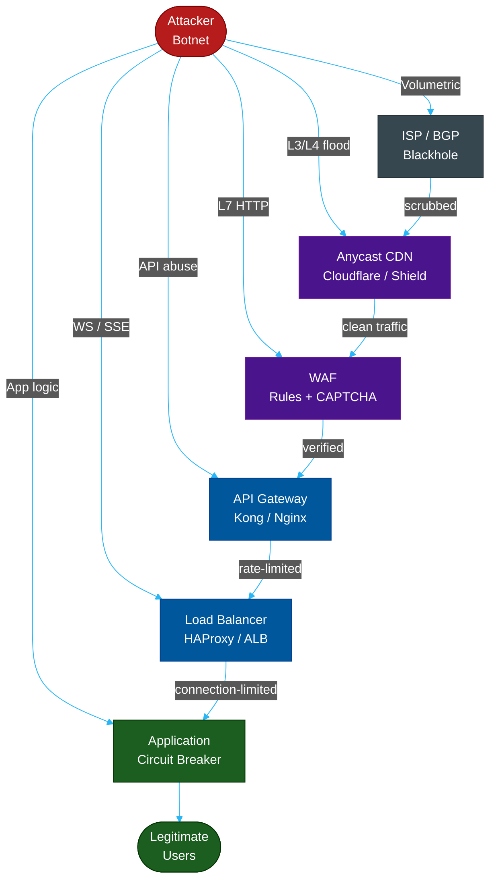

# DDoS Defense: The Complete Engineering Suite

**Author:** ichamrong  
**Category:** Security & Architecture  
**Read Time:** ~5 min  

---

## What Is a DDoS?

A **Distributed Denial of Service** attack doesn't steal data — it denies access. The attacker overwhelms your CPU, RAM, bandwidth, or connection slots so legitimate users cannot reach your application. Modern attacks are cheap to launch ($50–500/hr for a botnet) and expensive to defend against without the right architecture.

The defense is not a single tool. It is a **layered stack** where each layer stops a category of attack before it reaches the next.

---

## The Defense Stack at a Glance

---

## Document Suite

| # | File | Attack Vectors Covered | Read Time |
| :--- | :--- | :--- | :--- |
| 01 | [The Anatomy of a DDoS](./01-the-anatomy-of-a-ddos.md) | Layer 3/4 volumetric vs Layer 7 application attacks | ~10 min |
| 02 | [Dynamic Proxy Attacks](./02-dynamic-proxy-attacks.md) | Rotating residential proxy attacks, botnet fingerprinting | ~12 min |
| 03 | [HTTP Layer 7 Defense](./03-http-layer7-defense.md) | HTTP flood, Slowloris, Slow POST, cache busting, HTTP/2 Rapid Reset, ZIP bomb, large body | ~20 min |
| 04 | [WebSocket Defense](./04-websocket-defense.md) | Connection exhaustion, message flooding, large frames, slow WS, ping flood, broadcast amplification | ~18 min |
| 05 | [SSE & Streaming Defense](./05-sse-defense.md) | SSE connection pool exhaustion, slow consumer, reconnection storm, gRPC streaming, HTTP/2 push | ~18 min |
| 06 | [Network & Volumetric Defense](./06-network-volumetric-defense.md) | SYN flood, UDP flood, DNS/NTP/Memcached amplification, ICMP flood, BGP hijacking | ~20 min |
| 07 | [API, GraphQL & gRPC Defense](./07-api-graphql-defense.md) | REST parameter flooding, GraphQL complexity/introspection/batch, gRPC streaming, webhook callback DDoS | ~20 min |
| 08 | [Defense Architecture & Incident Response](./08-defense-architecture.md) | Full layered stack, rate limiting algorithms, circuit breakers, Kubernetes defenses, incident playbook | ~25 min |

---

## Attack → Defense Quick Reference

| Attack | Protocol | Layer | Primary Defense |
| :--- | :--- | :--- | :--- |
| HTTP Flood | HTTP | L7 | Rate limiting (token bucket), CDN challenge |
| Slowloris | HTTP | L7 | Connection timeout (10s), `limit_conn` |
| Slow POST | HTTP | L7 | Body timeout, `client_body_timeout` |
| HTTP/2 Rapid Reset | HTTP/2 | L7 | Patch server, limit RST_STREAM rate |
| Cache Busting | HTTP | L7 | CDN cache key normalization |
| WS Connection Exhaustion | WebSocket | L7 | Auth before upgrade, `limit_conn` per IP |
| WS Message Flood | WebSocket | L7 | Per-connection token bucket (100 msg/s) |
| WS Large Frame | WebSocket | L7 | `max_message_size` (64KB default) |
| SSE Pool Exhaustion | SSE/HTTP | L7 | Max connections per IP, auth required |
| SSE Slow Consumer | SSE/HTTP | L7 | Write timeout (30s), evict lagging clients |
| GraphQL Complexity | GraphQL | L7 | Depth limit (5), complexity score (1000) |
| gRPC Stream Flood | gRPC/HTTP/2 | L7 | Max streams per connection, stream timeout |
| SYN Flood | TCP | L4 | SYN Cookies (`tcp_syncookies=1`) |
| UDP Flood | UDP | L3/L4 | Edge rate limit, ICMP response block |
| DNS Amplification | UDP/DNS | L3 | Anycast, DNS RRL, disable open recursion |
| NTP Amplification | UDP/NTP | L3 | Disable MONLIST, NTPsec |
| Memcached Amplification | UDP | L3 | Firewall port 11211, disable UDP |
| Volumetric (>10 Gbps) | Any | L3 | Anycast CDN (Cloudflare/AWS Shield) |
| BGP Hijacking | BGP | L2/L3 | RPKI, route origin validation |

---

## References

- **Cloudflare DDoS Protection** — [cloudflare.com/ddos](https://www.cloudflare.com/ddos/)
- **AWS Shield** — [aws.amazon.com/shield](https://aws.amazon.com/shield/)
- **OWASP DDoS Prevention** — [owasp.org/www-community/attacks/Denial_of_Service](https://owasp.org/www-community/attacks/Denial_of_Service)
- **RFC 4987** — SYN Flood Countermeasures (SYN Cookies)
- **CVE-2023-44487** — HTTP/2 Rapid Reset Attack

---

*Last updated: 2026-05-17*
