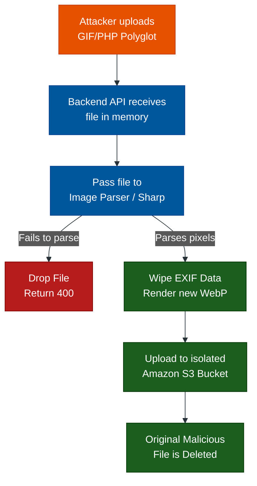

# File Upload Defense: The Polyglot Threat

**Author:** ichamrong  
**Category:** Security & Architecture  
**Read Time:** ~10 min  

---

## 📌 Table of Contents
- [1. What is a Polyglot File?](#1-what-is-a-polyglot-file)
  - [The GIF/PHP Polyglot Example:](#the-gifphp-polyglot-example)
  - [The Client-Side Attack (The Download Vector)](#the-client-side-attack-the-download-vector)
- [2. Why Traditional Security Fails](#2-why-traditional-security-fails)
- [3. How to Architecturally Prevent Polyglot Attacks](#3-how-to-architecturally-prevent-polyglot-attacks)
  - [Strategy 1: Re-Encoding & Re-Sampling (The Ultimate Defense)](#strategy-1-re-encoding-re-sampling-the-ultimate-defense)
  - [Strategy 2: Strip EXIF Data](#strategy-2-strip-exif-data)
  - [Strategy 3: Storage Isolation (The S3 Bucket)](#strategy-3-storage-isolation-the-s3-bucket)
  - [Strategy 4: The `nosniff` Header](#strategy-4-the-nosniff-header)
- [4. The Secure Upload Pipeline](#4-the-secure-upload-pipeline)
- [📚 References & Tools](#references-tools)

---

## 1. What is a Polyglot File?

In programming, a **Polyglot** is a file that is valid in *multiple different formats simultaneously*. It exploits the fact that different software parsers read files in completely different ways.

This is one of the most dangerous vectors for **Remote Code Execution (RCE)** or **Cross-Site Scripting (XSS)** when users upload files (like Profile Pictures or PDFs) to your application.

### The GIF/PHP Polyglot Example:
A standard GIF image simply requires the file to begin with the header `GIF89a`. A PHP server executes anything wrapped in `<?php ... ?>` tags, ignoring everything else. 

An attacker creates a file named `avatar.jpg` containing this raw data:
```text
GIF89a... [binary image garbage] ... <?php system($_GET['cmd']); ?>
```

- When your basic upload security checks the file, it reads the `GIF89a` Magic Bytes and says: *"Yes, this is a valid image!"*
- When the attacker navigates to `yourwebsite.com/uploads/avatar.jpg?cmd=whoami`, the Apache/PHP server sees the `<?php` tag and executes the malicious code, granting the attacker full control of your server.

### The Client-Side Attack (The Download Vector)
What if your server is perfectly secure? What if you use Node.js or an Amazon S3 bucket with strict execution permissions where PHP/Bash cannot run? 
**The Polyglot is still extremely dangerous because it targets the client (the victim).**

Attackers will upload a Polyglot that is a mix of an Image and Malware (e.g., a GIF/EXE or GIF/ZIP polyglot). 
- Because the file is hosted on your secure platform (e.g., `trusted-bank.com/uploads/document.gif`), it bypasses corporate firewalls. 
- The attacker sends the link to a victim. When the victim downloads the "raw" file to their computer, their local Operating System or a vulnerable PDF viewer parses the malicious half of the polyglot, instantly infecting the victim's local machine. You have inadvertently allowed attackers to use your secure domain as a trusted Malware Hosting CDN.

---

## 2. Why Traditional Security Fails

Most developers rely on weak file validation strategies that Polyglots easily bypass:

1. **Checking the File Extension (`.jpg`):** Useless. An attacker can upload a file named `image.php.jpg` or use null-byte injections `image.php%00.jpg`.
2. **Checking the MIME Type (`Content-Type: image/jpeg`):** Useless. The MIME type is just an HTTP header sent by the client. The attacker can modify it in Postman.
3. **Checking Magic Bytes (File Signatures):** Useless against Polyglots. The file *actually is* a valid GIF, it just happens to also be valid PHP/JavaScript.

---

## 3. How to Architecturally Prevent Polyglot Attacks

To defeat Polyglots, you must assume every uploaded file contains a hidden bomb. You cannot just "check" the file; you must destroy the bomb.

### Strategy 1: Re-Encoding & Re-Sampling (The Ultimate Defense)
Never, ever save the exact bytes the user uploaded to your server. If a user uploads an avatar, you must use an image processing library (like `Sharp` in Node.js, `Pillow` in Python, or `ImageMagick`) to open the image, render it into raw uncompressed pixels in memory, and export it as a **brand new** WebP or JPEG. 

This process completely destroys any hidden PHP, JavaScript, or ZIP payloads attached to the file, because the new file only contains pure pixel data.

### Strategy 2: Strip EXIF Data
Attackers love hiding XSS payloads inside the "Camera Model" or "Location" EXIF metadata of an image. If you do not strip EXIF data, a user rendering the image on your frontend might accidentally execute the XSS script. Always wipe metadata.

### Strategy 3: Storage Isolation (The S3 Bucket)
Never store user uploads on the same server that runs your application code. 
- Store files on an external CDN or Amazon S3 bucket.
- Serve them from a completely separate domain (e.g., `user-content.yourdomain.com`). This ensures that even if an attacker uploads a malicious HTML/JS polyglot, the browser executes it in a sandboxed domain, meaning it cannot steal cookies from your main application domain.

### Strategy 4: The `nosniff` Header
If an attacker uploads an HTML document but renames it to `avatar.jpg`, some older browsers will try to be "helpful." The browser will look at the file, realize it's actually HTML, and execute the JavaScript inside it. 
To stop this, your server must return the uploaded file with the HTTP header:
`X-Content-Type-Options: nosniff`
This forces the browser to treat it *strictly* as an image and refuse to execute it.

---

## 4. The Secure Upload Pipeline

Here is the architectural pipeline your backend should follow when receiving a file:



## 📚 References & Tools
- **OWASP Unrestricted File Upload** — [owasp.org/www-community/vulnerabilities/Unrestricted_File_Upload](https://owasp.org/www-community/vulnerabilities/Unrestricted_File_Upload)
- **ExifTool (Stripping Metadata)** — [exiftool.org](https://exiftool.org/)

---

**Navigation:** [File Upload Defense Index](./README.md)

*Last updated: 2026-05-17*

## Related

- [OWASP ASVS 5.0 Verification](../owasp-asvs-5.0/README.md)
- [Bot Protection & CAPTCHAs](../bot-protection/README.md)
- [Anti-Spam & Trust Scoring](../anti-spam-architecture/README.md)
