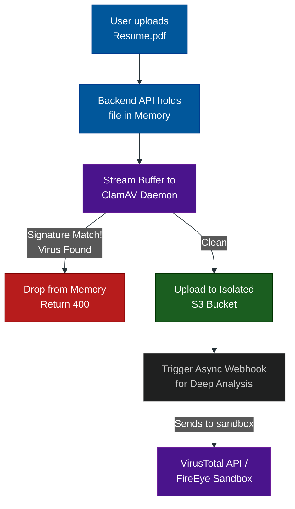

# Malware Scanning: ClamAV & Sandboxing

**Author:** ichamrong  
**Category:** Security & Architecture  
**Read Time:** ~10 min  

---

## 📌 Table of Contents
- [1. The Limitation of Re-Encoding](#1-the-limitation-of-re-encoding)
- [2. ClamAV (The Open-Source Shield)](#2-clamav-the-open-source-shield)
  - [What is it?](#what-is-it)
  - [Why use it?](#why-use-it)
  - [How to Architect it securely:](#how-to-architect-it-securely)
- [3. The Enterprise Pipeline](#3-the-enterprise-pipeline)
  - [The Async Sandbox (Step 2)](#the-async-sandbox-step-2)
- [📚 References & Tools](#references-tools)

---

## 1. The Limitation of Re-Encoding

In the previous guide, we established that mathematically re-encoding an image (e.g., JPEG to WebP) destroys hidden Polyglot payloads. 

But what if your platform is an HR portal that requires users to upload **PDF resumes**, or a financial app that accepts **CSV spreadsheets**? 
You cannot simply "re-encode" a PDF or a Word document (`.docx`) without destroying its formatting, text layers, and usability. 

If you must accept non-image files and store their raw bytes, you are completely exposed to Macro Viruses, embedded JavaScript (in PDFs), and Malware. This is where **ClamAV** is required.

---

## 2. ClamAV (The Open-Source Shield)

### What is it?
ClamAV is the industry-standard, open-source antivirus engine used in server environments. It is specifically designed for high-performance, real-time scanning of email attachments and web uploads.

### Why use it?
ClamAV maintains a massive, constantly updated database of known malware signatures, trojans, and malicious macros. If an attacker uploads a PDF that contains a hidden script designed to execute when an HR manager opens the file, ClamAV will flag it.

### How to Architect it securely:
You must never save the file to your primary disk before scanning it. If the file is a Zip Bomb or an aggressive worm, saving it to disk could trigger it. 

Instead, your Node.js or Go backend should accept the file upload as a **Memory Buffer**, and stream those raw bytes directly into the `clamd` (ClamAV Daemon) process via a local TCP socket.

- If ClamAV returns `OK`, you stream the buffer to your Amazon S3 bucket.
- If ClamAV returns `VIRUS FOUND`, you instantly drop the buffer from memory, ban the user's IP, and alert security.

---

## 3. The Enterprise Pipeline

For massive systems (like Gmail or Slack), ClamAV is just the first line of defense. The complete architectural pipeline for non-image documents looks like this:

### The Async Sandbox (Step 2)
ClamAV is excellent at catching *known* malware signatures. However, it can miss *Zero-Day* (brand new) malware. 
In highly secure enterprise environments, after the file passes ClamAV and is saved to S3, it triggers an async webhook. This webhook sends the file to a cloud Sandbox (like VirusTotal or CrowdStrike). The sandbox opens the PDF inside a fake virtual machine and watches to see if it tries to do anything malicious (Behavioral Analysis). If the sandbox detects a threat 5 minutes later, it deletes the file from S3.

## 📚 References & Tools
- **ClamAV Official Documentation** — [docs.clamav.net](https://docs.clamav.net/)
- **AWS S3 Object Lambda for Scanning** — [aws.amazon.com/blogs/aws/introducing-amazon-s3-object-lambda/](https://aws.amazon.com/blogs/aws/introducing-amazon-s3-object-lambda/)

---

**Navigation:** [Previous: Polyglot Files](./01-polyglot-files.md) | [File Upload Defense Index](./README.md)

*Last updated: 2026-05-17*

## Related

- [OWASP ASVS 5.0 Verification](../owasp-asvs-5.0/README.md)
- [Bot Protection & CAPTCHAs](../bot-protection/README.md)
- [Anti-Spam & Trust Scoring](../anti-spam-architecture/README.md)
