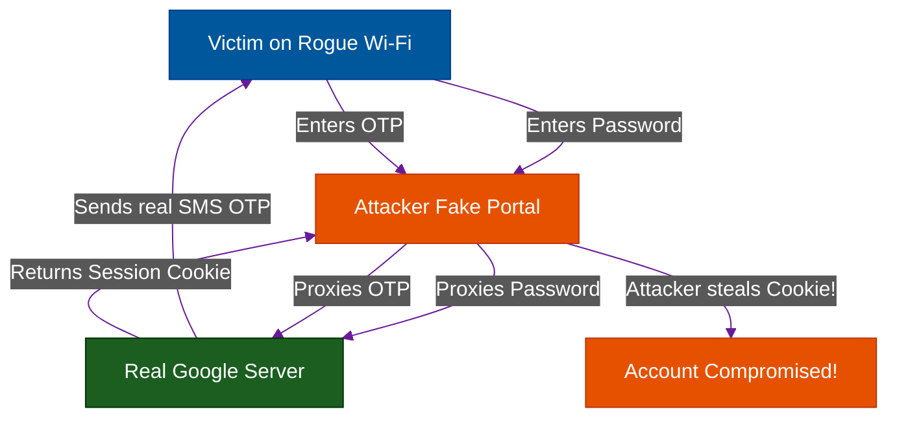

# The Evil Twin: Rogue Wi-Fi & OTP Theft

**Author:** ichamrong  
**Category:** Security & Architecture  
**Read Time:** ~8 min  

---

## 📌 Table of Contents
- [1. The Coffee Shop Threat (The Evil Twin)](#1-the-coffee-shop-threat-the-evil-twin)
- [2. The Captive Portal Phishing Attack](#2-the-captive-portal-phishing-attack)
- [3. Bypassing 2FA/OTP in Real-Time](#3-bypassing-2faotp-in-real-time)
- [📚 References & Tools](#references-tools)

---

## 1. The Coffee Shop Threat (The Evil Twin)

**What it is:** An "Evil Twin" is a rogue Wi-Fi access point set up by an attacker that perfectly mimics a legitimate public network (like "Starbucks Free Wi-Fi" or "Airport Guest").

Because laptops and phones automatically connect to Wi-Fi networks they recognize by Name (SSID), a victim's device will seamlessly connect to the attacker's router if the attacker's signal is stronger.

## 2. The Captive Portal Phishing Attack

Once the victim connects to the Evil Twin, the attacker has complete control over the network traffic (a Man-in-the-Middle attack). They execute the attack using a **Captive Portal**.

**The Execution:**
1. The victim connects to the Free Wi-Fi and opens their browser.
2. The attacker's router intercepts the DNS request and redirects the victim to a "Captive Portal" (a mandatory login page to access the internet).
3. The Captive Portal looks **exactly** like the official Google Login UI. 
4. The URL might be a different domain (e.g., `wifi-auth-google.com` instead of `google.com`), but users rarely check URLs on Captive Portals because they just want the internet to work.
5. The portal says: *"Please verify your Google Account to access the Free Wi-Fi."*

## 3. Bypassing 2FA/OTP in Real-Time

Historically, 2-Factor Authentication (OTP via SMS) protected users from this. If the attacker stole the password, they still needed the OTP. 

However, modern Evil Twin attacks use **Real-Time Proxying** (using advanced tools like *Evilginx2*):
1. The victim types their password into the fake portal.
2. The attacker's server *instantly* takes that password and types it into the real `google.com` server in the background.
3. Google sends a real SMS OTP to the victim's phone.
4. The fake portal prompts the victim: *"Enter the OTP you just received."*
5. The victim enters the valid OTP into the fake portal.
6. The attacker instantly passes the OTP to the real Google server.
7. Google grants the attacker the valid **Session Cookie**.
8. The attacker now has full, persistent access to the victim's Google account, bypassing 2FA entirely!

**The Lesson & Prevention:**
To defeat real-time proxy attacks, organizations must enforce **Hardware Security Keys (FIDO2/YubiKey)**. Hardware keys mathematically sign the specific Domain Name (`google.com`). When the victim presses their YubiKey on the fake `wifi-auth-google.com`, the cryptographic signature will fail, completely stopping the attack.

## 📚 References & Tools
- **HSTS Preload List** — [hstspreload.org](https://hstspreload.org/)
- **Evilginx2 (Phishing Framework)** — [github.com/kgretzky/evilginx2](https://github.com/kgretzky/evilginx2)

---

**Navigation:** [Next: Transit & Logging Failures](./02-transit-and-logging-failures.md) | [Network Security Index](./README.md)

*Last updated: 2026-05-17*

## Related

- [Social Engineering & Pretexting](../social-engineering/README.md)
- [Authentication & Identity Patterns](../auth-and-identity-patterns/README.md)
- [DDoS Defense & Rate Limiting](../ddos-defense/README.md)
