# Domain A: Identity & Access Management

**Author:** ichamrong  
**Category:** OWASP ASVS 5.0  
**Read Time:** ~30 min  

---

## 📌 Table of Contents
- [V2: Authentication Verification Requirements](#v2-authentication-verification-requirements)
  - [V2.1 — Password Security](#v21-password-security)
  - [V2.2 — General Authenticator Security](#v22-general-authenticator-security)
  - [V2.3 — Authenticator Lifecycle](#v23-authenticator-lifecycle)
  - [V2.4 — Credential Storage](#v24-credential-storage)
  - [V2.5 — Credential Recovery](#v25-credential-recovery)
  - [V2.6 — Look-up Secret Verifier (Backup Codes)](#v26-look-up-secret-verifier-backup-codes)
  - [V2.7 — Out of Band Verifier (Email/SMS OTP)](#v27-out-of-band-verifier-emailsms-otp)
  - [V2.8 — One-Time Verifier (TOTP)](#v28-one-time-verifier-totp)
  - [V2.9 — Cryptographic Authenticators (FIDO2/WebAuthn)](#v29-cryptographic-authenticators-fido2webauthn)
  - [V2.10 — Service Authentication](#v210-service-authentication)
- [V3: Session Management Verification Requirements](#v3-session-management-verification-requirements)
  - [V3.1 — Fundamental Session Management](#v31-fundamental-session-management)
  - [V3.2 — Session Binding](#v32-session-binding)
  - [V3.3 — Session Termination](#v33-session-termination)
  - [V3.4 — Cookie-Based Session Management](#v34-cookie-based-session-management)
  - [V3.5 — Token-Based Session (JWT)](#v35-token-based-session-jwt)
  - [V3.6 — Federated Re-authentication](#v36-federated-re-authentication)
  - [V3.7 — Defenses Against Session Exploits](#v37-defenses-against-session-exploits)
- [V4: Access Control Verification Requirements](#v4-access-control-verification-requirements)
  - [V4.1 — General Access Control Design](#v41-general-access-control-design)
  - [V4.2 — Operation Level Access Control](#v42-operation-level-access-control)
  - [V4.3 — Other Access Control](#v43-other-access-control)
- [Summary: Domain A at a Glance](#summary-domain-a-at-a-glance)
- [References](#references)
  - [Official Standards & Specifications](#official-standards-specifications)
  - [OWASP Cheat Sheets](#owasp-cheat-sheets)
  - [OWASP Top 10 Mappings](#owasp-top-10-mappings)
  - [Tools & Services](#tools-services)
- [📚 Implementation References](#implementation-references)

---

This domain covers ASVS Chapters V2, V3, and V4. It is the absolute foundation of application security. If identity fails, the entire application falls. Every requirement below is drawn from OWASP ASVS 5.0 and maps directly to a security control that defenders must implement and attackers actively probe.

---

## V2: Authentication Verification Requirements

Authentication answers the question: *who are you, and can you prove it?* It is the first gate an adversary must defeat. Every misconfiguration here — a weak hash, a missing rate limit, an SMS OTP that can be SIM-swapped — translates directly into account takeover. ASVS 5.0 moved away from outdated "password complexity theatre" and toward evidence-based controls that actually stop modern attacks.

---

### V2.1 — Password Security

Password policies have historically been counterproductive. Forced rotation caused users to pick `Summer2024!` then `Fall2024!`. Complexity rules produced `P@ssw0rd` — technically compliant, trivially crackable. ASVS 5.0 follows NIST SP 800-63B: minimum length matters, character restrictions do not. The key controls are minimum length, no truncation, no complexity rules, and active checking against breached password lists.

| ID | Requirement | Level | Notes |
|----|-------------|-------|-------|
| V2.1.1 | User-set passwords must be at least 12 characters long. Systems must allow passwords up to at least 64 characters without truncation. | L1 | Truncation silently breaks long passwords; users never discover why login fails |
| V2.1.2 | Do not impose character composition rules (e.g., "must include uppercase, number, symbol"). Allow any printable Unicode character including spaces. | L1 | Composition rules reduce entropy; attackers model them. NIST SP 800-63B §5.1.1 |
| V2.1.3 | Do not require periodic password rotation (e.g., "change every 90 days") unless there is evidence of compromise. | L1 | Forced rotation leads to predictable patterns and credential reuse |
| V2.1.4 | Ensure password fields allow paste operations and do not block password managers. | L1 | Blocking paste actively harms security by preventing long, random passwords |
| V2.1.5 | Verify that newly set or changed passwords are checked against a breached password list (e.g., HaveIBeenPwned API or local HIBP dataset). Reject known-breached passwords. | L1 | Top-10000 breached passwords cover a huge fraction of real-world attacks |
| V2.1.6 | Display a password strength meter to users during account creation or password change. | L2 | Visual feedback nudges users toward stronger choices |
| V2.1.7 | Provide a show/hide password toggle on all password input fields. | L1 | Reduces typos, especially on mobile; improves UX without sacrificing security |
| V2.1.8 | Do not provide password hints or allow knowledge-based security questions (e.g., "What was your first pet's name?"). | L1 | KBA answers are often publicly findable via social media |
| V2.1.9 | Do not impose a maximum password length of less than 64 characters. Longer limits or no limits are acceptable. | L1 | Arbitrary short maximums prevent passphrase use and suggest plaintext storage |

**Implementation Example — Password Policy Enforcement (Java pseudocode)**

```java
public class PasswordValidator {

    private static final int MIN_LENGTH = 12;
    private static final int MAX_LENGTH = 128; // allow long; no truncation
    private final HibpClient hibpClient;

    public ValidationResult validate(String password) {
        if (password.length() < MIN_LENGTH) {
            return ValidationResult.fail("Password must be at least 12 characters.");
        }
        // V2.1.9 — do not silently truncate; reject or allow, never truncate
        if (password.length() > MAX_LENGTH) {
            return ValidationResult.fail("Password must not exceed 128 characters.");
        }
        // V2.1.2 — no composition rules; allow any printable Unicode
        // V2.1.5 — check breached password list
        if (hibpClient.isPwned(password)) {
            return ValidationResult.fail(
                "This password has appeared in a data breach. Please choose another."
            );
        }
        return ValidationResult.ok();
    }
}
```

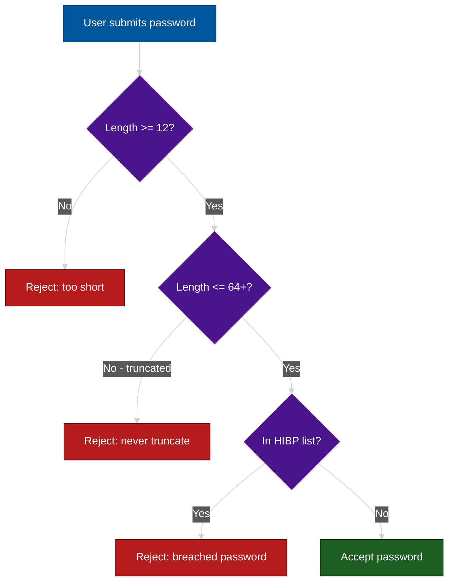
```mermaid
%%{init: {'theme': 'dark',
  'themeVariables': {
    'background': '#1e1e1e'
  },
  'themeCSS': 'svg { background-color: #1e1e1e !important; padding: 1rem !important; border-radius: 8px !important; } .edgeLabel rect { fill: #1e1e1e !important; } text, tspan, .messageText, .signalText, .edgeLabel, .edgeLabel span, .pointLabel, .axisLabel, .quadrantTitle, .quadrantLabel { fill: #ffffff !important; color: #ffffff !important; stroke: none !important; }'
}}%%
flowchart TD
    A[User submits password] --> B{Length >= 12?}
    B -->|No| C[Reject: too short]
    B -->|Yes| D{Length <= 64+?}
    D -->|No - truncated| E[Reject: never truncate]
    D -->|Yes| F{In HIBP list?}
    F -->|Yes| G[Reject: breached password]
    F -->|No| H[Accept password]

    classDef danger fill:#b71c1c,stroke:#7f0000,color:#fff
    classDef safe fill:#1b5e20,stroke:#003300,color:#fff
    classDef process fill:#01579b,stroke:#003c8f,color:#fff
    classDef decision fill:#4a148c,stroke:#6a1b9a,color:#fff

    A:::process
    B:::decision
    C:::danger
    D:::decision
    E:::danger
    F:::decision
    G:::danger
    H:::safe
```

---

### V2.2 — General Authenticator Security

Even a correct password can be defeated if the authentication system itself is not hardened. Credential stuffing — replaying billions of leaked username/password pairs — is one of the highest-volume attacks today. ASVS 5.0 requires anti-automation controls as a baseline (L1), and escalates to phishing-resistant MFA for higher assurance levels.

| ID | Requirement | Level | Notes |
|----|-------------|-------|-------|
| V2.2.1 | Implement anti-automation controls against credential stuffing: rate limiting, progressive delays, CAPTCHA, or account lockout with notification. | L1 | Without this, credential stuffing is trivially profitable |
| V2.2.2 | Weak authenticators (SMS OTP, email magic links) must only be used for low-value transactions and must not be offered as the sole MFA option for higher-value flows. | L2 | SIM swapping and SS7 attacks make PSTN-based OTP RESTRICTED per NIST |
| V2.2.3 | Send a secure notification to users whenever authentication credentials are changed (password change, MFA enrollment/removal), via a previously confirmed out-of-band channel. | L1 | Alerts users to account takeover in progress |
| V2.2.4 | Require phishing-resistant MFA (FIDO2/WebAuthn, hardware tokens) for high-value transactions, administrative actions, or privileged access. | L3 | TOTP and SMS OTP are phishable; FIDO2 is origin-bound and cannot be replayed |
| V2.2.5 | Service providers must offer multiple MFA options so that users are not locked out if one authenticator is lost. | L2 | Single MFA method is a single point of failure |
| V2.2.6 | Implement clock drift handling for TOTP: accept tokens valid within ±30 seconds of server time and document the drift window. | L2 | Overly strict windows lock out users with slightly drifted device clocks |
| V2.2.7 | Require physical possession authenticators (Passkeys, hardware FIDO2 tokens) for privileged accounts such as administrator or service operator roles. | L3 | High-value targets justify hardware-bound authentication |

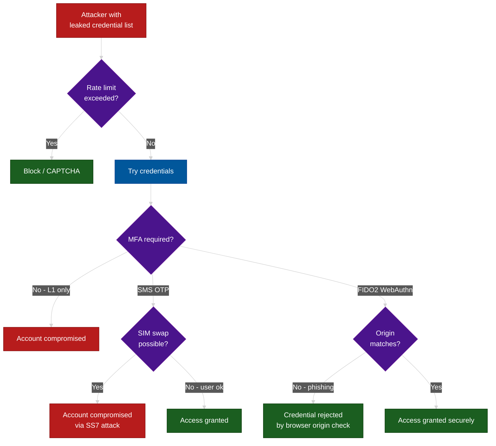
```mermaid
%%{init: {'theme': 'dark',
  'themeVariables': {
    'background': '#1e1e1e'
  },
  'themeCSS': 'svg { background-color: #1e1e1e !important; padding: 1rem !important; border-radius: 8px !important; } .edgeLabel rect { fill: #1e1e1e !important; } text, tspan, .messageText, .signalText, .edgeLabel, .edgeLabel span, .pointLabel, .axisLabel, .quadrantTitle, .quadrantLabel { fill: #ffffff !important; color: #ffffff !important; stroke: none !important; }'
}}%%
flowchart TD
    ATK[Attacker with<br/>leaked credential list] --> RS{Rate limit<br/>exceeded?}
    RS -->|Yes| BLK[Block / CAPTCHA]
    RS -->|No| TRY[Try credentials]
    TRY --> MFA{MFA required?}
    MFA -->|No - L1 only| PWND[Account compromised]
    MFA -->|SMS OTP| SIM{SIM swap<br/>possible?}
    SIM -->|Yes| PWND2[Account compromised<br/>via SS7 attack]
    SIM -->|No - user ok| SAFE[Access granted]
    MFA -->|FIDO2 WebAuthn| ORIGIN{Origin<br/>matches?}
    ORIGIN -->|No - phishing| DENY[Credential rejected<br/>by browser origin check]
    ORIGIN -->|Yes| SAFE2[Access granted securely]

    classDef danger fill:#b71c1c,stroke:#7f0000,color:#fff
    classDef safe fill:#1b5e20,stroke:#003300,color:#fff
    classDef process fill:#01579b,stroke:#003c8f,color:#fff
    classDef warning fill:#e65100,stroke:#bf360c,color:#fff
    classDef decision fill:#4a148c,stroke:#6a1b9a,color:#fff

    ATK:::danger
    RS:::decision
    BLK:::safe
    TRY:::process
    MFA:::decision
    PWND:::danger
    SIM:::decision
    PWND2:::danger
    SAFE:::safe
    ORIGIN:::decision
    DENY:::safe
    SAFE2:::safe
```

---

### V2.3 — Authenticator Lifecycle

Authenticators are not set-and-forget. They must be provisioned securely, rotated safely, and retired cleanly. The weakest moment in the lifecycle is often provisioning: a temporary password sent via email in plaintext, or a TOTP secret delivered over an insecure channel, undermines all downstream security.

| ID | Requirement | Level | Notes |
|----|-------------|-------|-------|
| V2.3.1 | System-generated initial passwords and activation codes must be cryptographically random, sufficiently long (≥ 6 characters for OTPs, ≥ 20 for temporary passwords), expire after first use or after a short time window (≤ 24 hours), and never reused. | L1 | Predictable initial passwords are a common lateral-movement vector |
| V2.3.2 | Password reset flows must use a secure out-of-band side channel (e.g., a time-limited single-use link sent to the registered email). The link must expire within 10 minutes. | L1 | Long-lived reset links in email are exploited via email forwarding rules and compromised inboxes |
| V2.3.3 | Enrollment for look-up secrets (backup codes, TOTP seeds) must occur over an authenticated, secure channel and must not be transmitted or displayed in plaintext after initial setup. | L2 | TOTP seeds are equivalent to passwords and must be protected as such |

---

### V2.4 — Credential Storage

How passwords are stored determines whether a database breach becomes a mass account takeover. MD5 and SHA-1 with no salt are trivially reversible with modern GPUs; bcrypt, scrypt, and Argon2 are deliberately expensive to compute. ASVS 5.0 provides a clear hierarchy: Argon2id first, then scrypt, then bcrypt, then PBKDF2 as last resort — with specific minimum parameters for each.

| ID | Requirement | Level | Notes |
|----|-------------|-------|-------|
| V2.4.1 | Store passwords using an adaptive one-way hashing function designed for password storage: Argon2id (preferred), scrypt, bcrypt, or PBKDF2. Never use MD5, SHA-1, SHA-256, or SHA-512 alone. | L1 | Fast hashes allow billions of guesses per second on commodity GPUs |
| V2.4.2 | If using Argon2id, configure with minimum parameters: memory cost m=19456 (19 MB), time cost t=2, parallelism p=1. Increase these over time as hardware improves. | L2 | Default Argon2 parameters in many libraries are insufficient |
| V2.4.3 | If Argon2id is unavailable, use bcrypt with a work factor of at least 10 (recommended: 12+). | L2 | bcrypt with work factor <10 can be brute-forced at scale |
| V2.4.4 | If only PBKDF2 is available (e.g., FIPS environments), use PBKDF2-SHA-512 with at least 210,000 iterations. | L2 | PBKDF2-SHA-1 is deprecated; SHA-512 raises the cost for GPU attackers |
| V2.4.5 | Apply an application-level pepper (secret key) stored separately from the password database (e.g., in an HSM or secrets manager). Hash the peppered password before sending to the password hashing function. | L3 | A pepper means database breach alone cannot crack passwords without the pepper value |

**Implementation Example — Argon2id Password Storage**

```java
import org.springframework.security.crypto.argon2.Argon2PasswordEncoder;

// V2.4.2 — m=19456, t=2, p=1 minimum
// saltLength=16 bytes, hashLength=32 bytes
Argon2PasswordEncoder encoder = new Argon2PasswordEncoder(16, 32, 1, 19456, 2);

// V2.4.5 — apply pepper before hashing
String pepperedPassword = hmacSha256(rawPassword, System.getenv("PASSWORD_PEPPER"));
String hash = encoder.encode(pepperedPassword);

// Verification
boolean matches = encoder.matches(
    hmacSha256(submittedPassword, System.getenv("PASSWORD_PEPPER")),
    storedHash
);
```

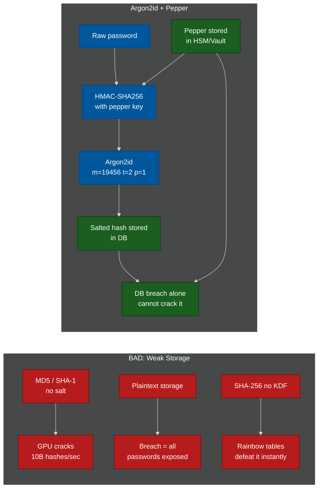
```mermaid
%%{init: {'theme': 'dark',
  'themeVariables': {
    'background': '#1e1e1e'
  },
  'themeCSS': 'svg { background-color: #1e1e1e !important; padding: 1rem !important; border-radius: 8px !important; } .edgeLabel rect { fill: #1e1e1e !important; } text, tspan, .messageText, .signalText, .edgeLabel, .edgeLabel span, .pointLabel, .axisLabel, .quadrantTitle, .quadrantLabel { fill: #ffffff !important; color: #ffffff !important; stroke: none !important; }'
}}%%
graph LR
    subgraph BAD["BAD: Weak Storage"]
        B1[MD5 / SHA-1<br/>no salt] --> B2[GPU cracks<br/>10B hashes/sec]
        B3[Plaintext storage] --> B4[Breach = all<br/>passwords exposed]
        B5[SHA-256 no KDF] --> B6[Rainbow tables<br/>defeat it instantly]
    end

    subgraph GOOD["Argon2id + Pepper"]
        G1[Raw password] --> G2[HMAC-SHA256<br/>with pepper key]
        G2 --> G3[Argon2id<br/>m=19456 t=2 p=1]
        G3 --> G4[Salted hash stored<br/>in DB]
        G5[Pepper stored<br/>in HSM/Vault] --> G2
        G4 --> G6[DB breach alone<br/>cannot crack it]
        G5 --> G6
    end

    classDef danger fill:#b71c1c,stroke:#7f0000,color:#fff
    classDef safe fill:#1b5e20,stroke:#003300,color:#fff
    classDef process fill:#01579b,stroke:#003c8f,color:#fff
    classDef warning fill:#e65100,stroke:#bf360c,color:#fff

    B1:::danger
    B2:::danger
    B3:::danger
    B4:::danger
    B5:::danger
    B6:::danger
    G1:::process
    G2:::process
    G3:::process
    G4:::safe
    G5:::safe
    G6:::safe
```

---

### V2.5 — Credential Recovery

Credential recovery is a backdoor. If the recovery flow is weaker than the primary authentication, attackers will use it to bypass MFA entirely. ASVS 5.0 requires recovery to be as strong as — or stronger than — the primary authentication path, and explicitly prohibits hints and knowledge-based answers.

| ID | Requirement | Level | Notes |
|----|-------------|-------|-------|
| V2.5.1 | Do not allow password hints. Recovery must use OTP sent to a verified contact, FIDO2 authenticator, or equivalent out-of-band mechanism. Never use security questions. | L1 | Security question answers are publicly discoverable via social engineering |
| V2.5.2 | Password reset tokens or OTP codes must expire within 10 minutes of issuance and be invalidated after a single use. | L1 | Long-lived reset tokens are routinely stolen from email inboxes |
| V2.5.3 | OTP reset links must not reveal whether an account exists for a given email or phone number. Return the same message regardless of account existence to prevent account enumeration. | L1 | Enumeration allows targeted phishing and credential stuffing pre-attacks |
| V2.5.4 | The forgot password flow must return identical responses (same HTTP status, same response body, same timing) whether the account exists or not. | L1 | Timing differences can leak account existence even when body text is identical |
| V2.5.5 | Shared, default, or factory-set credentials (e.g., admin/admin) must be changed before or during first use. Systems must enforce this and must not allow login with unchanged defaults. | L1 | Default credentials are the first thing automated scanners try |

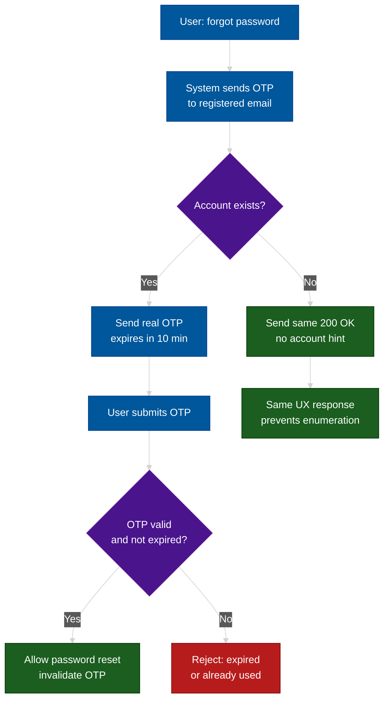
```mermaid
%%{init: {'theme': 'dark',
  'themeVariables': {
    'background': '#1e1e1e'
  },
  'themeCSS': 'svg { background-color: #1e1e1e !important; padding: 1rem !important; border-radius: 8px !important; } .edgeLabel rect { fill: #1e1e1e !important; } text, tspan, .messageText, .signalText, .edgeLabel, .edgeLabel span, .pointLabel, .axisLabel, .quadrantTitle, .quadrantLabel { fill: #ffffff !important; color: #ffffff !important; stroke: none !important; }'
}}%%
flowchart TD
    A[User: forgot password] --> B[System sends OTP<br/>to registered email]
    B --> C{Account exists?}
    C -->|Yes| D[Send real OTP<br/>expires in 10 min]
    C -->|No| E[Send same 200 OK<br/>no account hint]
    D --> F[User submits OTP]
    F --> G{OTP valid<br/>and not expired?}
    G -->|Yes| H[Allow password reset<br/>invalidate OTP]
    G -->|No| I[Reject: expired<br/>or already used]
    E --> J[Same UX response<br/>prevents enumeration]

    classDef danger fill:#b71c1c,stroke:#7f0000,color:#fff
    classDef safe fill:#1b5e20,stroke:#003300,color:#fff
    classDef process fill:#01579b,stroke:#003c8f,color:#fff
    classDef decision fill:#4a148c,stroke:#6a1b9a,color:#fff

    A:::process
    B:::process
    C:::decision
    D:::process
    E:::safe
    F:::process
    G:::decision
    H:::safe
    I:::danger
    J:::safe
```

---

### V2.6 — Look-up Secret Verifier (Backup Codes)

Backup codes are the recovery path when all other MFA methods fail. They must be treated with the same rigor as passwords: high entropy, single-use, stored hashed, delivered securely. A backup code list stored in plaintext in a database column negates the entire MFA system.

| ID | Requirement | Level | Notes |
|----|-------------|-------|-------|
| V2.6.1 | Backup/recovery codes must be generated from a cryptographically secure random source with at least 112 bits of entropy (e.g., 20 alphanumeric characters from a 62-char alphabet). | L2 | Low-entropy backup codes are brute-forceable offline |
| V2.6.2 | Backup codes must be stored hashed (using the same adaptive hashing function as passwords) or symmetrically encrypted at rest with keys stored separately. Never store plaintext. | L2 | Backup codes in plaintext are equivalent to stored plaintext passwords |
| V2.6.3 | Each backup code must be single-use. Upon successful use, the code must be immediately invalidated and the event logged. Prompt the user to regenerate a new code set. | L2 | Reusable backup codes allow attackers to maintain persistent access |

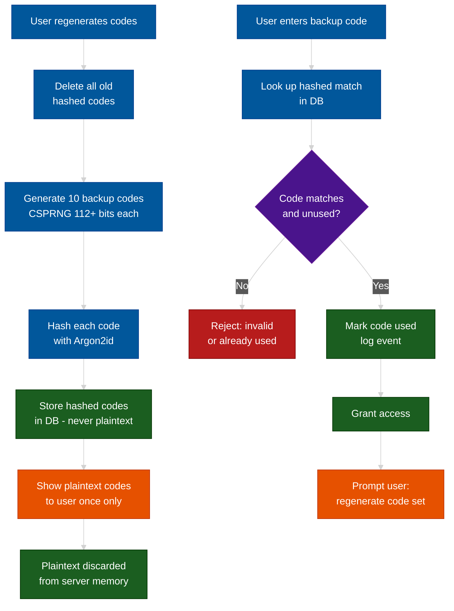
```mermaid
%%{init: {'theme': 'dark',
  'themeVariables': {
    'background': '#1e1e1e'
  },
  'themeCSS': 'svg { background-color: #1e1e1e !important; padding: 1rem !important; border-radius: 8px !important; } .edgeLabel rect { fill: #1e1e1e !important; } text, tspan, .messageText, .signalText, .edgeLabel, .edgeLabel span, .pointLabel, .axisLabel, .quadrantTitle, .quadrantLabel { fill: #ffffff !important; color: #ffffff !important; stroke: none !important; }'
}}%%
flowchart TD
    GEN[Generate 10 backup codes<br/>CSPRNG 112+ bits each] --> HASH[Hash each code<br/>with Argon2id]
    HASH --> STORE[Store hashed codes<br/>in DB - never plaintext]
    STORE --> SHOW[Show plaintext codes<br/>to user once only]
    SHOW --> DISCARD[Plaintext discarded<br/>from server memory]

    USE[User enters backup code] --> LOOKUP[Look up hashed match<br/>in DB]
    LOOKUP --> VALID{Code matches<br/>and unused?}
    VALID -->|No| DENY[Reject: invalid<br/>or already used]
    VALID -->|Yes| INVALIDATE[Mark code used<br/>log event]
    INVALIDATE --> GRANT[Grant access]
    GRANT --> PROMPT[Prompt user:<br/>regenerate code set]

    REGEN[User regenerates codes] --> DELOLD[Delete all old<br/>hashed codes]
    DELOLD --> GEN

    classDef danger fill:#b71c1c,stroke:#7f0000,color:#fff
    classDef safe fill:#1b5e20,stroke:#003300,color:#fff
    classDef process fill:#01579b,stroke:#003c8f,color:#fff
    classDef decision fill:#4a148c,stroke:#6a1b9a,color:#fff
    classDef warning fill:#e65100,stroke:#bf360c,color:#fff

    GEN:::process
    HASH:::process
    STORE:::safe
    SHOW:::warning
    DISCARD:::safe
    USE:::process
    LOOKUP:::process
    VALID:::decision
    DENY:::danger
    INVALIDATE:::safe
    GRANT:::safe
    PROMPT:::warning
    REGEN:::process
    DELOLD:::process
```

---

### V2.7 — Out of Band Verifier (Email/SMS OTP)

Out-of-band OTPs sent via SMS or email are widely deployed but carry known weaknesses. SS7 protocol attacks, SIM swapping, and email account compromise all bypass these controls. ASVS 5.0 classifies PSTN-based OTP as RESTRICTED — acceptable for low-value flows but not for high-value transactions.

| ID | Requirement | Level | Notes |
|----|-------------|-------|-------|
| V2.7.1 | OTP delivered via PSTN (SMS, voice call) must be classified as RESTRICTED per NIST SP 800-63B. Offer at least one alternative non-PSTN authenticator option. | L2 | SIM swapping attacks are commercially available services on underground markets |
| V2.7.2 | Out-of-band OTP codes must expire within 10 minutes of issuance and be single-use. Invalidate immediately after first successful verification. | L1 | Persistent OTP codes allow replay attacks if intercepted |
| V2.7.3 | OTP codes must be at least 6 numeric digits in length (or equivalent entropy). Do not use codes shorter than 6 digits. | L1 | 4-digit codes have only 10,000 possibilities; 6 digits is the NIST minimum |
| V2.7.4 | Re-binding or changing the out-of-band authenticator (e.g., changing the phone number for SMS OTP) must require re-authentication via a second factor and follow a secure approval flow with user notification. | L2 | Unprotected authenticator re-binding is the primary SIM-swap attack vector |

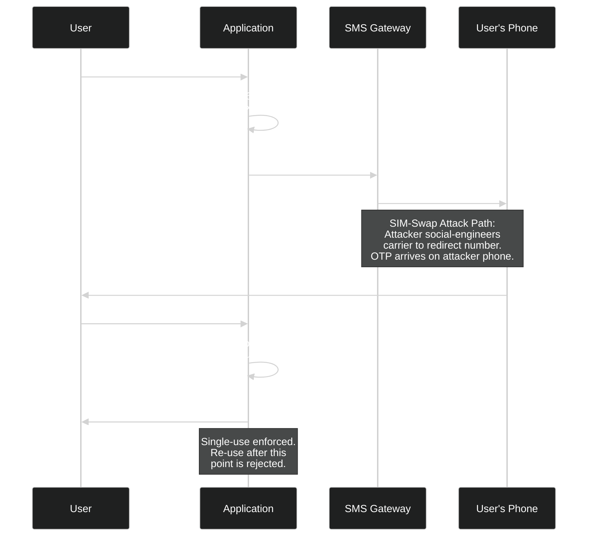
```mermaid
%%{init: {'theme': 'dark',
  'themeVariables': {
    'background': '#1e1e1e'
  },
  'themeCSS': 'svg { background-color: #1e1e1e !important; padding: 1rem !important; border-radius: 8px !important; } .edgeLabel rect { fill: #1e1e1e !important; } text, tspan, .messageText, .signalText, .edgeLabel, .edgeLabel span, .pointLabel, .axisLabel, .quadrantTitle, .quadrantLabel { fill: #ffffff !important; color: #ffffff !important; stroke: none !important; }'
}}%%
sequenceDiagram
    participant U as User
    participant App as Application
    participant GW as SMS Gateway
    participant Phone as User's Phone

    U->>App: Submit username + password
    App->>App: Generate 6-digit OTP<br/>(CSPRNG, expires 10 min)
    App->>GW: Send OTP to<br/>registered number
    GW->>Phone: Deliver SMS

    Note over GW,Phone: SIM-Swap Attack Path:<br/>Attacker social-engineers<br/>carrier to redirect number.<br/>OTP arrives on attacker phone.

    Phone->>U: User reads OTP
    U->>App: Submit OTP
    App->>App: Check: not expired?<br/>Check: not used before?
    App->>U: Grant access +<br/>invalidate OTP

    Note over App: Single-use enforced.<br/>Re-use after this<br/>point is rejected.
```

---

### V2.8 — One-Time Verifier (TOTP)

Time-based One-Time Passwords (TOTP, RFC 6238) are the most common software MFA mechanism. They are better than SMS but still phishable — a real-time phishing proxy can relay both password and TOTP before the 30-second window expires. ASVS 5.0 requires correct algorithm selection, key length, and strict single-use enforcement.

| ID | Requirement | Level | Notes |
|----|-------------|-------|-------|
| V2.8.1 | Time-based OTP codes must be valid for only a single use within their time window. Reject re-use of a previously accepted OTP within the same step. | L2 | Without this, a man-in-the-middle can replay the OTP in the same 30s window |
| V2.8.2 | The symmetric key used for TOTP generation must be at least 128 bits (16 bytes) of cryptographically random data. Keys of 160 bits (20 bytes, standard for RFC 4226) are preferred. | L2 | Short TOTP seeds reduce the brute-force search space |
| V2.8.3 | TOTP implementations must use approved HMAC algorithms: HMAC-SHA1 (RFC 4226 baseline), HMAC-SHA256, or HMAC-SHA512. Do not use non-standard or proprietary HMAC variants. | L2 | Non-standard algorithms may not be compatible with TOTP apps and may have unknown weaknesses |
| V2.8.4 | Hardware HOTP tokens must accept only a limited look-ahead window (recommended: ±1 counter step) to prevent counter desynchronisation abuse. | L3 | Large look-ahead windows weaken the one-time guarantee |

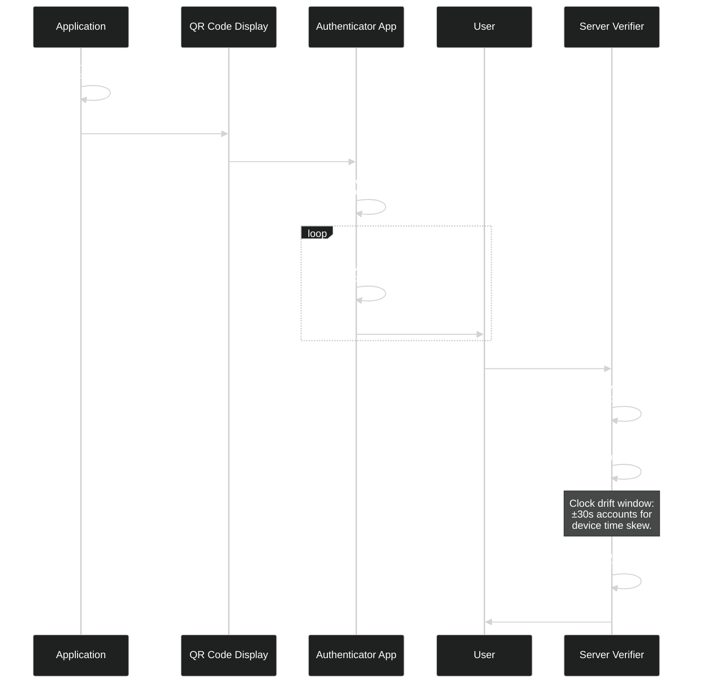
```mermaid
%%{init: {'theme': 'dark',
  'themeVariables': {
    'background': '#1e1e1e'
  },
  'themeCSS': 'svg { background-color: #1e1e1e !important; padding: 1rem !important; border-radius: 8px !important; } .edgeLabel rect { fill: #1e1e1e !important; } text, tspan, .messageText, .signalText, .edgeLabel, .edgeLabel span, .pointLabel, .axisLabel, .quadrantTitle, .quadrantLabel { fill: #ffffff !important; color: #ffffff !important; stroke: none !important; }'
}}%%
sequenceDiagram
    participant App as Application
    participant QR as QR Code Display
    participant Auth as Authenticator App
    participant U as User
    participant Srv as Server Verifier

    App->>App: Generate shared secret<br/>(160-bit CSPRNG seed)
    App->>QR: Encode as otpauth:// URI
    QR->>Auth: User scans QR code
    Auth->>Auth: Store secret securely<br/>on device

    loop Every 30 seconds
        Auth->>Auth: TOTP = HMAC-SHA1(<br/>secret, floor(time/30))
        Auth->>U: Display 6-digit code
    end

    U->>Srv: Submit TOTP code
    Srv->>Srv: Compute valid codes:<br/>T-1, T, T+1 (clock drift ±1)
    Srv->>Srv: Code in set AND<br/>not used this window?

    Note over Srv: Clock drift window:<br/>±30s accounts for<br/>device time skew.

    Srv->>Srv: Mark code used<br/>for this T window
    Srv->>U: Grant access
```

---

### V2.9 — Cryptographic Authenticators (FIDO2/WebAuthn)

FIDO2 and WebAuthn represent the current state of the art in phishing-resistant authentication. Unlike TOTP, the cryptographic challenge is origin-bound: a credential registered on `https://bank.example.com` cannot be used — or even presented — on `https://evil-bank.example.com`. This property eliminates real-time phishing proxies entirely.

| ID | Requirement | Level | Notes |
|----|-------------|-------|-------|
| V2.9.1 | Cryptographic authenticator private keys must be stored in a secure enclave, TPM, hardware security module, or equivalent isolated environment. Keys must never be exportable. | L3 | Exportable private keys defeat the entire purpose of hardware-bound authentication |
| V2.9.2 | Authentication challenges (nonces) generated by the server must be at least 64 bits of cryptographically random data and must expire after a single use or after a short timeout (≤ 5 minutes). | L2 | Predictable or reusable nonces allow replay attacks against the ceremony |
| V2.9.3 | Signatures produced by FIDO2/WebAuthn authenticators must use only approved algorithms: ECDSA with P-256 (ES256), RSA-PSS with 2048-bit keys or larger (RS256), or EdDSA (Ed25519). | L2 | Weak signature algorithms compromise the entire authentication assertion |

**Implementation Example — WebAuthn Server-Side Verification (pseudocode)**

```java
// V2.9.2 — generate challenge: >=64 bits, single-use
byte[] challenge = secureRandom.generateSeed(32); // 256 bits
cache.put(sessionId + ":webauthn_challenge", challenge, Duration.ofMinutes(5));

// V2.9.3 — verify assertion
PublicKeyCredential credential = parseAssertion(request);
AuthenticatorAssertionResponse response = credential.getResponse();

// Verify challenge matches and has not been used
byte[] storedChallenge = cache.getAndRemove(sessionId + ":webauthn_challenge");
if (!MessageDigest.isEqual(storedChallenge, response.getClientDataJSON().getChallenge())) {
    throw new AuthenticationException("Challenge mismatch or replay detected");
}

// V2.9.1 — verify signature against stored public key (private key never leaves device)
boolean valid = verifier.verify(
    response.getAuthenticatorData(),
    response.getClientDataJSON(),
    response.getSignature(),
    storedPublicKey  // ES256 / RS256 / Ed25519 only
);
```

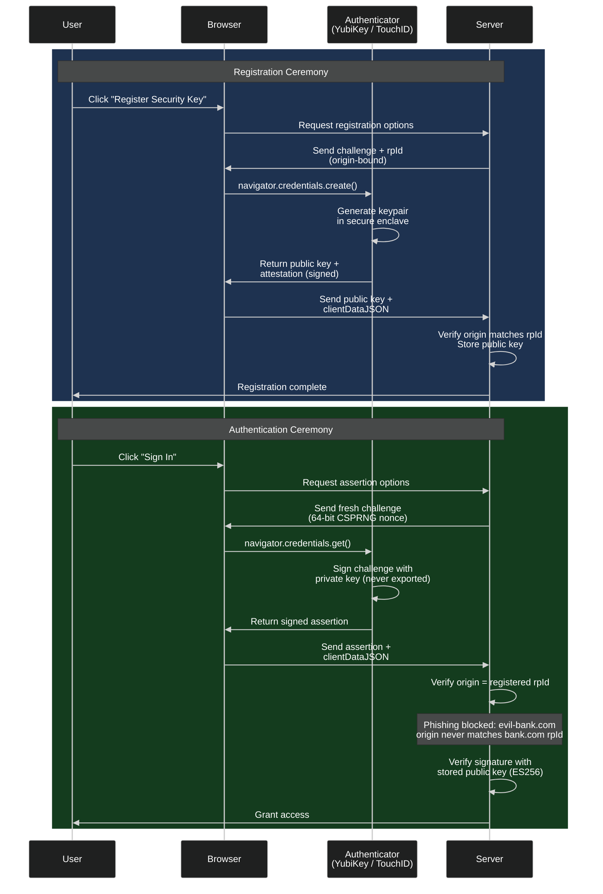
```mermaid
%%{init: {'theme': 'dark',
  'themeVariables': {
    'background': '#1e1e1e'
  },
  'themeCSS': 'svg { background-color: #1e1e1e !important; padding: 1rem !important; border-radius: 8px !important; } .edgeLabel rect { fill: #1e1e1e !important; } text, tspan, .messageText, .signalText, .edgeLabel, .edgeLabel span, .pointLabel, .axisLabel, .quadrantTitle, .quadrantLabel { fill: #ffffff !important; color: #ffffff !important; stroke: none !important; }'
}}%%
sequenceDiagram
    participant U as User
    participant B as Browser
    participant HW as Authenticator<br/>(YubiKey / TouchID)
    participant Srv as Server

    rect rgb(30, 50, 80)
        Note over U,Srv: Registration Ceremony
        U->>B: Click "Register Security Key"
        B->>Srv: Request registration options
        Srv->>B: Send challenge + rpId<br/>(origin-bound)
        B->>HW: navigator.credentials.create()
        HW->>HW: Generate keypair<br/>in secure enclave
        HW->>B: Return public key +<br/>attestation (signed)
        B->>Srv: Send public key +<br/>clientDataJSON
        Srv->>Srv: Verify origin matches rpId<br/>Store public key
        Srv->>U: Registration complete
    end

    rect rgb(20, 60, 30)
        Note over U,Srv: Authentication Ceremony
        U->>B: Click "Sign In"
        B->>Srv: Request assertion options
        Srv->>B: Send fresh challenge<br/>(64-bit CSPRNG nonce)
        B->>HW: navigator.credentials.get()
        HW->>HW: Sign challenge with<br/>private key (never exported)
        HW->>B: Return signed assertion
        B->>Srv: Send assertion +<br/>clientDataJSON
        Srv->>Srv: Verify origin = registered rpId
        Note over Srv: Phishing blocked: evil-bank.com<br/>origin never matches bank.com rpId
        Srv->>Srv: Verify signature with<br/>stored public key (ES256)
        Srv->>U: Grant access
    end
```

---

### V2.10 — Service Authentication

Machine-to-machine authentication is often the weakest link. Hardcoded credentials in source code are trivially extracted from public GitHub repositories. ASVS 5.0 requires service accounts to use dynamic, short-lived credentials injected at runtime — not static secrets burned into configuration files.

| ID | Requirement | Level | Notes |
|----|-------------|-------|-------|
| V2.10.1 | Integration credentials (API keys, service account passwords, database passwords) must not be embedded in source code, build artifacts, container images, or configuration files committed to version control. | L2 | Git history preserves secrets even after deletion; automated scanners find them in minutes |
| V2.10.2 | Service accounts must use just-in-time (JIT) credential injection via a secrets manager or platform identity mechanism: HashiCorp Vault, AWS IRSA/IAM roles, GCP Workload Identity, Azure Managed Identity. Static long-lived keys are prohibited for L3. | L3 | JIT credentials expire automatically; static credentials persist until manually rotated |
| V2.10.3 | Passwords used for service account authentication must have at least 112 bits of entropy, or the service must use certificate-based or asymmetric key-based authentication instead. | L2 | Service account passwords are high-value targets; they must be proportionally strong |
| V2.10.4 | All service credentials must be rotated on a documented schedule (recommended: ≤ 90 days for passwords, ≤ 365 days for long-lived certificates). Rotation must be automated where possible. | L2 | Unrotated credentials accumulate blast radius over time |


```mermaid
%%{init: {'theme': 'dark',
  'themeVariables': {
    'background': '#1e1e1e'
  },
  'themeCSS': 'svg { background-color: #1e1e1e !important; padding: 1rem !important; border-radius: 8px !important; } .edgeLabel rect { fill: #1e1e1e !important; } text, tspan, .messageText, .signalText, .edgeLabel, .edgeLabel span, .pointLabel, .axisLabel, .quadrantTitle, .quadrantLabel { fill: #ffffff !important; color: #ffffff !important; stroke: none !important; }'
}}%%
graph TD
    subgraph BAD["Hardcoded Secret"]
        BC[API_KEY=abc123<br/>in config.yml] --> BGIT[git push to<br/>public repo]
        BGIT --> BSCAN[Scanner finds<br/>in 60 seconds]
        BSCAN --> BREACH[Credential breach<br/>persists in git history]
    end

    subgraph GOOD["JIT via Vault/IRSA"]
        GS[Service pod starts] --> GIRSA[AWS IRSA / GCP<br/>Workload Identity]
        GIRSA --> GVAULT[Request short-lived<br/>token from Vault]
        GVAULT --> GINJECT[Token injected<br/>into env at runtime]
        GINJECT --> GUSE[Service authenticates<br/>with ephemeral token]
        GUSE --> GEXP[Token auto-expires<br/>never in source code]
    end

    classDef danger fill:#b71c1c,stroke:#7f0000,color:#fff
    classDef safe fill:#1b5e20,stroke:#003300,color:#fff
    classDef process fill:#01579b,stroke:#003c8f,color:#fff

    BC:::danger
    BGIT:::danger
    BSCAN:::danger
    BREACH:::danger
    GS:::process
    GIRSA:::process
    GVAULT:::safe
    GINJECT:::safe
    GUSE:::safe
    GEXP:::safe
```

---

## V3: Session Management Verification Requirements

Authentication proves who you are once. Session management maintains that proof across subsequent requests. A session token is a temporary credential, and it must be treated with the same discipline as the password it replaced. Session hijacking, fixation, CSRF, and insecure logout are all failures here — not in authentication.

---

### V3.1 — Fundamental Session Management

The most basic session management controls establish where tokens can travel and what gets recorded. A session token in a URL is visible in server logs, browser history, HTTP Referer headers, and shared links. A session token in a log file is accessible to anyone with log access.

| ID | Requirement | Level | Notes |
|----|-------------|-------|-------|
| V3.1.1 | Session tokens must not be transmitted in URL parameters, path segments, or query strings. Use cookies or Authorization headers exclusively. | L1 | URL-based tokens appear in server logs, browser history, and Referer headers |
| V3.1.2 | Session tokens must never be logged, cached, or stored in persistent storage — even partially or truncated. Logs must mask or omit session identifiers entirely. | L1 | A logged session token is an exploitable credential for anyone with log access |

---

### V3.2 — Session Binding

A session token is only as trustworthy as its generation and binding. Tokens generated with a weak PRNG can be predicted; tokens not regenerated after login are vulnerable to session fixation; tokens stored in permissive storage are vulnerable to XSS theft.

| ID | Requirement | Level | Notes |
|----|-------------|-------|-------|
| V3.2.1 | New session tokens must be generated post-authentication using a cryptographically secure pseudo-random number generator (CSPRNG) with at least 128 bits of entropy. | L1 | Predictable tokens allow session hijacking without any network interception |
| V3.2.2 | Generate a brand-new session token immediately upon successful (re-)authentication. Invalidate any pre-login session token. This prevents session fixation attacks. | L1 | Session fixation: attacker sets a known token before login, then hijacks after |
| V3.2.3 | Session tokens stored in the browser must use secure cookie attributes: Secure, HttpOnly, SameSite, and appropriate Path/Domain scope restrictions. | L1 | Missing attributes expose tokens to network interception, XSS, and CSRF |
| V3.2.4 | JWTs used as session tokens must be signed using approved asymmetric algorithms: RS256, ES256, or PS256. Do not use HS256 in distributed systems where the key must be shared. | L2 | Shared HMAC secrets in distributed systems create multiple key-compromise vectors |

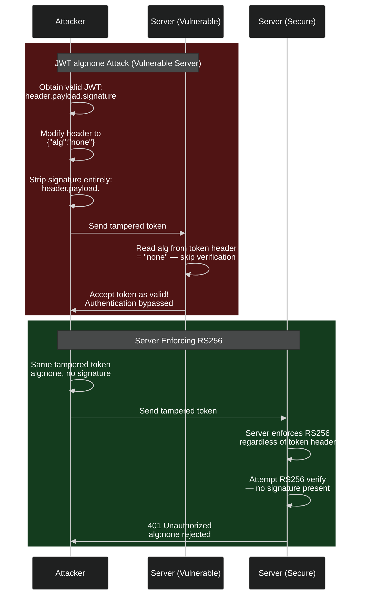
```mermaid
%%{init: {'theme': 'dark',
  'themeVariables': {
    'background': '#1e1e1e'
  },
  'themeCSS': 'svg { background-color: #1e1e1e !important; padding: 1rem !important; border-radius: 8px !important; } .edgeLabel rect { fill: #1e1e1e !important; } text, tspan, .messageText, .signalText, .edgeLabel, .edgeLabel span, .pointLabel, .axisLabel, .quadrantTitle, .quadrantLabel { fill: #ffffff !important; color: #ffffff !important; stroke: none !important; }'
}}%%
sequenceDiagram
    participant ATK as Attacker
    participant Srv as Server (Vulnerable)
    participant SrvS as Server (Secure)

    rect rgb(80, 20, 20)
        Note over ATK,Srv: JWT alg:none Attack (Vulnerable Server)
        ATK->>ATK: Obtain valid JWT:<br/>header.payload.signature
        ATK->>ATK: Modify header to<br/>{"alg":"none"}
        ATK->>ATK: Strip signature entirely:<br/>header.payload.
        ATK->>Srv: Send tampered token
        Srv->>Srv: Read alg from token header<br/>= "none" — skip verification
        Srv->>ATK: Accept token as valid!<br/>Authentication bypassed
    end

    rect rgb(20, 60, 30)
        Note over ATK,SrvS: Server Enforcing RS256
        ATK->>ATK: Same tampered token<br/>alg:none, no signature
        ATK->>SrvS: Send tampered token
        SrvS->>SrvS: Server enforces RS256<br/>regardless of token header
        SrvS->>SrvS: Attempt RS256 verify<br/>— no signature present
        SrvS->>ATK: 401 Unauthorized<br/>alg:none rejected
    end
```

---

### V3.3 — Session Termination

A session that never expires is a perpetual credential. ASVS 5.0 requires both absolute timeout (regardless of activity) and idle timeout (based on inactivity), enforced server-side. Client-side cookie deletion without server-side invalidation is not logout — the token remains valid until expiry.

| ID | Requirement | Level | Notes |
|----|-------------|-------|-------|
| V3.3.1 | Logout must invalidate the session server-side (e.g., remove from session store, add JWT to blocklist). Deleting the client-side cookie alone is insufficient. | L1 | A stolen token remains valid until expiry if only the cookie is deleted |
| V3.3.2 | Enforce an absolute session timeout regardless of user activity. Sessions must not be valid for more than 30 days for general applications and shorter for sensitive applications. | L2 | Long-lived sessions accumulate stolen tokens over time |
| V3.3.3 | Enforce an idle/inactivity timeout server-side. For sensitive applications (banking, healthcare, admin panels) the idle timeout must be ≤ 60 minutes. | L2 | Unattended browser sessions are a physical and network access risk |
| V3.3.4 | Users must be able to view all currently active sessions (device, location, timestamp) and terminate any or all sessions remotely from any authenticated device. | L2 | Session visibility enables users to detect and respond to account takeover |

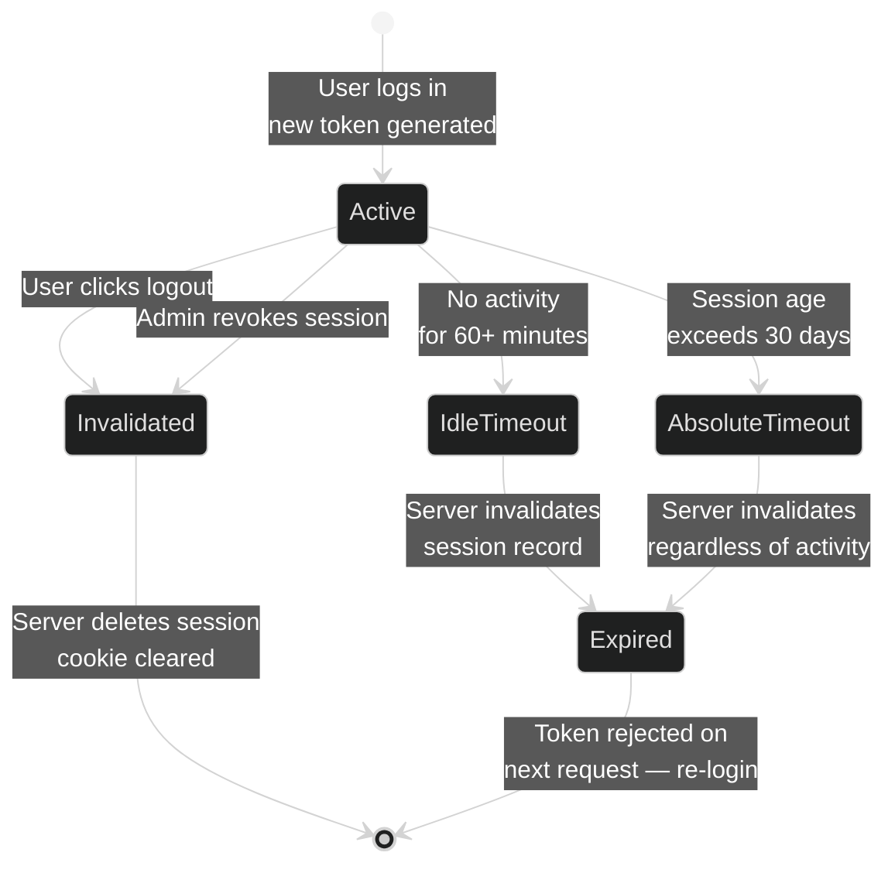
```mermaid
%%{init: {'theme': 'dark',
  'themeVariables': {
    'background': '#1e1e1e'
  },
  'themeCSS': 'svg { background-color: #1e1e1e !important; padding: 1rem !important; border-radius: 8px !important; } .edgeLabel rect { fill: #1e1e1e !important; } text, tspan, .messageText, .signalText, .edgeLabel, .edgeLabel span, .pointLabel, .axisLabel, .quadrantTitle, .quadrantLabel { fill: #ffffff !important; color: #ffffff !important; stroke: none !important; }'
}}%%
stateDiagram-v2
    [*] --> Active : User logs in<br/>new token generated

    Active --> IdleTimeout : No activity<br/>for 60+ minutes
    IdleTimeout --> Expired : Server invalidates<br/>session record

    Active --> AbsoluteTimeout : Session age<br/>exceeds 30 days
    AbsoluteTimeout --> Expired : Server invalidates<br/>regardless of activity

    Active --> Invalidated : User clicks logout
    Invalidated --> [*] : Server deletes session<br/>cookie cleared

    Active --> Invalidated : Admin revokes session
    Expired --> [*] : Token rejected on<br/>next request — re-login
```

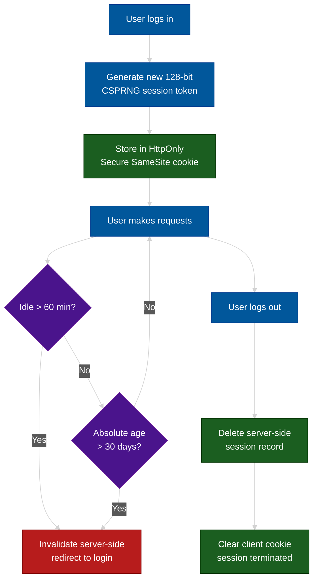
```mermaid
%%{init: {'theme': 'dark',
  'themeVariables': {
    'background': '#1e1e1e'
  },
  'themeCSS': 'svg { background-color: #1e1e1e !important; padding: 1rem !important; border-radius: 8px !important; } .edgeLabel rect { fill: #1e1e1e !important; } text, tspan, .messageText, .signalText, .edgeLabel, .edgeLabel span, .pointLabel, .axisLabel, .quadrantTitle, .quadrantLabel { fill: #ffffff !important; color: #ffffff !important; stroke: none !important; }'
}}%%
flowchart TD
    LOGIN[User logs in] --> NEWTOKEN[Generate new 128-bit<br/>CSPRNG session token]
    NEWTOKEN --> STORE[Store in HttpOnly<br/>Secure SameSite cookie]
    STORE --> USE[User makes requests]
    USE --> IDLE{Idle > 60 min?}
    IDLE -->|Yes| EXPIRE[Invalidate server-side<br/>redirect to login]
    IDLE -->|No| ABS{Absolute age<br/>> 30 days?}
    ABS -->|Yes| EXPIRE
    ABS -->|No| USE
    USE --> LOGOUT[User logs out]
    LOGOUT --> INVALIDATE[Delete server-side<br/>session record]
    INVALIDATE --> CLEAR[Clear client cookie<br/>session terminated]

    classDef safe fill:#1b5e20,stroke:#003300,color:#fff
    classDef process fill:#01579b,stroke:#003c8f,color:#fff
    classDef danger fill:#b71c1c,stroke:#7f0000,color:#fff
    classDef decision fill:#4a148c,stroke:#6a1b9a,color:#fff

    LOGIN:::process
    NEWTOKEN:::process
    STORE:::safe
    USE:::process
    IDLE:::decision
    EXPIRE:::danger
    ABS:::decision
    LOGOUT:::process
    INVALIDATE:::safe
    CLEAR:::safe
```

---

### V3.4 — Cookie-Based Session Management

Cookie security is layered: each attribute adds one defense. Missing a single attribute is often sufficient for an attacker to steal or forge a session. All four attributes — Secure, HttpOnly, SameSite, and the `__Host-` prefix — must be applied together.

| ID | Requirement | Level | Notes |
|----|-------------|-------|-------|
| V3.4.1 | Session cookies must have the `Secure` flag set. This prevents transmission over unencrypted HTTP connections. | L1 | Without Secure, cookies are sent over HTTP and visible to network attackers |
| V3.4.2 | Session cookies must have the `HttpOnly` flag set. This prevents JavaScript from reading the cookie value. | L1 | XSS attacks cannot steal HttpOnly cookies directly |
| V3.4.3 | Session cookies must have `SameSite=Lax` or `SameSite=Strict`. Lax is the minimum; Strict is required for sensitive applications. | L1 | SameSite prevents CSRF by blocking cross-site cookie sending |
| V3.4.4 | Use the `__Host-` cookie name prefix for session cookies. This enforces: Secure flag, no Domain attribute, Path=/ — maximum scope restriction. | L2 | Prefix prevents cookie injection via subdomains |
| V3.4.5 | Do not store session state in Flash cookies, HTML5 sessionStorage, or localStorage. These lack the security attributes of cookies and are accessible to JavaScript. | L1 | localStorage is readable by any same-origin script; no HttpOnly equivalent exists |

**Implementation Example — Spring Boot Secure Cookie**

```java
@Bean
public CookieSerializer cookieSerializer() {
    DefaultCookieSerializer serializer = new DefaultCookieSerializer();
    serializer.setCookieName("__Host-SESSION");  // V3.4.4 — __Host- prefix
    serializer.setUseSecureCookie(true);          // V3.4.1 — Secure flag
    serializer.setUseHttpOnlyCookie(true);        // V3.4.2 — HttpOnly flag
    serializer.setSameSite("Strict");             // V3.4.3 — SameSite=Strict
    serializer.setCookiePath("/");                // required with __Host- prefix
    // V3.4.4 — __Host- prefix prohibits Domain attribute
    return serializer;
}
```

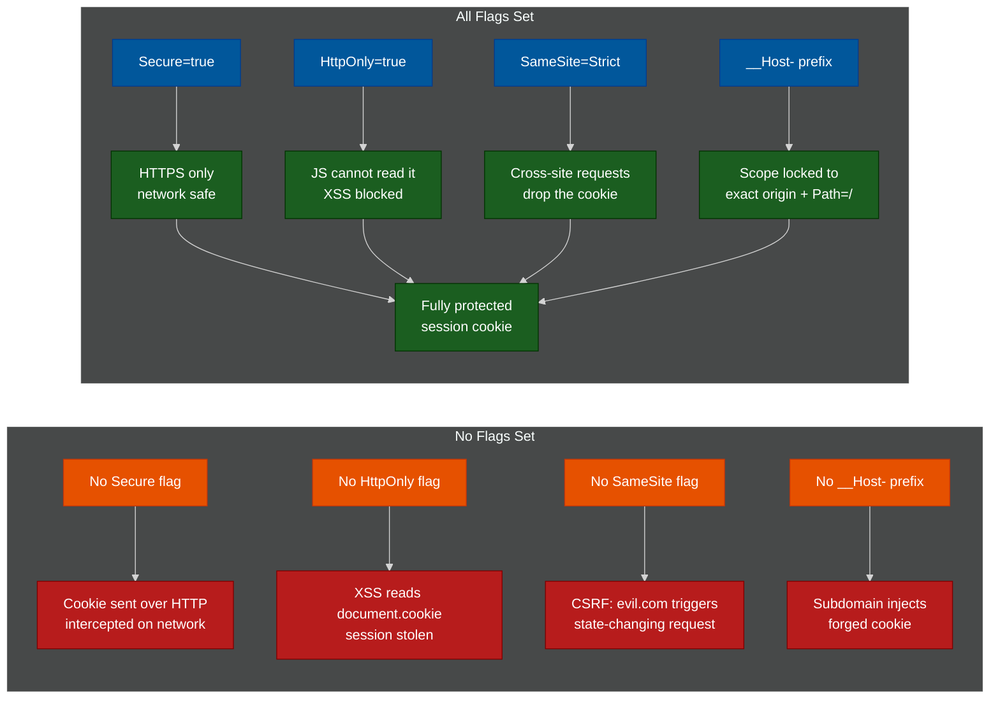
```mermaid
%%{init: {'theme': 'dark',
  'themeVariables': {
    'background': '#1e1e1e'
  },
  'themeCSS': 'svg { background-color: #1e1e1e !important; padding: 1rem !important; border-radius: 8px !important; } .edgeLabel rect { fill: #1e1e1e !important; } text, tspan, .messageText, .signalText, .edgeLabel, .edgeLabel span, .pointLabel, .axisLabel, .quadrantTitle, .quadrantLabel { fill: #ffffff !important; color: #ffffff !important; stroke: none !important; }'
}}%%
graph LR
    subgraph MISSING["No Flags Set"]
        M1[No Secure flag] --> M1R[Cookie sent over HTTP<br/>intercepted on network]
        M2[No HttpOnly flag] --> M2R[XSS reads document.cookie<br/>session stolen]
        M3[No SameSite flag] --> M3R[CSRF: evil.com triggers<br/>state-changing request]
        M4[No __Host- prefix] --> M4R[Subdomain injects<br/>forged cookie]
    end

    subgraph ALL["All Flags Set"]
        A1[Secure=true] --> A1R[HTTPS only<br/>network safe]
        A2[HttpOnly=true] --> A2R[JS cannot read it<br/>XSS blocked]
        A3[SameSite=Strict] --> A3R[Cross-site requests<br/>drop the cookie]
        A4[__Host- prefix] --> A4R[Scope locked to<br/>exact origin + Path=/]
        A1R & A2R & A3R & A4R --> PROT[Fully protected<br/>session cookie]
    end

    classDef danger fill:#b71c1c,stroke:#7f0000,color:#fff
    classDef safe fill:#1b5e20,stroke:#003300,color:#fff
    classDef process fill:#01579b,stroke:#003c8f,color:#fff
    classDef warning fill:#e65100,stroke:#bf360c,color:#fff

    M1:::warning
    M1R:::danger
    M2:::warning
    M2R:::danger
    M3:::warning
    M3R:::danger
    M4:::warning
    M4R:::danger
    A1:::process
    A1R:::safe
    A2:::process
    A2R:::safe
    A3:::process
    A3R:::safe
    A4:::process
    A4R:::safe
    PROT:::safe
```

---

### V3.5 — Token-Based Session (JWT)

JWTs are stateless by design — they carry their own validity claims. This creates a fundamental tension with revocation: how do you invalidate a token before its `exp` claim? ASVS 5.0 requires either a revocation mechanism (blocklist) or very short expiry + refresh token rotation. Storing JWTs in localStorage is explicitly prohibited due to XSS exposure.

| ID | Requirement | Level | Notes |
|----|-------------|-------|-------|
| V3.5.1 | Stateless session tokens (JWTs) must include standard claims: `iat` (issued at), `exp` (expiry), `iss` (issuer), `sub` (subject/user identifier). | L2 | Missing claims prevent proper validation and enable token reuse across systems |
| V3.5.2 | A revocation mechanism must exist for JWTs even if stateless: either a token blocklist checked on each request, or short-lived access tokens (≤ 15 min) combined with refresh token rotation and revocable refresh token storage. | L2 | Without revocation, logout is impossible and stolen tokens are valid until expiry |
| V3.5.3 | JWTs used for session management must not be stored in localStorage or sessionStorage. Store only in HttpOnly cookies (see V3.4). | L1 | localStorage is XSS-accessible; no attribute equivalent to HttpOnly exists |
| V3.5.4 | The server must enforce the expected JWT signing algorithm independently of the `alg` header in the received token. Never accept `alg: none`. | L1 | The `alg: none` attack allows unsigned tokens to be accepted as valid |

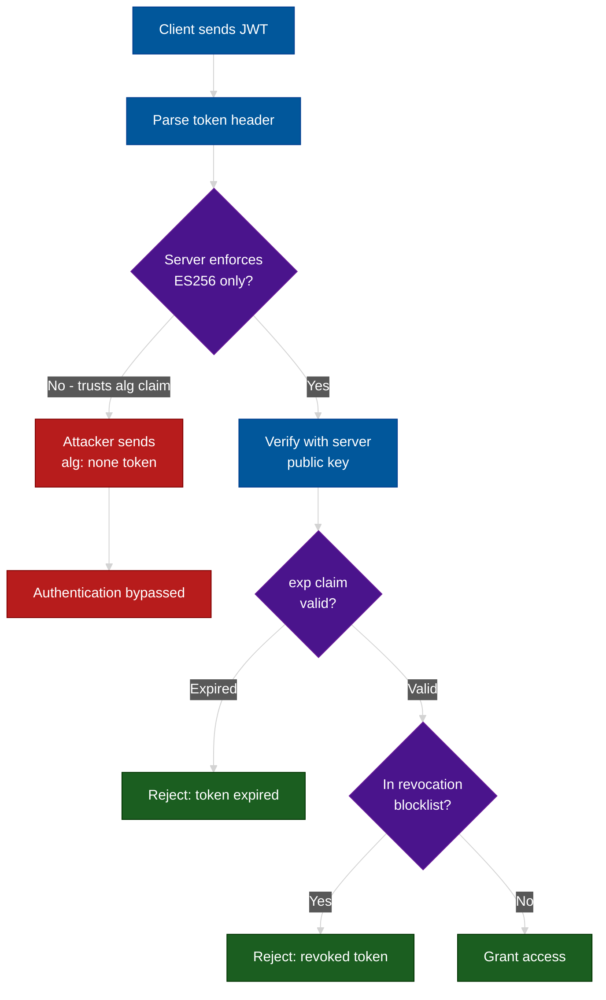
```mermaid
%%{init: {'theme': 'dark',
  'themeVariables': {
    'background': '#1e1e1e'
  },
  'themeCSS': 'svg { background-color: #1e1e1e !important; padding: 1rem !important; border-radius: 8px !important; } .edgeLabel rect { fill: #1e1e1e !important; } text, tspan, .messageText, .signalText, .edgeLabel, .edgeLabel span, .pointLabel, .axisLabel, .quadrantTitle, .quadrantLabel { fill: #ffffff !important; color: #ffffff !important; stroke: none !important; }'
}}%%
flowchart TD
    CLIENT[Client sends JWT] --> PARSE[Parse token header]
    PARSE --> ALGCHECK{Server enforces<br/>ES256 only?}
    ALGCHECK -->|No - trusts alg claim| NONE[Attacker sends<br/>alg: none token]
    NONE --> BYPASS[Authentication bypassed]
    ALGCHECK -->|Yes| VERIFY[Verify with server<br/>public key]
    VERIFY --> EXPCHECK{exp claim<br/>valid?}
    EXPCHECK -->|Expired| REJECT[Reject: token expired]
    EXPCHECK -->|Valid| BLOCKLIST{In revocation<br/>blocklist?}
    BLOCKLIST -->|Yes| REJECT2[Reject: revoked token]
    BLOCKLIST -->|No| GRANT[Grant access]

    classDef danger fill:#b71c1c,stroke:#7f0000,color:#fff
    classDef safe fill:#1b5e20,stroke:#003300,color:#fff
    classDef process fill:#01579b,stroke:#003c8f,color:#fff
    classDef decision fill:#4a148c,stroke:#6a1b9a,color:#fff

    CLIENT:::process
    PARSE:::process
    ALGCHECK:::decision
    NONE:::danger
    BYPASS:::danger
    VERIFY:::process
    EXPCHECK:::decision
    REJECT:::safe
    BLOCKLIST:::decision
    REJECT2:::safe
    GRANT:::safe
```

---

### V3.6 — Federated Re-authentication

Federated identity (OAuth 2.0, OpenID Connect, SAML) delegates authentication to an Identity Provider (IdP). This introduces new attack surfaces: replay attacks using captured assertions, and stale sessions at the IdP that do not reflect current authentication strength. ASVS 5.0 requires relying parties to actively manage re-authentication requirements.

| ID | Requirement | Level | Notes |
|----|-------------|-------|-------|
| V3.6.1 | OpenID Connect relying parties must specify the `max_age` parameter in authentication requests to require the IdP to force re-authentication if the user's session at the IdP is older than the specified age. | L3 | Without max_age, a user authenticated hours ago may silently satisfy an SSO request |
| V3.6.2 | OpenID Connect flows must include a `nonce` claim in the ID token and verify it matches the nonce sent in the authorization request. This prevents ID token replay attacks. | L2 | Captured ID tokens can be replayed without nonce validation |

---

### V3.7 — Defenses Against Session Exploits

Cross-Site Request Forgery (CSRF) and Cross-Origin Resource Sharing (CORS) misconfigurations are two of the most common session exploitation vectors. SameSite cookies provide CSRF protection for modern browsers; anti-CSRF tokens provide defense-in-depth and coverage for older browsers.

| ID | Requirement | Level | Notes |
|----|-------------|-------|-------|
| V3.7.1 | Implement anti-CSRF tokens for all state-changing requests if `SameSite=Strict` is not enforced. Anti-CSRF tokens must be unique per session, cryptographically random (≥ 128 bits), and validated server-side on every state-changing request. | L1 | CSRF allows attackers to perform actions on behalf of authenticated users |
| V3.7.2 | CORS policy must restrict the `Access-Control-Allow-Origin` header to an explicit allowlist of authorized origins. Never use wildcard (`*`) for endpoints that carry or accept credentials. | L1 | Wildcard CORS with credentials allows any website to make credentialed cross-origin requests |

---

## V4: Access Control Verification Requirements

Access control determines what an authenticated identity is permitted to do. Authentication failing is dramatic — account takeover. Access control failing is subtle — one user reading another user's data, a regular user accessing admin functions, or a workflow step being skipped. ASVS 5.0 requires that access control be enforced server-side, be deny-by-default, and be applied at the operation level — not just the UI level.

---

### V4.1 — General Access Control Design

The foundational principles of access control — least privilege, deny by default, server-side enforcement — have been known for decades. They continue to fail in practice because shortcuts are taken during feature development: a junior developer adds a new endpoint and forgets to add an authorization annotation, a feature flag disables access control in development and the flag leaks to production. ASVS 5.0 treats these as systematic failures requiring architectural controls.

| ID | Requirement | Level | Notes |
|----|-------------|-------|-------|
| V4.1.1 | All access control decisions must be enforced on the server side. Client-side checks (JavaScript conditions, hidden UI elements) are informational only and must never be the sole enforcement point. | L1 | Client-side controls are trivially bypassed via browser DevTools or direct API calls |
| V4.1.2 | All attributes and data used in access control decisions — user roles, permissions, group memberships, resource owners — must come from trusted server-side sources. Never accept role or permission claims from user-controlled input (URL parameters, request body, JWT claims that users can modify). | L1 | Client-supplied role elevation is a direct privilege escalation attack |
| V4.1.3 | Apply the principle of least privilege: users and service accounts should have only the minimum permissions necessary to perform their function. Permissions must be explicitly granted, not inherited by default. | L1 | Over-privileged accounts maximize blast radius when compromised |
| V4.1.4 | Implement deny-by-default access control. New API endpoints and features must be inaccessible by default and require explicit authorization rules to be added. | L1 | Missing authorization annotations on new endpoints are a common vulnerability class |
| V4.1.5 | Disable directory listing on all web and file servers. Users must not be able to enumerate files in directories that do not have an explicit index page. | L1 | Directory listings expose file names, backup files, and configuration files to attackers |

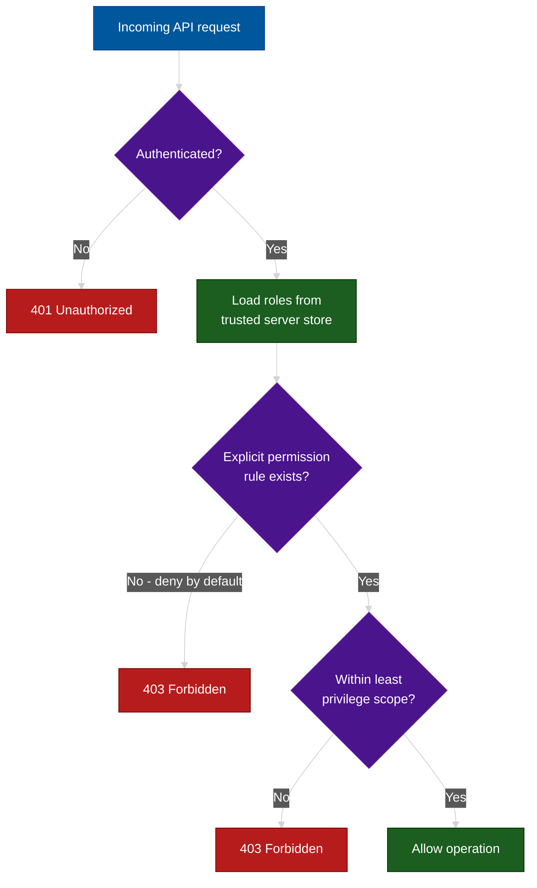
```mermaid
%%{init: {'theme': 'dark',
  'themeVariables': {
    'background': '#1e1e1e'
  },
  'themeCSS': 'svg { background-color: #1e1e1e !important; padding: 1rem !important; border-radius: 8px !important; } .edgeLabel rect { fill: #1e1e1e !important; } text, tspan, .messageText, .signalText, .edgeLabel, .edgeLabel span, .pointLabel, .axisLabel, .quadrantTitle, .quadrantLabel { fill: #ffffff !important; color: #ffffff !important; stroke: none !important; }'
}}%%
flowchart TD
    REQ[Incoming API request] --> AUTH{Authenticated?}
    AUTH -->|No| DENY401[401 Unauthorized]
    AUTH -->|Yes| LOADROLE[Load roles from<br/>trusted server store]
    LOADROLE --> PERMIT{Explicit permission<br/>rule exists?}
    PERMIT -->|No - deny by default| DENY403[403 Forbidden]
    PERMIT -->|Yes| LEASTPRIV{Within least<br/>privilege scope?}
    LEASTPRIV -->|No| DENY403B[403 Forbidden]
    LEASTPRIV -->|Yes| ALLOW[Allow operation]

    classDef danger fill:#b71c1c,stroke:#7f0000,color:#fff
    classDef safe fill:#1b5e20,stroke:#003300,color:#fff
    classDef process fill:#01579b,stroke:#003c8f,color:#fff
    classDef decision fill:#4a148c,stroke:#6a1b9a,color:#fff

    REQ:::process
    AUTH:::decision
    DENY401:::danger
    LOADROLE:::safe
    PERMIT:::decision
    DENY403:::danger
    LEASTPRIV:::decision
    DENY403B:::danger
    ALLOW:::safe
```

**Implementation Example — Spring Security Method Security**

```java
@RestController
@RequestMapping("/api/invoices")
public class InvoiceController {

    // V4.1.1 — server-side enforcement via annotation
    // V4.1.4 — explicit @PreAuthorize required; no implicit access
    @GetMapping("/{id}")
    @PreAuthorize("hasRole('INVOICE_READ') and @invoiceService.isOwner(#id, authentication.name)")
    public ResponseEntity<Invoice> getInvoice(@PathVariable UUID id) {
        // V4.2.1 — ownership checked in @PreAuthorize above
        // UUID prevents sequential enumeration (IDOR)
        return ResponseEntity.ok(invoiceService.findById(id));
    }

    // V4.1.3 — admin-only endpoint explicitly annotated
    @DeleteMapping("/{id}")
    @PreAuthorize("hasRole('INVOICE_ADMIN')")
    public ResponseEntity<Void> deleteInvoice(@PathVariable UUID id) {
        invoiceService.delete(id);
        return ResponseEntity.noContent().build();
    }
}
```

---

### V4.2 — Operation Level Access Control

Operation-level access control means verifying permissions at the level of individual objects and actions — not just at the route level. Insecure Direct Object Reference (IDOR) is the canonical failure here: an endpoint requires authentication but does not verify that the authenticated user owns the requested resource. Changing `/api/invoice/42` to `/api/invoice/43` retrieves another user's invoice.

| ID | Requirement | Level | Notes |
|----|-------------|-------|-------|
| V4.2.1 | All sensitive data access and API operations must verify that the authenticated user has permission to access the specific object being requested. Use cryptographic UUIDs or opaque identifiers and perform explicit ownership/permission checks in the backend — not just in the frontend. | L1 | IDOR is consistently one of the top API vulnerabilities; sequential integer IDs make enumeration trivial |
| V4.2.2 | Implement unique per-user per-session anti-CSRF tokens for all state-changing requests, or enforce `SameSite=Strict` cookies. Verify the token server-side before processing any state-changing operation. | L1 | CSRF allows state changes to be triggered cross-site without the user's explicit intent |

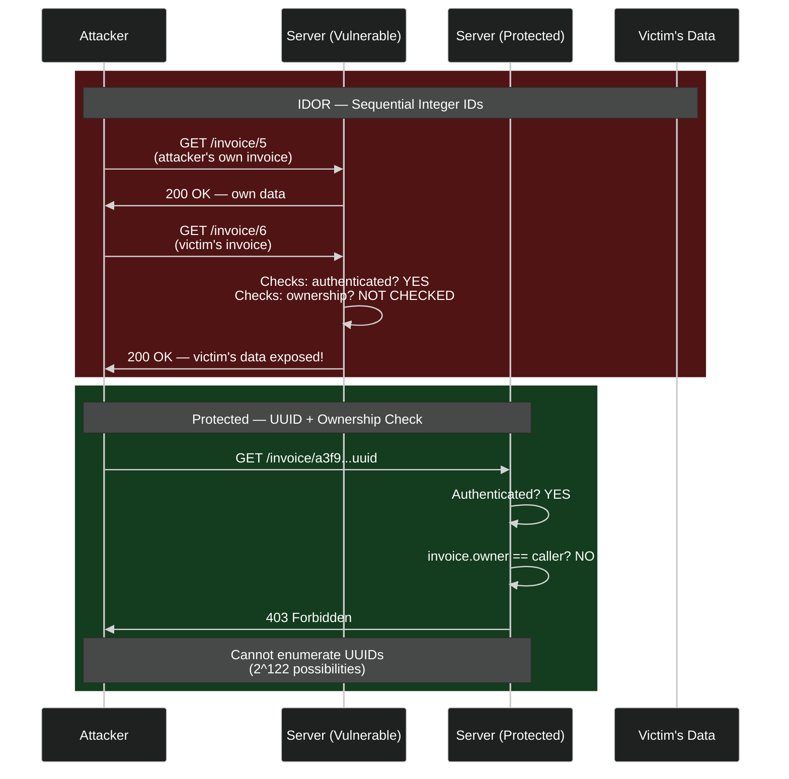
```mermaid
%%{init: {'theme': 'dark',
  'themeVariables': {
    'background': '#1e1e1e'
  },
  'themeCSS': 'svg { background-color: #1e1e1e !important; padding: 1rem !important; border-radius: 8px !important; } .edgeLabel rect { fill: #1e1e1e !important; } text, tspan, .messageText, .signalText, .edgeLabel, .edgeLabel span, .pointLabel, .axisLabel, .quadrantTitle, .quadrantLabel { fill: #ffffff !important; color: #ffffff !important; stroke: none !important; }'
}}%%
sequenceDiagram
    participant ATK as Attacker
    participant Srv as Server (Vulnerable)
    participant SrvS as Server (Protected)
    participant VIC as Victim's Data

    rect rgb(80, 20, 20)
        Note over ATK,VIC: IDOR — Sequential Integer IDs
        ATK->>Srv: GET /invoice/5<br/>(attacker's own invoice)
        Srv->>ATK: 200 OK — own data
        ATK->>Srv: GET /invoice/6<br/>(victim's invoice)
        Srv->>Srv: Checks: authenticated? YES<br/>Checks: ownership? NOT CHECKED
        Srv->>ATK: 200 OK — victim's data exposed!
    end

    rect rgb(20, 60, 30)
        Note over ATK,SrvS: Protected — UUID + Ownership Check
        ATK->>SrvS: GET /invoice/a3f9...uuid
        SrvS->>SrvS: Authenticated? YES
        SrvS->>SrvS: invoice.owner == caller? NO
        SrvS->>ATK: 403 Forbidden
        Note over ATK,SrvS: Cannot enumerate UUIDs<br/>(2^122 possibilities)
    end
```

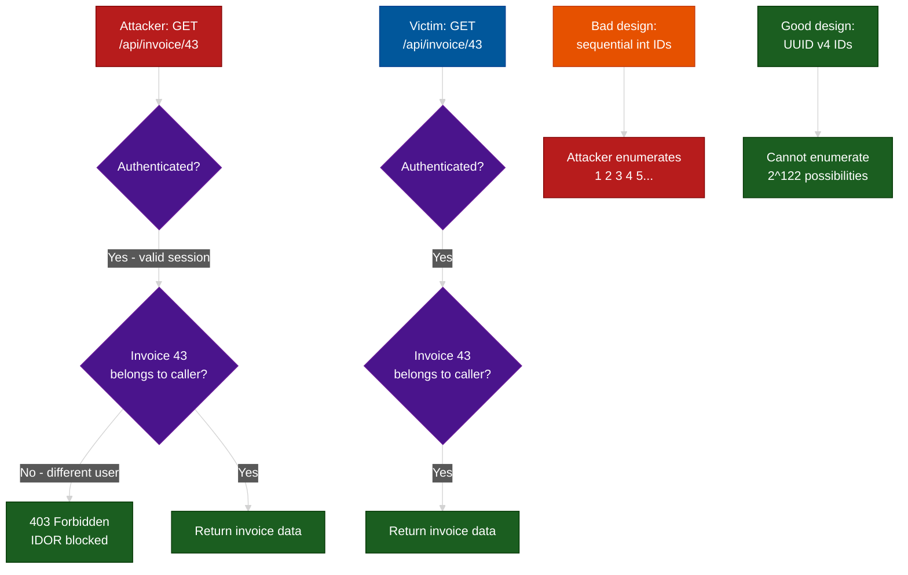
```mermaid
%%{init: {'theme': 'dark',
  'themeVariables': {
    'background': '#1e1e1e'
  },
  'themeCSS': 'svg { background-color: #1e1e1e !important; padding: 1rem !important; border-radius: 8px !important; } .edgeLabel rect { fill: #1e1e1e !important; } text, tspan, .messageText, .signalText, .edgeLabel, .edgeLabel span, .pointLabel, .axisLabel, .quadrantTitle, .quadrantLabel { fill: #ffffff !important; color: #ffffff !important; stroke: none !important; }'
}}%%
flowchart TD
    ATKTRY[Attacker: GET<br/>/api/invoice/43] --> AUTHN{Authenticated?}
    AUTHN -->|Yes - valid session| OBJCHECK{Invoice 43<br/>belongs to caller?}
    OBJCHECK -->|No - different user| IDOR403[403 Forbidden<br/>IDOR blocked]
    OBJCHECK -->|Yes| RETURN[Return invoice data]

    VICTIM[Victim: GET<br/>/api/invoice/43] --> AUTHN2{Authenticated?}
    AUTHN2 -->|Yes| OBJCHECK2{Invoice 43<br/>belongs to caller?}
    OBJCHECK2 -->|Yes| RETURN2[Return invoice data]

    SEQID[Bad design:<br/>sequential int IDs] --> GUESS[Attacker enumerates<br/>1 2 3 4 5...]
    UUID[Good design:<br/>UUID v4 IDs] --> NOGUESS[Cannot enumerate<br/>2^122 possibilities]

    classDef danger fill:#b71c1c,stroke:#7f0000,color:#fff
    classDef safe fill:#1b5e20,stroke:#003300,color:#fff
    classDef process fill:#01579b,stroke:#003c8f,color:#fff
    classDef decision fill:#4a148c,stroke:#6a1b9a,color:#fff
    classDef warning fill:#e65100,stroke:#bf360c,color:#fff

    ATKTRY:::danger
    AUTHN:::decision
    OBJCHECK:::decision
    IDOR403:::safe
    RETURN:::safe
    VICTIM:::process
    AUTHN2:::decision
    OBJCHECK2:::decision
    RETURN2:::safe
    SEQID:::warning
    GUESS:::danger
    UUID:::safe
    NOGUESS:::safe
```

---

### V4.3 — Other Access Control

These requirements address common access control failures that do not fit neatly into the above categories but are consistently exploited: unprotected admin interfaces, directory traversal, and business logic flow bypasses.

| ID | Requirement | Level | Notes |
|----|-------------|-------|-------|
| V4.3.1 | Administrative interfaces must require an additional authentication factor beyond the standard user authentication (step-up MFA). Prefer network-level restrictions (VPN, allowlisted IPs) in addition to application-level controls. | L1 | Admin interfaces are high-value targets; a single compromised account should not grant full admin access |
| V4.3.2 | Block directory traversal attacks by canonicalizing all file paths before use and verifying they reside within an allowed base directory. Never construct file paths using user-supplied input without strict sanitization and validation. | L1 | `../../../etc/passwd` traversal is one of the oldest and most consistently exploited vulnerability classes |
| V4.3.3 | Business logic access control must be enforced: users must not be able to skip workflow steps (e.g., bypassing payment, skipping approval, accessing step 3 of a wizard without completing steps 1 and 2). Enforce state machine transitions server-side. | L2 | Business logic bypasses are often invisible to automated scanners and cause direct financial or integrity harm |

**Implementation Example — Directory Traversal Defense**

```java
public class FileService {

    private final Path BASE_DIR = Path.of("/app/uploads").toRealPath();

    // V4.3.2 — canonicalize and validate path before access
    public byte[] readFile(String userSuppliedFilename) throws IOException {
        // Resolve against base, then normalize to remove ../ sequences
        Path requested = BASE_DIR.resolve(userSuppliedFilename).normalize().toRealPath();

        // Verify resolved path is still under the base directory
        if (!requested.startsWith(BASE_DIR)) {
            throw new SecurityException(
                "Directory traversal attempt detected: " + userSuppliedFilename
            );
        }

        return Files.readAllBytes(requested);
    }
}
```

**Implementation Example — Business Logic State Enforcement**

```java
// V4.3.3 — enforce checkout workflow server-side
@PostMapping("/checkout/payment")
@PreAuthorize("isAuthenticated()")
public ResponseEntity<?> submitPayment(@RequestBody PaymentRequest req, Principal user) {
    Order order = orderService.findByUser(user.getName(), req.getOrderId());

    // Cannot skip to payment step without a confirmed cart
    if (order.getStatus() != OrderStatus.CART_CONFIRMED) {
        return ResponseEntity.status(HttpStatus.CONFLICT)
            .body("Invalid workflow state: cart must be confirmed before payment.");
    }

    paymentService.process(order, req);
    order.setStatus(OrderStatus.PAYMENT_SUBMITTED);
    return ResponseEntity.ok().build();
}
```

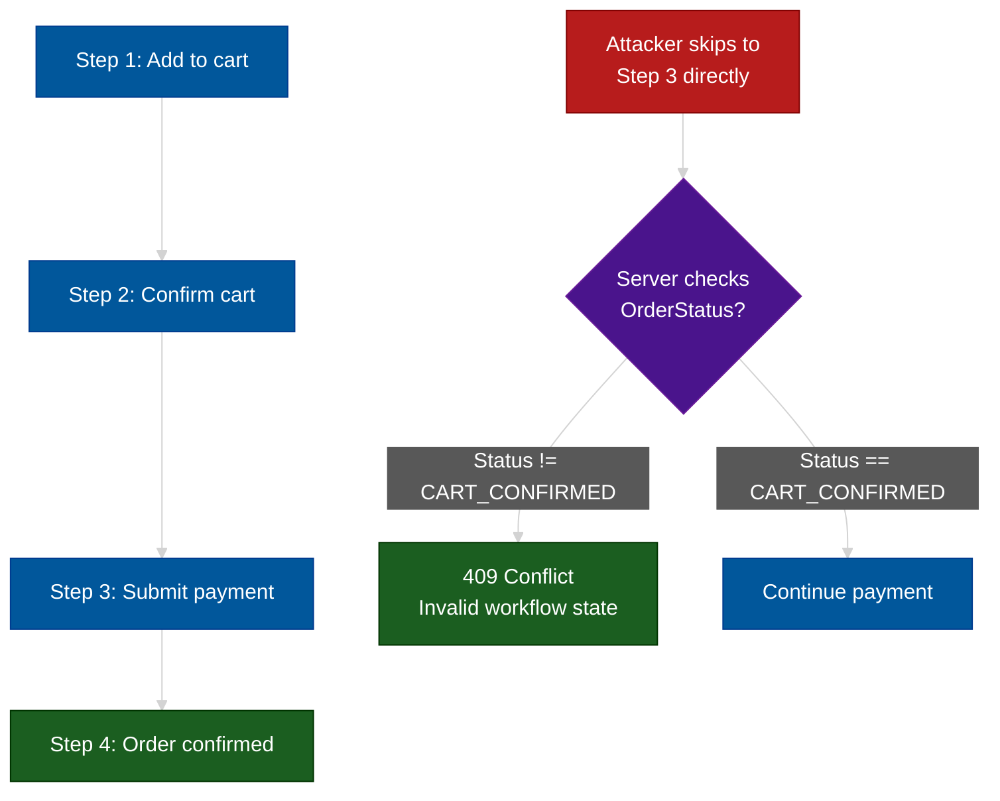
```mermaid
%%{init: {'theme': 'dark',
  'themeVariables': {
    'background': '#1e1e1e'
  },
  'themeCSS': 'svg { background-color: #1e1e1e !important; padding: 1rem !important; border-radius: 8px !important; } .edgeLabel rect { fill: #1e1e1e !important; } text, tspan, .messageText, .signalText, .edgeLabel, .edgeLabel span, .pointLabel, .axisLabel, .quadrantTitle, .quadrantLabel { fill: #ffffff !important; color: #ffffff !important; stroke: none !important; }'
}}%%
flowchart TD
    S1[Step 1: Add to cart] --> S2[Step 2: Confirm cart]
    S2 --> S3[Step 3: Submit payment]
    S3 --> S4[Step 4: Order confirmed]

    ATK[Attacker skips to<br/>Step 3 directly] --> CHECK{Server checks<br/>OrderStatus?}
    CHECK -->|Status != CART_CONFIRMED| BLOCK[409 Conflict<br/>Invalid workflow state]
    CHECK -->|Status == CART_CONFIRMED| PROCEED[Continue payment]

    classDef safe fill:#1b5e20,stroke:#003300,color:#fff
    classDef process fill:#01579b,stroke:#003c8f,color:#fff
    classDef danger fill:#b71c1c,stroke:#7f0000,color:#fff
    classDef decision fill:#4a148c,stroke:#6a1b9a,color:#fff

    S1:::process
    S2:::process
    S3:::process
    S4:::safe
    ATK:::danger
    CHECK:::decision
    BLOCK:::safe
    PROCEED:::process
```

---

## Summary: Domain A at a Glance

| Chapter | Core Principle | Key L1 Controls | Biggest Failure Mode |
|---------|----------------|-----------------|----------------------|
| V2 Authentication | Prove identity reliably | Min 12-char passwords, HIBP check, rate limiting | No rate limiting on login = credential stuffing |
| V3 Session Management | Maintain identity safely | HttpOnly+Secure+SameSite cookies, server-side invalidation | JWT stored in localStorage = XSS steals all sessions |
| V4 Access Control | Limit what identity can do | Server-side enforcement, deny-by-default, UUID object IDs | IDOR via sequential IDs = any user reads any record |

Every requirement above has a corresponding attack. The ASVS levels (L1/L2/L3) indicate the minimum assurance level at which the control must be implemented — L1 for all applications, L2 for applications handling sensitive data, L3 for high-assurance applications (financial, healthcare, critical infrastructure).

---


---

## References

### Official Standards & Specifications
- **OWASP ASVS 5.0** — [github.com/OWASP/ASVS](https://github.com/OWASP/ASVS) — Full standard source
- **NIST SP 800-63B** — [pages.nist.gov/800-63-3/sp800-63b.html](https://pages.nist.gov/800-63-3/sp800-63b.html) — Digital Identity Guidelines: Authentication & Lifecycle
- **RFC 9106** — [rfc-editor.org/rfc/rfc9106](https://www.rfc-editor.org/rfc/rfc9106) — Argon2 Memory-Hard Function specification
- **RFC 8725** — [rfc-editor.org/rfc/rfc8725](https://www.rfc-editor.org/rfc/rfc8725) — JSON Web Token Best Current Practices
- **W3C WebAuthn** — [w3.org/TR/webauthn-3](https://www.w3.org/TR/webauthn-3/) — Web Authentication (FIDO2) specification
- **FIDO2 Overview** — [fidoalliance.org/fido2](https://fidoalliance.org/fido2/) — FIDO Alliance FIDO2 resources

### OWASP Cheat Sheets
- **Authentication** — [cheatsheetseries.owasp.org/cheatsheets/Authentication_Cheat_Sheet.html](https://cheatsheetseries.owasp.org/cheatsheets/Authentication_Cheat_Sheet.html)
- **Password Storage** — [cheatsheetseries.owasp.org/cheatsheets/Password_Storage_Cheat_Sheet.html](https://cheatsheetseries.owasp.org/cheatsheets/Password_Storage_Cheat_Sheet.html)
- **Session Management** — [cheatsheetseries.owasp.org/cheatsheets/Session_Management_Cheat_Sheet.html](https://cheatsheetseries.owasp.org/cheatsheets/Session_Management_Cheat_Sheet.html)
- **Access Control** — [cheatsheetseries.owasp.org/cheatsheets/Access_Control_Cheat_Sheet.html](https://cheatsheetseries.owasp.org/cheatsheets/Access_Control_Cheat_Sheet.html)
- **Forgot Password** — [cheatsheetseries.owasp.org/cheatsheets/Forgot_Password_Cheat_Sheet.html](https://cheatsheetseries.owasp.org/cheatsheets/Forgot_Password_Cheat_Sheet.html)
- **CSRF Prevention** — [cheatsheetseries.owasp.org/cheatsheets/Cross-Site_Request_Forgery_Prevention_Cheat_Sheet.html](https://cheatsheetseries.owasp.org/cheatsheets/Cross-Site_Request_Forgery_Prevention_Cheat_Sheet.html)
- **IDOR Prevention** — [cheatsheetseries.owasp.org/cheatsheets/Insecure_Direct_Object_Reference_Prevention_Cheat_Sheet.html](https://cheatsheetseries.owasp.org/cheatsheets/Insecure_Direct_Object_Reference_Prevention_Cheat_Sheet.html)

### OWASP Top 10 Mappings
- **A01:2021** — [owasp.org/Top10/A01_2021-Broken_Access_Control](https://owasp.org/Top10/A01_2021-Broken_Access_Control/) — Broken Access Control (V4)
- **A07:2021** — [owasp.org/Top10/A07_2021-Identification_and_Authentication_Failures](https://owasp.org/Top10/A07_2021-Identification_and_Authentication_Failures/) — Authentication Failures (V2, V3)

### Tools & Services
- **HaveIBeenPwned API** — [haveibeenpwned.com/API/v3](https://haveibeenpwned.com/API/v3) — Breached password checking (V2.1.5)
- **Spring Security** — [spring.io/projects/spring-security](https://spring.io/projects/spring-security) — Java authentication & authorization framework
- **Argon2 Java** — [github.com/phxql/argon2-jvm](https://github.com/phxql/argon2-jvm) — Argon2 JVM binding (V2.4.2)
- **WebAuthn4J** — [github.com/webauthn4j/webauthn4j](https://github.com/webauthn4j/webauthn4j) — Java WebAuthn/FIDO2 server library (V2.9)
- **HashiCorp Vault** — [vaultproject.io](https://www.vaultproject.io) — Secrets management for service credentials (V2.10)

## 📚 Implementation References
To see how to physically implement these ASVS requirements, refer to our dedicated architecture guides:
- **V2 Auth:** [Defeating Evil Twins & Captive Portals](../network-security/01-evil-twins-and-captive-portals.md)
- **V3 Sessions:** [Device & Session Management Architecture](../session-and-cookie-security/02-device-and-session-management.md)
- **V3 Binding:** [Defeating the Cookie Black Market](../session-and-cookie-security/03-the-cookie-black-market.md)
- **V3 Heuristics:** [Advanced Session Cloning & Divergence](../session-and-cookie-security/05-advanced-session-cloning.md)

**Navigation:** [ASVS 5.0 Index](./README.md)

## Related

- [Authentication & Identity Patterns](../auth-and-identity-patterns/README.md)
- [Session & Cookie Security](../session-and-cookie-security/README.md)
- [File Upload Defense](../file-upload-defense/README.md)
