# Domain B: Data & Cryptography

**Author:** ichamrong  
**Category:** OWASP ASVS 5.0  
**Read Time:** ~30 min  

---

## 📌 Table of Contents
- [V5: Validation, Sanitization, and Encoding](#v5-validation-sanitization-and-encoding)
  - [Why It Matters](#why-it-matters-2)
  - [V5.1 — Input Validation](#v51-input-validation)
  - [V5.2 — Sanitization and Sandboxing](#v52-sanitization-and-sandboxing)
  - [V5.3 — Output Encoding](#v53-output-encoding)
  - [V5.4 — Memory and String Safety](#v54-memory-and-string-safety)
  - [V5.5 — Deserialization Prevention](#v55-deserialization-prevention)
- [V6: Stored Cryptography](#v6-stored-cryptography)
  - [Why It Matters](#why-it-matters-2)
  - [V6.1 — Data Classification](#v61-data-classification)
  - [V6.2 — Algorithms](#v62-algorithms)
  - [V6.3 — Random Values](#v63-random-values)
  - [V6.4 — Secret Management](#v64-secret-management)
  - [V6.5 — Key Derivation](#v65-key-derivation)
- [V8: Data Protection](#v8-data-protection)
  - [Why It Matters](#why-it-matters-2)
  - [V8.1 — General Data Protection](#v81-general-data-protection)
  - [V8.2 — Client-Side Data Protection](#v82-client-side-data-protection)
  - [V8.3 — Sensitive Private Data](#v83-sensitive-private-data)
- [Cross-Chapter Summary](#cross-chapter-summary)
- [References](#references)
  - [Official Standards & Specifications](#official-standards-specifications)
  - [OWASP Cheat Sheets](#owasp-cheat-sheets)
  - [OWASP Top 10 Mappings](#owasp-top-10-mappings)
  - [Tools & Libraries](#tools-libraries)
- [📚 Implementation References](#implementation-references)

---

This domain covers ASVS Chapters V5, V6, and V8. It dictates how data is received from the user, how it is encrypted at rest, and how privacy is maintained across the entire application lifecycle. Together these three chapters form the backbone of injection defense, cryptographic hygiene, and regulatory compliance (GDPR, PCI DSS, HIPAA).

---

## V5: Validation, Sanitization, and Encoding

### Why It Matters

Every application boundary — HTTP APIs, WebSocket messages, file uploads, GraphQL queries — is a potential attack surface. The OWASP Top 10 has consistently listed Injection attacks (SQL injection, XSS, command injection) as the most critical class of web vulnerabilities for over a decade. V5 exists because developers consistently underestimate how many ways an attacker can smuggle malicious payloads through data channels.

The core mental model is **never trust data you did not generate yourself**. Client-side validation is a UX convenience, not a security control. Every byte that crosses a trust boundary must be validated, sanitized, and encoded before it touches your database, your templates, your shell, or your logs.

ASVS 5.0 groups these defenses into five sub-chapters: Input Validation, Sanitization and Sandboxing, Output Encoding, Memory and String Safety, and Deserialization Prevention.

---

### V5.1 — Input Validation

| ID | Requirement Description | Priority | Implementation Notes |
|----|------------------------|----------|----------------------|
| V5.1.1 | All user-supplied input validated server-side; client-side validation is supplementary only | Critical | Never rely solely on HTML5 `required` or JS form validators. Attackers bypass them trivially with curl or Burp Suite. |
| V5.1.2 | Structured data (JSON, XML) validated against a published schema before processing | Critical | Use JSON Schema (Draft 7+), OpenAPI request validation middleware, or XML Schema Definition (XSD). Reject invalid payloads with HTTP 400. |
| V5.1.3 | URL redirects and forwards validated against an allowlist; open redirects blocked entirely | High | Never build redirect URLs from user input. Maintain a static allowlist of trusted domains. |
| V5.1.4 | Data parsed once in the same way as the consuming component interprets it (double-decode attacks) | High | Double URL encoding (`%2500` decoding to `%00` then to null) bypasses filters. Decode once, then validate. |
| V5.1.5 | JSON schema validation uses strict mode; extra fields are rejected, not silently ignored | High | Use `additionalProperties: false` in JSON Schema. Mass assignment vulnerabilities (e.g., adding `isAdmin: true`) exploit lenient schemas. |

**Code Example — Express.js with JSON Schema Validation**

```typescript
import Ajv from "ajv";
import addFormats from "ajv-formats";

const ajv = new Ajv({ allErrors: true, strict: true, removeAdditional: false });
addFormats(ajv);

const createUserSchema = {
  type: "object",
  properties: {
    username: { type: "string", minLength: 3, maxLength: 32, pattern: "^[a-zA-Z0-9_]+$" },
    email:    { type: "string", format: "email" },
    age:      { type: "integer", minimum: 13, maximum: 120 },
  },
  required: ["username", "email"],
  additionalProperties: false,   // V5.1.5: extra fields rejected
};

const validate = ajv.compile(createUserSchema);

app.post("/users", (req, res) => {
  // V5.1.1: server-side validation — never skipped
  if (!validate(req.body)) {
    return res.status(400).json({ errors: validate.errors });
  }
  // safe to proceed
});
```

---

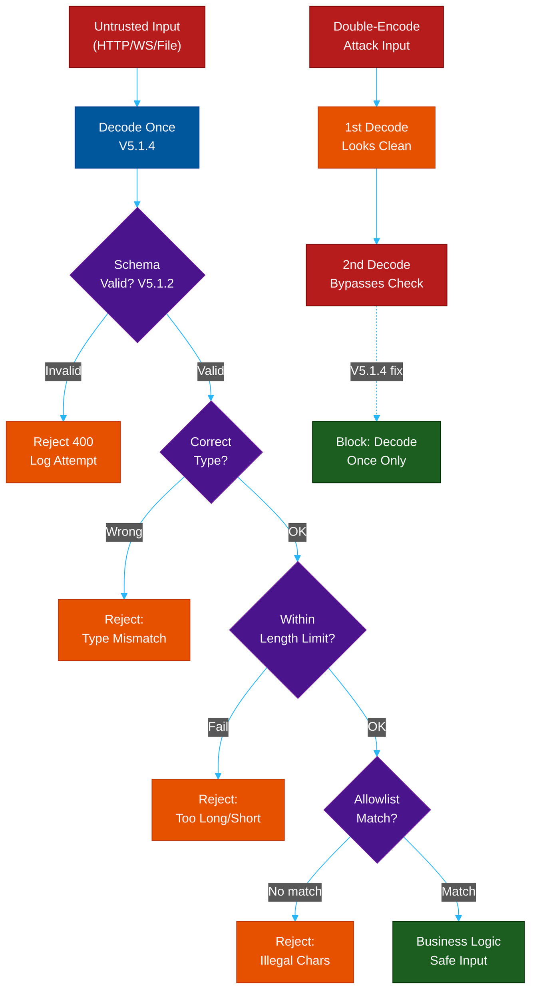

---

### V5.2 — Sanitization and Sandboxing

| ID | Requirement Description | Priority | Implementation Notes |
|----|------------------------|----------|----------------------|
| V5.2.1 | All untrusted HTML input sanitized using a proven library before storage or rendering | Critical | Use DOMPurify (browser/Node) or OWASP Java HTML Sanitizer. Rolling your own HTML parser is a critical mistake. |
| V5.2.2 | Unstructured data sanitized for context: length, character set, allowed characters, encoding | High | Reject or strip null bytes, control characters, and oversized payloads at the boundary layer. |
| V5.2.3 | Markdown input sanitized; raw HTML pass-through disabled even inside Markdown renderers | High | Configure markdown-it or marked with `html: false`. Attackers embed `<script>` tags in Markdown. |
| V5.2.4 | User-controlled data never evaluated as code; `eval()`, `exec()`, `Function()` blocked | Critical | Enforce with ESLint `no-eval`, Bandit (Python), or SonarQube rules. Code evaluation is a direct RCE vector. |
| V5.2.5 | Template injection prevented; user input never concatenated into server-side templates | Critical | Use parameterized template rendering. `render("Hello " + username)` in Jinja2 or Twig is Server-Side Template Injection (SSTI). |
| V5.2.6 | SSRF blocked by validating URLs against an allowlist of permitted schemes, ports, and hosts | Critical | Use a URL parser, extract host, check against allowlist. Block private IP ranges (127.x, 10.x, 172.16-31.x, 192.168.x). |
| V5.2.7 | Sandboxed environments used when executing user-supplied code or untrusted scripts | High | Use gVisor, Firecracker microVMs, or language-specific sandboxes. Never execute user code in the main process. |
| V5.2.8 | SSRF protection includes disabling HTTP redirects or validating each redirect destination | High | An allowlisted URL that redirects to `169.254.169.254` (AWS metadata) bypasses naive host checks. Follow each redirect hop. |

**Code Example — DOMPurify HTML Sanitization and SSRF URL Validation**

```typescript
import DOMPurify from "isomorphic-dompurify";
import { URL } from "url";

// V5.2.1: HTML sanitization
function sanitizeHtml(dirty: string): string {
  return DOMPurify.sanitize(dirty, {
    ALLOWED_TAGS: ["p", "b", "i", "em", "strong", "a", "ul", "ol", "li"],
    ALLOWED_ATTR: ["href", "rel"],
    FORBID_CONTENTS: ["script", "style", "iframe"],
  });
}

// V5.2.6 + V5.2.8: SSRF URL validation
const SSRF_BLOCKLIST = /^(10\.|172\.(1[6-9]|2\d|3[01])\.|192\.168\.|127\.|169\.254\.)/;
const ALLOWED_SCHEMES = new Set(["https:"]);
const ALLOWED_HOSTS   = new Set(["api.trusted-partner.com", "cdn.myapp.com"]);

function validateExternalUrl(raw: string): string {
  let parsed: URL;
  try { parsed = new URL(raw); } catch { throw new Error("Invalid URL"); }

  if (!ALLOWED_SCHEMES.has(parsed.protocol))
    throw new Error("Scheme not permitted");
  if (!ALLOWED_HOSTS.has(parsed.hostname))
    throw new Error("Host not on allowlist");
  if (SSRF_BLOCKLIST.test(parsed.hostname))
    throw new Error("Private IP range blocked");

  return parsed.toString();
}
```

---

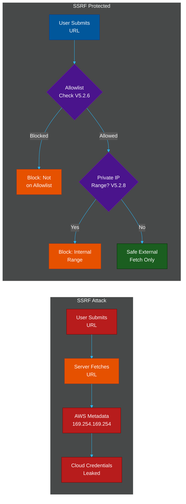

---

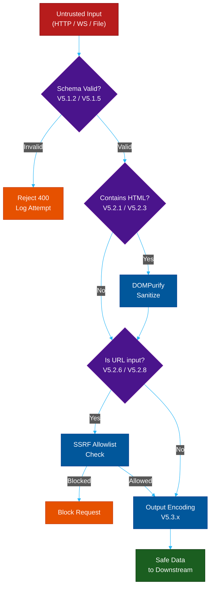

---

### V5.3 — Output Encoding

| ID | Requirement Description | Priority | Implementation Notes |
|----|------------------------|----------|----------------------|
| V5.3.1 | Output encoding is context-specific: HTML entity, URL, JavaScript, and CSS encoding applied in respective contexts | Critical | One encoding does not fit all contexts. `<script>` tags require JavaScript encoding; style attributes require CSS encoding. |
| V5.3.2 | HTML encoding applied for all user-controlled values placed in HTML element content or attribute values | Critical | Use template engine auto-escaping (Jinja2, Twig, Handlebars). Never disable auto-escaping with `` or `{!! !!}` on user data. |
| V5.3.3 | JavaScript encoding applied when inserting data into JavaScript string contexts | High | Use `JSON.stringify()` or `encodeForJavaScript()` (ESAPI). Building `<script>` blocks via string concatenation with user input is always wrong. |
| V5.3.4 | CSS encoding applied for user-controlled values placed in CSS property or attribute contexts | High | A CSS context can be used for data exfiltration. Reject or strictly allowlist CSS values. |
| V5.3.5 | URL encoding applied for user-controlled values placed in URL query parameters | High | Use `encodeURIComponent()` in JS or `urllib.parse.quote()` in Python. Never string-concatenate into URLs. |
| V5.3.6 | JSON encoding prevents injection; API responses served with `Content-Type: application/json` | High | Without correct Content-Type, browsers may interpret JSON as HTML and execute embedded scripts. |
| V5.3.7 | XML content encoded to prevent XXE and XML injection | High | Use a safe XML library that defaults to entity expansion disabled. Encode user data before embedding in XML. |
| V5.3.8 | LDAP queries sanitized to prevent LDAP injection | Medium | Use parameterized LDAP queries (JNDI PreparedStatement equivalent) or escape special chars `( ) * \ NUL`. |
| V5.3.9 | OS command injection prevented via parameterized commands; no string concatenation into shell commands | Critical | Use `execFile(cmd, [arg1, arg2])` rather than `exec("cmd " + userInput)`. Shell metacharacters (`; & \| ` ` $ ( )`) are injection vectors. |
| V5.3.10 | XPath injection prevented using parameterized XPath queries or sanitized input | High | XPath has no native parameterized query standard; use Saxon's `XPathVariable` or sanitize strictly. |

**Code Example — Context-Aware Output Encoding**

```typescript
import { escape as htmlEscape } from "html-escaper";

// V5.3.2: HTML context encoding
function renderUserBio(bio: string): string {
  // Template engines do this automatically when auto-escape is on
  return `<p>${htmlEscape(bio)}</p>`;
}

// V5.3.3: JavaScript context — embedding data as a JS variable
function renderJsonPayload(data: unknown): string {
  // JSON.stringify safely encodes <, >, &, and quotes
  const safe = JSON.stringify(data)
    .replace(/</g, "\\u003c")
    .replace(/>/g, "\\u003e")
    .replace(/&/g, "\\u0026");
  return `<script>window.__DATA__ = ${safe};</script>`;
}

// V5.3.5: URL query parameter encoding
function buildSearchUrl(query: string, page: number): string {
  return `/search?q=${encodeURIComponent(query)}&page=${encodeURIComponent(page)}`;
}

// V5.3.9: OS command — args passed as an array, never as a shell string
import { execFile } from "child_process";

function convertImage(filename: string, outputFormat: string): Promise<void> {
  // filename and outputFormat are array elements — the shell is never invoked
  return new Promise((resolve, reject) => {
    execFile("convert", [filename, `output.${outputFormat}`], (err) => {
      err ? reject(err) : resolve();
    });
  });
}
```

---

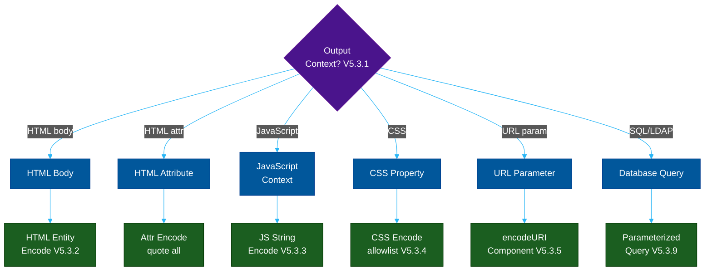

---

### V5.4 — Memory and String Safety

| ID | Requirement Description | Priority | Implementation Notes |
|----|------------------------|----------|----------------------|
| V5.4.1 | Buffer overflow protections enabled: ASLR, DEP/NX, and stack canaries active in compiled output | High | For C/C++/Rust: compile with `-fstack-protector-strong`, `-D_FORTIFY_SOURCE=2`, verify `checksec` output. Managed runtimes (JVM, .NET, Go) handle this automatically. |
| V5.4.2 | Format string attacks prevented; `printf`-family functions do not accept user input as the format string | Critical | Never write `printf(userInput)`. Always use `printf("%s", userInput)`. Applies in C, C++, and any FFI calls to native libraries. |
| V5.4.3 | Integer overflow checks present for security-critical arithmetic (payment amounts, allocation sizes) | High | Use checked arithmetic libraries or big integer types. An overflowed allocation size leading to a small heap buffer is a classic exploit primitive. |

---

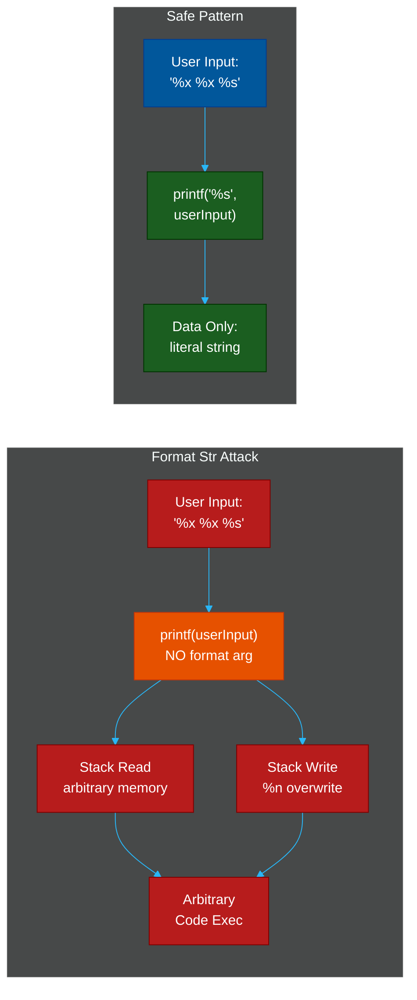

---

### V5.5 — Deserialization Prevention

| ID | Requirement Description | Priority | Implementation Notes |
|----|------------------------|----------|----------------------|
| V5.5.1 | Deserialization of untrusted data avoided where possible; JSON or XML used instead of native serialization formats | Critical | Java `ObjectInputStream`, Python `pickle`, Ruby `Marshal`, PHP `unserialize()` are all dangerous with untrusted input. Use JSON. |
| V5.5.2 | If deserialization is used, integrity verified via HMAC signature before deserializing any data | Critical | Sign serialized payloads with HMAC-SHA256 keyed by a server secret. Verify signature before passing to deserializer. |
| V5.5.3 | Deserialization type filtering restricts instantiable classes to a known-safe allowlist | High | Java: use `ObjectInputFilter` (JEP 290). Jackson: `FAIL_ON_UNKNOWN_PROPERTIES` and disable default typing. |
| V5.5.4 | XML parsers configured to disable external entity resolution (XXE prevention) | Critical | XXE can read `/etc/passwd`, internal files, and trigger SSRF. Disable `FEATURE_EXTERNAL_GENERAL_ENTITIES` and `FEATURE_EXTERNAL_PARAMETER_ENTITIES`. |

**Code Example — XXE Prevention and Safe Deserialization**

```java
// V5.5.4: XXE-safe XML parser configuration (Java)
DocumentBuilderFactory factory = DocumentBuilderFactory.newInstance();
factory.setFeature("http://apache.org/xml/features/disallow-doctype-decl", true);
factory.setFeature("http://xml.org/sax/features/external-general-entities", false);
factory.setFeature("http://xml.org/sax/features/external-parameter-entities", false);
factory.setXIncludeAware(false);
factory.setExpandEntityReferences(false);
DocumentBuilder builder = factory.newDocumentBuilder();
```

```python
# V5.5.1 + V5.5.2: Replacing pickle with signed JSON in Python
import json
import hmac
import hashlib
import os

SECRET = os.environ["SERIALIZATION_SECRET"].encode()

def serialize(data: dict) -> str:
    payload = json.dumps(data, separators=(",", ":"))
    sig = hmac.new(SECRET, payload.encode(), hashlib.sha256).hexdigest()
    return f"{payload}.{sig}"

def deserialize(token: str) -> dict:
    try:
        payload, sig = token.rsplit(".", 1)
    except ValueError:
        raise ValueError("Malformed token")
    expected = hmac.new(SECRET, payload.encode(), hashlib.sha256).hexdigest()
    if not hmac.compare_digest(expected, sig):        # V5.5.2: integrity check
        raise ValueError("Signature invalid")
    return json.loads(payload)                         # safe JSON, not pickle
```

---

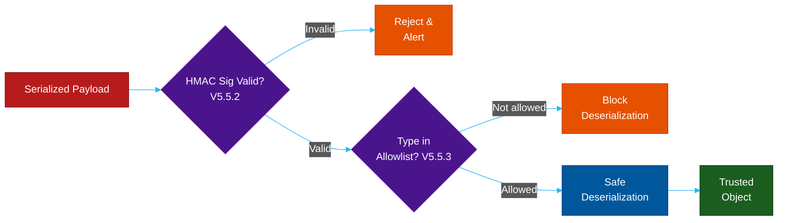

---

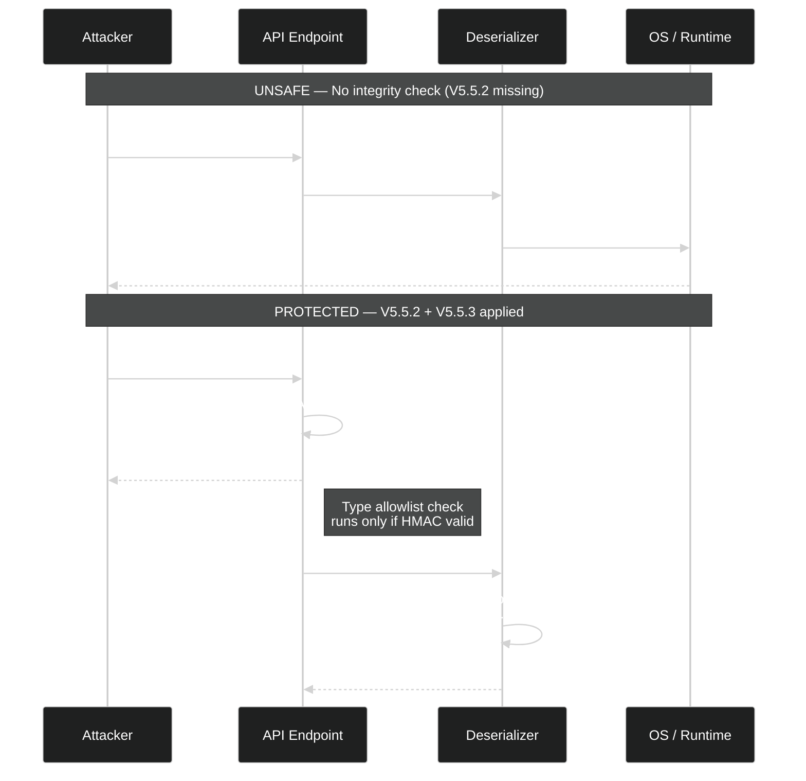

---

## V6: Stored Cryptography

### Why It Matters

Cryptography is not optional for any application that stores sensitive data. V6 defines the minimum cryptographic standards that prevent attackers who compromise your database from reading passwords, PII, financial records, or session tokens. The rules here reflect current NIST SP 800-131A guidance and are designed to remain secure against adversaries with significant computational resources.

The key insight is that **weak cryptography is often worse than no cryptography** — it provides a false sense of security while being trivially breakable. MD5-hashed passwords, AES-ECB encrypted columns, and 1024-bit RSA keys have all been publicly cracked in large-scale breaches.

---

### V6.1 — Data Classification

| ID | Requirement Description | Priority | Implementation Notes |
|----|------------------------|----------|----------------------|
| V6.1.1 | All data classified by sensitivity level before storage decisions are made | Critical | Define classification tiers: Public, Internal, Confidential, Restricted. Storage controls (encryption, access, retention) derive from tier. |
| V6.1.2 | Regulated data (PII, health records, financial data) identified; additional controls applied per regulation | Critical | GDPR requires data mapping. PCI DSS requires CDE scoping. HIPAA requires PHI inventory. Start with a data flow diagram. |
| V6.1.3 | Data no longer required is securely deleted or anonymized rather than retained indefinitely | High | Implement retention policies enforced by automated jobs. Deletion must extend to backups, replicas, and audit logs where required. |

---

```mermaid
%%{init: {'theme': 'dark', 'themeVariables': {'primaryColor': '#01579b', 'primaryTextColor': '#ffffff', 'lineColor': '#29b6f6',
    'background': '#1e1e1e'},
  'themeCSS': 'svg { background-color: #1e1e1e !important; padding: 1rem !important; border-radius: 8px !important; } .edgeLabel rect { fill: #1e1e1e !important; } text, tspan, .messageText, .signalText, .edgeLabel, .edgeLabel span, .pointLabel, .axisLabel, .quadrantTitle, .quadrantLabel { fill: #ffffff !important; color: #ffffff !important; stroke: none !important; }'
}}%%
graph TD
    classDef attack  fill:#b71c1c,stroke:#7f0000,color:#fff
    classDef safe    fill:#1b5e20,stroke:#003300,color:#fff
    classDef process fill:#01579b,stroke:#003c8f,color:#fff
    classDef warn    fill:#e65100,stroke:#bf360c,color:#fff
    classDef decide  fill:#4a148c,stroke:#6a1b9a,color:#fff

    TOP["Data Classification<br/>Hierarchy V6.1.1"]:::decide

    PUB["Public<br/>No restrictions"]:::safe
    INT["Internal<br/>Access controls"]:::process
    CONF["Confidential<br/>PII / Business"]:::warn
    REST["Restricted<br/>PII/PHI/PCI/PSD2"]:::attack

    P1["No encryption<br/>required"]:::safe
    I1["Encrypt in<br/>transit (TLS)"]:::process
    I2["Access logging<br/>required"]:::process
    C1["Encrypt at<br/>rest + transit"]:::warn
    C2["Access logging<br/>+ alerting"]:::warn
    C3["90-day<br/>retention max"]:::warn
    R1["AES-256 at rest<br/>+ in transit"]:::attack
    R2["Access logging<br/>+ audit trail"]:::attack
    R3["Strict retention<br/>limits (GDPR)"]:::attack
    R4["Right to erasure<br/>Art. 17 GDPR"]:::attack

    TOP --> PUB
    TOP --> INT
    TOP --> CONF
    TOP --> REST

    PUB --> P1
    INT --> I1
    INT --> I2
    CONF --> C1
    CONF --> C2
    CONF --> C3
    REST --> R1
    REST --> R2
    REST --> R3
    REST --> R4
```

---

### V6.2 — Algorithms

| ID | Requirement Description | Priority | Implementation Notes |
|----|------------------------|----------|----------------------|
| V6.2.1 | Approved cryptographic modules used; FIPS 140-2 validated libraries preferred where compliance is required | Critical | OpenSSL (FIPS build), Bouncy Castle FIPS, Microsoft CNG. Avoid rolling custom crypto — even experienced cryptographers make mistakes. |
| V6.2.2 | All random number generation for security purposes uses a CSPRNG; `Math.random()` and `rand()` prohibited | Critical | `Math.random()` is predictable. Use `crypto.randomBytes()` (Node.js), `secrets` module (Python 3.6+), `SecureRandom` (Java). |
| V6.2.3 | AES-256-GCM used for symmetric encryption; AES-ECB prohibited (leaks patterns via identical ciphertext blocks) | Critical | GCM provides authenticated encryption (AEAD). Never use ECB mode — encrypting the same block always produces the same ciphertext. |
| V6.2.4 | RSA-2048 or ECC P-256 (minimum) used for asymmetric operations | High | RSA-1024 is broken. P-256 offers equivalent security to RSA-3072 with smaller keys and faster operations. |
| V6.2.5 | SHA-256 minimum for hashing; MD5 and SHA-1 prohibited for any security-relevant use | Critical | SHA-1 is collision-broken (SHAttered attack, 2017). MD5 is broken for all security uses. Use SHA-256 or SHA-3. |
| V6.2.6 | Digital signatures use minimum RSA-2048 or ECDSA P-256 | High | Weak signature keys allow attackers to forge signed JWTs, certificates, and code signatures. |
| V6.2.7 | Key lengths comply with current NIST SP 800-131A recommendations | High | Review NIST guidance annually. Currently: AES-128 minimum, RSA-2048 minimum, ECC-224 minimum through 2030. |
| V6.2.8 | Cryptographic algorithm choices reviewed annually against BSI, ANSSI, or NIST guidance | Medium | Cryptographic deprecation timelines shift. Build an annual review into your security program. |

**Code Example — AES-256-GCM Authenticated Encryption**

```typescript
import { randomBytes, createCipheriv, createDecipheriv } from "crypto";

const ALGORITHM  = "aes-256-gcm";
const KEY_LENGTH = 32;  // 256 bits
const IV_LENGTH  = 12;  // 96 bits recommended for GCM
const TAG_LENGTH = 16;  // 128-bit auth tag

// V6.2.3: AES-256-GCM encryption — provides confidentiality + integrity
function encrypt(plaintext: string, key: Buffer): { iv: string; ciphertext: string; tag: string } {
  const iv = randomBytes(IV_LENGTH);          // V6.3.1: CSPRNG
  const cipher = createCipheriv(ALGORITHM, key, iv);
  const encrypted = Buffer.concat([cipher.update(plaintext, "utf8"), cipher.final()]);
  return {
    iv:         iv.toString("hex"),
    ciphertext: encrypted.toString("hex"),
    tag:        cipher.getAuthTag().toString("hex"),   // authentication tag
  };
}

function decrypt(iv: string, ciphertext: string, tag: string, key: Buffer): string {
  const decipher = createDecipheriv(ALGORITHM, key, Buffer.from(iv, "hex"));
  decipher.setAuthTag(Buffer.from(tag, "hex"));        // verify integrity before decrypting
  const decrypted = Buffer.concat([
    decipher.update(Buffer.from(ciphertext, "hex")),
    decipher.final(),                                   // throws if tag verification fails
  ]);
  return decrypted.toString("utf8");
}
```

---

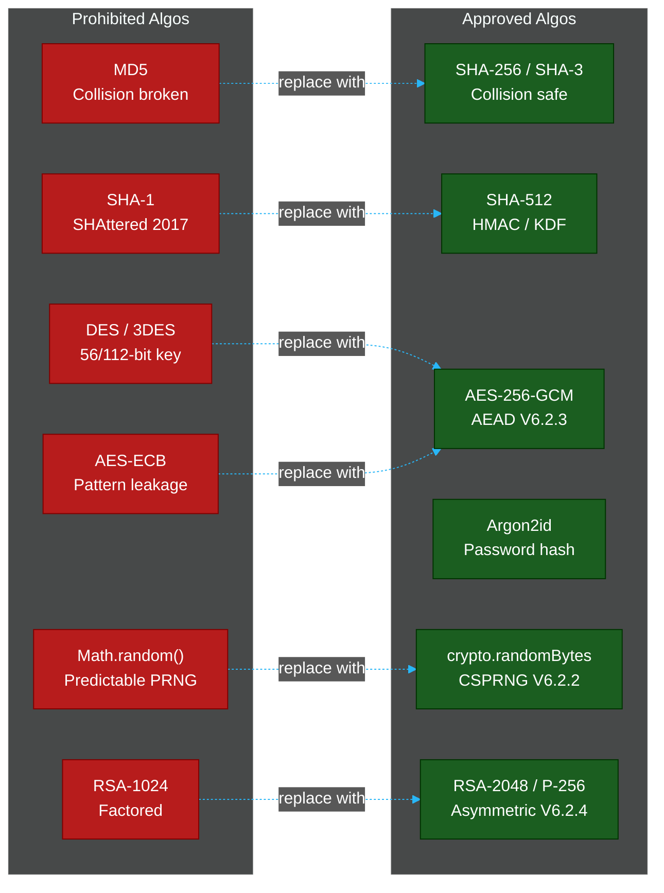

---

### V6.3 — Random Values

| ID | Requirement Description | Priority | Implementation Notes |
|----|------------------------|----------|----------------------|
| V6.3.1 | All random values used for security generated with CSPRNG | Critical | `SecureRandom` (Java), `secrets` (Python), `crypto.randomBytes()` (Node), `/dev/urandom` (Linux). The OS CSPRNG is always the right choice. |
| V6.3.2 | Random GUIDs generated using UUID v4 backed by CSPRNG | High | UUID v4 has 122 bits of randomness from a CSPRNG. UUID v1 and v3 are deterministic and must not be used for tokens. |
| V6.3.3 | Random values have sufficient entropy for their intended purpose; ≥128 bits for session tokens and secrets | Critical | A 128-bit random token has 2^128 possible values — infeasible to brute force. Never use short tokens (e.g., 6-digit OTPs as long-lived tokens). |

**Code Example — CSPRNG Token Generation**

```python
# V6.3.1 + V6.3.3: Python secrets module — CSPRNG-backed, 256 bits
import secrets
import uuid

# Session token: 256 bits of entropy (32 bytes = 64 hex chars)
def generate_session_token() -> str:
    return secrets.token_hex(32)

# API key with URL-safe base64 encoding
def generate_api_key() -> str:
    return secrets.token_urlsafe(32)   # 256 bits, URL-safe

# V6.3.2: UUID v4 using CSPRNG
def generate_record_id() -> str:
    return str(uuid.uuid4())           # 122 bits from os.urandom()

# Prohibited alternatives — never use for security:
# import random; random.token_hex(32)   # NOT a CSPRNG
# uuid.uuid1()                           # time-based, predictable
```

---

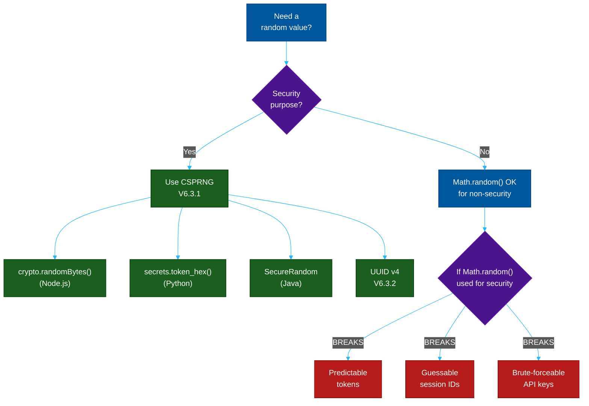

---

### V6.4 — Secret Management

| ID | Requirement Description | Priority | Implementation Notes |
|----|------------------------|----------|----------------------|
| V6.4.1 | Secrets not stored in source code, inline environment variable assignments in code, or version control | Critical | `git log` persists deleted secrets forever. Rotate any secret ever committed. Use `.gitignore` + pre-commit hooks to prevent it. |
| V6.4.2 | Secrets management solution used in production | Critical | HashiCorp Vault, AWS Secrets Manager, Azure Key Vault, GCP Secret Manager. Never pass secrets via environment variables baked into container images. |
| V6.4.3 | All secrets are rotatable without requiring application downtime | High | Design for secret rotation from day one. Two-phase rotation: write new secret, deploy app supporting both, revoke old. |
| V6.4.4 | Key compromise response process documented; keys replaced immediately upon compromise | High | Document: who to notify, how to rotate, which downstream systems need updating, incident timeline requirements. |

---

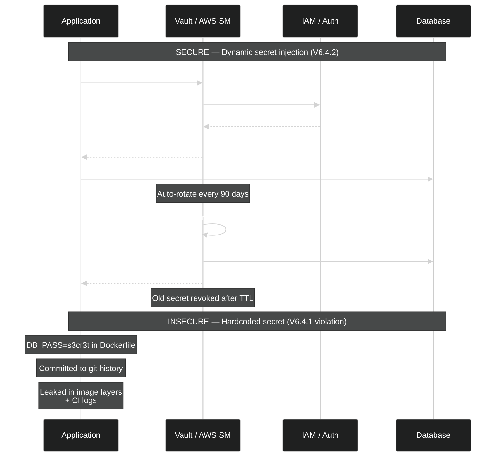

---

### V6.5 — Key Derivation

| ID | Requirement Description | Priority | Implementation Notes |
|----|------------------------|----------|----------------------|
| V6.5.1 | Argon2id used for password hashing with m≥19456 KiB (19 MiB), t≥2 iterations, p=1 parallelism | Critical | Argon2id is the Password Hashing Competition winner. It resists GPU, ASIC, and side-channel attacks simultaneously. |
| V6.5.2 | PBKDF2-HMAC-SHA512 with ≥210,000 iterations acceptable only where Argon2id is unavailable | High | PBKDF2 is GPU-parallelizable; Argon2id is strongly preferred. If using PBKDF2, use SHA-512 not SHA-1. |
| V6.5.3 | Password hashing salt is ≥128 bits, generated by CSPRNG, unique per credential | Critical | Salts prevent rainbow table attacks and ensure identical passwords produce different hashes. Never reuse salts. |
| V6.5.4 | HKDF (RFC 5869) or equivalent KDF used to derive keys from high-entropy key material | High | HKDF extracts and expands key material. Use when deriving multiple keys from a single master key (e.g., separate encryption and MAC keys). |

**Code Example — Argon2id Password Hashing**

```python
# V6.5.1 + V6.5.3: Argon2id password hashing
from argon2 import PasswordHasher
from argon2.exceptions import VerifyMismatchError

# ASVS-compliant parameters: m=19456 KiB, t=2, p=1
ph = PasswordHasher(
    time_cost=2,          # V6.5.1: t >= 2
    memory_cost=19456,    # V6.5.1: m >= 19456 KiB (19 MiB)
    parallelism=1,        # V6.5.1: p = 1
    hash_len=32,          # 256-bit output
    salt_len=16,          # V6.5.3: 128-bit salt, CSPRNG-generated automatically
)

def hash_password(plaintext: str) -> str:
    return ph.hash(plaintext)    # includes salt, parameters in output string

def verify_password(stored_hash: str, plaintext: str) -> bool:
    try:
        return ph.verify(stored_hash, plaintext)
    except VerifyMismatchError:
        return False

# V6.5.4: HKDF for deriving subkeys from a master key
from cryptography.hazmat.primitives.kdf.hkdf import HKDF
from cryptography.hazmat.primitives import hashes
import os

def derive_encryption_key(master_key: bytes, context: bytes) -> bytes:
    hkdf = HKDF(
        algorithm=hashes.SHA256(),
        length=32,                   # 256-bit derived key
        salt=None,                   # optional; use if master key is low-entropy
        info=context,                # domain separation (e.g., b"database-encryption-key")
    )
    return hkdf.derive(master_key)
```

---

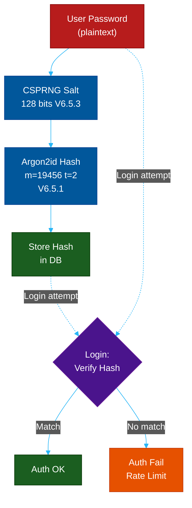

---

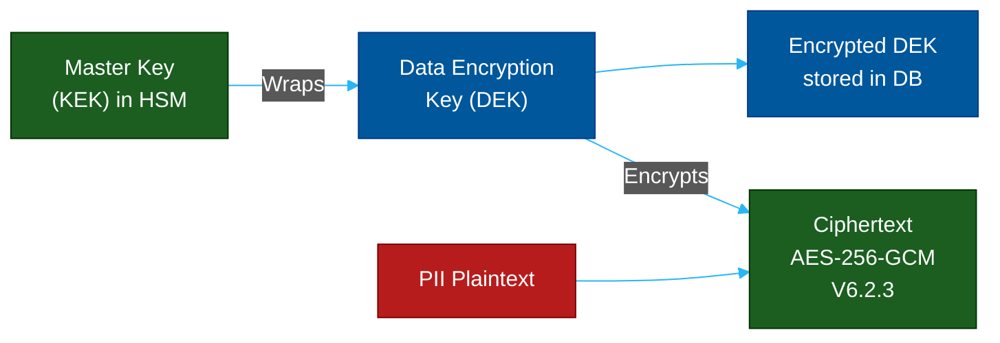

---

## V8: Data Protection

### Why It Matters

V8 addresses a threat that is distinct from cryptographic strength: **the risk of data being exposed not through cryptographic weakness, but through architectural decisions** — logging sensitive fields, caching authenticated pages, storing PII in browser localStorage, or retaining data longer than necessary.

Privacy regulations (GDPR, CCPA, HIPAA, PCI DSS) impose significant penalties for data exposure incidents. But beyond compliance, V8 reflects a core security principle: **you cannot expose data you do not have**. Every piece of sensitive data collected is a liability. V8 requires minimizing that liability through deliberate architectural choices.

---

### V8.1 — General Data Protection

| ID | Requirement Description | Priority | Implementation Notes |
|----|------------------------|----------|----------------------|
| V8.1.1 | Sensitive data not written to application logs: passwords, payment data, session tokens, full PII | Critical | Implement a log scrubbing layer. Log aggregators (Datadog, Splunk) are accessible to many engineers — treat them as untrusted. |
| V8.1.2 | Sensitive data caches cleared when access is no longer required | High | In-process caches that hold decrypted PII must expire promptly. Use TTL-based eviction; do not hold references longer than necessary. |
| V8.1.3 | Sensitive data in memory zeroed after use where the language/runtime supports it | Medium | Java: use `char[]` for passwords (can be zeroed), not `String` (immutable, GC timing unpredictable). Go: `memset` via `unsafe`. |
| V8.1.4 | Application provides data access and deletion flows for personal data (GDPR Art. 15, 17) | High | Implement a "Download my data" export and a "Delete my account" flow that cascades across microservices, queues, and backups. |
| V8.1.5 | Sensitive data not stored in `localStorage`; `sessionStorage` used only for session-scoped, non-critical data | High | `localStorage` persists across browser sessions and is accessible to any JS on the page (XSS can exfiltrate it). Store tokens in `HttpOnly` cookies. |

**Code Example — Log Scrubbing Middleware (Node.js)**

```typescript
// V8.1.1: Sensitive field scrubbing before logging
const SENSITIVE_FIELDS = new Set([
  "password", "token", "secret", "authorization",
  "credit_card", "cvv", "ssn", "dob",
]);

function scrubSensitive(obj: Record<string, unknown>, depth = 0): Record<string, unknown> {
  if (depth > 5) return obj;    // prevent infinite recursion on circular structures
  return Object.fromEntries(
    Object.entries(obj).map(([k, v]) => {
      if (SENSITIVE_FIELDS.has(k.toLowerCase())) return [k, "[REDACTED]"];
      if (v && typeof v === "object") return [k, scrubSensitive(v as Record<string, unknown>, depth + 1)];
      return [k, v];
    })
  );
}

// Express request logging middleware
app.use((req, _res, next) => {
  const safeBody = req.body ? scrubSensitive(req.body) : undefined;
  logger.info({ method: req.method, path: req.path, body: safeBody });
  next();
});
```

---

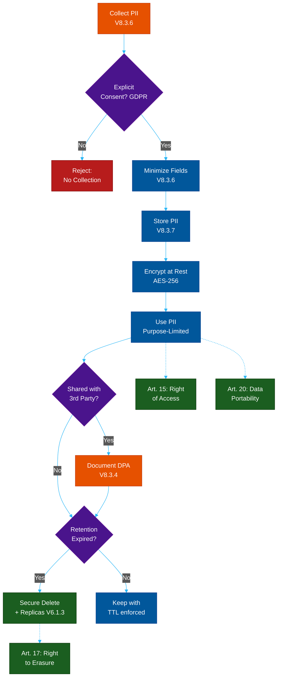

---

### V8.2 — Client-Side Data Protection

| ID | Requirement Description | Priority | Implementation Notes |
|----|------------------------|----------|----------------------|
| V8.2.1 | Sensitive data in browser cache disabled via `Cache-Control: no-store` | High | Without this, sensitive pages are stored in the browser disk cache, readable by other users on shared machines or via forensic tools. |
| V8.2.2 | Sensitive data not stored in browser-accessible storage beyond session scope | High | Avoid `localStorage`, `IndexedDB`, `sessionStorage` for tokens. Use `HttpOnly; Secure; SameSite=Strict` cookies. |
| V8.2.3 | All authenticated resources served with `Cache-Control: no-cache, no-store` | High | Authenticated page responses must not be served from CDN or proxy caches to other users. |

**Code Example — Security Response Headers for Authenticated Routes**

```typescript
// V8.2.1 + V8.2.3: Cache headers for authenticated routes
function noCacheHeaders(res: Response): void {
  res.setHeader("Cache-Control", "no-store, no-cache, must-revalidate, private");
  res.setHeader("Pragma", "no-cache");         // HTTP/1.0 proxies
  res.setHeader("Expires", "0");               // prevent proxy caching
  res.setHeader("Surrogate-Control", "no-store"); // CDN bypass
}

// Apply to all authenticated routes
app.use("/api", requireAuth, (req, res, next) => {
  noCacheHeaders(res);
  next();
});

app.use("/dashboard", requireAuth, (req, res, next) => {
  noCacheHeaders(res);
  next();
});
```

---

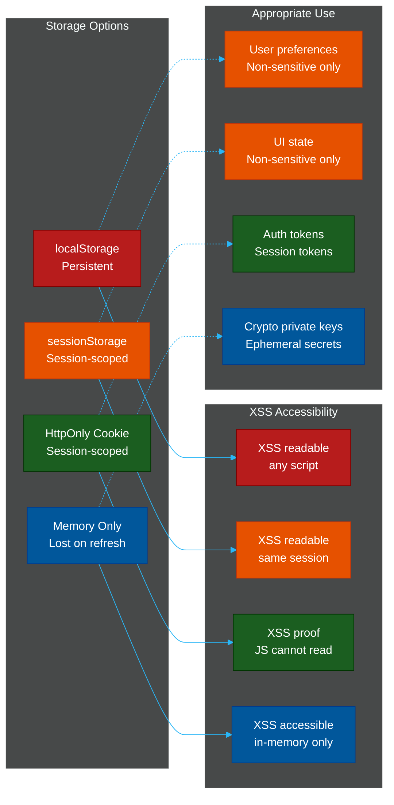

---

### V8.3 — Sensitive Private Data

| ID | Requirement Description | Priority | Implementation Notes |
|----|------------------------|----------|----------------------|
| V8.3.1 | Sensitive data submitted in HTTP message body (POST/PUT), not URL query parameters | High | URLs appear in server access logs, browser history, Referer headers, and CDN logs. Passwords and tokens must never be in query strings. |
| V8.3.2 | Explicit user consent obtained for collection of sensitive data; opt-in model, not opt-out | High | GDPR requires explicit consent (Art. 7). Pre-ticked boxes are not valid consent. Log consent timestamp and version for audit purposes. |
| V8.3.3 | Sensitive data in API responses masked or truncated (e.g., last 4 digits of card, not full PAN) | Critical | Front-end and mobile clients should never receive more data than they display. Apply masking at the API layer, not in the UI. |
| V8.3.4 | Data inventory maintained for all PII collected; third-party data sharing documented and contractually controlled | High | GDPR Art. 30 requires a Record of Processing Activities (ROPA). Automate discovery via data lineage tools. |
| V8.3.5 | Sensitive authentication data not retained after authorization is complete | Critical | PCI DSS Req. 3.3: do not store SAD (CVV2, full track data, PIN blocks) after auth. Delete immediately, including temporary buffers. |
| V8.3.6 | PII minimized; only data necessary for the stated purpose collected | High | Data minimization is a foundational GDPR principle (Art. 5). Review all registration and intake forms for unnecessary fields. |
| V8.3.7 | Sensitive data encrypted at rest using AES-256; encryption keys stored in a separate system | Critical | Column-level or file-level encryption. Key must not be stored in the same DB or filesystem as the ciphertext. |
| V8.3.8 | Financial data handled per PCI DSS; cardholder data not stored post-authorization unless explicitly required and scoped | Critical | Use a tokenization service (Stripe, Braintree). If you store PANs, you are fully in-scope for PCI DSS Level 1 audit requirements. |

**Code Example — API Response Masking**

```typescript
// V8.3.3: Mask sensitive fields before sending API responses
interface UserProfile {
  id: string;
  email: string;
  phone: string;
  cardLastFour: string;
  cardFull?: string;       // never expose this field
  ssn?: string;            // never expose this field
}

function maskProfileForResponse(user: UserProfile): Omit<UserProfile, "cardFull" | "ssn"> {
  return {
    id:          user.id,
    email:       maskEmail(user.email),          // "j***@example.com"
    phone:       user.phone.slice(-4).padStart(user.phone.length, "*"),  // "***-***-1234"
    cardLastFour: user.cardLastFour,             // already a last-4
    // cardFull and ssn are structurally omitted — never present in the return type
  };
}

function maskEmail(email: string): string {
  const [local, domain] = email.split("@");
  return `${local[0]}${"*".repeat(Math.max(local.length - 1, 2))}@${domain}`;
}

app.get("/api/profile", requireAuth, async (req, res) => {
  const user = await db.findUser(req.user.id);
  res.json(maskProfileForResponse(user));   // masked, never raw
});
```

---

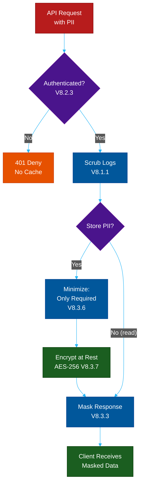

---

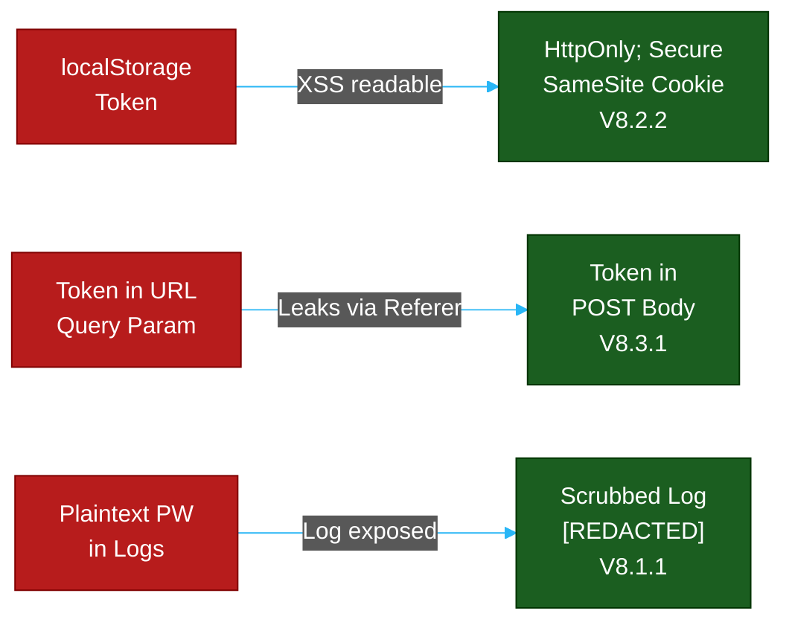

---

## Cross-Chapter Summary

The three chapters of Domain B form a layered defense:

| Layer | Chapter | Core Principle |
|-------|---------|----------------|
| Input Boundary | V5 | Validate everything; encode for context; never eval user data |
| Storage | V6 | Use approved algorithms; derive keys properly; manage secrets centrally |
| Privacy | V8 | Minimize what you collect; mask what you expose; control what you log |

A breach that bypasses one layer is contained by the others. An attacker who exploits an injection flaw (V5 failure) finds encrypted data (V6 protection) that is minimized and masked (V8 protection). Defense in depth requires all three chapters operating together.

---


---

## References

### Official Standards & Specifications
- **OWASP ASVS 5.0** — [github.com/OWASP/ASVS](https://github.com/OWASP/ASVS) — Full standard source
- **NIST SP 800-131A** — [csrc.nist.gov/publications/detail/sp/800-131a/rev-2/final](https://csrc.nist.gov/publications/detail/sp/800-131a/rev-2/final) — Cryptographic Algorithm Transitions
- **NIST SP 800-57** — [csrc.nist.gov/publications/detail/sp/800-57-part-1/rev-5/final](https://csrc.nist.gov/publications/detail/sp/800-57-part-1/rev-5/final) — Key Management Recommendations
- **NIST SP 800-132** — [csrc.nist.gov/publications/detail/sp/800-132/final](https://csrc.nist.gov/publications/detail/sp/800-132/final) — Password-Based Key Derivation
- **RFC 9106** — [rfc-editor.org/rfc/rfc9106](https://www.rfc-editor.org/rfc/rfc9106) — Argon2 specification
- **GDPR** — [gdpr-info.eu](https://gdpr-info.eu) — EU General Data Protection Regulation (V8)

### OWASP Cheat Sheets
- **Input Validation** — [cheatsheetseries.owasp.org/cheatsheets/Input_Validation_Cheat_Sheet.html](https://cheatsheetseries.owasp.org/cheatsheets/Input_Validation_Cheat_Sheet.html)
- **XSS Prevention** — [cheatsheetseries.owasp.org/cheatsheets/Cross_Site_Scripting_Prevention_Cheat_Sheet.html](https://cheatsheetseries.owasp.org/cheatsheets/Cross_Site_Scripting_Prevention_Cheat_Sheet.html)
- **SQL Injection Prevention** — [cheatsheetseries.owasp.org/cheatsheets/SQL_Injection_Prevention_Cheat_Sheet.html](https://cheatsheetseries.owasp.org/cheatsheets/SQL_Injection_Prevention_Cheat_Sheet.html)
- **SSRF Prevention** — [cheatsheetseries.owasp.org/cheatsheets/Server_Side_Request_Forgery_Prevention_Cheat_Sheet.html](https://cheatsheetseries.owasp.org/cheatsheets/Server_Side_Request_Forgery_Prevention_Cheat_Sheet.html)
- **Cryptographic Storage** — [cheatsheetseries.owasp.org/cheatsheets/Cryptographic_Storage_Cheat_Sheet.html](https://cheatsheetseries.owasp.org/cheatsheets/Cryptographic_Storage_Cheat_Sheet.html)
- **Key Management** — [cheatsheetseries.owasp.org/cheatsheets/Key_Management_Cheat_Sheet.html](https://cheatsheetseries.owasp.org/cheatsheets/Key_Management_Cheat_Sheet.html)
- **Secrets Management** — [cheatsheetseries.owasp.org/cheatsheets/Secrets_Management_Cheat_Sheet.html](https://cheatsheetseries.owasp.org/cheatsheets/Secrets_Management_Cheat_Sheet.html)
- **Deserialization** — [cheatsheetseries.owasp.org/cheatsheets/Deserialization_Cheat_Sheet.html](https://cheatsheetseries.owasp.org/cheatsheets/Deserialization_Cheat_Sheet.html)

### OWASP Top 10 Mappings
- **A02:2021** — [owasp.org/Top10/A02_2021-Cryptographic_Failures](https://owasp.org/Top10/A02_2021-Cryptographic_Failures/) — Cryptographic Failures (V6)
- **A03:2021** — [owasp.org/Top10/A03_2021-Injection](https://owasp.org/Top10/A03_2021-Injection/) — Injection (V5)
- **A04:2021** — [owasp.org/Top10/A04_2021-Insecure_Design](https://owasp.org/Top10/A04_2021-Insecure_Design/) — Insecure Design (V8)

### Tools & Libraries
- **DOMPurify** — [github.com/cure53/DOMPurify](https://github.com/cure53/DOMPurify) — HTML sanitizer (V5.2.1)
- **OWASP Java HTML Sanitizer** — [github.com/OWASP/java-html-sanitizer](https://github.com/OWASP/java-html-sanitizer) — Server-side HTML sanitization
- **AWS Secrets Manager** — [aws.amazon.com/secrets-manager](https://aws.amazon.com/secrets-manager/) — Cloud-native secrets management (V6.4.2)
- **HashiCorp Vault** — [vaultproject.io](https://www.vaultproject.io) — Open-source secrets management
- **Google Tink** — [github.com/google/tink](https://github.com/google/tink) — Cryptography library with safe defaults (V6.2)
- **OWASP Dependency Check** — [owasp.org/www-project-dependency-check](https://owasp.org/www-project-dependency-check/) — Dependency vulnerability scanner

## 📚 Implementation References
To see how to physically implement these ASVS requirements, refer to our dedicated architecture guides:
- **V5 Validation:** [Defeating Polyglot Files & Payloads](../file-upload-defense/01-polyglot-files.md)
- **V8 Protection:** [Telecom Recycling & Auto-Deletion Rules](../session-and-cookie-security/06-inactivity-and-telecom-recycling.md)

**Navigation:** [ASVS 5.0 Index](./README.md)

## Related

- [Authentication & Identity Patterns](../auth-and-identity-patterns/README.md)
- [Session & Cookie Security](../session-and-cookie-security/README.md)
- [File Upload Defense](../file-upload-defense/README.md)
