# Domain C: Architecture & Communications

**Author:** ichamrong  
**Category:** OWASP ASVS 5.0  
**Read Time:** ~35 min  

---

## 📌 Table of Contents
- [V1: Architecture, Design and Threat Modeling](#v1-architecture-design-and-threat-modeling)
  - [V1.1 — Secure Software Development Lifecycle](#v11-secure-software-development-lifecycle)
  - [V1.2 — Authentication Architecture](#v12-authentication-architecture)
  - [V1.3 — Session Management Architecture](#v13-session-management-architecture)
  - [V1.4 — Access Control Architecture](#v14-access-control-architecture)
  - [V1.5 — Input/Output Architecture](#v15-inputoutput-architecture)
  - [V1.6 — Cryptographic Architecture](#v16-cryptographic-architecture)
  - [V1.7 — Error Handling and Logging Architecture](#v17-error-handling-and-logging-architecture)
  - [V1.8 — Data Protection Architecture](#v18-data-protection-architecture)
  - [V1.9 — Communications Architecture](#v19-communications-architecture)
  - [V1.10 — Malicious Software Architecture](#v110-malicious-software-architecture)
  - [V1.11 — Business Logic Architecture](#v111-business-logic-architecture)
  - [V1.12 — Secure File Upload Architecture](#v112-secure-file-upload-architecture)
  - [V1.14 — Configuration Architecture](#v114-configuration-architecture)
- [V9: Communication Security](#v9-communication-security)
  - [V9.1 — Client Communication](#v91-client-communication)
  - [V9.2 — Server Communication](#v92-server-communication)
  - [TLS Communication Flow](#tls-communication-flow)
- [V13: API and Web Service Security](#v13-api-and-web-service-security)
  - [V13.1 — Generic Web Service Security](#v131-generic-web-service-security)
  - [V13.2 — RESTful Web Service](#v132-restful-web-service)
  - [V13.3 — SOAP Web Service](#v133-soap-web-service)
  - [V13.4 — GraphQL](#v134-graphql)
  - [GraphQL Security Checklist](#graphql-security-checklist)
  - [CORS Policy Decision Flowchart](#cors-policy-decision-flowchart)
- [V14: Configuration Verification](#v14-configuration-verification)
  - [V14.1 — Build and Deploy](#v141-build-and-deploy)
  - [V14.2 — Dependency Security](#v142-dependency-security)
  - [V14.3 — Unintended Security Disclosure](#v143-unintended-security-disclosure)
  - [V14.4 — HTTP Security Headers](#v144-http-security-headers)
  - [V14.5 — HTTP Request Header Validation](#v145-http-request-header-validation)
  - [Security Headers Reference](#security-headers-reference)
- [Cross-Chapter Integration](#cross-chapter-integration)
- [References](#references)
  - [Official Standards & Specifications](#official-standards-specifications)
  - [OWASP Cheat Sheets](#owasp-cheat-sheets)
  - [OWASP Top 10 Mappings](#owasp-top-10-mappings)
  - [Tools & Services](#tools-services)
- [📚 Implementation References](#implementation-references)

---

This domain covers ASVS 5.0 Chapters V1, V9, V13, and V14. It addresses macroscopic system design, how components communicate securely, how APIs are hardened, and how deployment configuration is verified. Every requirement ID below maps directly to the ASVS 5.0 specification.

---

## V1: Architecture, Design and Threat Modeling

You cannot patch a fundamentally broken architecture. V1 requirements must be resolved at design time — retrofitting them is expensive and error-prone.

### V1.1 — Secure Software Development Lifecycle

| ID | Requirement |
|----|-------------|
| V1.1.1 | A SSDLC process is defined; security activities are embedded in all phases (design, implementation, testing, release). |
| V1.1.2 | Threat modeling is performed for significant features and all architecture changes. |
| V1.1.3 | Security user stories and acceptance criteria are defined for every feature. |
| V1.1.4 | A security design review is required for any feature processing sensitive data. |
| V1.1.5 | Third-party components are inventoried with version, license, and vulnerability status (SBOM maintained). |

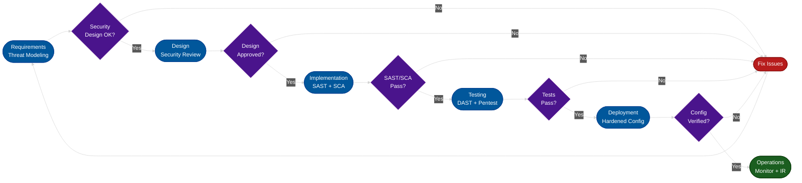

### V1.2 — Authentication Architecture

| ID | Requirement |
|----|-------------|
| V1.2.1 | All application components use a centralized authentication mechanism; no local bypasses exist. |
| V1.2.2 | Multiple authentication mechanisms do not weaken each other. |
| V1.2.3 | System documentation covers authentication flows for all user types and service identities. |

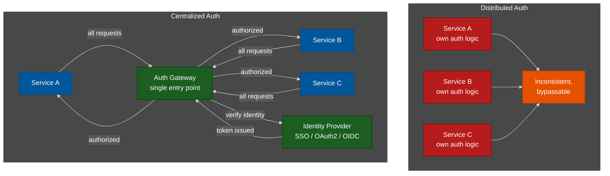

### V1.3 — Session Management Architecture

| ID | Requirement |
|----|-------------|
| V1.3.1 | Unique session tokens are issued per application; tokens are never shared across applications. |
| V1.3.2 | Session tokens are stored securely; they are not placed in URLs nor accessible via JavaScript. |

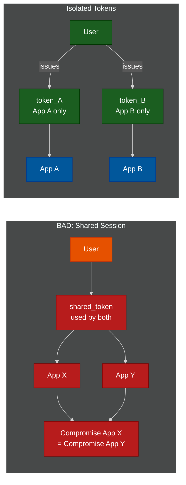

### V1.4 — Access Control Architecture

| ID | Requirement |
|----|-------------|
| V1.4.1 | A single, well-tested access control point enforces decisions for all protected resources. |
| V1.4.2 | Deny-by-default architecture is applied; access requires an explicit allowlist entry, not a denylist. |
| V1.4.3 | Attribute-based access control (ABAC) is preferred over role-only controls for fine-grained decisions. |

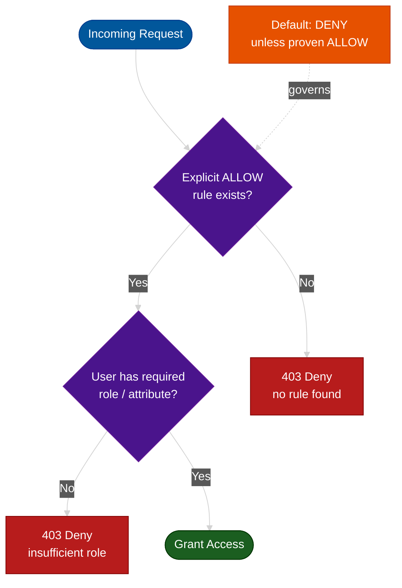

### V1.5 — Input/Output Architecture

| ID | Requirement |
|----|-------------|
| V1.5.1 | An input/output encoding policy is defined per output context (HTML, SQL, shell, LDAP). |
| V1.5.2 | All client-supplied data is treated as untrusted and validated server-side. |
| V1.5.3 | Output encoding is performed as close to the interpreter as possible (contextual encoding). |

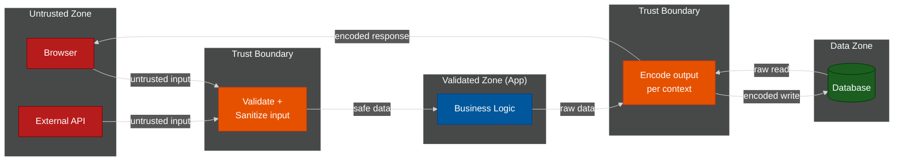

### V1.6 — Cryptographic Architecture

| ID | Requirement |
|----|-------------|
| V1.6.1 | A cryptographic key management policy is documented covering generation, rotation, storage, and destruction. |
| V1.6.2 | Key consumers do not share key material; separate keys are used per service boundary. |
| V1.6.3 | Keys are stored in an HSM, secrets manager, or encrypted key store — never as plaintext. |
| V1.6.4 | Cryptographic algorithm agility is maintained: algorithms can be replaced without architectural changes. |

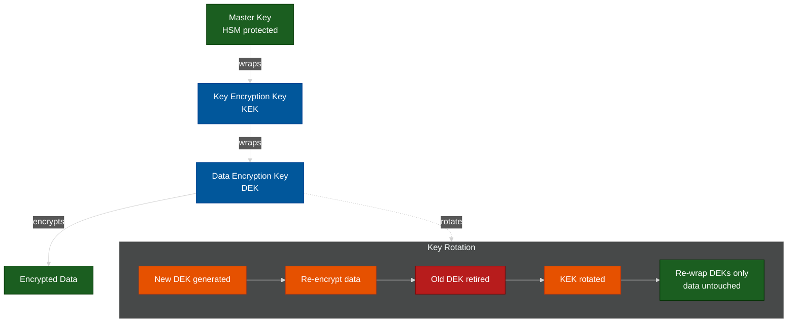

### V1.7 — Error Handling and Logging Architecture

| ID | Requirement |
|----|-------------|
| V1.7.1 | A common error handling architecture is applied consistently across the application. |
| V1.7.2 | Logs are aggregated to a central SIEM with tamper protection (append-only or WORM storage). |
| V1.7.3 | Sensitive data is excluded from logs at the architecture level (not filtered ad hoc). |

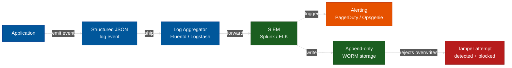

### V1.8 — Data Protection Architecture

| ID | Requirement |
|----|-------------|
| V1.8.1 | All sensitive data is identified and classified at design time (PII, PCI, PHI tiers). |
| V1.8.2 | Data flows are documented; third-party data sharing is explicitly reviewed and approved. |

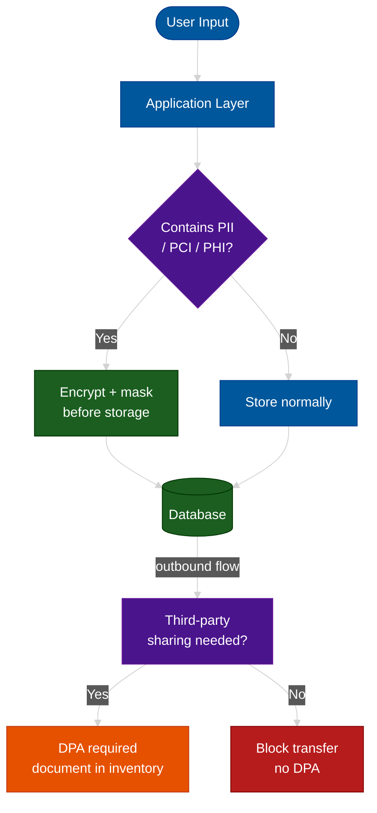

### V1.9 — Communications Architecture

| ID | Requirement |
|----|-------------|
| V1.9.1 | All component communications are encrypted with TLS — even on internal networks. |
| V1.9.2 | Certificate pinning or certificate transparency checks are applied to high-value connections. |

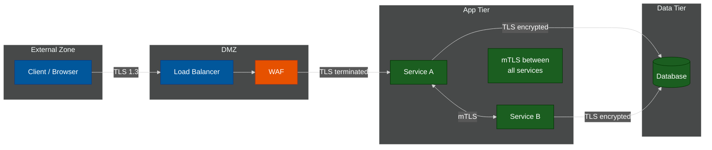

### V1.10 — Malicious Software Architecture

| ID | Requirement |
|----|-------------|
| V1.10.1 | Source code is managed in a version control system with integrity checks (signed commits or branch protection). |
| V1.10.2 | The build pipeline prevents unauthorized code introduction (mandatory code review, signed artifacts). |

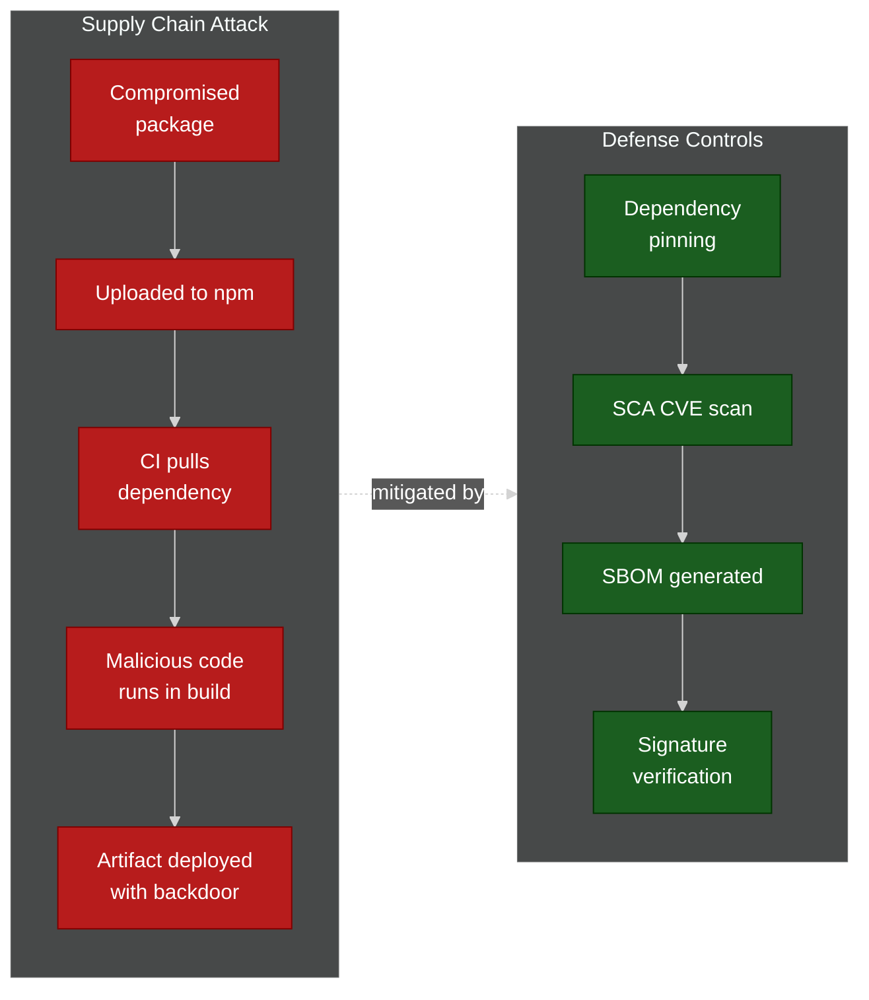

### V1.11 — Business Logic Architecture

| ID | Requirement |
|----|-------------|
| V1.11.1 | Business logic flows are documented with trust boundaries identified at each step. |
| V1.11.2 | High-value transactions require signed, audited steps that provide non-repudiation. |

### V1.12 — Secure File Upload Architecture

| ID | Requirement |
|----|-------------|
| V1.12.1 | User-uploaded files are stored outside the web root. |
| V1.12.2 | User-uploaded files are served from a separate domain or CDN to prevent same-origin attacks. |

### V1.14 — Configuration Architecture

| ID | Requirement |
|----|-------------|
| V1.14.1 | Application components are isolated via containerization or separate OS accounts. |
| V1.14.2 | Least privilege is applied to all service identities (no over-privileged service accounts). |

---

## V9: Communication Security

Transport-layer security failures are silent — they leave data exposed without triggering application-layer errors. Every requirement in V9 must be verified with an active TLS scanner (e.g., testssl.sh, SSL Labs) on each environment.

### V9.1 — Client Communication

| ID | Requirement |
|----|-------------|
| V9.1.1 | TLS 1.2 is the minimum version; TLS 1.3 is preferred for all client connections. |
| V9.1.2 | Certificate verification is enabled; connections with invalid or expired certificates fail immediately. |
| V9.1.3 | HTTP Strict Transport Security (HSTS) is set with `max-age` ≥ 31,536,000 (1 year) and `includeSubDomains`. |
| V9.1.4 | Only secure cipher suites are enabled; RC4, DES, 3DES, and NULL ciphers are disabled. |
| V9.1.5 | Forward secrecy cipher suites (ECDHE-based) are preferred to protect past sessions. |
| V9.1.6 | Certificate revocation is checked via OCSP Stapling. |

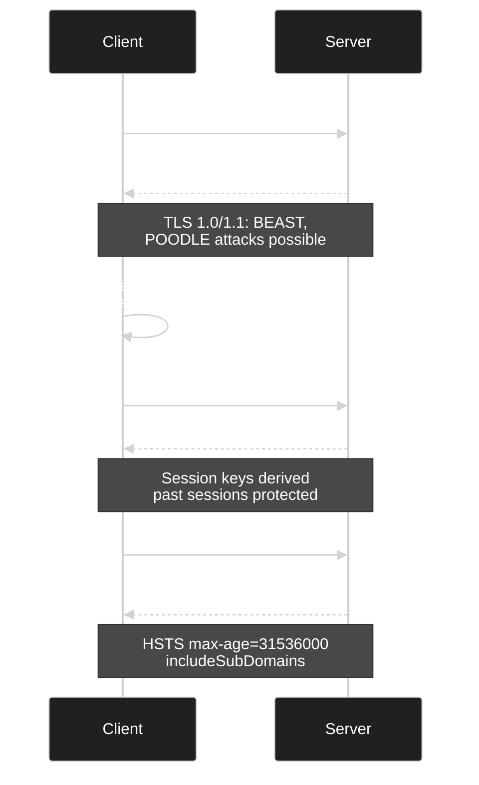

### V9.2 — Server Communication

| ID | Requirement |
|----|-------------|
| V9.2.1 | Authenticated connections are used for all external system integrations. |
| V9.2.2 | Back-channel integrations use current TLS; deprecated SSL/early TLS is prohibited. |
| V9.2.3 | Certificate validation is enforced for all outgoing connections; no certificate bypass flags are set. |
| V9.2.4 | Mutual TLS (mTLS) is used for service-to-service communication in zero-trust architectures. |
| V9.2.5 | Certificate pinning is applied for high-value mobile and embedded client connections. |
| V9.2.6 | DNS-over-HTTPS or DNSSEC is used where available to prevent DNS spoofing. |

### TLS Communication Flow

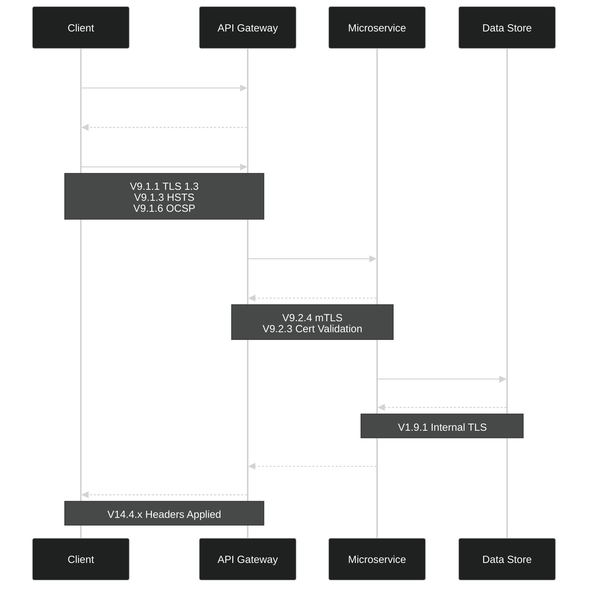

---

## V13: API and Web Service Security

APIs are the primary attack surface of modern applications. V13 requirements apply to every public and internal API endpoint, regardless of protocol.

### V13.1 — Generic Web Service Security

| ID | Requirement |
|----|-------------|
| V13.1.1 | All API requests to protected resources are authenticated; no unauthenticated access is permitted. |
| V13.1.2 | Authorization is checked for every resource request, not only at the entry point or gateway. |
| V13.1.3 | Request body size limits are enforced to prevent denial-of-service via large payload uploads. |
| V13.1.4 | API versioning is implemented; deprecated API versions are documented and decommissioned on a schedule. |
| V13.1.5 | The `Content-Type` header is validated server-side; requests with unexpected content types are rejected. |

### V13.2 — RESTful Web Service

| ID | Requirement |
|----|-------------|
| V13.2.1 | RESTful HTTP methods are used correctly; verb-noun pairing is enforced and GET requests have no side effects. |
| V13.2.2 | JSON schema validation is applied to all API requests and responses. |
| V13.2.3 | API rate limiting is enforced per user, per IP, and per endpoint. |
| V13.2.4 | CORS policy explicitly allowlists trusted origins; the wildcard (`*`) is prohibited for authenticated endpoints. |
| V13.2.5 | RESTful APIs use anti-CSRF tokens or `SameSite` cookies; CORS alone is not used as a CSRF defense. |
| V13.2.6 | API responses for sensitive data include `X-Content-Type-Options: nosniff` and `Cache-Control: no-store`. |

### V13.3 — SOAP Web Service

| ID | Requirement |
|----|-------------|
| V13.3.1 | XSD schema validation is performed before any XML processing occurs. |
| V13.3.2 | SOAP request signing using WS-Security is applied when transport security alone is insufficient. |
| V13.3.3 | XML bomb and billion-laughs attack protection is implemented via entity expansion limits. |

### V13.4 — GraphQL

| ID | Requirement |
|----|-------------|
| V13.4.1 | Authorization is enforced at the resolver level; schema visibility alone does not grant data access. |
| V13.4.2 | GraphQL query depth limits are enforced to prevent deeply nested query denial-of-service attacks. |
| V13.4.3 | GraphQL query complexity limits are enforced per request. |
| V13.4.4 | GraphQL introspection is disabled in production environments. |
| V13.4.5 | GraphQL batch query limits are enforced to prevent batch-based enumeration or amplification. |

### GraphQL Security Checklist

| Control | Status Check | ASVS ID |
|---------|-------------|---------|
| Resolver-level authorization | Each resolver validates the caller's identity and permissions | V13.4.1 |
| Query depth limit | Max depth configured (recommended: 5-10) | V13.4.2 |
| Query complexity limit | Complexity budget per query enforced | V13.4.3 |
| Introspection disabled | `NODE_ENV=production` disables introspection | V13.4.4 |
| Batch query limit | Max batch size enforced (recommended: ≤10) | V13.4.5 |
| Rate limiting | Per-IP and per-user limits applied at gateway | V13.1.3 |
| Schema exposure | Error messages do not reveal internal field names | V14.3.2 |

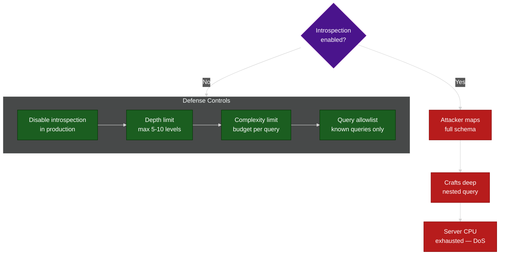

### CORS Policy Decision Flowchart

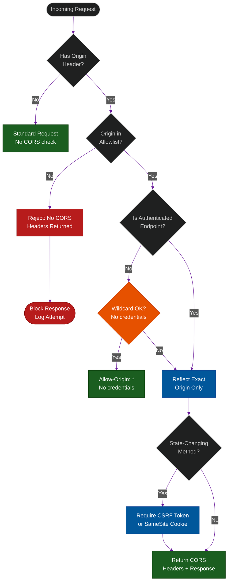

---

## V14: Configuration Verification

Misconfiguration is responsible for the majority of cloud and application breaches. V14 requirements are verified via automated scanning (DAST headers check, SCA, dependency audit) integrated into CI/CD.

### V14.1 — Build and Deploy

| ID | Requirement |
|----|-------------|
| V14.1.1 | The build process documents and verifies all third-party components using SCA scanning in CI. |
| V14.1.2 | Compiler flags enable security protections: ASLR, stack canaries, and PIE are active. |
| V14.1.3 | JavaScript dependencies served from CDN are verified via Subresource Integrity (SRI) hashes. |
| V14.1.4 | Production builds contain no debug code, development credentials, or test accounts. |
| V14.1.5 | Deployment artifact checksums are verified before deployment begins. |
| V14.1.6 | Dependencies are scanned for known CVEs as a mandatory CI/CD pipeline gate. |

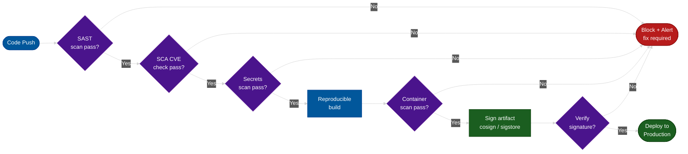

### V14.2 — Dependency Security

| ID | Requirement |
|----|-------------|
| V14.2.1 | All third-party components are inventoried with version information (SBOM is maintained and updated). |
| V14.2.2 | Dependencies are checked for known vulnerabilities using tools such as OWASP Dependency-Check, Snyk, or Dependabot. |
| V14.2.3 | Dependencies are pinned to specific versions — not version ranges — in production build manifests. |
| V14.2.4 | Unmaintained dependencies are replaced or forked with security patches applied before production use. |

### V14.3 — Unintended Security Disclosure

| ID | Requirement |
|----|-------------|
| V14.3.1 | HTTP response headers do not expose server version information (e.g., `Server: web` not `Server: Apache/2.4.51`). |
| V14.3.2 | Error messages do not reveal stack traces, database errors, or internal file paths to end users. |
| V14.3.3 | Default pages (test pages, server status endpoints) are removed or access-restricted in production. |
| V14.3.4 | Directory listing is disabled on all web server paths. |

### V14.4 — HTTP Security Headers

| ID | Header | Required Value | Purpose |
|----|--------|---------------|---------|
| V14.4.1 | `X-Content-Type-Options` | `nosniff` | Prevent MIME-sniffing / polyglot attacks |
| V14.4.2 | `Content-Security-Policy` | Explicit policy; no `unsafe-inline` or `unsafe-eval` for scripts | Block XSS execution |
| V14.4.3 | `X-Frame-Options` | `DENY` or `SAMEORIGIN` | Prevent clickjacking |
| V14.4.4 | `Referrer-Policy` | `no-referrer` or `strict-origin` | Prevent sensitive URL leakage |
| V14.4.5 | `Permissions-Policy` | Disable unused features: `camera=(), geolocation=(), microphone=()` | Reduce browser attack surface |
| V14.4.6 | `Content-Type` | Explicit type with charset (e.g., `text/html; charset=utf-8`) | Prevent charset sniffing |
| V14.4.7 | `Strict-Transport-Security` | `max-age=31536000; includeSubDomains` (preload recommended) | Enforce HTTPS across the origin |

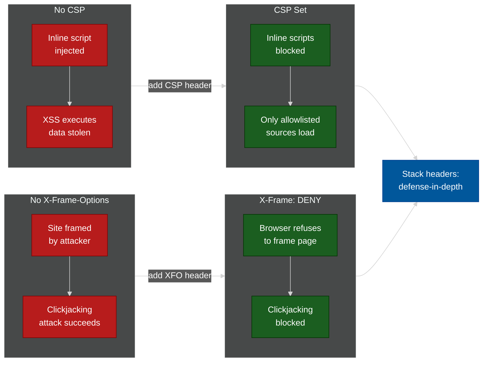

### V14.5 — HTTP Request Header Validation

| ID | Requirement |
|----|-------------|
| V14.5.1 | Web servers process only HTTP methods configured for that endpoint; unexpected methods are rejected with `405 Method Not Allowed`. |
| V14.5.2 | The `Origin` header is validated; requests from unexpected origins are rejected for all state-changing operations. |
| V14.5.3 | The `Content-Type` header is validated against the expected type; mismatches are rejected with `415 Unsupported Media Type`. |

### Security Headers Reference

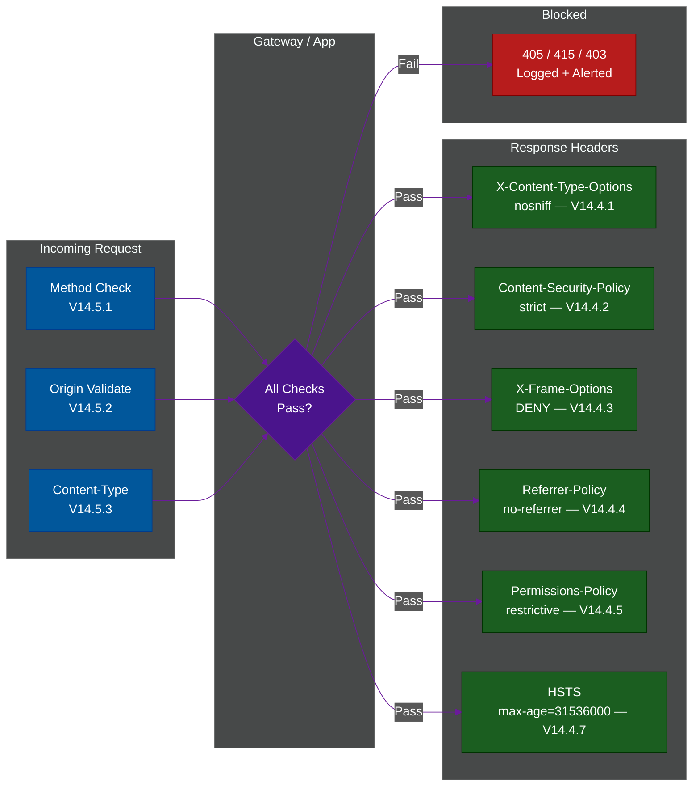

---

## Cross-Chapter Integration

The four V1/V9/V13/V14 chapters form a layered defense that must be implemented together:

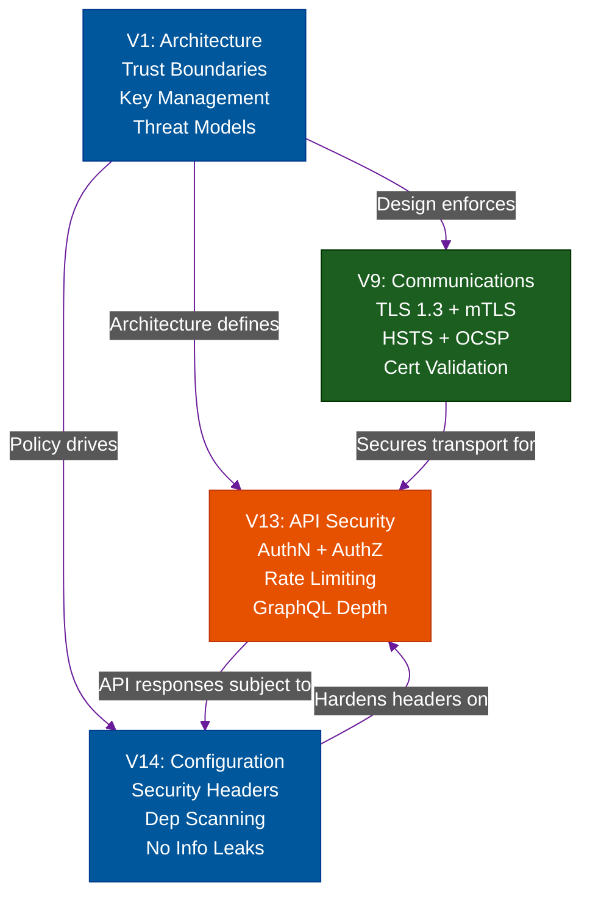

---

---

## References

### Official Standards & Specifications
- **OWASP ASVS 5.0** — [github.com/OWASP/ASVS](https://github.com/OWASP/ASVS) — Full standard source
- **NIST SP 800-52 Rev 2** — [csrc.nist.gov/publications/detail/sp/800-52/rev-2/final](https://csrc.nist.gov/publications/detail/sp/800-52/rev-2/final) — TLS Implementation Guidelines
- **RFC 8446** — [rfc-editor.org/rfc/rfc8446](https://www.rfc-editor.org/rfc/rfc8446) — TLS 1.3 specification
- **RFC 9110** — [rfc-editor.org/rfc/rfc9110](https://www.rfc-editor.org/rfc/rfc9110) — HTTP Semantics
- **NIST SP 800-160** — [csrc.nist.gov/publications/detail/sp/800-160/vol-1/final](https://csrc.nist.gov/publications/detail/sp/800-160/vol-1/final) — Systems Security Engineering
- **CSP Level 3** — [w3.org/TR/CSP3](https://www.w3.org/TR/CSP3/) — Content Security Policy specification (V14.4.2)

### OWASP Cheat Sheets
- **Threat Modeling** — [cheatsheetseries.owasp.org/cheatsheets/Threat_Modeling_Cheat_Sheet.html](https://cheatsheetseries.owasp.org/cheatsheets/Threat_Modeling_Cheat_Sheet.html)
- **TLS/SSL** — [cheatsheetseries.owasp.org/cheatsheets/Transport_Layer_Security_Cheat_Sheet.html](https://cheatsheetseries.owasp.org/cheatsheets/Transport_Layer_Security_Cheat_Sheet.html)
- **REST Security** — [cheatsheetseries.owasp.org/cheatsheets/REST_Security_Cheat_Sheet.html](https://cheatsheetseries.owasp.org/cheatsheets/REST_Security_Cheat_Sheet.html)
- **GraphQL** — [cheatsheetseries.owasp.org/cheatsheets/GraphQL_Cheat_Sheet.html](https://cheatsheetseries.owasp.org/cheatsheets/GraphQL_Cheat_Sheet.html)
- **HTTP Security Headers** — [cheatsheetseries.owasp.org/cheatsheets/HTTP_Headers_Cheat_Sheet.html](https://cheatsheetseries.owasp.org/cheatsheets/HTTP_Headers_Cheat_Sheet.html)
- **CORS** — [cheatsheetseries.owasp.org/cheatsheets/HTTP_Headers_Cheat_Sheet.html#cross-origin-resource-sharing](https://cheatsheetseries.owasp.org/cheatsheets/HTTP_Headers_Cheat_Sheet.html#cross-origin-resource-sharing)
- **Microservices Security** — [cheatsheetseries.owasp.org/cheatsheets/Microservices_Security_Cheat_Sheet.html](https://cheatsheetseries.owasp.org/cheatsheets/Microservices_Security_Cheat_Sheet.html)
- **Software Supply Chain** — [cheatsheetseries.owasp.org/cheatsheets/Software_Supply_Chain_Security_Cheat_Sheet.html](https://cheatsheetseries.owasp.org/cheatsheets/Software_Supply_Chain_Security_Cheat_Sheet.html)

### OWASP Top 10 Mappings
- **A05:2021** — [owasp.org/Top10/A05_2021-Security_Misconfiguration](https://owasp.org/Top10/A05_2021-Security_Misconfiguration/) — Security Misconfiguration (V14)
- **A06:2021** — [owasp.org/Top10/A06_2021-Vulnerable_and_Outdated_Components](https://owasp.org/Top10/A06_2021-Vulnerable_and_Outdated_Components/) — Vulnerable Components (V14.2)

### Tools & Services
- **Mozilla Observatory** — [observatory.mozilla.org](https://observatory.mozilla.org) — HTTP security header scanner (V14.4)
- **Qualys SSL Labs** — [ssllabs.com/ssltest](https://www.ssllabs.com/ssltest/) — TLS configuration grader (V9.1)
- **SecurityHeaders.com** — [securityheaders.com](https://securityheaders.com) — Response header analysis (V14.4)
- **OWASP Dependency Check** — [owasp.org/www-project-dependency-check](https://owasp.org/www-project-dependency-check/) — SCA for V14.2
- **OWASP Threat Dragon** — [owasp.org/www-project-threat-dragon](https://owasp.org/www-project-threat-dragon/) — Threat modeling tool (V1.1)
- **CycloneDX** — [cyclonedx.org](https://cyclonedx.org) — SBOM standard and tooling (V14.2.1)

## 📚 Implementation References
To see how to physically implement these ASVS requirements, refer to our dedicated architecture guides:
- **V1 Architecture:** [The Complete DDoS Defense Architecture](../ddos-defense/08-defense-architecture.md)
- **V9 Communications:** [Network Transit & Missing HTTPS](../network-security/02-transit-and-logging-failures.md)
- **V13 APIs:** [Defeating API & GraphQL Attacks](../ddos-defense/07-api-graphql-defense.md)
- **V14 Configuration:** [CORS Misconfigurations & Header Spoofing](../session-and-cookie-security/04-cors-misconfigurations.md)

**Navigation:** [ASVS 5.0 Index](./README.md)

## Related

- [Authentication & Identity Patterns](../auth-and-identity-patterns/README.md)
- [Session & Cookie Security](../session-and-cookie-security/README.md)
- [File Upload Defense](../file-upload-defense/README.md)
