# Domain D: Business Logic & Operations

**Author:** ichamrong  
**Category:** OWASP ASVS 5.0  
**Read Time:** ~30 min  

---

## 📌 Table of Contents
- [V7: Error Handling and Logging](#v7-error-handling-and-logging)
  - [V7.1 — Log Content](#v71-log-content)
  - [V7.2 — Log Processing](#v72-log-processing)
  - [V7.3 — Log Protection](#v73-log-protection)
  - [V7.4 — Error Handling](#v74-error-handling)
- [V10: Malicious Code Verification](#v10-malicious-code-verification)
  - [V10.1 — Code Integrity](#v101-code-integrity)
  - [V10.2 — Malicious Code Search](#v102-malicious-code-search)
  - [V10.3 — Deployed Application Integrity](#v103-deployed-application-integrity)
- [V11: Business Logic Security](#v11-business-logic-security)
  - [V11.1 — Business Logic](#v111-business-logic)
  - [V11.2 — Anti-Automation](#v112-anti-automation)
- [V12: Files and Resources](#v12-files-and-resources)
  - [V12.1 — File Upload](#v121-file-upload)
  - [V12.2 — File Integrity](#v122-file-integrity)
  - [V12.3 — File Execution Prevention](#v123-file-execution-prevention)
  - [V12.4 — File Storage](#v124-file-storage)
  - [V12.5 — File Download](#v125-file-download)
  - [V12.6 — SSRF Protection](#v126-ssrf-protection)
- [Summary: Domain D Coverage](#summary-domain-d-coverage)
- [References](#references)
  - [Official Standards & Specifications](#official-standards-specifications)
  - [OWASP Cheat Sheets](#owasp-cheat-sheets)
  - [OWASP Top 10 Mappings](#owasp-top-10-mappings)
  - [Tools & Services](#tools-services)
- [📚 Implementation References](#implementation-references)

---

This domain covers ASVS Chapters V7, V10, V11, and V12. It focuses on the behavioral flow of the application — how it handles errors, detects malicious code, enforces business rules, and manages file operations safely.

---

## V7: Error Handling and Logging

Logs are the single most important forensic artifact available during and after a security incident. They are also one of the most commonly weaponized resources if misconfigured — leaking credentials, exposing internal architecture, or enabling log injection that corrupts your audit trail. ASVS 5.0 treats logging not as a convenience but as a security control.

### V7.1 — Log Content

What gets written to logs matters as much as where logs go. Sensitive data in logs creates secondary exposure: a developer who can read logs can now read passwords.

| ID | Requirement |
|----|-------------|
| **V7.1.1** | No sensitive data in logs: passwords, tokens, PII, card numbers, and session IDs must never appear in any log entry at any log level. |
| **V7.1.2** | No application debug data in production logs. Debug-level output (stack traces, variable dumps, SQL queries) must be disabled in all production environments. |
| **V7.1.3** | Audit log records must include: timestamp, user ID, action performed, source IP address, and outcome (success/failure). |
| **V7.1.4** | Security-relevant events must be logged: authentication attempts (success and failure), privilege changes, and access control failures. |

**Why it matters:** An attacker who compromises your log pipeline should gain zero useful material. Log files that contain session tokens allow replaying authenticated sessions. Debug data in production logs reveals your internal stack to anyone who gets a single error response.

**What to log vs. what NOT to log:**

```mermaid
%%{init: {'theme': 'dark',
  'themeVariables': {
    'background': '#1e1e1e'
  },
  'themeCSS': 'svg { background-color: #1e1e1e !important; padding: 1rem !important; border-radius: 8px !important; } .edgeLabel rect { fill: #1e1e1e !important; } text, tspan, .messageText, .signalText, .edgeLabel, .edgeLabel span, .pointLabel, .axisLabel, .quadrantTitle, .quadrantLabel { fill: #ffffff !important; color: #ffffff !important; stroke: none !important; }'
}}%%
graph TD
    classDef process fill:#01579b,stroke:#003c8f,color:#fff
    classDef safe fill:#1b5e20,stroke:#003300,color:#fff
    classDef attack fill:#b71c1c,stroke:#7f0000,color:#fff
    classDef warning fill:#e65100,stroke:#bf360c,color:#fff
    classDef decision fill:#4a148c,stroke:#6a1b9a,color:#fff

    ROOT[Log Event Data]:::process

    ROOT --> NEVER[NEVER Log]:::attack
    ROOT --> ALWAYS[ALWAYS Log]:::safe
    ROOT --> CAREFUL[Log Carefully]:::warning

    NEVER --> N1[Passwords]:::attack
    NEVER --> N2[Session Tokens]:::attack
    NEVER --> N3[Credit Card #]:::attack
    NEVER --> N4[SSN / Tax ID]:::attack
    NEVER --> N5[Private Keys]:::attack
    NEVER --> N6[Full PII Name/<br/>DOB / Address]:::attack

    ALWAYS --> A1[User ID<br/>not username]:::safe
    ALWAYS --> A2[Action Type]:::safe
    ALWAYS --> A3[Timestamp UTC]:::safe
    ALWAYS --> A4[Source IP]:::safe
    ALWAYS --> A5[Outcome<br/>success / fail]:::safe
    ALWAYS --> A6[Request ID]:::safe

    CAREFUL --> C1[Email — hash it]:::warning
    CAREFUL --> C2[User Agent<br/>truncate]:::warning
    CAREFUL --> C3[Error codes<br/>not stack trace]:::warning
```

### V7.2 — Log Processing

Writing logs to a local file is not enough. The application itself being compromised should not allow the attacker to destroy the audit trail.

| ID | Requirement |
|----|-------------|
| **V7.2.1** | Logs forwarded to a SIEM or centralized logging system in near-real-time. Local log files are not the authoritative record. |
| **V7.2.2** | Logs must not be manipulable by the application itself. Use a write-once, append-only destination (e.g., immutable S3, syslog to a remote host, Splunk HEC). |
| **V7.2.3** | Log injection prevented: any user-controlled input written into log entries must be encoded or sanitized to prevent forged log entries. |
| **V7.2.4** | Time synchronization configured via NTP; log timestamps must be consistent across all system components to enable accurate timeline reconstruction. |

**Log injection example:** If a username field accepts `\n2024-01-01 admin logged in successfully`, an attacker can forge log entries by submitting crafted payloads that create false audit records.

### V7.3 — Log Protection

Logs are only useful if they are available, intact, and accessible to the right people.

| ID | Requirement |
|----|-------------|
| **V7.3.1** | Log files protected against unauthorized read and write access. Application service accounts should append only; no read access to historical logs. |
| **V7.3.2** | Logs retained for a minimum of 12 months; at least 3 months must be immediately accessible without restoration procedures. |
| **V7.3.3** | Security team can access logs without requiring application-level access or involving the development team. |
| **V7.3.4** | Alerting configured for anomaly events: brute force patterns, impossible travel (login from two geographically distant IPs within minutes), and privilege escalation attempts. |

**Retention rationale:** Many breaches are discovered weeks or months after initial intrusion. 12 months of log retention allows investigators to trace the attacker's initial foothold, lateral movement, and persistence mechanisms.

**Log tampering attack vs. defense:**

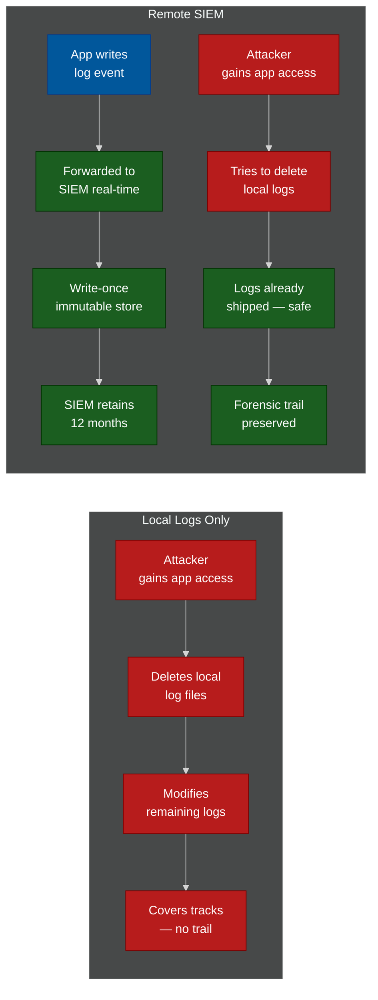

### V7.4 — Error Handling

Errors are inevitable. What information they expose to users determines whether an error becomes an intelligence source for attackers.

| ID | Requirement |
|----|-------------|
| **V7.4.1** | Generic error messages shown to users; detailed errors (stack traces, DB errors, internal paths) logged server-side only. Never surfaced to the client. |
| **V7.4.2** | Unhandled exceptions caught at the application boundary; application fails securely (default deny — reject the request, do not partially process it). |
| **V7.4.3** | Error responses do not include stack traces, database error messages, query strings, or internal file system paths. |
| **V7.4.4** | Custom 404 and 500 error pages implemented. Default server error pages (Apache, Nginx, IIS) reveal server software versions and must be replaced. |

**Logging pipeline diagram:**

```mermaid
%%{init: {'theme': 'dark',
  'themeVariables': {
    'background': '#1e1e1e'
  },
  'themeCSS': 'svg { background-color: #1e1e1e !important; padding: 1rem !important; border-radius: 8px !important; } .edgeLabel rect { fill: #1e1e1e !important; } text, tspan, .messageText, .signalText, .edgeLabel, .edgeLabel span, .pointLabel, .axisLabel, .quadrantTitle, .quadrantLabel { fill: #ffffff !important; color: #ffffff !important; stroke: none !important; }'
}}%%
graph LR
    classDef process fill:#01579b,stroke:#003c8f,color:#fff
    classDef safe fill:#1b5e20,stroke:#003300,color:#fff
    classDef attack fill:#b71c1c,stroke:#7f0000,color:#fff
    classDef warning fill:#e65100,stroke:#bf360c,color:#fff
    classDef decision fill:#4a148c,stroke:#6a1b9a,color:#fff

    A[App Event]:::process --> B{Sensitive<br/>Data?}:::decision
    B -->|Yes| C[Redact / Mask]:::warning
    B -->|No| D[Encode<br/>User Input]:::process
    C --> D
    D --> E[Local Log<br/>Buffer]:::process
    E --> F[Forward to<br/>SIEM / Splunk]:::safe
    F --> G[Immutable<br/>Log Store]:::safe
    G --> H[Alert Engine]:::safe
    H --> I{Anomaly<br/>Detected?}:::decision
    I -->|Yes| J[Security Alert]:::warning
    I -->|No| K[Retained<br/>12 Months]:::safe
```

---

## V10: Malicious Code Verification

Supply chain attacks have become one of the most devastating attack vectors in modern software. When an attacker compromises a widely used package, they instantly gain access to every application that depends on it. ASVS V10 addresses both first-party code integrity and third-party dependency risks.

### V10.1 — Code Integrity

Every artifact that runs in production must have a verified, traceable lineage back to reviewed source code.

| ID | Requirement |
|----|-------------|
| **V10.1.1** | Code signing or hash verification for all first-party production artifacts. Build outputs (container images, binaries, packages) must have a verifiable signature or content hash. |
| **V10.1.2** | Build pipeline enforces code review before merge. No direct push to main or production branches; all code changes require pull request and approval. |
| **V10.1.3** | Static Application Security Testing (SAST) run on every commit or pull request. Results must be reviewed before merge; critical findings must block merge. |
| **V10.1.4** | Dynamic Application Security Testing (DAST) included in the deployment pipeline. Run against a staging environment before production promotion. |
| **V10.1.5** | Secrets scanning in CI/CD pipeline. Commits containing secrets (API keys, passwords, private keys) must be rejected at the pipeline level, not just flagged. |

**Pipeline model:** The goal is to treat security scanning as a gate, not a report. If SAST finds a critical vulnerability, the build fails. The team is forced to address it before shipping.

**Secure CI/CD pipeline — gate model:**

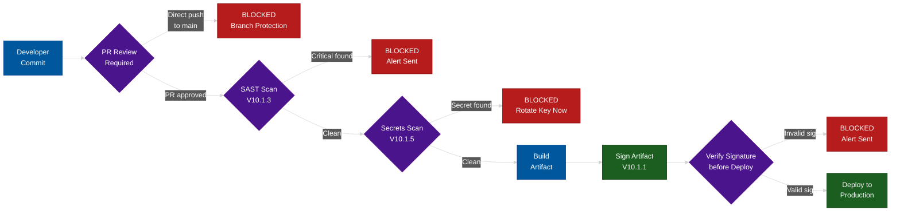

### V10.2 — Malicious Code Search

Not all malicious code is introduced by external attackers. Insider threats, compromised developer machines, and dependency confusion attacks are all real vectors.

| ID | Requirement |
|----|-------------|
| **V10.2.1** | Source code reviewed for time bombs, logic bombs, and hidden backdoors. Code review processes must include security-focused review, not just functional review. |
| **V10.2.2** | Third-party code reviewed for obfuscated or unexpected functionality. Minified or obfuscated packages must be evaluated for legitimacy before inclusion. |
| **V10.2.3** | Application code does not call home, exfiltrate data, or perform unauthorized outbound communication. Network egress policies must be configured to enforce this. |
| **V10.2.4** | Anti-virus and malware scanning for binary executables and user-uploaded files. Scanning must occur before files are made available to other users or systems. |
| **V10.2.5** | No hardcoded credentials, API keys, or private keys in source code. This includes test credentials and development keys. |
| **V10.2.6** | No hardcoded accounts, undocumented backdoors, or test/debug features accessible in production builds. Debug endpoints must be disabled at build time. |

**V10.2.5 and V10.2.6 enforcement:** Use pre-commit hooks (`detect-secrets`, `truffleHog`) and CI-level scanning. Rotate any key that is ever committed to version control, even briefly, regardless of whether the commit was reverted.

**Supply chain attack vs. pinned dependency defense:**

```mermaid
%%{init: {'theme': 'dark',
  'themeVariables': {
    'background': '#1e1e1e'
  },
  'themeCSS': 'svg { background-color: #1e1e1e !important; padding: 1rem !important; border-radius: 8px !important; } .edgeLabel rect { fill: #1e1e1e !important; } text, tspan, .messageText, .signalText, .edgeLabel, .edgeLabel span, .pointLabel, .axisLabel, .quadrantTitle, .quadrantLabel { fill: #ffffff !important; color: #ffffff !important; stroke: none !important; }'
}}%%
sequenceDiagram
    participant ATK as Attacker
    participant REG as npm Registry
    participant CI as CI Pipeline
    participant BUILD as Build Server
    participant SCA as SCA Scanner
    participant ALERT as Security Alert

    rect rgb(80,20,20)
        Note over ATK,BUILD: Unprotected — Floating Dependency
        ATK->>REG: Compromise left-pad@2.0.0<br/>inject malicious code
        CI->>REG: npm install left-pad@latest
        REG-->>CI: Returns malicious v2.0.0
        CI->>BUILD: Build with tainted package
        BUILD->>ATK: Malicious code exfiltrates<br/>env vars and secrets
    end

    rect rgb(20,50,20)
        Note over ATK,ALERT: Protected — Hash Pinned + SCA
        ATK->>REG: Compromise left-pad@2.0.0<br/>inject malicious code
        CI->>REG: npm install left-pad@sha512-abc123
        REG-->>CI: Hash mismatch — install fails
        CI->>SCA: Run dependency audit
        SCA->>SCA: CVE check on all deps
        SCA-->>ALERT: CVE detected in left-pad
        ALERT-->>CI: Build BLOCKED
    end
```

### V10.3 — Deployed Application Integrity

The gap between source code and what actually runs in production is where supply chain attacks often live.

| ID | Requirement |
|----|-------------|
| **V10.3.1** | Auto-update functionality verifies cryptographic signature before applying any update. Updates without valid signatures must be rejected. |
| **V10.3.2** | Unsigned or incorrectly signed code rejected by the runtime environment. This applies to plugins, scripts, and dynamically loaded modules. |
| **V10.3.3** | Binary deployment integrity verified using hash comparison before execution. The hash must be computed from a trusted, out-of-band source — not from the same delivery channel as the binary. |

**Binary verification — BAD vs. GOOD:**

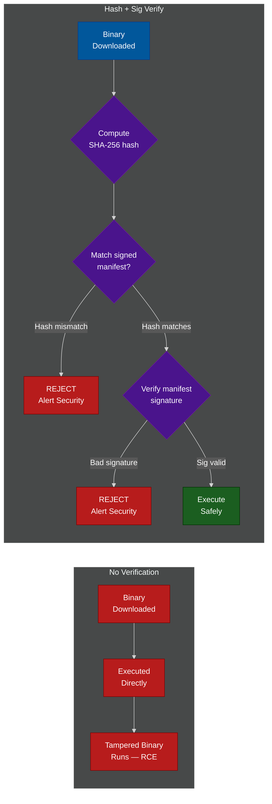

---

## V11: Business Logic Security

Business logic flaws are the category that automated scanners consistently miss. A vulnerability scanner can find an XSS. It cannot determine that your e-commerce checkout flow allows users to skip the payment step by manipulating URL parameters. These require understanding the intended behavior of the application and verifying that the implementation enforces it.

### V11.1 — Business Logic

| ID | Requirement |
|----|-------------|
| **V11.1.1** | Business logic flows validated on the server side. Client-side validation is UX-only and must never be the authoritative enforcement point. |
| **V11.1.2** | Process steps cannot be skipped. Workflow enforcement prevents users from jumping to later steps without completing earlier required steps. |
| **V11.1.3** | Transaction amounts and high-value operations have server-side sanity checks: minimum and maximum bounds enforced, velocity limits applied per user and per session. |
| **V11.1.4** | Business logic transactions only executable by authenticated users. Anonymous access must be blocked for any transactional operation. |
| **V11.1.5** | Business logic detects and blocks automated abuse: mass account creation, mass purchase attempts, and bulk data extraction patterns. |
| **V11.1.6** | High-value transactions — admin actions, bulk operations, irreversible actions — require an additional confirmation step (e.g., re-authentication, TOTP, explicit confirmation dialog with consequences stated). |
| **V11.1.7** | Timing attacks on business logic prevented. Time-constant responses for sensitive decisions prevent attackers from inferring internal state via response time differences. |
| **V11.1.8** | Business logic validates sequence integrity. Out-of-order processing (e.g., completing payment before checkout, accessing step 4 without completing step 2) must be rejected. |

**Business logic step enforcement — state diagram:**

```mermaid
%%{init: {'theme': 'dark',
  'themeVariables': {
    'background': '#1e1e1e'
  },
  'themeCSS': 'svg { background-color: #1e1e1e !important; padding: 1rem !important; border-radius: 8px !important; } .edgeLabel rect { fill: #1e1e1e !important; } text, tspan, .messageText, .signalText, .edgeLabel, .edgeLabel span, .pointLabel, .axisLabel, .quadrantTitle, .quadrantLabel { fill: #ffffff !important; color: #ffffff !important; stroke: none !important; }'
}}%%
stateDiagram-v2
    [*] --> Cart: Add Items
    Cart --> Checkout: V11.1.2<br/>Step validated
    Checkout --> Payment: V11.1.3<br/>Amount checked
    Payment --> Confirmation: V11.1.6<br/>Re-auth required
    Confirmation --> Complete: V11.1.8<br/>Sequence verified
    Complete --> [*]

    Cart --> Payment: BLOCKED
    Cart --> Complete: BLOCKED
    Checkout --> Complete: BLOCKED
    Payment --> Complete: BLOCKED
```

**E-commerce workflow enforcement — full state machine:**

```mermaid
%%{init: {'theme': 'dark',
  'themeVariables': {
    'background': '#1e1e1e'
  },
  'themeCSS': 'svg { background-color: #1e1e1e !important; padding: 1rem !important; border-radius: 8px !important; } .edgeLabel rect { fill: #1e1e1e !important; } text, tspan, .messageText, .signalText, .edgeLabel, .edgeLabel span, .pointLabel, .axisLabel, .quadrantTitle, .quadrantLabel { fill: #ffffff !important; color: #ffffff !important; stroke: none !important; }'
}}%%
stateDiagram-v2
    [*] --> Cart: Session starts

    state Cart {
        [*] --> Browsing
        Browsing --> ItemAdded: add to cart
        ItemAdded --> Browsing: continue shopping
        ItemAdded --> ReadyCheckout: proceed
    }

    state Checkout {
        [*] --> AddressEntry
        AddressEntry --> ShippingSelect: address valid
        ShippingSelect --> ReviewOrder: method chosen
    }

    state Payment {
        [*] --> PaymentEntry
        PaymentEntry --> Processing: submit
        Processing --> PaymentFailed: decline
        PaymentFailed --> PaymentEntry: retry
        Processing --> PaymentOK: success
    }

    state Confirmation {
        [*] --> ReAuthCheck
        ReAuthCheck --> Confirmed: TOTP valid
        ReAuthCheck --> Blocked: TOTP fail
    }

    Cart --> Checkout: proceed
    Checkout --> Payment: submit
    Payment --> Confirmation: success
    Confirmation --> [*]: order placed

    Cart --> Confirmation: BLOCKED
    Checkout --> Confirmation: BLOCKED
    Payment --> [*]: BLOCKED — no skip
```

### V11.2 — Anti-Automation

Automated abuse is not just a performance problem — it is a security problem. Credential stuffing, account enumeration, gift card cracking, and inventory hoarding are all automated attacks against business logic.

| ID | Requirement |
|----|-------------|
| **V11.2.1** | Rate limiting on all endpoints receiving user input: login, registration, password reset, OTP submission, and any endpoint that takes a guessable parameter. |
| **V11.2.2** | Bot detection in high-value flows: CAPTCHA, behavioral analysis, or device fingerprinting applied at login, account creation, and checkout. |
| **V11.2.3** | Velocity checks: abnormal action rates (e.g., 1,000 API calls in 10 seconds from a single IP) trigger an automated block and generate a security alert. |
| **V11.2.4** | CAPTCHA or proof-of-work mechanism for account creation to prevent mass registration abuse and disposable account farming. |
| **V11.2.5** | API abuse detection: scraping patterns, enumeration attempts (sequential ID probing), and data harvesting patterns are detected and blocked. |

**Rate limiting architecture:** Rate limiters must operate at the infrastructure level (API gateway, WAF, load balancer) — not just in application code. Application-level rate limiting is bypassed if the attacker can send requests that cause the application to crash before the limiter runs.

**Rate limiting decision flow:**

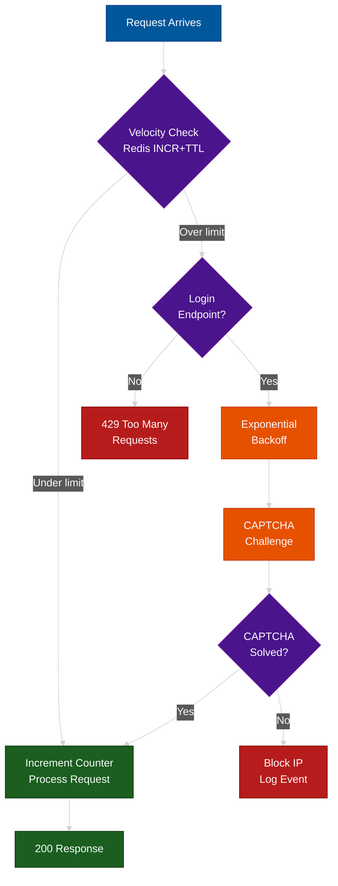

---

## V12: Files and Resources

File handling is one of the highest-risk operations in any web application. A user uploading a file is handing the application untrusted binary data and asking it to process that data. Every step of that processing pipeline — from receipt to storage to delivery — has attack vectors that must be explicitly closed.

### V12.1 — File Upload

| ID | Requirement |
|----|-------------|
| **V12.1.1** | File upload only accepts expected MIME types validated by content inspection (magic byte analysis), not by file extension or the `Content-Type` header supplied by the client. |
| **V12.1.2** | File size limits enforced server-side before processing begins. Limits prevent disk exhaustion DoS via large file uploads. |
| **V12.1.3** | Uploaded files scanned by anti-malware engine before being made available to any user or system. |
| **V12.1.4** | Uploaded filenames sanitized before any use. Path traversal sequences (`../`, `..\`) and null bytes stripped. Filenames regenerated server-side rather than trusted from client. |
| **V12.1.5** | Polyglot file attacks prevented. Files validated against magic bytes and internal structure, not extension. A `.jpg` file that also parses as valid PHP must be rejected. |
| **V12.1.6** | Zip and archive files inspected for zip bombs before extraction. Compressed size vs. uncompressed size ratio checked; extracted content size enforced against a maximum. |
| **V12.1.7** | Image files re-encoded (re-processed through an image parser and re-rendered to pixels) before display. Re-encoding destroys any embedded payloads — polyglots, EXIF-based XSS, and steganographic payloads are all neutralized. |

**File upload validation pipeline:**

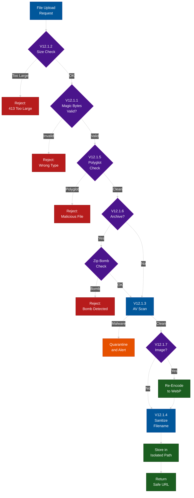

**Detailed file upload pipeline with all rejection paths:**

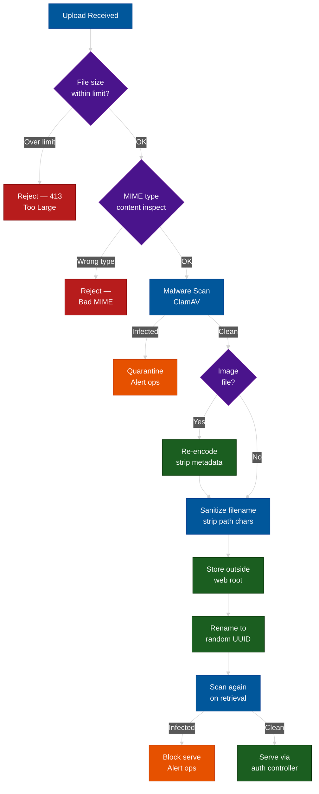

### V12.2 — File Integrity

| ID | Requirement |
|----|-------------|
| **V12.2.1** | Uploaded files integrity-checked after storage. A hash computed at upload time must be verifiable on retrieval; tampering with stored files must be detectable. |
| **V12.2.2** | Files served with `Content-Disposition: attachment` header to prevent browsers from rendering or executing them in-context. |

### V12.3 — File Execution Prevention

Stored files being executed on the server is the canonical path to remote code execution. These requirements close the most common vectors.

| ID | Requirement |
|----|-------------|
| **V12.3.1** | User-uploaded files not executed on the server. Storage location is outside the web root or in a directory explicitly configured with no execution permissions. |
| **V12.3.2** | Web server does not execute user-uploaded scripts in any server-side language: PHP, ASP, CGI, Perl, Python. Directory-level execution must be disabled for upload storage. |
| **V12.3.3** | Uploaded file storage path is randomized and not user-controlled. The filename used internally must be generated server-side (UUID or random hash), never derived from the client-supplied filename. |
| **V12.3.4** | Server-side include (SSI) processing disabled for any directory that contains or could contain user-uploaded files. |

**File execution — BAD path vs. GOOD path:**

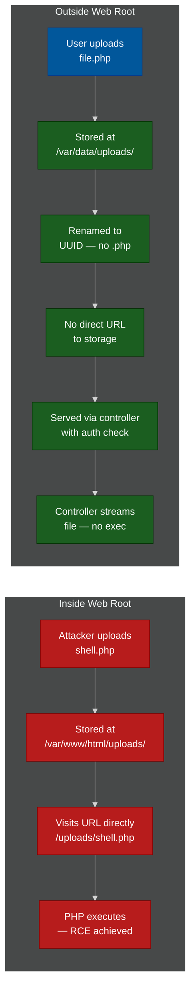

### V12.4 — File Storage

| ID | Requirement |
|----|-------------|
| **V12.4.1** | User-uploaded files stored outside the web root, or on a separate domain/origin that does not share cookies or session context with the main application. |
| **V12.4.2** | Files encrypted at rest using AES-256. Encryption keys managed separately from the encrypted data — key compromise must not automatically expose all files. |
| **V12.4.3** | Storage permissions minimal. The web application process can write to the upload destination but must not have permission to list arbitrary directories or delete arbitrary files from storage. |

### V12.5 — File Download

Downloads introduce a separate class of vulnerabilities: information disclosure about internal storage, MIME sniffing attacks, and content injection.

| ID | Requirement |
|----|-------------|
| **V12.5.1** | Downloaded file metadata does not expose internal file system paths, storage bucket names, or server-side filenames. URLs and headers must be sanitized before serving. |
| **V12.5.2** | `Content-Disposition: attachment` set for all downloadable files to prevent browsers from rendering file content as an active page. |
| **V12.5.3** | `Content-Type` validated and set correctly for downloaded files. `X-Content-Type-Options: nosniff` must be set to prevent browsers from overriding the declared content type. |

### V12.6 — SSRF Protection

Server-Side Request Forgery (SSRF) occurs when an attacker can cause the server to make HTTP requests on their behalf. This bypasses firewalls (the request originates from inside the network), enables access to cloud metadata APIs, and can be used to pivot to internal services.

| ID | Requirement |
|----|-------------|
| **V12.6.1** | URL inputs validated against an allowlist before any server-side fetch. Block-listing is insufficient — only allowlisted domains and schemes should be permitted. |
| **V12.6.2** | Internal network ranges blocked in server-side URL fetches: `169.254.0.0/16` (link-local), `10.0.0.0/8`, `172.16.0.0/12`, `192.168.0.0/16`, `127.0.0.0/8`, and `::1`. |
| **V12.6.3** | DNS rebinding attacks mitigated: validate the resolved IP address after DNS resolution completes, not before. A hostname that resolves to a public IP at validation time can resolve to an internal IP at fetch time. |
| **V12.6.4** | Cloud metadata endpoints blocked for all outbound requests from the application tier. The AWS metadata service at `169.254.169.254` and equivalent endpoints for GCP and Azure must be unreachable from the application network via egress policy. |

**SSRF attack vs. protected flow — sequence diagram:**

```mermaid
%%{init: {'theme': 'dark',
  'themeVariables': {
    'background': '#1e1e1e'
  },
  'themeCSS': 'svg { background-color: #1e1e1e !important; padding: 1rem !important; border-radius: 8px !important; } .edgeLabel rect { fill: #1e1e1e !important; } text, tspan, .messageText, .signalText, .edgeLabel, .edgeLabel span, .pointLabel, .axisLabel, .quadrantTitle, .quadrantLabel { fill: #ffffff !important; color: #ffffff !important; stroke: none !important; }'
}}%%
sequenceDiagram
    participant A as Attacker
    participant App as Application
    participant Val as URL Validator
    participant Meta as Metadata API<br/>169.254.169.254
    participant Ext as Allowed<br/>External API

    rect rgb(80,20,20)
        Note over A,Meta: Unprotected SSRF Attack
        A->>App: POST url=http://169.254.169.254
        App->>Meta: GET /latest/meta-data/
        Meta-->>App: IAM credentials, secrets
        App-->>A: Leaked cloud credentials
    end

    rect rgb(20,50,20)
        Note over A,Ext: Protected Flow (V12.6.1 - V12.6.4)
        A->>App: POST url=http://169.254.169.254
        App->>Val: Validate URL
        Val->>Val: Check allowlist
        Val->>Val: Resolve DNS
        Val->>Val: Check IP ranges
        Val-->>App: BLOCKED: Internal IP
        App-->>A: 400 Bad Request

        A->>App: POST url=https://api.allowed.com
        App->>Val: Validate URL
        Val-->>App: Allowed
        App->>Ext: GET /data
        Ext-->>App: Response
        App-->>A: 200 OK
    end
```

**SSRF variant decision tree — bypass attempts:**

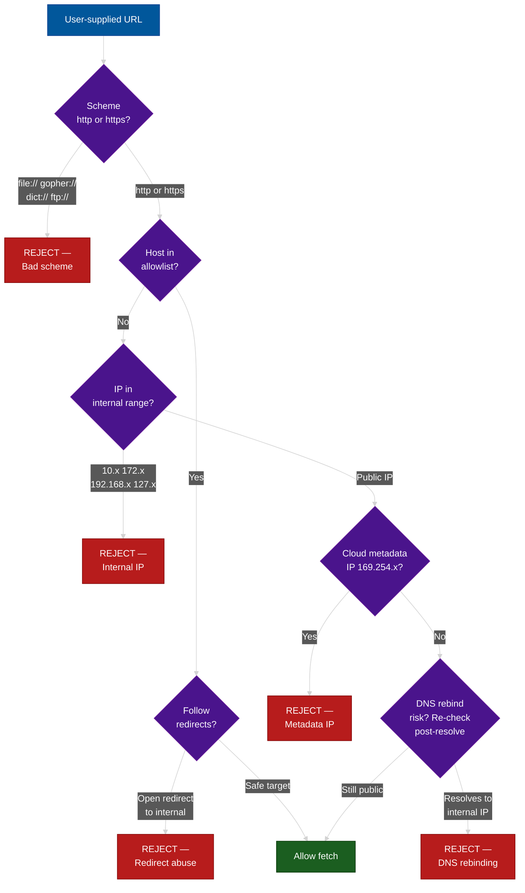

---

## Summary: Domain D Coverage

| Chapter | Focus Area | Key Risk Mitigated |
|---------|------------|--------------------|
| V7 | Error Handling and Logging | Information leakage, audit trail manipulation |
| V10 | Malicious Code | Supply chain compromise, backdoors |
| V11 | Business Logic | Workflow bypass, automated abuse |
| V12 | Files and Resources | RCE via upload, SSRF, data exfiltration |

All four chapters share a common theme: **the application must enforce security at the server side, independent of any client-side controls or trusting any user-supplied input**. Business logic enforced only in JavaScript, file types validated only by extension, error details surfaced to the user, and URLs fetched without validation — each of these is a pattern that appears constantly in real-world vulnerability reports and ASVS addresses each explicitly.

---

---

## References

### Official Standards & Specifications
- **OWASP ASVS 5.0** — [github.com/OWASP/ASVS](https://github.com/OWASP/ASVS) — Full standard source
- **NIST SP 800-218** — [csrc.nist.gov/publications/detail/sp/800-218/final](https://csrc.nist.gov/publications/detail/sp/800-218/final) — Secure Software Development Framework (SSDF)
- **NIST SP 800-92** — [csrc.nist.gov/publications/detail/sp/800-92/final](https://csrc.nist.gov/publications/detail/sp/800-92/final) — Guide to Computer Security Log Management
- **CIS Controls v8** — [cisecurity.org/controls/v8](https://www.cisecurity.org/controls/v8) — Security logging and monitoring controls

### OWASP Cheat Sheets
- **Logging** — [cheatsheetseries.owasp.org/cheatsheets/Logging_Cheat_Sheet.html](https://cheatsheetseries.owasp.org/cheatsheets/Logging_Cheat_Sheet.html)
- **Logging Vocabulary** — [cheatsheetseries.owasp.org/cheatsheets/Logging_Vocabulary_Cheat_Sheet.html](https://cheatsheetseries.owasp.org/cheatsheets/Logging_Vocabulary_Cheat_Sheet.html)
- **File Upload** — [cheatsheetseries.owasp.org/cheatsheets/File_Upload_Cheat_Sheet.html](https://cheatsheetseries.owasp.org/cheatsheets/File_Upload_Cheat_Sheet.html)
- **SSRF Prevention** — [cheatsheetseries.owasp.org/cheatsheets/Server_Side_Request_Forgery_Prevention_Cheat_Sheet.html](https://cheatsheetseries.owasp.org/cheatsheets/Server_Side_Request_Forgery_Prevention_Cheat_Sheet.html)
- **Business Logic** — [owasp.org/www-project-web-security-testing-guide/latest/4-Web_Application_Security_Testing/10-Business_Logic_Testing](https://owasp.org/www-project-web-security-testing-guide/latest/4-Web_Application_Security_Testing/10-Business_Logic_Testing/)
- **Anti-Automation** — [cheatsheetseries.owasp.org/cheatsheets/Credential_Stuffing_Prevention_Cheat_Sheet.html](https://cheatsheetseries.owasp.org/cheatsheets/Credential_Stuffing_Prevention_Cheat_Sheet.html)
- **Error Handling** — [cheatsheetseries.owasp.org/cheatsheets/Error_Handling_Cheat_Sheet.html](https://cheatsheetseries.owasp.org/cheatsheets/Error_Handling_Cheat_Sheet.html)
- **Software Supply Chain** — [cheatsheetseries.owasp.org/cheatsheets/Software_Supply_Chain_Security_Cheat_Sheet.html](https://cheatsheetseries.owasp.org/cheatsheets/Software_Supply_Chain_Security_Cheat_Sheet.html)

### OWASP Top 10 Mappings
- **A08:2021** — [owasp.org/Top10/A08_2021-Software_and_Data_Integrity_Failures](https://owasp.org/Top10/A08_2021-Software_and_Data_Integrity_Failures/) — Software & Data Integrity Failures (V10)
- **A09:2021** — [owasp.org/Top10/A09_2021-Security_Logging_and_Monitoring_Failures](https://owasp.org/Top10/A09_2021-Security_Logging_and_Monitoring_Failures/) — Logging & Monitoring Failures (V7)

### Tools & Services
- **ClamAV** — [clamav.net](https://www.clamav.net) — Open-source antivirus for file scanning (V12.1.3)
- **OWASP Dependency Check** — [owasp.org/www-project-dependency-check](https://owasp.org/www-project-dependency-check/) — SCA vulnerability scanner (V10.1.6)
- **CycloneDX** — [cyclonedx.org](https://cyclonedx.org) — SBOM standard (V10.1.5)
- **Semgrep** — [semgrep.dev](https://semgrep.dev) — Static analysis / SAST (V10.1.3)
- **OWASP ZAP** — [zaproxy.org](https://www.zaproxy.org) — DAST scanning (V10.1.4)
- **Truffleog / Gitleaks** — [github.com/trufflesecurity/trufflehog](https://github.com/trufflesecurity/trufflehog) — Secrets scanning in CI (V10.1.5)
- **fail2ban** — [fail2ban.org](https://www.fail2ban.org) — Rate limiting and IP blocking (V11.2)

## 📚 Implementation References
To see how to physically implement these ASVS requirements, refer to our dedicated architecture guides:
- **V7 Logging:** [The Cardinal Sin: Passwords in Access Logs](../network-security/02-transit-and-logging-failures.md)
- **V11 Business Logic:** [Trust & Velocity Scoring Engines](../anti-spam-architecture/01-trust-and-velocity-scoring.md)
- **V11 Checkpoints:** [Marketplace Spam Strategies](../anti-spam-architecture/04-marketplace-spam-strategies.md)
- **V12 File Uploads:** [Malware & Enterprise File Upload Defense](../file-upload-defense/README.md)

**Navigation:** [ASVS 5.0 Index](./README.md)

## Related

- [Authentication & Identity Patterns](../auth-and-identity-patterns/README.md)
- [Session & Cookie Security](../session-and-cookie-security/README.md)
- [File Upload Defense](../file-upload-defense/README.md)
