# CSRF: The 1-Click Account Takeover

**Author:** ichamrong  
**Category:** Security & Architecture  
**Read Time:** ~8 min  

---

## 📌 Table of Contents
- [1. Cross-Site Request Forgery (CSRF)](#1-cross-site-request-forgery-csrf)
- [2. The Facebook "Change Email" Attack](#2-the-facebook-change-email-attack)
- [3. The Architectural Defenses](#3-the-architectural-defenses)
  - [Defense 1: The Anti-CSRF Token](#defense-1-the-anti-csrf-token)
  - [Defense 2: The SameSite Cookie Attribute](#defense-2-the-samesite-cookie-attribute)
- [📚 References & Tools](#references-tools)

---

## 1. Cross-Site Request Forgery (CSRF)

**What it is:** CSRF is an attack that forces an end user to execute unwanted actions on a web application in which they are currently authenticated. 

Because browsers automatically include cookies with requests to a specific domain, the backend server cannot distinguish between a legitimate request made by the user, and a forged request forced by a malicious website.

## 2. The Facebook "Change Email" Attack

Imagine an older, poorly secured version of a social network like Facebook. The endpoint to change a user's email address is a simple `POST` request to `/api/settings/change-email`.

**The Execution:**
1. You are actively logged into Facebook in Tab 1 of your browser.
2. In Tab 2, you are browsing the internet and click a link to a funny cat blog.
3. The blog is actually owned by a hacker. Hidden on the page is an invisible HTML form:
```html
<form id="hack" action="https://facebook.com/api/settings/change-email" method="POST">
    <input type="hidden" name="new_email" value="hacker@russia.com">
</form>
<script>document.getElementById('hack').submit();</script>
```
4. The moment the page loads, the Javascript automatically submits the form to Facebook.
5. **The Devastating Flaw:** Because you are logged into Facebook in Tab 1, your browser *automatically attaches your Facebook Session Cookie* to the forged request in Tab 2.
6. The Facebook backend receives the request, sees your valid cookie, and says: *"Ah, John wants to change his email to hacker@russia.com. Approved!"*
7. You just lost your account without typing a single password.

```mermaid
%%{init: {'theme': 'dark', 'themeVariables': {'primaryColor': '#4a148c', 'primaryTextColor': '#ffffff', 'lineColor': '#6a1b9a',
    'background': '#1e1e1e'},
  'themeCSS': 'svg { background-color: #1e1e1e !important; padding: 1rem !important; border-radius: 8px !important; } .edgeLabel rect { fill: #1e1e1e !important; } text, tspan, .messageText, .signalText, .edgeLabel, .edgeLabel span, .pointLabel, .axisLabel, .quadrantTitle, .quadrantLabel { fill: #ffffff !important; color: #ffffff !important; stroke: none !important; }'
}}%%
flowchart LR
    classDef hack fill:#e65100,stroke:#bf360c,color:#fff
    classDef user fill:#01579b,stroke:#003c8f,color:#fff
    classDef sys fill:#1b5e20,stroke:#003300,color:#fff
    
    A[Victim visits<br/>Hacker Blog]:::user --> B[Hidden Form<br/>Auto-Submits]:::hack
    B -->|Browser attaches<br/>Facebook Cookie| C[Facebook API]:::sys
    C -->|Validates Cookie| D[Changes Email to Hacker]:::hack
```



## 3. The Architectural Defenses

To prevent CSRF, the backend must verify that the request originated *from the actual application UI*, not from a random third-party website.

### Defense 1: The Anti-CSRF Token
When the server renders the settings page, it generates a cryptographically random string (e.g., `8f4b2a9c`) and embeds it in the HTML. When the user clicks "Save", the UI must send this token in the payload.
Because the Hacker's blog (Tab 2) cannot read the HTML of Facebook (Tab 1) due to the browser's Same-Origin Policy (SOP), the hacker cannot guess the random token. The forged request fails.

### Defense 2: The SameSite Cookie Attribute
This is the modern, bulletproof defense. When the backend sets the Session Cookie during login, it must include the `SameSite` flag:
`Set-Cookie: session_id=xyz; Secure; HttpOnly; SameSite=Lax`

- `SameSite=Lax` or `Strict` tells the browser: *"If a request is being sent to Facebook from a completely different domain (like a hacker's blog), DO NOT attach the Facebook cookie."* 
- Without the cookie, the Facebook API rejects the forged request instantly.

## 📚 References & Tools
- **SameSite Cookie Specification** — [web.dev/samesite-cookies-explained/](https://web.dev/samesite-cookies-explained/)
- **OWASP CSRF Prevention** — [cheatsheetseries.owasp.org/cheatsheets/Cross-Site_Request_Forgery_Prevention_Cheat_Sheet.html](https://cheatsheetseries.owasp.org/cheatsheets/Cross-Site_Request_Forgery_Prevention_Cheat_Sheet.html)

---

**Navigation:** [Next: Device & Session Management](./02-device-and-session-management.md) | [Session Security Index](./README.md)

*Last updated: 2026-05-17*

## Related

- [Authentication & Identity Patterns](../auth-and-identity-patterns/README.md)
- [OWASP ASVS 5.0 Verification](../owasp-asvs-5.0/README.md)
- [Bot Protection & CAPTCHAs](../bot-protection/README.md)
