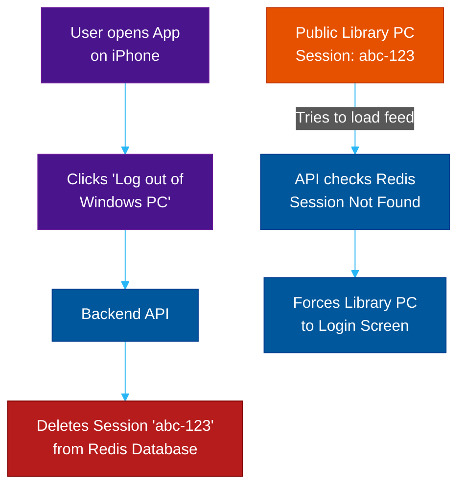

# Device & Session Management

**Author:** ichamrong  
**Category:** Security & Architecture  
**Read Time:** ~8 min  

---

## 📌 Table of Contents
- [1. The Real-World Danger of Active Sessions](#1-the-real-world-danger-of-active-sessions)
- [2. The "Logged-In Devices" UI](#2-the-logged-in-devices-ui)
- [3. The Backend Architecture (Stateful vs Stateless)](#3-the-backend-architecture-stateful-vs-stateless)
  - [The Stateful Redis Solution](#the-stateful-redis-solution)
  - [The Implementation Steps:](#the-implementation-steps)
- [📚 References & Tools](#references-tools)

---

## 1. The Real-World Danger of Active Sessions

Imagine logging into your Facebook or banking account on a friend's laptop, or worse, a public library computer. You close the browser window but **forget to click "Log Out".** 

Two hours later, someone else sits at that computer, opens the browser, goes to Facebook, and is instantly dropped into your account with full privileges. 

Alternatively, a user might see suspicious activity on their account and realize someone in another country has hacked their password. Changing the password is not enough; the hacker *already has an active session cookie*.

## 2. The "Logged-In Devices" UI

To solve this, every modern enterprise application (Google, Meta, GitHub) must have a **Device Management Dashboard** (often called "Where You're Logged In").

This UI allows the user to see every active session attached to their account, including:
- The Device Type (MacBook, iPhone, Windows 11).
- The Browser (Chrome, Safari).
- The Geo-Location (Paris, Tokyo) based on IP.
- **The Kill Switch:** A button to remotely log out that specific device.

## 3. The Backend Architecture (Stateful vs Stateless)

Implementing a remote kill switch dictates your entire backend authentication architecture. 

If you use pure **Stateless JWTs (JSON Web Tokens)**, you have a massive security flaw. A stateless JWT is signed by the server but *not saved in the database*. The server only verifies the cryptography. Because the server doesn't keep a list of active tokens, **you cannot remotely revoke a specific stateless JWT before it expires.** If a user forgets to log out of the library computer, there is no way to kill that session from their phone.

### The Stateful Redis Solution
To build a secure Device Management system, you must use **Stateful Sessions** (Opaque Tokens) or maintain a JWT Blacklist/Whitelist in a fast in-memory database like **Redis**.

### The Implementation Steps:
1. When a user logs in, the API generates a unique Session ID (`abc-123`).
2. The API saves `abc-123` into Redis, alongside the User-Agent (Windows/Chrome) and the IP Address.
3. The API sends `abc-123` to the browser as an `HttpOnly` cookie.
4. When the user clicks "Log out of Windows PC" from their phone, the API simply deletes `abc-123` from Redis.
5. The next time the library computer makes an API request, the server checks Redis, sees the session no longer exists, and throws a `401 Unauthorized`, instantly kicking the intruder out.

## 📚 References & Tools
- **Redis Session Management** — [redis.io/docs/manual/patterns/session-storage/](https://redis.io/docs/manual/patterns/session-storage/)
- **JWT Best Practices (RFC 8725)** — [rfc-editor.org/rfc/rfc8725](https://www.rfc-editor.org/rfc/rfc8725)

---

**Navigation:** [Previous: CSRF Attacks](./01-csrf-and-state-mutations.md) | [Next: The Cookie Black Market](./03-the-cookie-black-market.md) | [Session Security Index](./README.md)

*Last updated: 2026-05-17*

## Related

- [Authentication & Identity Patterns](../auth-and-identity-patterns/README.md)
- [OWASP ASVS 5.0 Verification](../owasp-asvs-5.0/README.md)
- [Bot Protection & CAPTCHAs](../bot-protection/README.md)
