# The Cookie Black Market (Session Hijacking)

**Author:** ichamrong  
**Category:** Security & Architecture  
**Read Time:** ~10 min  

---

## 📌 Table of Contents
- [1. The Evolution of Hacking](#1-the-evolution-of-hacking)
- [2. The Genesis Market & RedLine Stealer](#2-the-genesis-market-redline-stealer)
- [3. The "Free" Cookie Economy (Netflix & Spotify)](#3-the-free-cookie-economy-netflix-spotify)
- [4. Architectural Defenses: Session Binding](#4-architectural-defenses-session-binding)
  - [Defense 1: IP Binding & Geo-Velocity](#defense-1-ip-binding-geo-velocity)
  - [Defense 2: Browser Fingerprinting](#defense-2-browser-fingerprinting)
- [📚 References & Tools](#references-tools)

---

## 1. The Evolution of Hacking

Ten years ago, hackers stole passwords. Today, stealing a password is often useless because massive companies enforce **2-Factor Authentication (SMS/TOTP)**. 

Because of this, modern cybercriminal syndicates have evolved. They no longer steal passwords; **they steal Cookies**. 

If an attacker steals your active Session Cookie, they don't need your password, and they don't need your SMS code. To the server, the cookie *is* the fully authenticated user. 

## 2. The Genesis Market & RedLine Stealer

**The Attack Vector:** 
A user downloads a cracked video game or illegal software. Hidden inside is an "InfoStealer" malware (like the famous *RedLine Stealer*). 

The malware does not try to encrypt the hard drive. Instead, it silently accesses the hidden SQLite databases used by Google Chrome or Edge on the victim's computer. It extracts every single active Session Cookie (Facebook, Gmail, Binance, Corporate VPNs) and quietly uploads them to the attacker's server.

**The Dark Web Market:**
The attacker takes these stolen cookies and uploads them to dark web marketplaces (like the notorious *Genesis Market*). 

Cybercriminals purchase a "bot profile" for $10. This profile contains the victim's exact cookies, browser fingerprints, and IP data. The criminal imports the cookies into a specialized browser, opens `binance.com`, and is instantly logged into the victim's crypto exchange without ever triggering a 2FA prompt.

```mermaid
%%{init: {'theme': 'dark', 'themeVariables': {'primaryColor': '#37474f', 'primaryTextColor': '#ffffff', 'lineColor': '#263238',
    'background': '#1e1e1e'},
  'themeCSS': 'svg { background-color: #1e1e1e !important; padding: 1rem !important; border-radius: 8px !important; } .edgeLabel rect { fill: #1e1e1e !important; } text, tspan, .messageText, .signalText, .edgeLabel, .edgeLabel span, .pointLabel, .axisLabel, .quadrantTitle, .quadrantLabel { fill: #ffffff !important; color: #ffffff !important; stroke: none !important; }'
}}%%
flowchart LR
    classDef victim fill:#01579b,stroke:#003c8f,color:#fff
    classDef hack fill:#e65100,stroke:#bf360c,color:#fff
    classDef market fill:#4a148c,stroke:#6a1b9a,color:#fff
    classDef bank fill:#1b5e20,stroke:#003300,color:#fff
    
    A[Victim downloads<br/>Malware]:::victim --> B[RedLine Stealer<br/>extracts Chrome Cookies]:::hack
    B --> C[Attacker lists Cookies<br/>on Genesis Market]:::market
    C --> D[Criminal buys Cookie<br/>Imports to Browser]:::hack
    D -->|Connects to Bank| E[Bank API sees valid<br/>cookie. Bypasses 2FA.]:::bank
```

## 3. The "Free" Cookie Economy (Netflix & Spotify)
While Genesis Market sells high-value cookies (Banks, VPNs), there is a massive sub-culture of **voluntary cookie sharing** for entertainment platforms like Netflix, Spotify, or Premium SaaS tools.

Users who don't want to pay for a Netflix subscription will go to Telegram groups or forums where "Premium Cookies" are dropped daily. 
- A user with a valid Netflix account uses a browser extension (like *EditThisCookie*) to export their active session cookie as a JSON string.
- They post that string online.
- Hundreds of people copy the JSON, import it into their own browsers using the same extension, and refresh the page.
- Suddenly, hundreds of strangers are logged into the same premium Netflix account, bypassing the login screen entirely.

*(Note: This is one of the primary reasons Netflix implemented strict "Household Wi-Fi" and Device limits. They cannot just rely on password sharing anymore, they have to kill forged session cookies.)*

## 4. Architectural Defenses: Session Binding

How does a backend server know if the Session Cookie is being used by the real victim in Paris, or a criminal who bought the cookie in Russia? 

The answer is **Session Binding**.

When the server generates the Session Cookie during the initial login, it must tie that specific Cookie ID in the Redis database to the user's physical constraints.

### Defense 1: IP Binding & Geo-Velocity
If Cookie `abc-123` was generated by an IP address in France, the server saves `Country: FR` in Redis. If the exact same cookie `abc-123` is suddenly used from an IP address in Russia 2 hours later, the server flags it as Impossible Travel. The server instantly invalidates the cookie and forces a hard re-login.

### Defense 2: Browser Fingerprinting
The server records the victim's `User-Agent` (e.g., `Chrome 114 on MacOS`). If the stolen cookie is imported into a hacker's machine running `Firefox 109 on Windows`, the backend detects the mismatch. It immediately destroys the session.

*(Note: Highly advanced criminals use anti-detect browsers to fake the exact User-Agent and buy proxies in the victim's zip code to bypass these defenses, which pushes security teams into using deep behavioral analytics and mouse-movement tracking.)*

## 📚 References & Tools
- **RedLine Stealer Analysis** — [malpedia.caad.fkie.fraunhofer.de/details/win.redline_stealer](https://malpedia.caad.fkie.fraunhofer.de/details/win.redline_stealer)
- **Genesis Market Takedown (DOJ)** — [justice.gov/opa/pr/international-law-enforcement-operation-targets-genesis-market](https://www.justice.gov/opa/pr/international-law-enforcement-operation-targets-genesis-market)

---

**Navigation:** [Previous: Device & Session Management](./02-device-and-session-management.md) | [Session Security Index](./README.md)

*Last updated: 2026-05-17*

## Related

- [Authentication & Identity Patterns](../auth-and-identity-patterns/README.md)
- [OWASP ASVS 5.0 Verification](../owasp-asvs-5.0/README.md)
- [Bot Protection & CAPTCHAs](../bot-protection/README.md)
