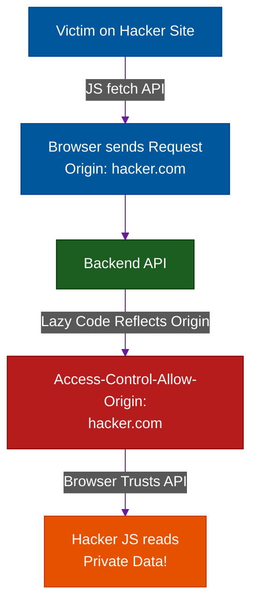

# CORS Misconfigurations & Bypasses

**Author:** ichamrong  
**Category:** Security & Architecture  
**Read Time:** ~10 min  

---

## 📌 Table of Contents
- [1. What is CORS?](#1-what-is-cors)
  - [CSRF vs. CORS](#csrf-vs-cors)
- [2. The Devastating CORS Bypass (Dynamic Reflection)](#2-the-devastating-cors-bypass-dynamic-reflection)
- [3. Other Common CORS Bypasses](#3-other-common-cors-bypasses)
  - [A. The "Null" Origin Trust](#a-the-null-origin-trust)
  - [B. The Regex Failure](#b-the-regex-failure)
- [4. The Server-Side Proxy Bypass (Header Spoofing)](#4-the-server-side-proxy-bypass-header-spoofing)
- [5. Architectural Prevention](#5-architectural-prevention)
- [📚 References & Tools](#references-tools)

---

## 1. What is CORS?

**Cross-Origin Resource Sharing (CORS)** is a security mechanism enforced by web browsers. 

By default, the browser's **Same-Origin Policy (SOP)** prevents Javascript running on one website (e.g., `hacker.com`) from reading data from a completely different website (e.g., `api.bank.com`). 

CORS is the set of HTTP headers that a backend API uses to tell the browser: *"It is okay to relax the rules. I allow `app.bank.com` to read my data."*

### CSRF vs. CORS
- **CSRF** is an attack where the hacker forces the victim to **write/mutate** data (e.g., Change Email).
- **CORS Bypass** is an attack where the hacker exploits backend misconfigurations to **read/steal** sensitive data (e.g., Fetching the user's Social Security Number or Private Messages).

---

## 2. The Devastating CORS Bypass (Dynamic Reflection)

A "CORS Bypass" happens when developers get lazy with their backend security rules. 

**The Scenario:** 
A company has 50 different subdomains (`admin.corp.com`, `hr.corp.com`, `billing.corp.com`) that all need access to the core API. 

Instead of hardcoding a list of 50 allowed domains, the backend developer writes a script that takes whatever domain the user is coming from (the `Origin` header), and dynamically echoes it back in the `Access-Control-Allow-Origin` (ACAO) header.

**The Attack Execution:**
1. You are logged into `corp.com` (you have an active Session Cookie).
2. You click a link to a hacker's website: `https://evil-hacker.com`.
3. The hacker's website runs a hidden Javascript `fetch()` request to `https://api.corp.com/v1/private/messages`. 
4. The browser attaches your Session Cookie and sends the header: `Origin: https://evil-hacker.com`.
5. The lazy backend API reads the header, dynamically reflects it, and responds: 
   `Access-Control-Allow-Origin: https://evil-hacker.com`
   `Access-Control-Allow-Credentials: true`
6. The browser sees that the API explicitly "allowed" the hacker's domain. The browser hands over your private messages to the hacker's Javascript.
7. The Javascript silently sends your messages to the attacker's database.



---

## 3. Other Common CORS Bypasses

### A. The "Null" Origin Trust
Sometimes, developers configure the API to allow `Access-Control-Allow-Origin: null` to support local file testing. 
**The Exploit:** An attacker can host their malicious Javascript inside a sandboxed `<iframe>`. Sandboxed iframes strip the domain name and send requests with an `Origin: null` header, completely bypassing the CORS defense.

### B. The Regex Failure
A developer wants to allow any subdomain of `company.com`, so they write a backend Regular Expression (Regex) that looks for `company.com` at the end of the URL string.
**The Exploit:** The attacker buys the domain name `malicious-company.com` or `company.com.hacker.net`. The lazy Regex passes, and the API grants full access to the attacker.

---

## 4. The Server-Side Proxy Bypass (Header Spoofing)

**The Scenario:** A developer configures `api.company.com` to enforce strict CORS. If the `Origin` or `Referer` header is not exactly `https://app.company.com`, the API rejects the request. The developer thinks the API is completely locked down.

**The Fatal Flaw:** CORS is strictly a **Browser Security Feature**. It does not exist outside of Chrome, Safari, or Firefox. Tools like Postman, cURL, and Node.js servers do not enforce CORS, and they allow you to fake any header you want.

**The Attack Execution (The Next.js Proxy):**
1. The attacker creates a malicious frontend, but knows the browser will block the AJAX request to `api.company.com` due to CORS.
2. Instead, the attacker builds a Next.js application. The malicious frontend sends the request to its own backend (`hacker.com/api/proxy`).
3. The attacker's Next.js API executes a server-to-server HTTP request to your `api.company.com`.
4. Because the request comes from a Node.js server, the attacker explicitly fakes the headers in their code:
```javascript
// Attacker's Next.js API Route
fetch('https://api.company.com/v1/data', {
  headers: {
    'Origin': 'https://app.company.com',
    'Referer': 'https://app.company.com'
  }
})
```
5. Your API receives the request, sees the perfectly faked `Origin` header, assumes the request came from your legitimate app, and returns the data.

*(Note: This easily bypasses CORS to scrape public data or abuse unprotected endpoints. To steal a specific user's private data this way, the attacker would still need to steal the user's active Session Cookie or API Token first).*

---

## 5. Architectural Prevention

To properly secure your API Gateways and backend servers against CORS attacks:

1. **Never Dynamically Reflect:** Do not echo the `Origin` header blindly. 
2. **Hardcode a Whitelist:** Maintain a strict, hardcoded array of allowed URLs (e.g., `['https://app.com', 'https://admin.app.com']`). If the incoming origin is not in that exact array, return a `403 Forbidden`.
3. **Gateway Enforcement:** Do not implement CORS rules in your application code (Node.js/Python). Enforce CORS at the API Gateway layer (Kong, Nginx, Cloudflare) so that it is universally strict across all microservices.

## 📚 References & Tools
- **MDN Web Docs: CORS** — [developer.mozilla.org/en-US/docs/Web/HTTP/CORS](https://developer.mozilla.org/en-US/docs/Web/HTTP/CORS)
- **PortSwigger CORS Vulnerabilities** — [portswigger.net/web-security/cors](https://portswigger.net/web-security/cors)

---

**Navigation:** [Previous: The Cookie Black Market](./03-the-cookie-black-market.md) | [Session Security Index](./README.md)

*Last updated: 2026-05-17*

## Related

- [Authentication & Identity Patterns](../auth-and-identity-patterns/README.md)
- [OWASP ASVS 5.0 Verification](../owasp-asvs-5.0/README.md)
- [Bot Protection & CAPTCHAs](../bot-protection/README.md)
